# 第二章: Vert.x 异步编程的基础知识

构建反应式系统的第一步是采用异步编程。基于阻塞I/O的传统编程模型的可伸缩性不如使用非阻塞I/O的模型。用更少的资源服务更多的请求是非常有吸引力的，那么问题在哪里呢?这里确实存在一个小问题:如果您从未接触过异步编程，那么它是一种重要的范式转换!

本书这部分的章节将通过使用Vert.x工具包教你异步编程的基本概念。使用Vert.x思考异步操作绝对是可行的(而且很有趣!)，我们将探讨Vert.x应用程序的主要构建块。

**本章涵盖了**

- Vert.x 是什么
- 为什么不能避免分布式系统
- 编程资源高效的网络应用程序的挑战
- 什么是异步和非阻塞编程
- 什么是响应式应用程序，以及为什么异步编程还不够
- Vert.x 的替代品

我们开发人员生活在一个充满流行语、技术和实践炒作周期的行业。 我长期教大学生设计、编程、集成和部署应用程序的要素，我亲眼目睹了新手在当前技术的狂野海洋中航行是多么复杂。

`Asynchronous` 和 `reactive` 是现代应用程序中的重要主题，我编写本书的目标是帮助开发人员理解这些术语背后的核心概念，获得实践经验，并认识到这些方法何时有好处。 我们将使用 Eclipse Vert.x，这是一个用于编写异步应用程序的工具包，它具有为“reactive(反应式)”含义的不同定义提供解决方案的额外好处。

在本书中，确保你理解这些概念是我的首要任务。 虽然我想让您深入了解如何编写 Vert.x 应用程序，但我还想确保您可以将在这里学到的技能转化为现在或五年后的其他类似和可能竞争的技术。

## 1.1 分布式和网络化是常态

20 年前，部署可以在单台机器上独立运行的同时执行所有操作的业务应用程序很常见。 此类应用程序通常展示图形用户界面，并且它们具有用于存储数据的本地数据库或自定义文件管理。 当然，这有点夸张，因为网络已经在使用中，并且业务应用程序可以利用网络上的数据库服务器、网络文件存储和各种远程代码操作。

如今，应用程序更自然地通过 Web 和移动界面向最终用户公开。 这自然会使网络发挥作用，从而使分布式系统发挥作用。 此外，*面向服务的架构*允许通过向其他服务发出请求来重用某些功能，这些服务可能由第三方提供商控制。 例如，将消费者应用程序中的身份验证委托给流行的帐户提供商，如 Google、Facebook 或 Twitter，或者将支付处理委托给 Stripe 或 PayPal。

## 1.2 不是住在孤岛上

图 1.1 是对现代应用程序的虚构描述：一组相互交互的网络服务。 以下是其中一些网络服务：

  - 像 PostgreSQL 或 MongoDB 这样的数据库存储数据。
  - 像 Elasticsearch 这样的搜索引擎允许查找以前编入索引的信息，例如目录中的产品。
  - 像 Amazon S3 这样的持久存储服务提供文档的持久和复制数据存储。
  - 消息服务可以是
    + 以编程方式发送电子邮件的 SMTP 服务器。
    + 用于通过消息平台（例如 Slack、Telegram 或 Facebook Messenger）与用户交互的机器人。
    + 用于应用程序到应用程序集成的集成消息传递协议，如 AMQP。
 - 像 Keycloak 这样的身份管理服务为用户和服务交互提供身份验证和角色管理。

使用 Micrometer 等库进行监控会公开健康状态、指标和日志，以便外部编排工具可以保持适当的服务质量，可能通过启动新服务实例或在失败时终止现有服务实例。

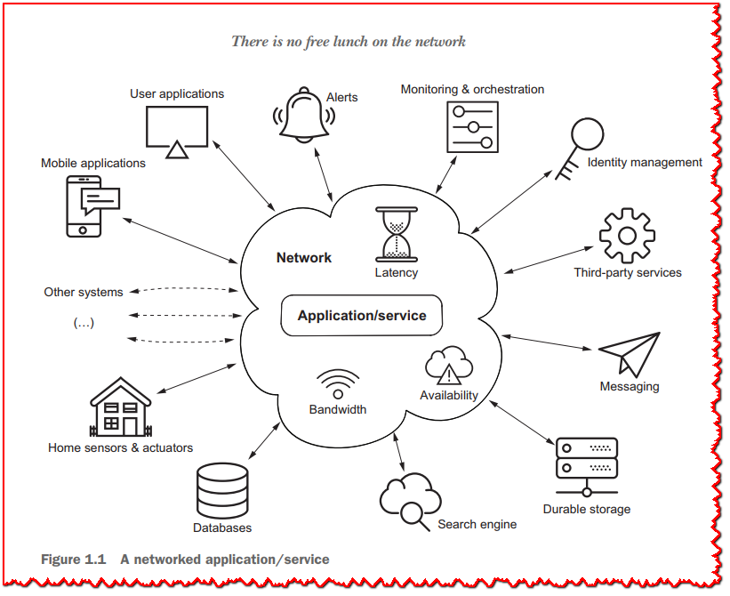

在本书的后面部分，您将看到典型服务的示例，例如 API 端点、流处理器和边缘服务。 当然，前面的列表并不详尽，但关键是服务很少独立存在，因为它们需要通过网络与其他服务通信才能运行。

## 1.3 网络上没有免费的午餐

网络正是计算中可能出现许多问题的地方：

  - 带宽波动很大，因此服务之间的数据密集型交互可能会受到影响。 并非所有服务都可以在同一数据中心内享受快速带宽，即便如此，它仍然比同一台机器上的进程之间的通信慢。

  - 延迟波动很大，并且由于服务需要与其他服务对话以处理给定请求的服务，所有网络引起的延迟都会增加整体请求处理时间。

  - 可用性不应被视为理所当然：网络失败。 路由器出现故障。 代理失败。 有时有人碰到网线并断开它。 当网络发生故障时，向另一个服务发送请求的服务可能无法确定是其他服务还是网络故障。

从本质上讲，现代应用程序是由分布式和网络化服务组成的。 它们是通过本身引入问题的网络访问的，并且每个服务都需要维护多个传入和传出连接。

## 1.4 阻塞 API 的简单性

服务需要管理与其他服务和请求者的连接。 管理并发网络连接的传统且广泛使用的模型是为每个连接分配一个线程。 这是许多技术中的模型，例如 Jakarta EE 中的 Servlet（在版本 3 中添加之前）、Spring Framework（在版本 5 中添加之前）、Ruby on Rails、Python Flask 等等。 该模型具有简单的优点，因为它是*同步的*。

让我们看一个例子，TCP 服务器将输入文本回显给客户端，直到它看到 `/quit` 终端输入（如清单 1.3 所示）。

服务器可以使用本书完整示例项目中的 Gradle 运行任务（终端中的`./gradlew run -PmainClass=chapter1.snippets.SynchronousEcho`）运行。 通过使用 `netcat` 命令行工具，我们可以发送和接收文本。

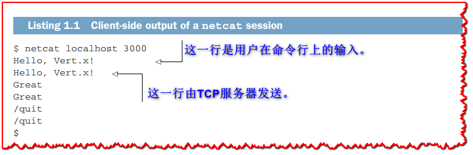

> **💡提示:** 您可能需要在操作系统上安装 netcat（或 nc）。

在服务器端，我们可以看到以下跟踪。

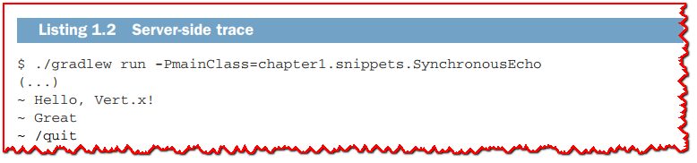

以下清单中的代码提供了 TCP 服务器实现。 它是提供同步 I/O API 的`java.io`包的经典用法。

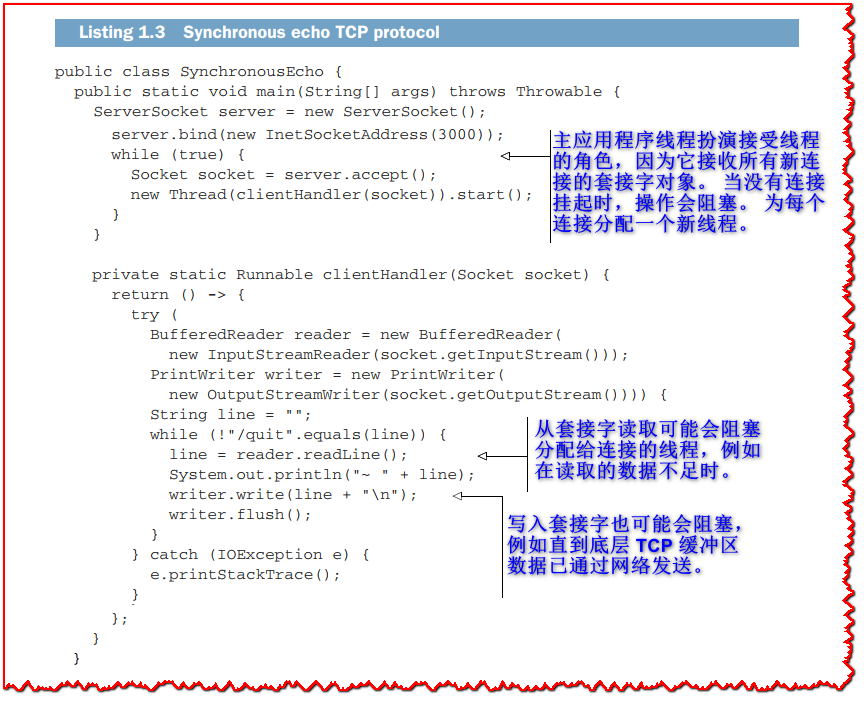

```java
package chapter1.snippets;

import java.io.*;
import java.net.InetSocketAddress;
import java.net.ServerSocket;
import java.net.Socket;

public class SynchronousEcho {

  public static void main(String[] args) throws Throwable {
    ServerSocket server = new ServerSocket();
    server.bind(new InetSocketAddress(3000));
    while (true) {   // <1>
      Socket socket = server.accept();
      new Thread(clientHandler(socket)).start();
    }
  }

  private static Runnable clientHandler(Socket socket) {
    return () -> {
      try (
        BufferedReader reader = new BufferedReader(
          new InputStreamReader(socket.getInputStream()));
        PrintWriter writer = new PrintWriter(
          new OutputStreamWriter(socket.getOutputStream()))) {
        String line = "";
        while (!"/quit".equals(line)) {
          line = reader.readLine();      // <2>
          System.out.println("~ " + line);
          writer.write(line + "\n");  // <3>
          writer.flush();
        }
      } catch (IOException e) {
        e.printStackTrace();
      }
    };
  }
}
```

><1>: 主应用程序线程扮演接受线程的角色，因为它接收所有新连接的套接字对象。 当没有连接挂起时，操作会阻塞。 为每个连接分配一个新线程。
>
><2>: 从套接字读取可能会阻塞分配给连接的线程，例如在读取的数据不足时。
>
><3>: 写入套接字也可能会阻塞，例如直到底层 TCP 缓冲区数据已通过网络发送。

服务器使用主线程接受连接，并为每个连接分配一个新线程来处理 I/O。 I/O 操作是同步的，因此线程可能会阻塞 I/O 操作。

## 1.5 阻塞API浪费资源，增加成本

**清单 1.3** 中代码的主要问题是它为每个传入连接分配一个新线程，而线程绝不是廉价资源。 线程需要内存，线程越多，对操作系统内核调度程序施加的压力就越大，因为它需要给线程分配 CPU 时间。 我们可以改进**清单 1.3** 中的代码，通过使用线程池在连接关闭后重用线程，但在任何给定时间点我们仍然需要 *n* 个线程来处理 *n* 个连接。

如图 1.2 所示，您可以在其中看到三个并发网络连接的三个线程的 CPU 使用率随时间变化。 诸如`readLine`和`write`之类的输入/输出操作可能会**阻塞**线程，这意味着它正被操作系统悬停。 发生这种情况有两个原因：
  - 读取操作可能正在等待数据从网络到达。
  - 如果缓冲区因先前的写入操作已满，则写入操作可能必须等待缓冲区被耗尽。

现代操作系统可以正确处理几千个并发线程。 并非每个联网服务都会面临如此多并发请求的负载，

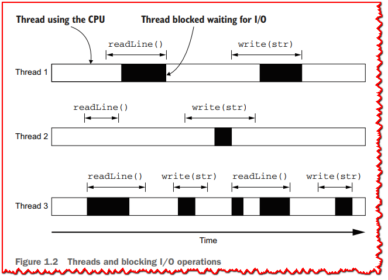

但是当我们谈论数以万计的并发连接时，这个模型很快就显示出它的局限性。

同样重要的是要记住，我们通常需要比传入网络连接更多的线程。 举一个具体的例子，假设我们有一个 HTTP 服务，它为给定的产品提供最优惠的价格，它通过向其他四个 HTTP 服务请求价格来做到这一点，如**图 1.3** 所示。 这种服务通常

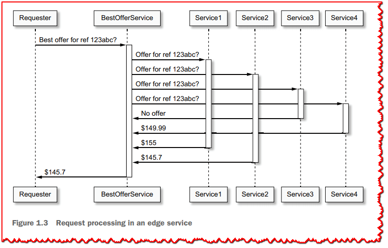

称为*边缘服务*或*API网关*。 按顺序请求每个服务然后选择最低价格会使我们的服务变得非常慢，因为每个请求都会增加我们自己服务的延迟。 有效的方法是从我们的服务启动四个并发请求，然后等待并收集它们的响应。 这意味着再启动四个线程； 如果我们有 1,000 个并发网络请求，我们可能会使用多达 5,000 个线程，在最糟糕的情况下，所有请求都需要同时处理，并且我们不使用线程池或维护来自边缘服务的持久连接 请求的服务。

最后但同样重要的是，应用程序通常部署到容器化或虚拟化环境中。 这意味着应用程序可能无法看到所有可用的 CPU 内核，并且它们分配的 CPU 时间可能会受到限制。 进程的可用内存也可能受到限制，因此线程过多也会占用内存预算。 此类应用程序必须与其他应用程序共享 CPU 资源，因此如果所有应用程序都使用阻塞 I/O API，很快就会有太多线程需要管理和调度，这需要随着流量的增加启动更多服务器/容器实例。 这直接转化为增加的运营成本。

## 1.6 使用非阻塞 I/O 进行异步编程

Instead of waiting for I/O operations to complete, we can shift to *non-blocking* I/O. You may have already sampled this with the select function in C.

The idea behind non-blocking I/O is to request a (blocking) operation, and move

on to doing other tasks until the operation result is ready. For example a non-blocking read may ask for up to 256 bytes over a network socket, and the execution thread does other things (like dealing with another connection) until data has been put into the buffers, ready for consumption in memory. In this model, many concurrent connec- tions can be multiplexed on a single thread, as network latency typically exceeds the CPU time it takes to read incoming bytes.

Java has long had the java.nio (Java NIO) package, which offers non-blocking I/O APIs over files and networks. Going back to our previous example of a TCP ser- vice that echoes incoming data, listings 1.4 through 1.7 show a possible implementa- tion with Java non-blocking I/O.

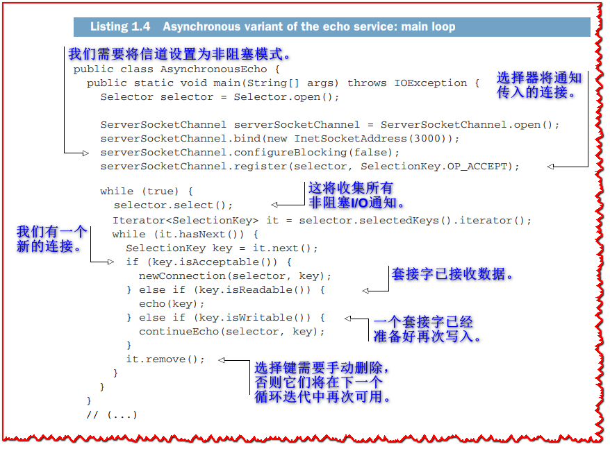

Listing 1.4 shows the server socket channel preparation code. It opens the server socket channel and makes it non-blocking, then registers an NIO key selector for pro- cessing events. The main loop iterates over the selector keys that have events ready for processing and dispatches them to specialized methods depending on the event type (new connections, data has arrived, or data can be sent again).

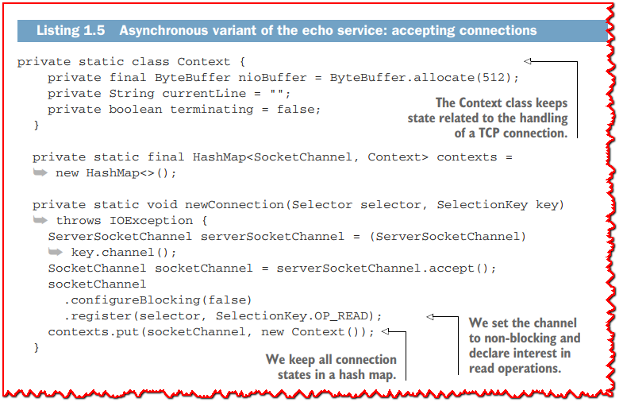

Listing 1.5 shows how new TCP connections are dealt with. The socket channel that corresponds to the new connection is configured as non-blocking and then is tracked for further reference in a hash map, where it is associated to some *context object*. The context depends on the application and protocol. In our case, we track the current line and whether the connection is closing, and we maintain a connection-specific NIO buffer for reading and writing data.

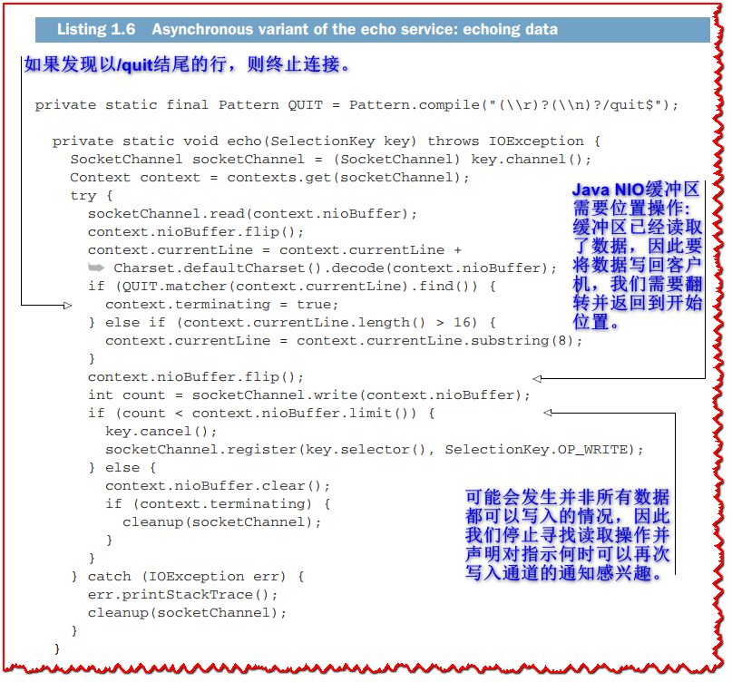

Listing 1.6 has the code for the echo method. The processing is very simple: we read data from the client socket, and then we attempt to write it back. If the write operation was only partial, we stop further reads, declare interest in knowing when the socket channel is writable again, and then ensure all data is written.

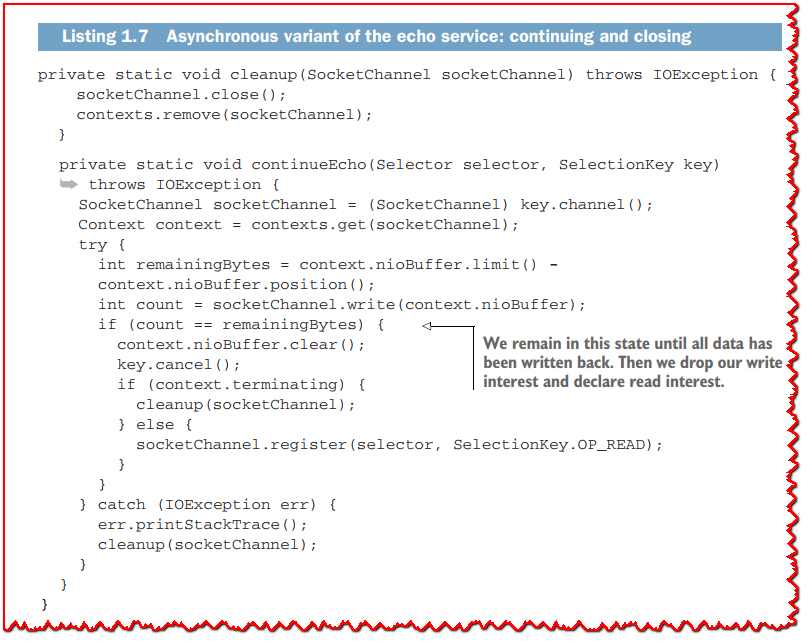

Finally, listing 1.7 shows the methods for closing the TCP connection and for finishing writing a buffer. When all data has been written in continueEcho, we register interest again in reading data.

As this example shows, using non-blocking I/O is doable, but it significantly increases the code complexity compared to the initial version that used blocking APIs. The echo protocol needs two states for reading and writing back data: reading, or fin- ishing writing. For more elaborate TCP protocols, you can easily anticipate the need for more complicated state machines.

It is also important to note that like most JDK APIs, java.nio focuses solely on what it does (here, I/O APIs). It does not provide higher-level protocol-specific help- ers, like for writing HTTP clients and servers. Also, java.nio does not prescribe a threading model, which is still important to properly utilize CPU cores, nor does it handle asynchronous I/O events or articulate the application processing logic.

>  **🏷注意:** This is why, in practice, developers rarely deal with Java NIO. Network- ing libraries like Netty and Apache MINA solve the shortcomings of Java NIO, and many toolkits and frameworks are built on top of them. As you will soon discover, Eclipse Vert.x is one of them.

## 1.7 Multiplexing event-driven processing: The case of the event loop

A popular threading model for processing asynchronous events is that of the event loop. Instead of polling for events that may have arrived, as we did in the previous Java NIO example, events are pushed to an *event loop*.

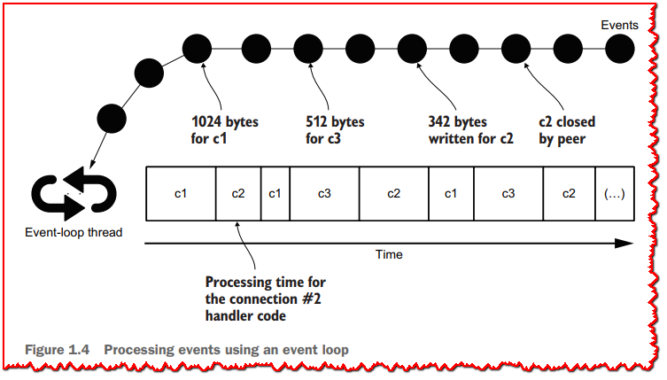

As you can see in figure 1.4, events are queued as they arrive. They can be I/O events, such as data being ready for consumption or a buffer having been fully written to a socket. They can also be any *other* event, such as a timer firing. A single thread is assigned to an event loop, and processing events shouldn’t perform any blocking or long-running operation. Otherwise, the thread blocks, defeating the purpose of using an event loop.

Event loops are quite popular: JavaScript code running in web browsers runs on top of an event loop. Many graphical interface toolkits, such as Java Swing, also have an event loop.

Implementing an event loop is easy.

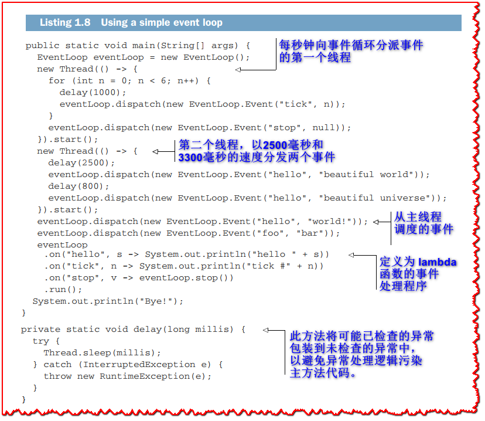

The code in listing 1.8 shows the use of an event-loop API whose execution gives the following console output.

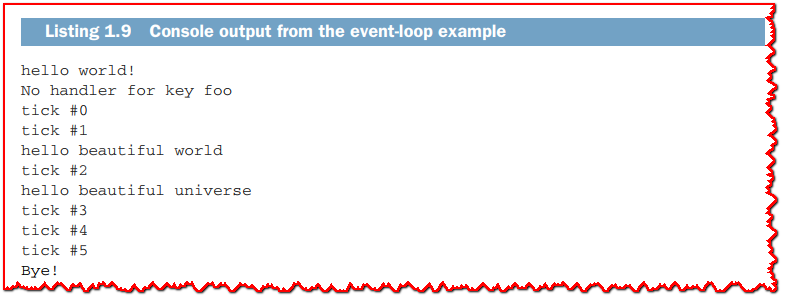

More sophisticated event-loop implementations are possible, but the one in the fol- lowing listing relies on a queue of events and a map of handlers.

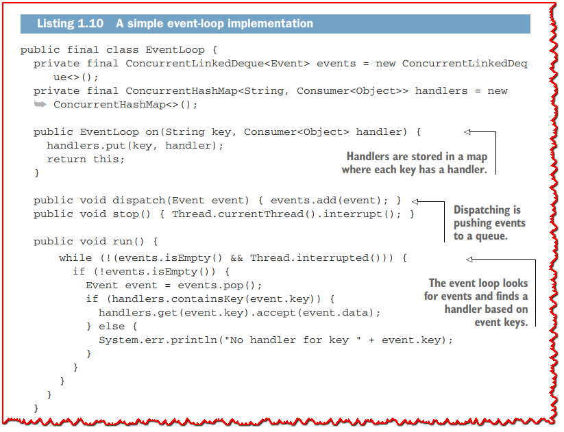

The event loop runs on the thread that calls the run method, and events can be safely sent from other threads using the `dispatch` method.

Last, but not least, an event is simply a pair of a key and data, as shown in the fol- lowing, which is a static inner class of `EventLoop`.

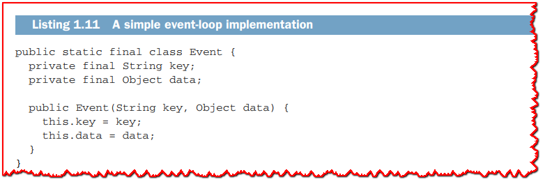

## 1.8 What is a reactive system?

So far we have discussed how to do the following:
  - Leverage asynchronous programming and non-blocking I/O to handle more concurrent connections and use less threads
  - Use one threading model for asynchronous event processing (the event loop)

By combining these two techniques, we can build scalable and resource-efficient appli- cations. Let’s now discuss what a *reactive system* is and how it goes beyond “just” asyn- chronous programming.

The four properties of reactive systems are exposed in *The Reactive Manifesto*: *respon- sive*, *resilient*, *elastic*, and *message-driven* ([www.reactivemanifesto.org/](http://www.reactivemanifesto.org/)). We are not going to paraphrase the manifesto in this book, so here is a brief take on what these proper- ties are about:
  - *Elastic*—Elasticity is the ability for the application to work with a variable num- ber of instances. This is useful, as elasticity allows the app to respond to traffic spikes by starting new instances and load-balancing traffic across instances. This has an interesting impact on the code design, as shared state across instancesneeds to be well identified and limited (e.g., server-side web sessions). It is use- ful for instances to report *metrics*, so that an orchestrator can decide when to start or stop instances based on both network traffic and reported metrics.
  - *Resilient*—Resiliency is partially the flip side of elasticity. When one instance crashes in a group of elastic instances, resiliency is naturally achieved by redi- recting traffic to other instances, and a new instance can be started if necessary. That being said, there is more to resiliency. When an instance cannot fulfill a request due to some conditions, it still tries to answer in *degraded mode*. Depend- ing on the application domain, it may be possible to respond with older cached values, or even to respond with empty or default data. It may also be possible to forward a request to some other, non-error instance. In the worst case, an instance can respond with an error, but in a timely fashion.
  - *Responsive*—Responsivity is the result of combining elasticity and resiliency. Consistent response times provide strong service-level agreement guarantees. This is achieved both thanks to the ability to start new instances if need be (to keep response times acceptable), and also because instances still respond quickly when errors arise. It is important to note that responsivity is not possible if one component relies on a non-scalable resource, like a single central data- base. Indeed, starting more instances does not solve the problem if they all issue requests to one resource that is quickly going to be overloaded.
  - *Message-driven* —Using asynchronous message passing rather than blocking par- adigms like remote procedure calls is the key enabler of elasticity and resiliency, which lead to responsiveness. This also enables messages to be dispatched to more instances (making the system elastic) and controls the flow between mes- sage producers and message consumers (this is *back-pressure*, and we will explore it later in this book).

A reactive system exhibits these four properties, which make for dependable and resource-efficient systems.

**Does asynchronous imply reactive?**

This is an important question, as being asynchronous is often presented as being a magic cure for software woes. Clearly, reactive implies asynchronous, but the con- verse is not necessarily true.

As a (not so) fictitious example, consider a shopping web application where users can put items in a shopping cart. This is classically done by storing items in a server-side web session. When sessions are being stored in memory or in local files, the system is not reactive, even if it internally uses non-blocking I/O and asynchronous program- ming. Indeed, an instance of the application cannot take over another one because sessions are application state, and in this case that state is not being replicated and shared across nodes.

A reactive variant of this example would use a memory grid service (e.g., Hazelcast, Redis, or Infinispan) to store the web sessions, so that incoming requests could be routed to any instance.

## 1.9 What else does reactive mean?

As *reactive* is a trendy term, it is also being used for very different purposes. You just saw what a *reactive system* is, but there are two other popular reactive definitions, sum- marized in table 1.1.

**Table 1.1 All the reactive things**

| **Reactive?** | **Description**                                              |
| ------------- | ------------------------------------------------------------ |
| Systems       | Dependable applications that are message-driven, resilient, elastic, and responsive. |
| Programming   | A means of reacting to changes and events. Spreadsheet programs are a great example of reactive programming: when cell data changes, cells having formulas depending on affected cells are recomputed automatically. Later in this book you will see RxJava, a pop- ular *reactive extensions* API for Java that greatly helps coordinate asynchronous event and data processing. There is also *functional reactive programming*, a style of programming that we won’t cover in this book but for which *Functional Reactive Programming* by Stephen Blackheath and Anthony Jones (Manning, 2016) is a fantastic resource. |
| Streams       | When systems exchange continuous streams of data, the classical producer/consumer problems arise. It is especially important to provide *back-pressure* mechanisms so that a consumer can notify a producer when it is emitting too fast. With reactive streams |

## 1.10 What is Vert.x?

According to the Vert.x website (https://vertx.io/), “Eclipse Vert.x is a tool-kit for building reactive applications on the JVM.”

Initiated by Tim Fox in 2012, Vert.x is a project now fostered at the vendor-neutral Eclipse Foundation. While the first project iterations were aimed at being a “Node.js for the JVM,” Vert.x has since significantly deviated toward providing an asynchronous programming foundation tailored for the specifics of the JVM.

**The essence of Vert.x**

As you may have guessed from the previous sections of this chapter, the focus of Vert.x is processing asynchronous events, mostly coming from non-blocking I/O, and the threading model processes events in an event loop.

It is very important to understand that Vert.x is a *toolkit* and not a *framework*: it does not provide a predefined foundation for your application, so you are free to use Vert.x as a library inside a larger code base. Vert.x is largely unopinionated on the build tools that you should be using, how you want to structure your code, how you intend to package and deploy it, and so on. A Vert.x application is an assembly of modules pro- viding exactly what you need, and nothing more. If you don’t need to access a data- base, then your project does not need to depend on database-related APIs.

The Vert.x project is organized in composable modules, with figure 1.5 showing the structure of a random Vert.x application:
  - A core project, called vertx-core, provides the APIs for asynchronous pro- gramming, non-blocking I/O, streaming, and convenient access to networked protocols such as TCP, UDP, DNS, HTTP, or WebSockets.
  - A set of modules that are part of the community-supported Vert.x stack, such as a better web API (vertx-web) or data clients (vertx-kafka-client, vertx-redis, vertx-mongo, etc.) provide functionality for building all kinds of applications.
  - A wider ecosystem of projects provides even more functionality, such as con- necting with Apache Cassandra, non-blocking I/O to communicate between system processes, and so on.

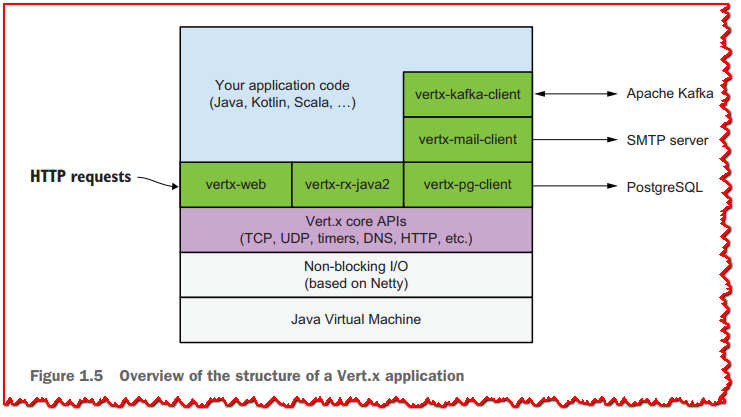

Vert.x is *polyglot* as it supports most of the popular JVM languages: JavaScript, Ruby, Kotlin, Scala, Groovy, and more. Interestingly, these languages are not just supported through their interoperability with Java. Idiomatic bindings are being generated, so you can write Vert.x code that still feels natural in these languages. For example, the Scala bindings use the Scala future APIs, and the Kotlin bindings leverage custom DSLs and functions with named parameters to simplify some code constructs. And, of course, you can mix and match different supported languages within the same Vert.x application.

## 1.11 Your first Vert.x application

It’s finally time for us to write a Vert.x application!

Let’s continue with the echo TCP protocol that we have used in various forms in this chapter. It will still expose a TCP server on port 3000, where any data is sent back to the client. We will add two other features:
  - The number of open connections will be displayed every five seconds.
  - An HTTP server on port 8080 will respond with a string giving the current num- ber of open connections.

### 1.11.1 Preparing the project

While not strictly necessary for this example, it is easier to use a build tool. In this book, I will show examples with Gradle, but you can find the equivalent Maven build descriptors in the book’s source code Git repository.

For this project, the only third-party dependency that we need is the vertx-core artifact plus its dependencies. This artifact is on Maven Central under the io.vertx group identifier.

An integrated development environment (IDE) like IntelliJ IDEA Community Edi- tion is great, and it knows how to create Maven and Gradle projects. You can equally use Eclipse, NetBeans, or even Visual Studio Code.

>  **TIP** You can also use the Vert.x starter web application at [https://start.vertx.io ](https://start.vertx.io/)and generate a project skeleton to download.

For this chapter let’s use Gradle. A suitable build.gradle.kts file would look like the next listing.

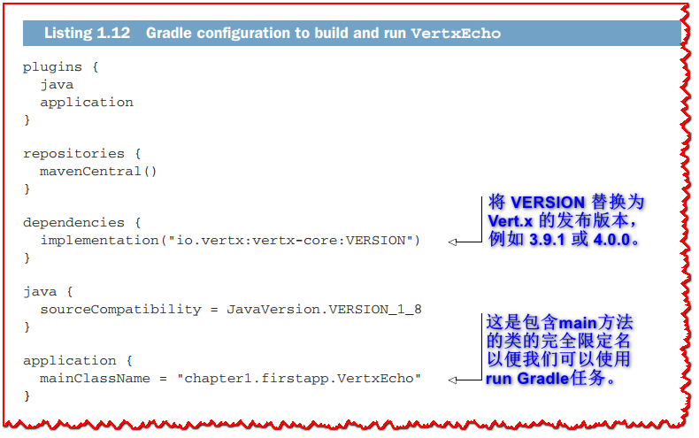

> **TIP** You may be more familiar with Apache Maven than Gradle. This book uses Gradle because it is a modern, efficient, and flexible build tool. It also uses a concise domain-specific language for writing build files, which works better than Maven XML files in the context of a book. You will find Maven build descriptors equivalent to those of Gradle in the source code Git repository.

### 1.11.2 The VertxEcho class

The *VertxEcho* class implementation is shown in listing 1.15. You can run the applica- tion with Gradle using the run task (*gradle run* or *./gradlew run*), as follows.

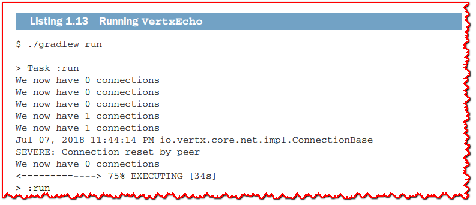

> **TIP** If you prefer Maven, run mvn compile exec:java instead of ./gradlew run from the chapter1 folder in the book’s source code Git repository.

You can, of course, interact with the service with the netcat command to echo text, and you can make an HTTP request to see the number of open connections, as shown in the following listing.

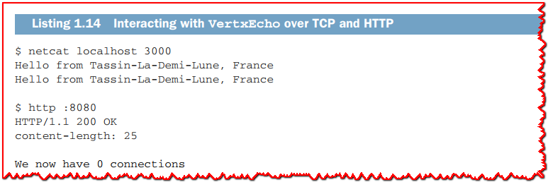

>  **TIP** The http command comes from the HTTPie project at [https://](https://httpie.org/) [httpie.org](https://httpie.org/). This tool is a developer-friendly alternative to curl, and you can easily install it on your operating system.

Let’s now see the code of `VertxEcho`.

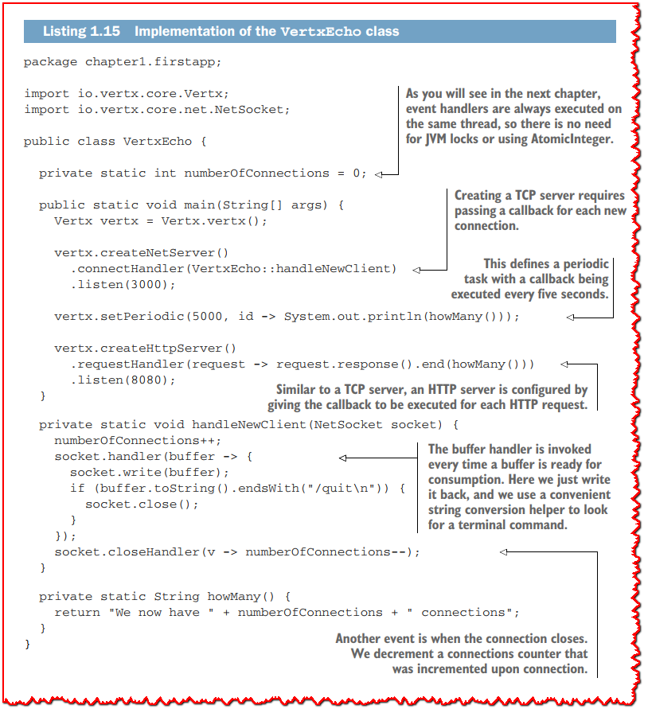

```java
package chapter1.firstapp;

import io.vertx.core.Vertx;
import io.vertx.core.net.NetSocket;

public class VertxEcho {

  private static int numberOfConnections = 0;  // <1>

  public static void main(String[] args) {
    Vertx vertx = Vertx.vertx();

    vertx.createNetServer()
      .connectHandler(VertxEcho::handleNewClient)  // <2>
      .listen(3000);

    vertx.setPeriodic(5000, id -> System.out.println(howMany()));  // <3>

    vertx.createHttpServer()
      .requestHandler(request -> request.response().end(howMany()))  // <4>
      .listen(8080);
  }

  private static void handleNewClient(NetSocket socket) {
    numberOfConnections++;
    socket.handler(buffer -> {  // <5>
      socket.write(buffer);
      if (buffer.toString().endsWith("/quit\n")) {
        socket.close();
      }
    });
    socket.closeHandler(v -> numberOfConnections--);  // <6>
  }

  private static String howMany() {
    return "We now have " + numberOfConnections + " connections";
  }
}
```

> <1>: As you will see in the next chapter, event handlers are always executed on the same thread, so there is no need for JVM locks or using AtomicInteger.
>
> <2>: Creating a TCP server requires passing a callback for each new connection.
>
> <3>: This defines a periodic task with a callback being executed every five seconds.
>
> <4>: Similar to a TCP server, an HTTP server is configured by giving the callback to be executed for each HTTP request.
>
> <5>: The buffer handler is invoked every time a buffer is ready for consumption. Here we just write it back, and we use a convenient string conversion helper to look for a terminal command.
>
> <6>: Another event is when the connection closes. We decrement a connections counter that was incremented upon connection.

This example is interesting in that it has few lines of code. It is centered around a plain old Java main method, because there is no framework to bootstrap. All we need to create is a Vertx context, which in turns offers methods to create tasks, servers, cli- ents, and more, as you will discover in the next chapters.

While it’s not apparent here, an event loop is managing the processing of events, be it a new TCP connection, the arrival of a buffer, a new HTTP request, or a periodic task that is being fired. Also, every event handler is being executed on the same (event-loop) thread.

### 1.11.3 The role of callbacks

As you just saw in listing 1.15, *callbacks* are the primary method Vert.x uses to notify the application code of asynchronous events and pass them to some handlers. Combined with lambda expressions in Java, callbacks make for a concise way to define event handling.

You may have heard or experienced the infamous *callback hell* where callbacks get nested into callbacks, leading to code that is difficult to read and reason about.

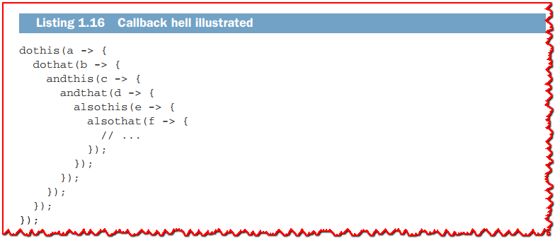

Be reassured: although the Vert.x core APIs indeed use callbacks, Vert.x provides sup- port for more programming models. Callbacks are the canonical means for notifica- tion in event-driven APIs, but as you will see in upcoming chapters, it is possible to build other abstractions on top of callbacks, such as futures and promises, reactive extensions, and coroutines.

While callbacks have their issues, there are many cases with minimal levels of nesting where they remain a very good programming model with minimal dispatch overhead.

### 1.11.4 So is this a reactive application?

This is a very good question to ask. It is important to remember that while Vert.x is a toolkit for building reactive applications, using the Vert.x API and modules does not “auto-magically” make an application a reactive one. Yet the event-driven, non-blocking APIs that Vert.x provides tick the first box.

The short answer is that no, this application is not reactive. Resiliency is not the issue, as the only errors that can arise are I/O related—and they simply result in dis- carding the connections. The application is also responsive, as it does not perform any complicated processing. If we benchmarked the TCP and HTTP servers, we would get very good latencies with low deviation and very few outliers. The following listing shows an imperfect, yet telling, quick benchmark with wrk ([https://github.com/](https://github.com/wg/wrk) [wg/wrk](https://github.com/wg/wrk)) running from a terminal.

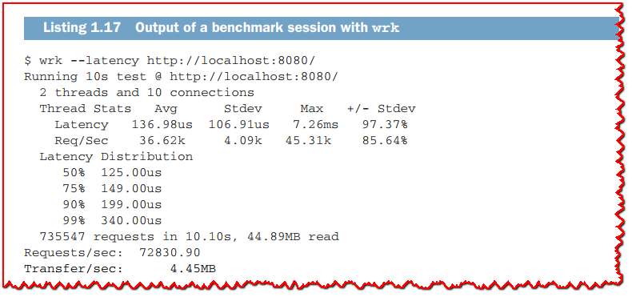

The culprit for not being reactive clearly is elasticity. Indeed, if we create new instances, each instance maintains its own connection counter. The counter scope is the application, so it should be a shared global counter between all instances.

As this example shows, designing reactive applications is more subtle than just implementing responsive and resource-efficient systems. Ensuring that an application can run as many replaceable instances is surprisingly more engaging, especially as we need to think about *instance state* versus *application state* to make sure that instances are interchangeable.

**What if I am a Windows user?**

wrk is a command-line tool that works on Unix systems like Linux and macOS.

In this book we prefer Unix-style tooling and command-line interfaces over graphical user interfaces. We will use Unix tools that are powerful, intuitive, and maintained by active open source communities.

Fortunately, you don’t have to leave Windows to benefit from these tools! While some of these tools work natively on Windows, starting from Windows 10 you can install the Windows Subsystem for Linux (WSL) and benefit from a genuine Linux environ- ment alongside your more traditional Windows desktop environment. Microsoft mar- kets WSL as a major feature for developers on Windows, and I can only recommend that you invest some time and get familiar with it. You can see Microsoft’s WSL FAQ for more details: https://docs.microsoft.com/en-us/windows/wsl/faq.

## 1.12 What are the alternatives to Vert.x?

As you will see in this book, Vert.x is a compelling technology for building end-to-end reactive applications. Reactive application development is a trendy topic, and it is more important to understand the principles than to blindly become an expert in one specific technology. What you will learn in this book easily transfers to other technolo- gies, and I highly encourage you to check them out.

Here are the most popular alternatives to Vert.x for asynchronous and reactive programming:
  - *Node.js*—Node.js is an event-driven runtime for writing asynchronous JavaScript applications. It is based on the V8 JavaScript engine that is used by Google Chrome. At first sight, Vert.x and Node.js have lots of similarities. Still, they dif- fer greatly. Vert.x runs multiple event loops by default, unlike Node.js. Also, the JVM has a better JIT compiler and garbage collector, so the JVM is better suited for long-running processes. Last, but not least, Vert.x supports JavaScript.
  - *Akka*—Akka is a faithful implementation of the *actor* model. It runs on the JVM and primarily offers Scala APIs, although Java bindings are also being pro- moted. Akka is particularly interesting, as actors are message driven and loca- tion transparent, and actors offer supervision features that are interesting for error recovery. Akka clearly targets the design of reactive applications. As you will see in this book, Vert.x is no less capable for the task. Vert.x has a concept of *verticles*, a loose form of actors, that are used for processing asynchronous events. Interestingly, Vert.x is significantly faster than Akka and most alter- natives in established benchmarks, such as TechEmpower benchmarks ([www.techempower.com/benchmarks/](www.techempower.com/benchmarks/))
  - *Spring Framework*—The older and widespread Spring Framework now integrates a reactive stack. It is based on Project Reactor, an API for reactive programming that is very similar to RxJava. The focus of the Spring reactive stack is essentially on reactive programming APIs, but it does not necessarily lead to end-to-end reac- tive applications. Many parts of the Spring Framework employ blocking APIs, so extra care must be taken to limit the exposure to blocking operations. Project Reactor is a compelling alternative to RxJava, but the Spring reactive stack is tied to this API, and it may not always be the best way to express certain asynchronous constructions. Vert.x provides more flexibility as it supports callbacks, futures, Java CompletionStage, Kotlin coroutines, RxJava, and fibers. This means that with Vert.x it is easier to select the right asynchronous programming model for a certain task. Also like with Akka, Vert.x remains significantly faster in TechEmpower benchmarks, and applications boot faster than Spring-based ones.
  - *Quarkus* —Quarkus is a new framework for developing Java applications that run exceptionally well in container environments like Kubernetes ([https://](https://quarkus.io/) [quarkus.io](https://quarkus.io/)). Indeed, in such environments, boot time and memory consumption are critical cost-saving factors. Quarkus employs techniques at compilation time to make sensible gains when running using traditional Java virtual machines and as native executables. It is based on popular libraries like Hibernate, Eclipse MicroProfile, RESTEasy, and Vert.x. Quarkus unifies imperative and reactive programming models, and Vert.x is a cornerstone of the framework. Vert.x is not just used to power some pieces of the networking stack; some client modules are directly based on those from Vert.x, such as the Quarkus mail service and reactive routes. You can also use Vert.x APIs in a Quarkus application, with the unification between reactive and imperative helping you to bridge both worlds. Vert.x and Quarkus have different programming paradigms: Vert.x will appeal to develop- ers who prefer a toolkit approach, or developers who have affinities with Node.js. In contrast, Quarkus will appeal to developers who prefer an opinionated stack approach with dependency injection and convention over configuration. In the end, both projects work together, and anything you develop with Vert.x can be reused in Quarkus.
  - *Netty* —The Netty framework provides non-blocking I/O APIs for the JVM. It provides abstractions and platform-specific bug fixes compared to using raw NIO APIs. It also provides threading models. The target of Netty is low-latency and high-performance network applications. While you can certainly build reactive applications with Netty, the APIs remain somewhat low-level. Vert.x is one of the many technologies built on top of Netty (Spring Reactive and Akka have Netty integration), and you can get all the performance benefits of Netty with the simpler APIs of Vert.x.
  - *Scripting languages* —Scripting languages such as Python and Ruby also provide non-blocking I/O libraries, such as Async (Ruby) and Twisted (Python). You can certainly build reactive systems with them. Again, the JVM performance is an advantage for Vert.x, along with the ability to use alternative JVM languages (Ruby is officially supported by Vert.x).
  - *Native languages*—Native languages are becoming trendy again. Instead of using the venerable C/C++ languages, Go, Rust, and Swift are gaining mindshare. They all tick the boxes for building highly scalable applications, and they certainly can be used for creating reactive applications. That being said, most efficient libraries in these languages are fairly low-level, and ultimately the JVM-based Vert.x/Netty combination still ranks favorably in benchmarks.

The following books are good resources for many of the preceding topics:
  - *Node.js in Action* by Mike Cantelon, Marc Harter, T.J. Holowaychuk, and Nathan Rajlich (Manning, 2013)
  - *Akka in Action* by Raymond Roestenburg, Rob Bakker, and Rob Williams (Man- ning, 2016)
  - *Reactive Application Development* by Duncan K. DeVore, Sean Walsh, and Brian Hanafee (Manning, 2018)
  - *Spring in Action*, fifth edition, by Craig Walls (Manning, 2018)
  - *Netty in Action* by Norman Maurer and Marvin Allen Wolfthal (Manning, 2015)
  - *Go in Action* by William Kennedy with Brian Ketelsen and Erik St. Martin (Man- ning, 2015)
  - *Rust in Action* by Tim McNamara (Manning, 2019)
  - *Swift in Depth* by Tjeerd in 't Veen (Manning, 2018)

In the next chapter, we will dissect the fundamentals of asynchronous programming with Vert.x.

## Summary

  - Asynchronous programming allows you to multiplex multiple networked con- nections on a single thread.
  - Managing non-blocking I/O is more complex than the equivalent imperative code based on blocking I/O, even for simple protocols.
  - The event loop and the reactor pattern simplify asynchronous event processing.
  - A reactive system is both scalable and resilient, producing responses with consis- tent latencies despite demanding workloads and failures.
  - Vert.x is an approachable, efficient toolkit for writing asynchronous and reac- tive applications on the JVM.

