# 第十一章: 端到端的实时反应式事件处理

> 翻译: 白石(https://github.com/wjw465150/Vert.x-in-Action-ChineseVersion)

**本章涵盖**
  - 结合RxJava操作符和Vert.x客户端来支持高级处理
  - 使用RxJava操作符在事件流上执行内容充实和聚合数据处理
  - 将Vert.x事件总线扩展到web应用程序，以统一后端和前端通信模型
  - 在流处理设置中管理状态

在本章中，我们将探索高级反应式流处理，其中应用程序状态会根据事件进行实时更改。 通过对事件执行转换和聚合，我们将计算有关在更大的 1万 步应用程序中发生的事情的实时统计信息。 您还将了解事件流如何通过在 Vert.x 事件总线保护伞下统一 Java 和 JavaScript 代码来影响实时 Web 应用程序。

本章首先介绍使用 RxJava 运算符和 Vert.x 客户端的高级流处理。 然后，我们将讨论通过事件总线连接的实时 Web 应用程序这一主题，最后我们将介绍在连续事件的上下文中正确处理状态（尤其是 *initial* 状态）的技术。

## 11.1 使用 Kafka 和 RxJava 进行高级流数据处理

在前面的章节中，我们使用 RxJava 操作符来处理各种事件：HTTP 请求、AMQP 消息和 Kafka 记录。 RxJava 是一个用于反应式编程的多功能库，它特别适合处理具有 *Flowable* 类型的事件流，用于背压流。 Kafka 为事件流提供了可靠的中间件，而 Vert.x 提供了一个丰富的响应式客户端生态系统，这些客户端连接到其他服务、数据库或消息传递系统。

*event stats* 服务是一个事件驱动的响应式服务，它使用 Kafka 记录并像其他 Kafka 记录一样生成一些统计信息。 我们将研究如何使用 RxJava 运算符有效地处理事件流上的三种常见操作：

  - 充实数据
  - 在时间窗口内聚合数据
  - 通过使用键或函数对元素进行分组来聚合数据

### 11.1.1 丰富每日设备更新以生成用户更新

*daily.step.updates* Kafka 主题填充了从活动服务发送的记录。 这些记录包含三个条目：设备标识符、记录生成时间的时间戳和一些步数。

每当活动服务处理设备更新时，它会将更新存储到 PostgreSQL 数据库，然后生成一条 Kafka 记录，其中包含相应设备当天的步数。 例如，当设备 abc 收到更新，例如在 11:25 记录的 300 步时，它会向 *daily.step.updates* 发送一条 Kafka 记录，其中当天的步数对应于设备 *abc*。

事件统计服务使用这些事件来丰富用户数据，因此其他服务可以实时更新任何用户当天记录的步数。 为此，我们从 *daily.step.updates* Kafka 主题中获取记录，并添加来自用户 API 的数据：用户名、电子邮件、城市以及数据是否公开。 然后将丰富的数据作为记录发送到 *event-stats.useractivity.update*s 主题。 丰富数据的步骤如 **图 11.1** 所示。

>  **💡提示:** 这是 Gregor Hohpe 和 Bobby Woolf（Addison-Wesley Professional，2003 年）所著的开创性 *Enterprise Integration Patterns* 书籍中的 *contentenricher* 消息传递模式的一种实现技术。

对于每个传入的 Kafka 记录，我们执行以下操作：
1. 向用户配置文件 API 发出请求以确定设备属于谁。
2. 向用户配置文件 API 发出另一个请求以获取用户的所有数据，并将其与传入的记录数据合并。
3. 将丰富的记录写入 *event-stats.user-activity.updates* Kafka 主题，并提交。

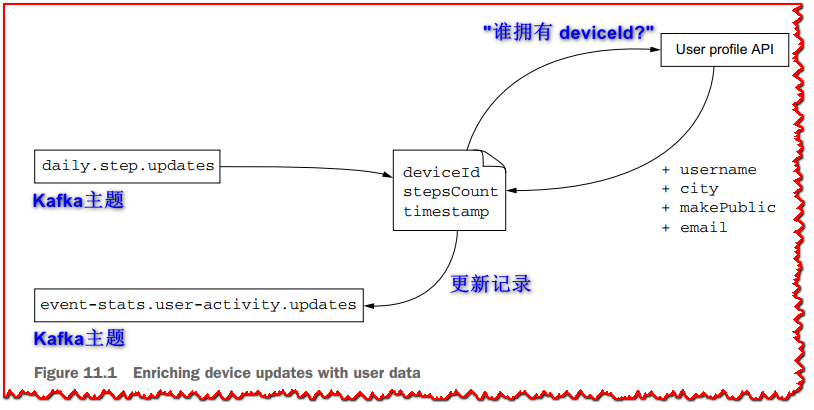

下面的清单显示了相应的RxJava管道。

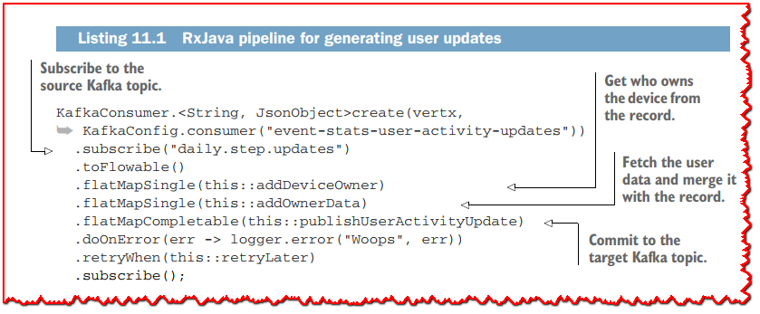

RXJAVA管道与 *flatmapsingle* 和  *flatmapcompletable* 组成异步操作。 这是因为执行HTTP请求会产生（单个）结果，而进行Kafka记录是没有返回值的操作（因此是可完成的）。 您还可以从前章中看到常见的错误处理逻辑，并延迟重新提交。

下一个清单显示了*addDeviceOwner*方法的实现。

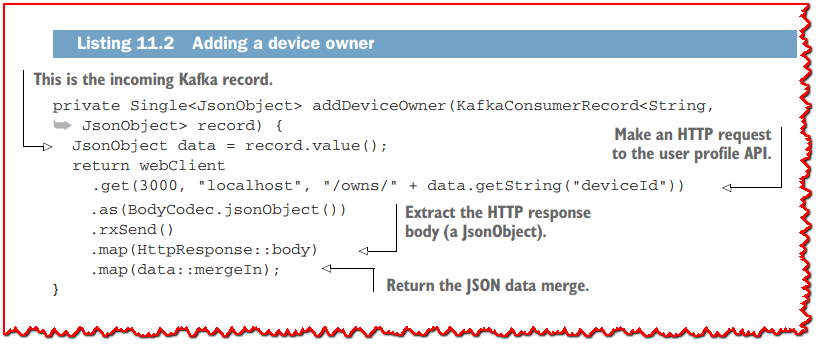

此方法是HTTP请求，其结果是JSON对象，并且它返回源Kafka记录的JSON数据与请求结果数据的合并。

完成此操作后，我们知道记录的设备属于谁，因此我们可以链接另一项请求，以从用户配置文件API获取用户数据，如下所示。

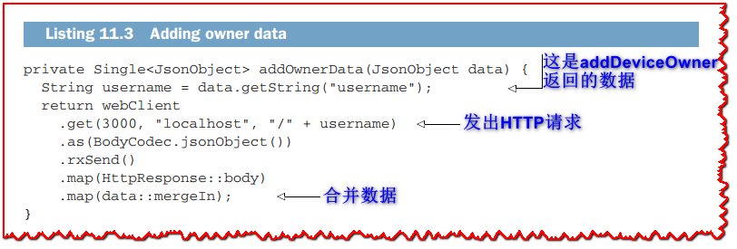

此方法遵循与 *AddDeviceowner* 相同的模式，因为它将上一个操作的结果作为参数作为参数，向用户配置文件API提出HTTP请求，然后返回合并的数据。

最后一个操作是 *PublishActivityUpdate* 方法，如以下列表所示。

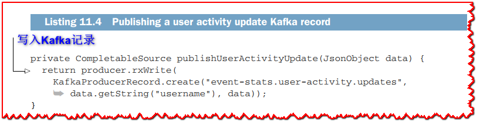

实施将KAFKA记录写入目标 *event-stats.user-activity.updates* 主题。

### 11.1.2 使用时间窗口聚合计算设备更新摄入吞吐量

摄入服务从HTTP和AMQP接收传入设备更新，然后将其发布到 *incomeing.Steps* Kafka主题。 摄入吞吐量是仪表板度量标准的典型特征，在该仪表板度量标准中，该值经常使用每秒摄入的设备更新数量更新。 这是较大应用程序的应力水平的很好的指标，因为每个更新都会触发其他微服务处理的其他事件。

为了计算摄入吞吐量，我们需要在 *incoming.steps* 主题，在固定时间窗口上汇总记录上收听记录，并计算收到多少记录。 这在**图11.2**中说明了。

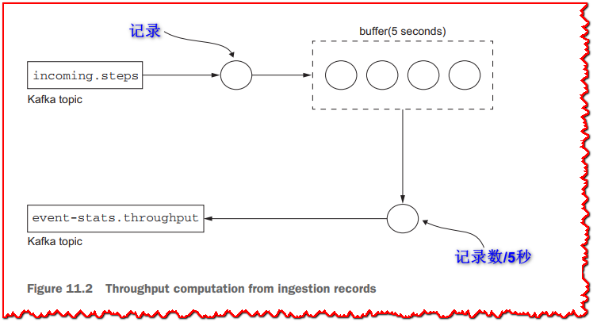

以下列表显示了用于计算吞吐量并将结果发布到 *event-stats.thoughput* kafka主题的RXJAVA管道。

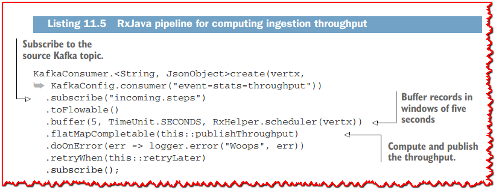

*Buffer* 运算符是您可以在RXJAVA中使用的几个聚合操作员之一。 它汇总了一个时间段的事件，然后将结果作为 *列表* 传递。 您可以看到我们通过 *RxHelper* 类传递Vert.x调度程序； 这是因为 *buffer* 延迟事件处理，默认情况下将在RXJAVA特定线程上调用下一个操作员。 Vert.x调度程序确保从原始的Vert.x上下文调用运算符，以保留Vert.x线程模型。

一旦 *buffer*在过去五秒钟内汇总了所有KAFKA记录， *PublishThroughput* 方法计算并发布吞吐量如下所示。

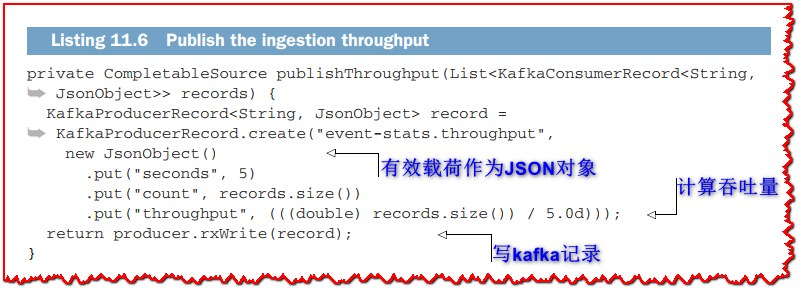

给定 *记录* 列表，我们可以轻松计算吞吐量并发布新记录。 我们要注意以秒为单位的记录和时间窗口大小的数量，以便活动消费者拥有所有信息，而不仅仅是原始结果。

### 11.1.3 使用聚合判别法和时间窗计算每个城市的趋势

现在，让我们通过计算每个城市趋势来研究基于RXJAVA操作员的另一种形式的数据聚合。 更具体地说，我们将定期计算当天每个城市记录多少个步骤。 为此，我们可以重新使用发布到 *event-stats.user-activity.updates* Kafka主题的事件，因为它们包含了当天用户记录的步数，以及其他数据 ，包括城市。

我们可以重复使用 *buffer*运算符，如**列表11.5**，然后在记录列表上迭代。 对于每个记录，我们可以更新一个哈希表条目，其中键是城市，值是步数。 然后，我们可以根据哈希表中的值发布每个城市的更新。

但是，我们可以通过 *GroupBy* 运算符编写一个更惯用的RXJAVA处理管道，如以 **清单 11.7** 和 **图11.3**所示。

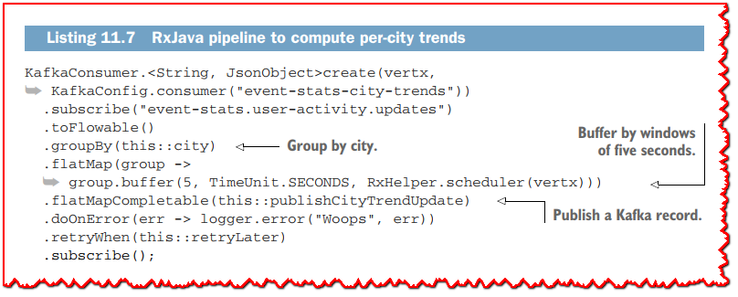

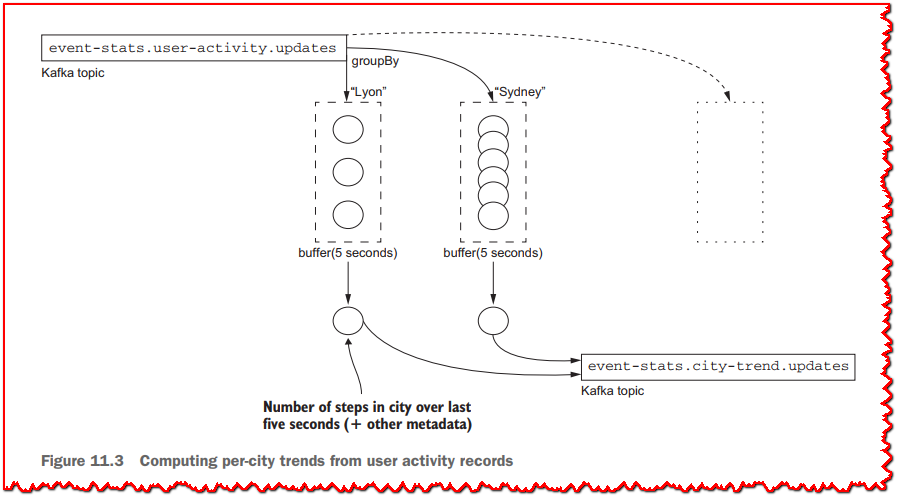

当事件进入管道时， *GroupBy* 操符号根据记录中的城市的值（ *discriminant* ）将其分配给组。 您可以将 *GroupBy* 视为SQL语句中的 *groupBy* 功能. *city*在下一个清单中显示，并从Kafka记录中提取城市值。

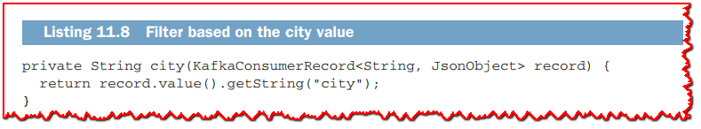

**清单11.7** 中的 *groupBy* 操作符返回 *GroupedFlowable* Kafka记录的 *Flowable*。每个 *GroupedFlowable* 是一个流动的，它专用于一个城市的分组记录，由 *groupBy* 使用 *city* 函数调度。对于每个组， *flatMap*操 作符随后用于在5秒的时间窗口中对事件进行分组，这意味着每个城市步数每5秒更新一次。

最后，*publishCityTrendUpdate* 方法准备了一个新的记录，其中包含每个城市的最新统计数据，如下面的清单所示。

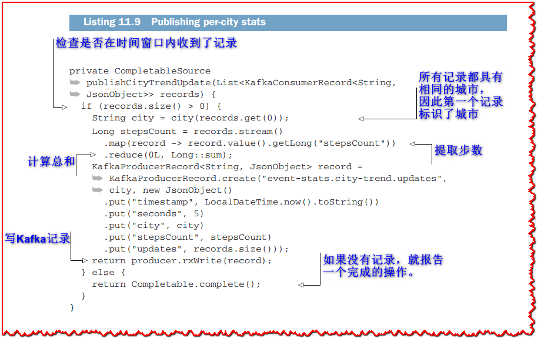

*publishCityTrendUpdate* 方法从一个时间窗口接收一个给定城市的Kafka记录列表。我们首先要检查是否有记录，否则就什么都做不了。对于记录，我们可以使用Java流用 *reduce* 操作符来计算总和，然后准备一个带有几个条目的Kafka记录:一个时间戳，时间窗口持续时间(以秒为单位)，城市，记录了多少步骤，以及在时间窗口中观察到多少次更新。完成之后，我们将记录写入*event-stats.city-trend.updates*  的Kafka的主题。

Now that we’ve looked at performing advanced event-streaming processing with RxJava and Vert.x, let’s see how we can propagate events to reactive web applications.

## 11.2 实时响应式web应用程序

如第7章所述，仪表板web应用程序从stats服务中消费事件并显示如下:
  - 摄入的吞吐量
  - 公众用户排行
  - 每座城市的趋势

该应用程序将在收到新数据后立即进行实时更新，这使后端服务和Web浏览器之间的端到端集成变得不错。 该应用程序是微服务，如**图11.4**所示。

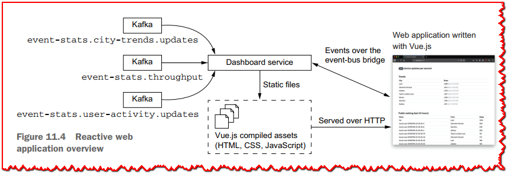

仪表板服务由两个部分组成：
  - Vue.js应用程序
  - 执行以下操作的Vert.x服务：
      1- 服务vue.js资源
      2- 连接到kafka并转发到vert.x事件总线
      3- 连接的Web浏览器和Vert.x事件总线之间的桥梁 

让我们从从Kafka转发到事件总线开始。

### 11.2.1 转发Kafka记录到Vert.x事件总线

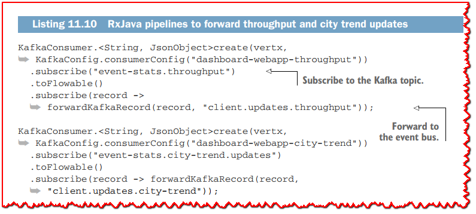

这两个Rxjava管道没有复杂的逻辑，因为它们将其转发到 *client.updates.thoughput* 和 *client.updates.updates.updates.city-trend* 事件总线目的地。

下一个列表显示了 *forwardkafkarecord* 方法的实现。

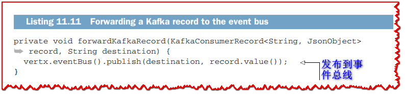

由于 Kafka 记录值的类型为 *JsonObject*，因此无需执行数据转换即可将它们发布到 Vert.x 事件总线。

### 11.2.2 桥接事件总线和 Web 应用程序

仪表板web应用程序启动一个HTTP服务器，如下列表所示。

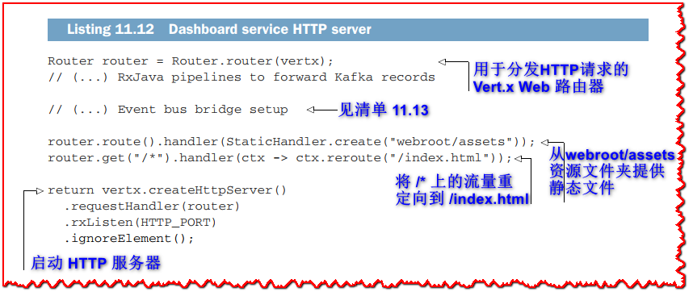

**清单 11.12** 显示了一个用于提供静态文件的 HTTP 服务器。 这只是一个摘录：我们现在需要看看 Vert.x 事件总线如何连接到 Web 应用程序。

Vert.x 使用 SockJS 库 (https://github.com/sockjs) 提供事件总线集成。 SockJS 是 WebSocket 协议 (https://tools.ietf.org/html/rfc6455) 的仿真库，它允许浏览器和服务器在持久连接之上双向通信。 Vert.x 核心 API 提供对 WebSockets 的支持，但 SockJS 很有趣，因为并非市场上的每个浏览器都正确支持 WebSockets，并且一些 HTTP 代理和负载平衡器可能会拒绝 WebSocket 连接。 SockJS 尽可能使用 WebSockets，如果不能它也会回退到其他机制，例如基于 HTTP、AJAX、JSONP 或 iframe 的长轮询。

Vert.x Web 模块为桥接事件总线的 SockJS 连接提供了一个处理程序，因此可以从服务器端（在 Vert.x 中）和客户端（在 JavaScript 中）使用相同的编程模型。 以下清单显示了如何配置它。

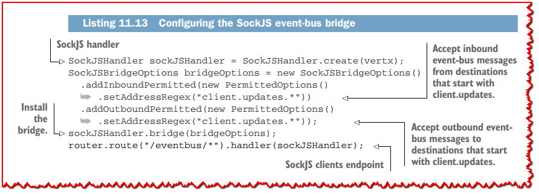

桥依赖于 SockJS 客户端连接的处理程序，具有一组权限以仅允许桥接某些事件总线目的地。 出于安全和性能原因，限制在连接的 Web 应用程序和后端之间流动的事件确实很重要。 在这种情况下，我决定只有以 *client.updates* 开头的目的地可用。

在 Web 应用程序方面，Vert.x 项目提供了 *vertx3-eventbus-client* 库，可以手动下载或使用 *npm*（Node 包管理器）等工具下载。 使用这个库，我们可以连接到事件总线，如下面的清单所示。

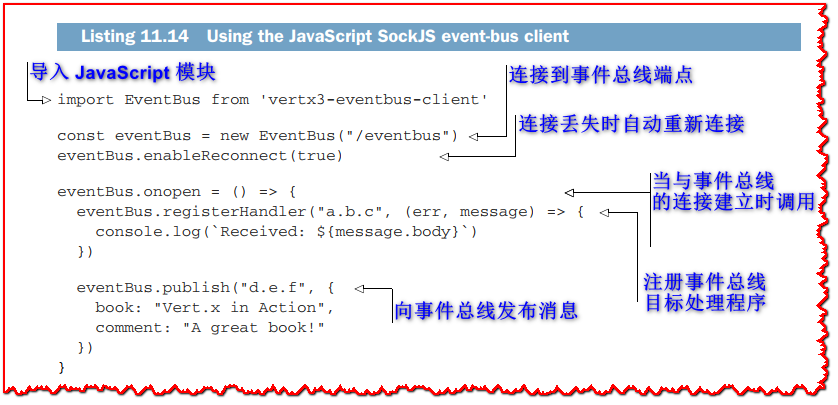

在 Vue.js 组件中使用 Vert.x 事件总线的完整代码位于源代码存储库的 *part2steps-challenge/dashboard-webapp/src/App.vue* 文件中。 如您所见，我们在 JavaScript 代码中具有相同的编程模型； 我们可以注册事件总线处理程序并发布消息，就像我们在 Vert.x 代码中一样。

### 11.2.3 从 Kafka 到实时 Web 应用程序更新

仪表板使用 Vue.js，就像您之前看到的公共 Web 应用程序服务一样。 整个应用程序本质上适合 App.vue 组件，可以在项目源代码中找到。 组件数据模型由三个条目组成，如下所示。

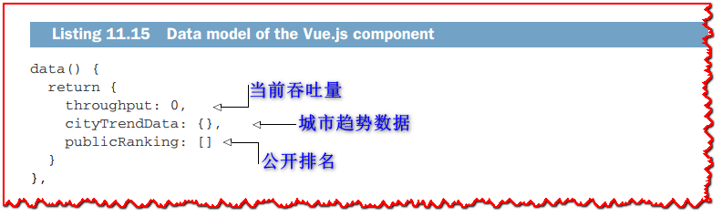

当从 Vert.x 事件总线接收到事件时，这些条目会更新。 为此，我们使用 Vue.js *mounted* 生命周期回调连接到事件总线，然后按如下方式注册处理程序。

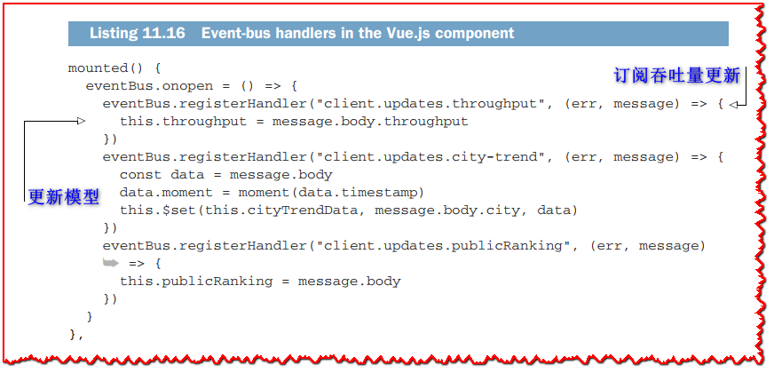

处理程序根据从事件总线接收到的内容更新模型。 由于 Vue.js 是一个响应式 Web 应用程序框架，因此接口会随着数据模型的变化而更新。 例如，当 *throughput* 的值发生变化时，以下清单中 HTML 模板显示的值也会发生变化。

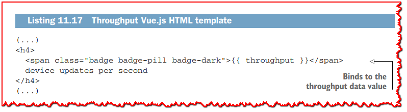

城市趋势视图渲染是一个更精细的模板。

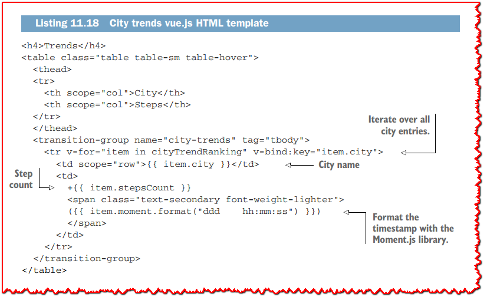

该模板遍历所有城市数据并为每个城市呈现一个表格行。 当一个城市有更新时，由于 *item.city* 绑定，城市行被更新，这确保了 *v-for* 循环生成的行的唯一性。 *transition-group* 标签是 Vue.js 特有的，用于动画目的：当数据顺序发生变化时，行顺序会随着动画而变化。 循环遍历 *cityTrendRanking*，这是一个计算属性，如下面的清单所示。

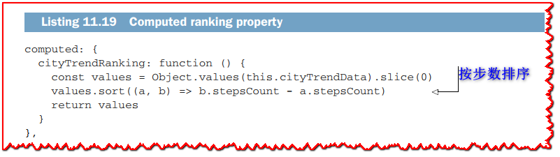

*cityTrendRanking* 计算属性根据条目的步数对条目进行排名，因此仪表板会在顶部显示步数最多的城市。

吞吐量和城市趋势每5秒更新一次，来自 Kafka 记录和 JSON 有效负载的更新被转发到仪表板 Web 应用程序。 这很有效，因为更新很频繁并且涵盖了汇总数据，但是正如您接下来将看到的，用户排名的情况更加复杂。

## 11.3 流和状态

仪表板 Web 应用程序根据用户在过去 24 小时内采取的步数显示用户的实时排名。 可以根据事件统计服务生成的更新对用户进行排名，并将其发送到 *event-stats.user-activity.updates* Kafka 主题。

### 11.3.1 更新流

发送到 *event-stats.user-activity.updates* 的每条记录都包含给定用户的最新步数。 仪表板服务可以观察这些事件，更新其状态以跟踪给定用户已走的步数，并相应地更新全球排名。 这里的问题是我们需要一些状态来启动，因为当它启动（或重新启动！）时，仪表板服务不知道早期的更新。

我们可以将 Kafka 订阅者配置为从流的开头重新启动，但它可能跨越数天甚至数周的数据。 在仪表板服务启动时重放所有记录理论上可以让我们计算出准确的排名，但这将是一项代价高昂的操作。 此外，我们需要等到所有记录都处理完毕后再将更新发送到连接的 Web 应用程序，因为这会在事件总线上产生大量流量。

另一种解决方案是首先询问活动服务当天的排名是多少，这是一个内置在服务中的简单 SQL 查询。 我们将其称为 *hydration(水合)* 阶段。 然后，我们可以在收到来自 *event-stats.user-activity.updates* Kafka 主题的更新时更新排名。

### 11.3.2 水合排名状态

The dashboard service maintains a *publicRanking* field, which is a map where keys are user names and values are the latest user update entries as JSON data. When the service starts, this collection is empty, so the first step is to fill it with data.

为此，在设置 Kafka 消费者之后，从 *DashboardWebAppVerticle* 初始化方法 (*rxStart*) 调用 *hydrate* 方法，如**清单 11.10** 所示。 此方法通过调用活动和用户配置文件服务来组装排名数据，如下面的清单所示。

*hydrate* 方法的实施依赖于在过去 24 小时内对设备进行排名。 该服务返回一个按步数排序的 JSON 数组。 我们允许在发出请求之前任意延迟5秒，并允许在活动服务不可用的情况下重试5次。 一旦我们有了排名数据，*whoOwnsDevice* 方法（**清单 11.21**）和 *fillWithUserProfile* 方法（**清单 11.22**）将计步器中心数据与用户相关联。 最后，**清单 11.23** 中的 *hydraEntryIfPublic* 方法使用来自选择公开排名的用户的数据填充 *publicRanking* 集合。

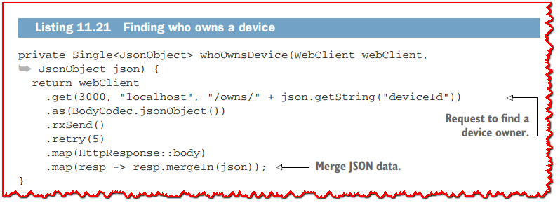

*whoOwnsDevice* 方法执行 HTTP 请求以确定谁拥有设备，然后合并生成的 JSON 数据。 此时，我们需要填充剩余的用户数据，这是通过 *fillWithUserProfile* 方法完成的，如下所示。

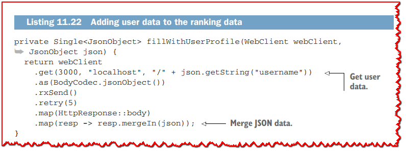

此代码与 *whoOwnsDevice* 方法的代码非常相似。

最后但同样重要的是，以下清单中的 *hydraEntryIfPublic* 方法将数据添加到 *publicRanking* 集合中。

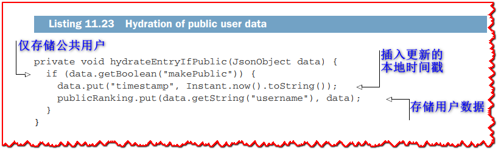

Hydration 是一个在 Verticle 启动时异步启动的过程，最终 *publicRanking* 集合包含准确的数据。 请注意，在这个阶段，我们还没有将任何排名数据推送到仪表板 Web 应用程序客户端。 现在让我们看看接下来会发生什么。

### 11.3.3 从更新流中定期更新排名

用户排名每5秒更新一次。 为此，我们会在5秒钟内从用户那里收集更新，更新公共排名数据，并将结果推送到仪表板 Web 应用程序。 我们在 5 秒内对数据进行批处理以加快仪表板的刷新速度，但如果您想要一个更生动的仪表板，您可以缩短时间窗口甚至取消它。 以下清单显示了管理此过程的 RxJava 管道。

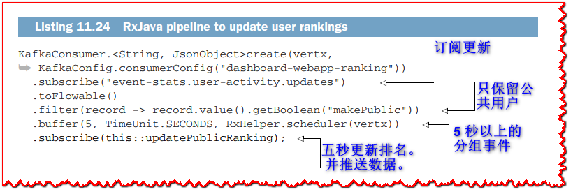

*filter* 运算符用于仅保留用户数据公开的 Kafka 记录，*buffer* 运算符生成 5 秒的事件窗口。

以下清单显示了处理这些事件批次的 *updatePublicRanking* 方法的实现。

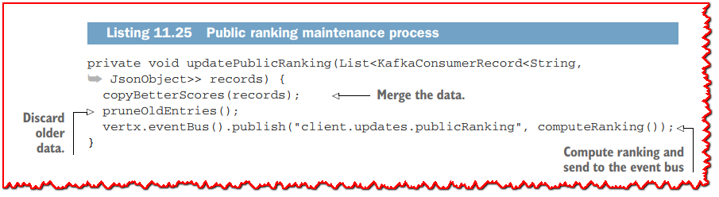

该方法分三个步骤描述该过程：
  1. 使用收集的数据更新排名数据。
  2. 丢弃旧条目。
  3. 计算新排名并通过事件总线将其发送到连接的 Web 应用程序。

下一个清单显示了 *copyBetterScores* 方法的实现。

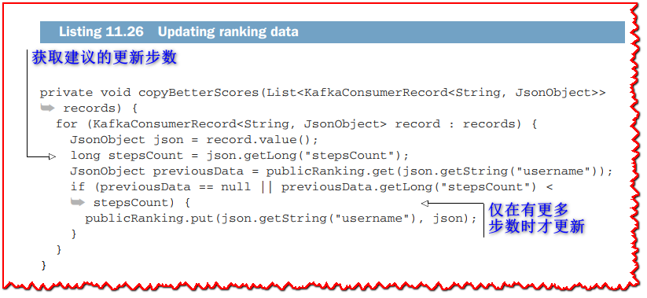

当收集的条目的步数高于前一个条目时，上述方法会更新 *publicRanking* 集合，因为水合过程和用户更新之间可能存在冲突。

下一个清单显示了 *pruneOldEntries* 方法。

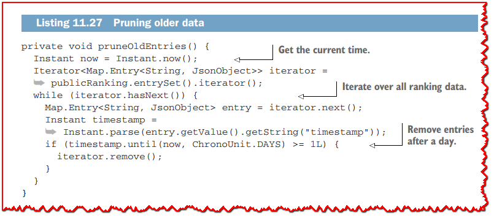

此方法简单地遍历 *publicRanking* 集合中的所有排名数据条目，并删除超过1天的条目。

排名由 *computeRanking* 方法生成，如下所示。

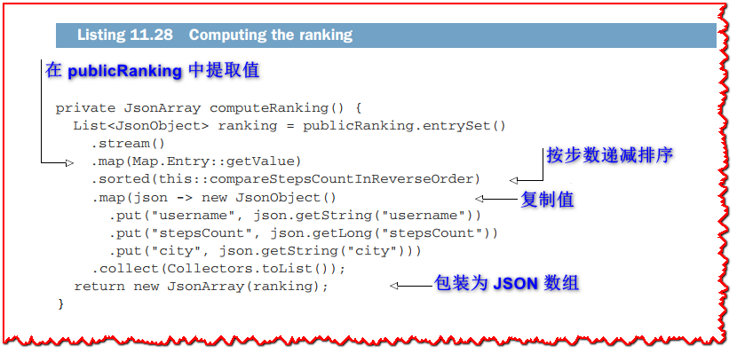

该方法对公共排名数据进行排序并生成一个 JSON 数组，其中条目按倒序排列（第一个值是过去 24 小时内步数最多的用户，依此类推）。

用于比较和排序条目的 *compareStepsCountInReverseOrder* 方法显示在以下清单中。

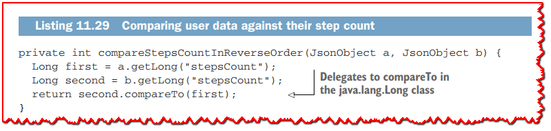

当 b 的步数少于 *a* 时，比较返回 -1，当它们相等时返回 0，当 *b* 的步数多于 *a* 时返回 1。

用于呈现用户排名表的 *Vue.js* 模板显示在下一个清单中。

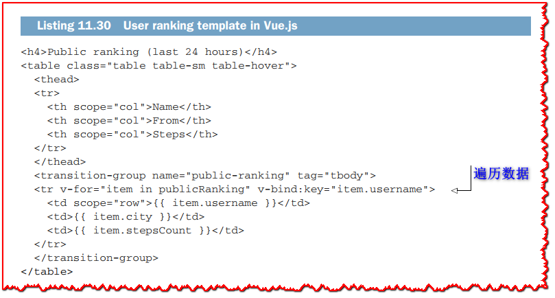

Web 应用程序的 *Vue.js* 代码通过事件总线接收排名数组并更新 *publicRanking* 数据条目。 每当发生这种情况时，都会更新显示以反映更改。 就像城市趋势表一样，条目随着顺序的变化使用动画移动。

从 Kafka 记录到响应式 Web 应用程序的端到端流处理到此结束。 下一章重点介绍反应式系统中的弹性和容错性。

## 总结
  - RxJava 提供了像 *buffer* 和 *groupBy* 这样的高级操作符，它们可以组合来执行聚合数据处理。
  - 微服务不必公开 HTTP API。 事件统计服务仅使用和生成 Kafka 记录。
  - 有一些流处理工作可以从流的任何点开始，比如计算吞吐量，而其他工作需要一些初始状态，比如在过去 24 小时内维护用户的实时排名。
  - Vert.x 事件总线可以使用 SockJS 协议扩展到 Web 应用程序，提供跨服务和 Web 代码库的相同通信模型。
  - Vert.x 允许您构建端到端的反应式系统，其中事件触发服务中的计算并影响面向用户的 Web 应用程序。
