# 第十二章: 通过负载和混乱测试实现响应性

> 翻译: 白石(https://github.com/wjw465150/Vert.x-in-Action-ChineseVersion)

**本章涵盖**
  - 用Locust模拟用户
  - 使用Hey负载测试HTTP端点
  - 使用Pumba进行混乱测试
  - 通过显式超时、断路器和缓存来减少故障

现在，我们涵盖了1万步挑战应用程序的所有重要技术部分：如何构建Web API，Web应用程序和边缘服务，以及如何使用数据库并执行事件流处理。 通过使用Vert.x的异步和响应式编程，我们可以期望形成该应用程序的一组服务是 *响应式*：当工作负载增长时可伸缩，当故障发生时具有弹性。

我们构建的服务实际上是响应式的吗?现在让我们通过测试和实验来发现这一点，并看看我们可以在哪些方面做出改进。

为此，我们将使用负载测试工具来强调服务和测量延迟。然后，我们将使用混乱测试工具添加失败，以了解这是如何影响服务行为的，我们将讨论修复我们发现的问题的几种选项。您也可以在自己的项目中应用此方法。

> **软件版本**
>
> 本章使用以下工具版本编写和测试:
>
> - Locust 1.0.3
> - Python 3.8.2
> - Hey 0.1.3
> - Pumba 0.7.2

## 12.1 初始实验:性能好吗?

本章主要基于实验，因此我们需要生成一些工作负载来评估应用程序如何应对高要求的工作负载和故障。有许多负载测试工具，但要选择一种并不总是那么容易。有些工具非常擅长强调特定请求的服务（例如，“每秒给 `/api /hello` 发出500个请求时的延迟是多少”）。 Some tools provide more flexibility by offering scripting capabilities (e.g., “Simulate a user that logs in, then adds items to a cart, then perform a purchase”). 最后，有些工具可以完成所有这些工作，但是报告的指标可能不准确，这与工具的实现方式有关。

在本章中，我选择了两种流行且易于使用的工具:
  - *Locust* - 一个通用的负载测试工具，通过Python编写的脚本模拟用户(https://locust.io/)
  - *Hey* - 一个可靠的HTTP加载生成器(https://github.com/rakyll/hey)

这两种工具可以一起使用。Locust允许我们模拟与应用程序交互的用户的代表性工作负载，而Hey则为我们提供特定HTTP端点在压力下的行为的精确度量。

>  **💡提示:** Locust和Hey都可以在Linux、macOS和Windows上工作。通常，如果您是Windows用户，我建议您使用Windows for Linux 子系统 (WSL)。

### 12.1.1 负载测试前的一些注意事项

在我们运行负载测试工具之前，我想讨论一下获得代表性结果所必须考虑的几点。最重要的是，我们需要谨慎地解读它们。

首先，当你运行第7章中提到的1万步应用程序时，所有的服务都运行在本地，而第三方中间件和服务都运行在Docker容器中。这意味着所有内容实际上都运行在同一台机器上，从而避免了真正的网络通信。例如，当用户配置文件服务与MongoDB对话时，它会通过虚拟网络接口，但它永远不会到达实际的网络接口，因此不会出现波动延迟或数据丢失。我们将在本章后面使用其他工具来模拟网络问题，并对服务的行为有更精确的理解。

接下来，很有可能您将在您的笔记本电脑或桌面电脑上进行这些实验。请记住，在硬件和软件配置方面，实服务器与您的工作站是不同的，因此您可能会使用比服务在生产设置中实际能够处理的更低的工作负载执行测试。例如，当我们直接从容器中使用PostgreSQL时，我们不需要做任何调优，而这在生产环境中是需要做的。更一般的情况是，从容器运行中间件服务有利于开发，但在生产环境中，无论是否使用容器，运行它们的方式都不同。还要注意，我们将在不进行任何JVM调优的情况下运行基于vert.x的服务。在生产设置中，您至少需要调整内存设置和调优垃圾收集器。

此外，每个服务将作为单个实例运行，顶点也将是单个实例。它们都被设计为使用多个实例，但是，比方说，部署摄入服务的两个实例还需要部署HTTP反向代理来在两个实例之间分发流量。

最后但并非最不重要的是，最好使用两台机器运行负载测试:一台运行应用程序，另一台运行负载测试工具。如果方便的话，您可以在一台机器上执行测试，但是请记住以下几点:
  - 您将无法通过网络，这会影响结果。
  - 被测试的服务和负载测试工具都将争夺操作系统资源(CPU时间、网络、打开的文件描述符等)，这也会影响结果。

我在本章中给出的结果是基于在两台Apple MacBook笔记本电脑上进行的实验，它们几乎不符合生产级服务器的要求。我还使用了WiFi网络，它不如以太网有线网络，尤其是在延迟稳定的情况下。最后，macOS对一个进程可以打开的文件描述符的数量有很低的限制(256)，所以我必须用*ulimit*命令启动它们来运行服务和负载测试工具 - 否则，由于打开了太多连接，就会出现与服务代码无关的错误。我将向您展示如何做到这一点，根据您的系统，您可能必须使用这种技术来运行实验。

### 12.1.2 用Locust模拟用户

Locust是一种通过模拟与服务交互的用户来生成工作负载的工具。您可以使用它进行演示、测试和测量性能。

您的机器上需要一个最新版本的Python。如果你是Python新手，你可以阅读Naomi Ceder的 *探索Python基础知识*  (Manning, 2019)或浏览许多在线教程中的一个。在编写本文时，我使用的是Python 3.8.2。

您可以通过在命令行中运行 *pip install Locust* *来安装Locust，其中  *pip* 是标准的Python包管理器。

我们将使用的Locust文件是 *loccustfile .py*，它可以在本书的Git存储库的 *part2steps-challenge/load-testing* 文件夹中找到。我们将模拟如**图12.1**所示的用户行为:
  **1.** 每个新用户都是由随机数据和一组预定义的城市生成的。
  **2.** 新创建的用户通过公共API注册自己。
  **3.** 用户在注册后的第一个请求中获取一个JWT令牌，然后定期发出请求:
      **一.** 用户发送步数更新(80%的请求)。
      **二.** 用户获取其配置文件数据(其请求的5%)。
      **三.** 用户获取它的总步数(请求的5%)。
      **四.** 用户获取当天的步数(10%的请求)。

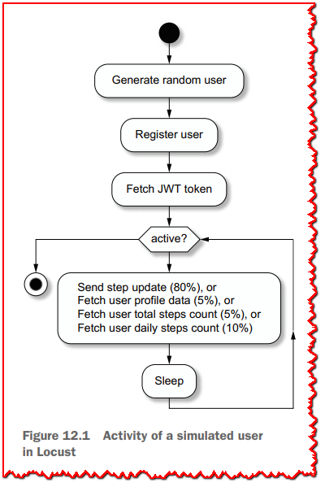

此活动涵盖了大多数服务：在大多数服务之间摄入触发器事件交换，而API查询触发了对活动和用户配置文件服务的调用。

*locustfile.py*文件定义了两个类。 *UserBehavior* 定义用户执行的任务，*UserWithDevice* 以0.5到2秒的随机延迟运行这些任务。 这是请求之间相对较短的延迟，以增加每秒请求的总数。

有两个参数用于与Locust进行测试：
  - 模拟用户数量
  - 孵化率，即在初始加速阶段每秒创建的新用户数量

如第七章所述，你需要在终端中使用 *Docker-Compose* 从 *part2-steps-challenge* 文件夹中运行容器服务。

然后，您可以在另一个终端运行所有基于Vert.x的服务。 如果已安装foreman，则可以使用foreman启动，也可以使用Procfile中的命令运行所有服务。

下面的清单显示了执行初始热身运行的命令。

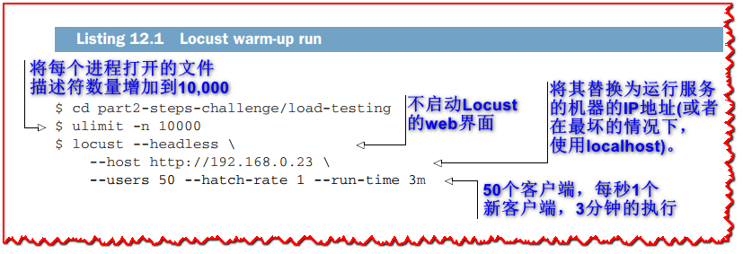

进行这样的预热运行是很重要的，因为运行各种服务的JVM在开始高效运行代码之前需要有一些工作负载。在此之后，您可以运行一个更大的工作负载，以获得服务运行情况的初步估计。

下面的清单显示了使用150个客户端运行5分钟测试的命令，孵化速率为每秒2个新用户。

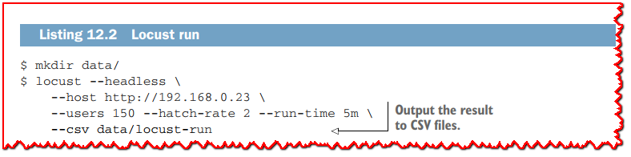

让我们进行实验并收集结果。我们将获得每种请求类型的各种指标，例如平均响应时间、最小/最大时间、中值时间等等。一个有趣的指标是给定百分比的延迟。

让我们以第80百分位的延迟为例。这是观察到的80%请求的最大延迟。如果延迟是100毫秒，这意味着80%的请求花费的时间少于100毫秒。类似地，如果95百分比的延迟是150毫秒，这意味着95%的请求最多花费150毫秒。百分之一百显示了观察到的最糟糕的情况。

在度量性能时，我们通常对第95百分位到第100百分位之间的延迟感兴趣。假设第90个百分位的延迟是50毫秒，但第95个百分位的延迟是3秒，第99个百分位的延迟是20秒。在这种情况下，我们显然会遇到性能问题，因为我们观察到大量的不良延迟。相比之下，观察第90百分位的延迟为50毫秒，第99百分位的延迟为70毫秒，可以看出服务具有非常一致的行为。

服务行为在负载下的延迟分布比平均延迟更能说明问题。我们真正感兴趣的不是最好的情况而是那些我们观察到最差结果的情况。**图12.2** 显示了我在5分钟内对150个用户进行的一次运行的延迟报告。

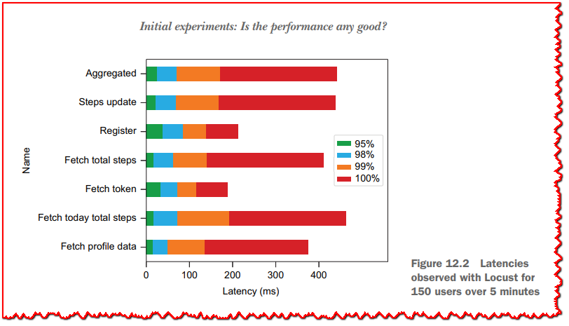

该图包含第95、98、99和100百分位的值。报告的延迟在所有请求的第99个百分位上都低于200毫秒，对于不完美的条件和没有调优的运行来说，这听起来很合理。百分之一百的值显示了观察到的最差响应时间，它们都在500毫秒以下。

我们可以增加用户数量，从而对应用程序施加更大的压力，但我们不打算对Locust进行精确的负载测试。如果提高用户数量，很快就会看到延迟和错误增加。这不是由于正在测试的应用程序，而是由于在撰写本文时对Locust的限制:
  - Locust的网络堆栈效率不是很高，因此我们很快就会达到并发用户数量的限制。
  - 与许多负载测试工具一样，Locust也存在“协调遗漏”问题，这是一个时间度量不正确的问题，因为忽略了实际发出请求之前的等待时间。

为了进行准确的负载测试，我们必须使用另一个工具，Hey就是一个很好的工具。

>  **💡提示:** 对于产生小工作量，甚至自动化项目演示，Locust仍然是一个很好的工具。一旦启动并模拟用户，您可以连接到仪表板web应用程序，并查看实时更新。

### 12.1.3 使用Hey对API进行负载测试

Hey是一个比Locust简单得多的工具，因为它不能运行脚本，而且它主要强调HTTP端点。然而，它是一个很好的工具，在压力下得到一个端点的精确测量。

我们仍然会在侧面使用Locust来模拟少量的用户。这将在系统中跨所有服务和中间件生成一些活动，因此我们不会在空闲的系统上进行测量。

我们将用两个不同的请求来强调公共API端点:
  - 获取用户的总步数。
  - 验证并获取JWT令牌。

这很有趣，因为要获取用户的步数，公共API服务需要向活动服务发出HTTP请求，活动服务反过来查询PostgreSQL数据库。获取JWT令牌涉及更多的工作，因为在执行一些加密工作并最终返回JWT令牌之前，需要查询两次用户配置文件服务。因此，这些请求的总体延迟会受到HTTP API、用户和活动服务，最后是数据库中所做工作的影响。

>  **🏷注意:** 这里的目标不是确定服务在最大吞吐量和最佳延迟方面的限制。我们希望有一个基线来查看服务在持续工作负载下的行为，这将帮助我们在以后确定各种故障类型的影响和缓解策略。

由于Hey不能运行脚本，我们必须专注于一个用户，并在shell脚本中封装对Hey的调用。您将在 *part2-steps-challenge/load-testing* 文件夹中找到帮助脚本。第一个脚本是*create-user.sh*，如下清单所示。

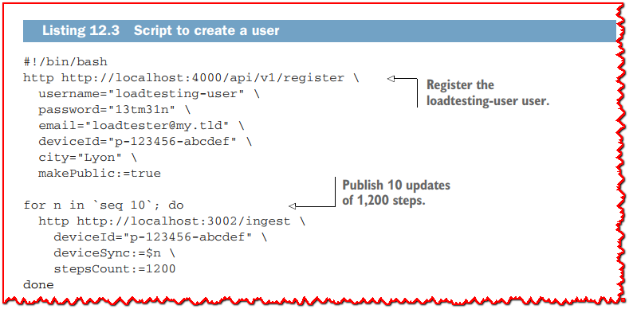

这个脚本确保创建了用户 *loadtesting-user*，并记录了一些更新。

下面清单中显示的 *run-hey-user-steps.sh* 脚本使用Hey并获取用户 *loadtesting-user* 的总步骤数。

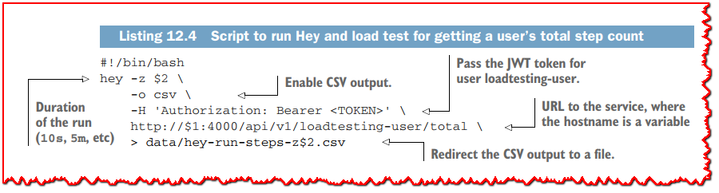

下面清单中的 *run-hey-token.sh* 脚本与此类似，它执行一个身份验证请求以获得JWT令牌。

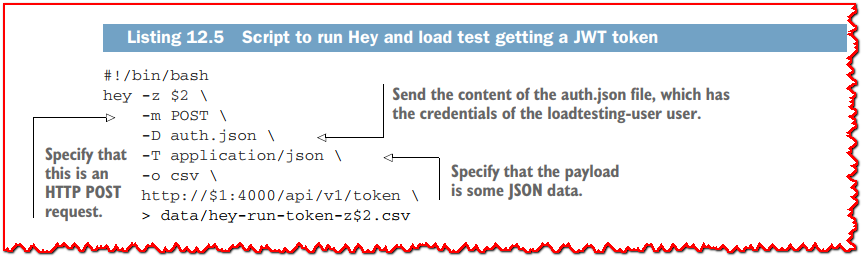

现在我们准备对用户的总步数端点执行一次运行。在我的例子中，我使用第二台笔记本电脑进行实验，而我的主笔记本电脑运行服务，在运行测试时其IP地址为192.168.0.23。首先，我们将使用Locust获得一些轻微的背景工作负载，再次确保系统不会完全空闲:

```bash
$ locust --headless --host [http://192.168.0.23 ](http://192.168.0.23/)--users 20 --hatch-rate 2
```

在另一个终端中，我们将使用Hey启动测试5分钟:

```bash
./run-hey-user-steps.sh 192.168.0.23 5m
```

一旦我们收集了结果，分析它们的最佳方法是处理数据并绘制它。您将在 *part2-step2-challenge/loadtesting* 文件夹中找到执行此操作的Python脚本。**图12.**3展示了这个实验的示意图。

该图包含三个子图：
  - 请求延迟随时间的分布图
  - 吞吐量图与请求延迟图具有相同的规模
  - 延迟分布在95%到100%之间

当吞吐量很高时，99.99个百分点的延迟非常好。与使用Locust的100个用户的工作量相比，我们使用Hey获得了更好的结果。我们可以看到一些短暂的吞吐量下降与较高的延迟响应相关，但在这些情况下没有什么可担心的。这些下降可能是由各种因素造成的，包括PostgreSQL、WiFi网络或运行的JVM垃圾收集器。通过更好的硬件运行Linux、有线网络、一些JVM调优和正确配置的PostgreSQL数据库服务器，很容易获得更好的结果。

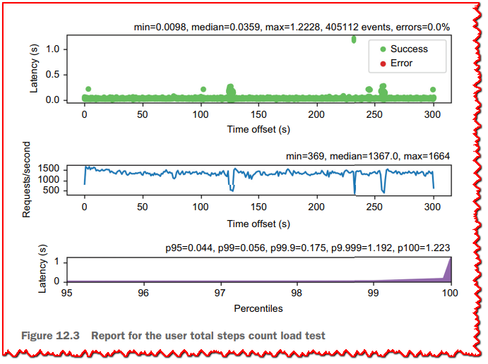

我们可以运行另一个负载测试实验，获取JWT令牌:

```bash
./run-hey-token.sh 192.168.0.23 5m
```

结果如 **图12.4** 所示。

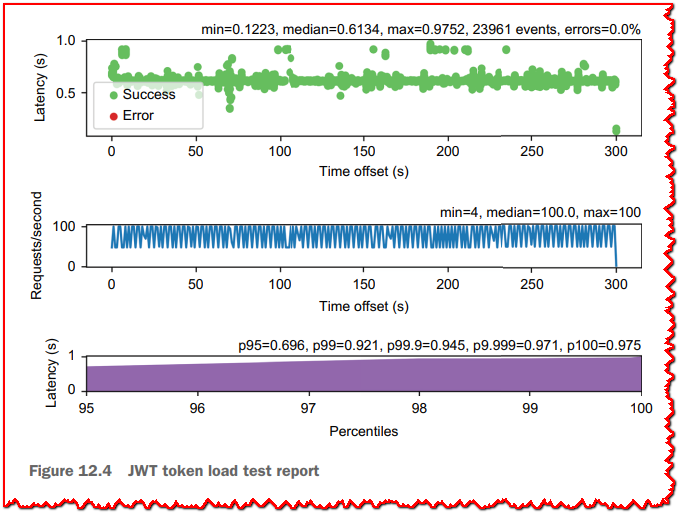

这些结果再次显示出一致的行为，尽管其延迟且吞吐量较高，而吞吐量较高。 这很容易解释，因为对用户配置文件服务有两个HTTP请求，然后必须生成和签名令牌。 HTTP请求主要是I/O结合，而令牌签名需要在事件循环上完成CPU结合的工作。 在五分钟的运行中，结果是一致的。

可以肯定地说，经过测试的服务实现在负载下交付了稳定的性能。您可以尝试增加Hey的工作人员数量，看看更大的工作量会发生什么(参见 *Hey* 工具的 *-c* 标志)。您也可以通过增加请求速率来执行延迟测量(参见 *-q* 标志)，但请注意，在默认情况下，Hey不做速率限制，所以在之前的运行中，Hey在50个worker(默认)的情况下做得最好。

可伸缩性只体现了响应式的一半，所以现在让我们看看在出现故障时，我们的服务在相同的工作负载下的行为。

## 12.2 我们来做一些混乱工程

严格地说，*混乱工程* 是一种主动在生产系统中引入故障的实践，以观察它们如何应对意外的应用程序、网络和基础设施故障。例如，您可以尝试关闭数据库、关闭服务、引入网络延迟，甚至中断网络之间的通信。与其等待生产中发生故障，并在周日凌晨4点叫醒现场的可靠性工程师，你决定主动地定期引入故障。

您还可以在软件进入生产之前进行混乱工程，因为核心原则仍然是相同的:带一些工作负载运行软件，引入某种形式的故障，并查看软件的行为。

### 12.2.1 测试计划

我们需要一个可重现的场景来评估服务，因为它们将在正常阶段和故障阶段之间交替进行。我们将根据 **图12.5** 中的计划介绍故障。

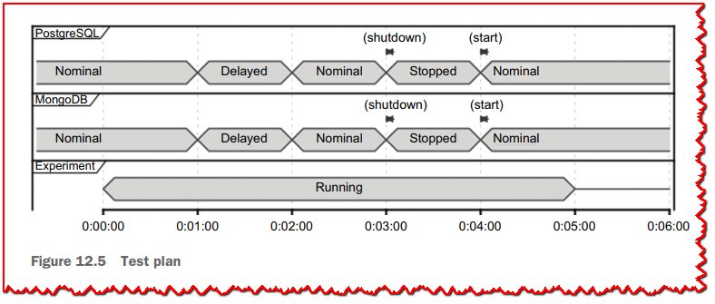

我们将在5分钟的时间内运行与前几节相同的负载测试实验。改变的是，我们将把它分成五个阶段，每个阶段一分钟:

  **1** 数据库在第一分钟正常工作。

  **2** 我们将为所有数据库流量引入3秒(+/- 500毫秒)的2分钟网络延迟。

  **3** 我们将在第三分钟回到正常上的表现。

  **4** 我们将停止这两个数据库四分钟。

  **5** 在第五分钟，也是最后一分钟，我们将回到正常上的表现。

网络延迟会增加延迟，但它们也会模拟开始变得无响应的超载数据库或服务。使用极端的延迟值，它们还可以模拟不可达的主机，其中建立TCP连接需要很长时间才能失败。另一方面，停止数据库会模拟服务停止，而它们的主机仍在运行，这应该会导致快速TCP连接错误。

我们要如何引入这些失败?

### 12.2.2 Chaos testing with Pumba

Pumba是一个用于在Docker容器中引入故障的混乱测试工具(https://github.com/alexei-led/pumba)。它可以用来做以下事情:
  - 杀死、移除和停止容器
  - 暂停容器中的进程
  - 压力容器资源(例如，CPU、内存或文件系统)
  - 模拟网络问题(包延迟、丢失、重复、损坏等)

Pumba是一个非常方便的工具，您可以下载并在您的机器上运行。唯一的依赖是Docker。

我们专注于测试计划中的两种失败类型，因为它们与我们最相关。您可以轻松地处理其他类型的失败。

在本地运行1万步的应用程序后，让我们使用Pumba并为MongoDB数据库流量添加一些延迟。让我们用 *load-testing/fetch-token.sh* 脚本获取一个JWT令牌，如下所示。

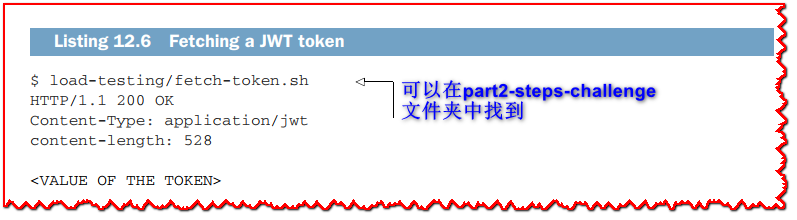

在另一个终端中，让我们引入以下命令的延迟。

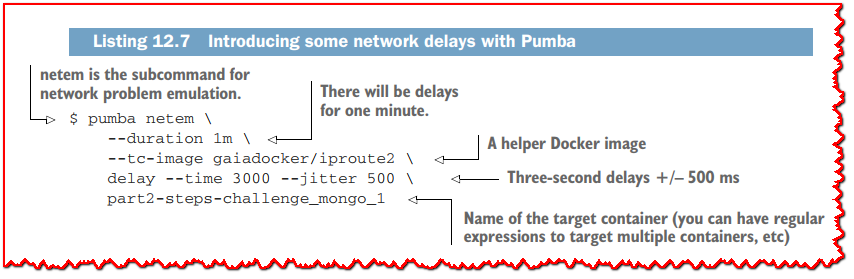

Pumba 现在应该能跑一分钟了。再次尝试获取JWT令牌;该命令显然应该比以前花费更多的时间，如下面的清单所示。

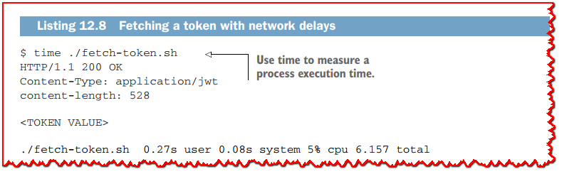

由于等待I/O，该过程花费了6.157秒才能获取令牌。 同样，您可以使用以下命令停止容器。

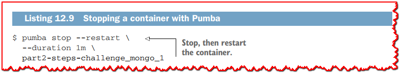

如果您再次运行脚本获取令牌，您将等待，而在日志中您将看到一些由于MongoDB容器关闭而导致的错误，如下所示。

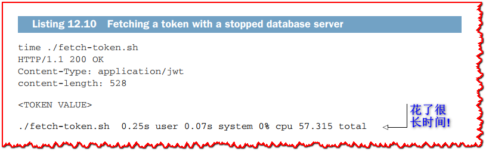

服务现在没有响应。我的请求花了57.315秒完成，因为它必须等待数据库回来。

让我们通过运行测试计划来获得更清晰的理解，我们将看到当这些故障发生时，系统在负载测试下会发生什么。

### 12.2.3 我们还没有弹性(尚未)

要运行这些实验，您将使用与本章前面相同的shell脚本来启动Hey。您最好使用两台机器。在 *part2-steps-challenge/load-testing* 文件夹中包含一个 *run-chaos.sh*  的shell脚本，通过在正确的时间调用Pumba来自动化测试计划。关键是同时启动 *run-chaos.sh* 和Hey脚本(例如，*run-hey-token.sh* )。

**图12.6** 显示了获取用户总步数时服务的行为。

结果显示Pumba运行时明显缺乏响应性。

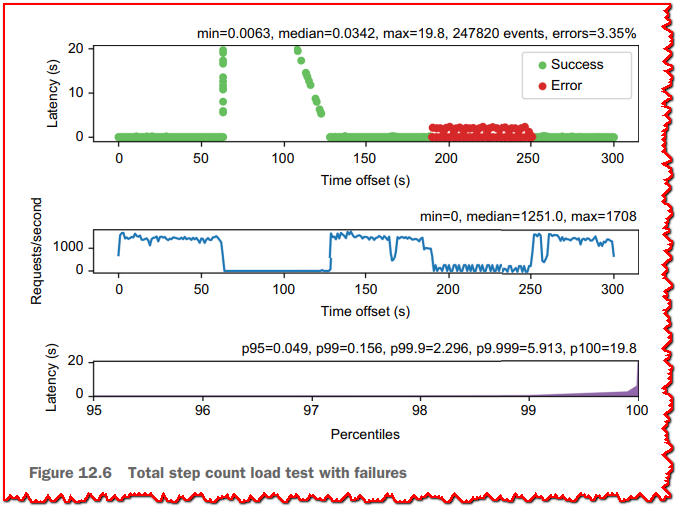

在网络延迟阶段，我们看到延迟迅速增加到近20秒，之后吞吐量急剧下降。这里发生的情况是，请求被放入队列，等待公共API和用户配置文件服务中的响应，直到系统停止。数据库延迟在2.5秒到3.5秒之间，这在实践中可能是临时发生的。当然，由于负载测试，这个问题在这里被大大放大了，但是任何具有一些持续流量的服务，即使延迟较小，也可以显示出这种行为。

在数据库宕机的阶段，我们会看到整个模拟宕机期间的错误。虽然我们很难对错误感到惊讶，但我们可以看到，这个系统也没有停止。然而，这还远远不够完美，因为吞吐量下降是一个信号，表明请求需要 *一些* 时间来给出错误，而其他请求正在等待，直到他们超时，或他们最终完成时数据库重新启动。

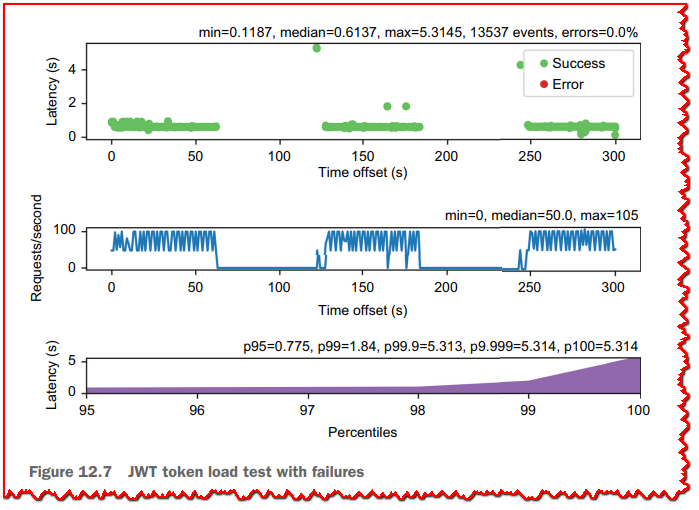

现在让我们看看 **图12.7**，看看如何获取JWT令牌。

网络延迟也会导致系统停止，但我们在散点图中没有观察到相同的形状。这是由于这种类型的请求的服务固有的较低的吞吐量，以及需要两个HTTP请求的事实。请求堆积起来，等待响应的到来，一旦延迟停止，系统就会重新启动。更有趣的是，在数据库停止的阶段，我们没有观察到错误。因为系统正在等待数据库，所以不再处理请求。

从这两个实验中，我们可以看到服务在出现故障时没有响应，因此它们没有响应。好消息是，有一些方法可以修复这个问题，所以让我们看看如何变得被动，再次使用公共API作为参考。然后，您将能够将这些技术推断到其他服务。

## 12.3 从“可扩展” 到 “可扩展和弹性”

为了使我们的应用程序具有弹性，我们必须对公共API进行修改，确保它在检测到故障时能够“快速”响应。我们将探讨两种方法:强制超时，然后使用断路器。

### 12.3.1 执行超时

在前面的实验中观察到，在等待数据库恢复正常状态或等待TCP错误出现时，请求会堆积起来。第一种方法是在HTTP客户端请求中强制短时间超时，这样当用户配置文件或活动服务花费太长时间响应时，它们就会快速失败。

更改非常简单:我们只需要向Vert.x web客户端发出的HTTP请求添加超时，如 **清单12.11** 所示。

>  **💡提示:** 您可以在Git存储库的*chapter12/publicapi-with-timeout *分支中找到相应的代码更改。

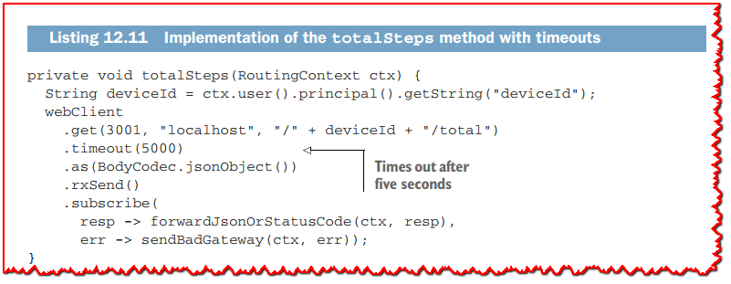

在 *fetchUserDetails* 和 *token* 方法中的变化是相同的。5秒的超时相对较短，可以确保快速通知错误。

直观地看，这应该会提高公共API服务的响应能力，并避免吞吐量停止。让我们看看再次运行chaos测试实验会发生什么，如 **图12.8** 所示。

与 **图12.6** 中的实验相比，我们仍然大大降低了失败期间的吞吐量，但至少我们看到了报告的错误，这多亏了强制超时。我们还看到最大延迟低于6秒，这与5秒的超时一致。

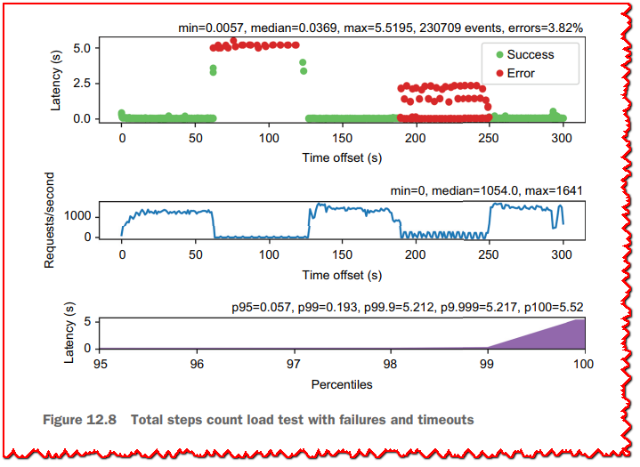


现在让我们看看JWT令牌负载测试的行为，如 **图12.9** 所示。这次运行确认了我们所观察到的情况:强制执行超时，确保在故障期间仍能处理一些请求。但是，最坏情况下的延迟比没有超时时更糟糕:网络延迟延长了对用户配置文件服务执行两个HTTP请求的时间，因此较高的值对应于第二个请求超时的请求。

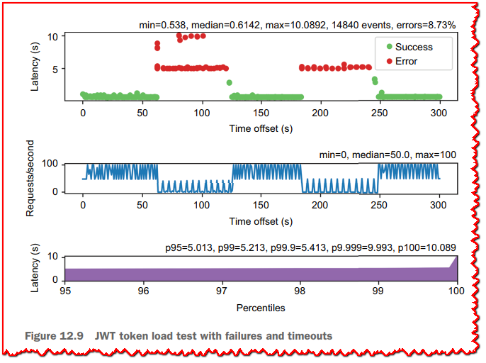

在提高响应性方面，超时总比没有超时要好，但我们不能把我们的公共API服务定义为弹性服务。我们需要的是一种让服务“知道”发生了故障的方法，这样它就能快速失败，而不是等待超时发生。这就是断路器的作用!

### 12.3.2 使用断路器

断路器的目标是防止出现上一节所观察到的问题，即对无响应系统的请求堆积起来，导致分布式服务之间的级联错误。断路器充当(网络)请求(如RPC调用、HTTP请求或数据库调用)和要调用的服务之间的代理形式。

图12.10显示了断路器作为有限状态机的工作原理。这个想法很简单。断路器在闭合状态启动，对每一个请求，观察请求是否成功。失败可能是因为报告了错误(例如，TCP超时或TCP连接错误)，或因为操作花费了太长时间才完成。

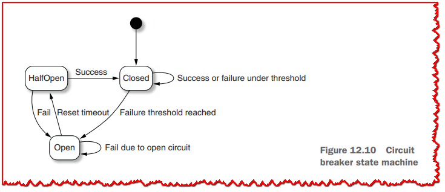

一旦报告了一定数量的错误，断路器就进入开路状态。从这里开始，所有操作都将被通知由于电路打开而导致的故障。这避免了进一步向没有响应的服务发出请求，从而允许快速错误响应、尝试替代恢复策略，并减少服务端和请求端压力。

断路器离开开路状态，并进入半开路状态后，一些复位超时。处于半开状态的第一个请求确定服务是否已恢复。与打开状态不同，半打开状态是我们开始再次进行实际操作的地方。如果成功，断路器回到闭合状态，并恢复正常服务。如果没有，在它回到半开状态之前，将开始另一个重置周期，并检查服务是否恢复。

>  **💡提示:** 你可以在Git仓库的*chapter12/publicapi-with-circuit-breaker*分支中找到这里讨论的代码更改。

Vert.x提供了 *Vertx -circuit-breaker* 模块，需要添加到公共API项目中。我们将使用两个断路器:一个用于令牌生成请求，另一个用于调用活动服务(例如获取用户的总步骤数)。下面的清单显示了在 *PublicApiVerticlerxStart* 方法中创建断路器的代码。

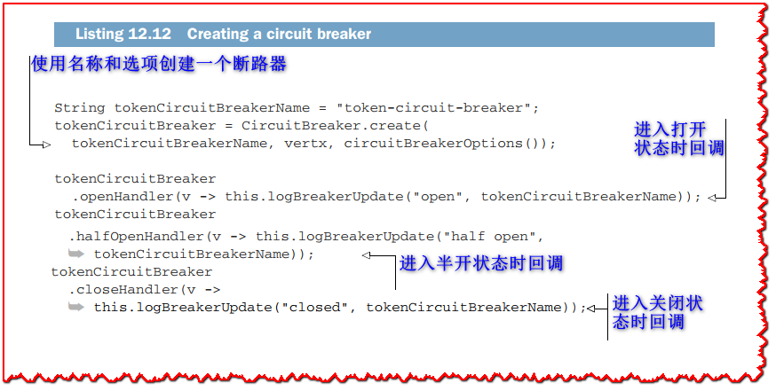

*tokenCircuitBreakerName* 引用是 *CircuitBreaker* 类型的字段。 活动服务断路器还有另一个名为 *activityCircuitBreaker* 的字段，代码相同。 状态变化的回调可以有选择地设置。记录这些状态变化以用于诊断是一个好主意。

下面的清单显示了一个断路器配置。

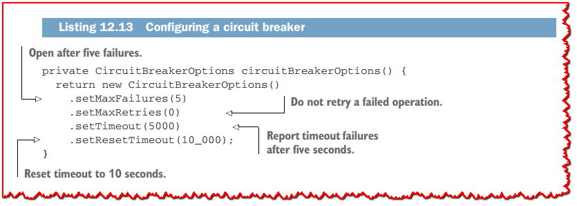

我们将在5次故障后打开断路器，包括5秒后操作超时(与之前的实验一致)。重置超时设置为10秒，这将让我们经常检查服务如何运行。这个值的长度应该取决于您的上下文，但是您可以预期，长超时将增加服务在降级模式下运行的时间或报告错误，而短超时可能会降低使用断路器的有效性。

下面的清单显示了修改后的令牌方法，其中的代码封装在一个断路器调用中。

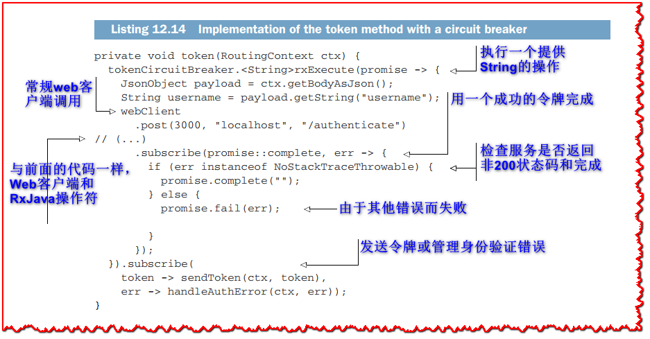

断路器执行一个操作，此处正在向用户配置文件服务提出两个HTTP请求，然后制作JWT令牌。 操作的结果是JWT令牌值的 *Single<String>*。 执行方法向包装的代码传递一个承诺，因此它可以通知操作是否成功。

必须按照以下清单修改 *handleAuthError* 方法，以检查任何错误的来源。

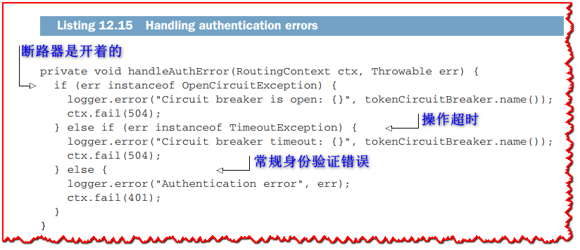

断路器报告了开路条件和操作超时，具有专用例外。 在这些情况下，我们报告了HTTP 500状态代码或经典401，以便请求者知道失败是否是由于错误的凭据。

这很好，但是断路器对我们系统的实际影响是什么?让我们通过在JWT令牌生成上运行这个实验来看看。结果如 **图12.11** 所示。

断路器的影响令人震惊：该服务现在在故障期间响应良好！ 在故障期间，我们会获得高吞吐量，因为当断路器打开时，服务现在快速失败。有趣的是，我们可以发现当电路断路器在半开状态下试图发出请求时:这些是定期间隔的高延迟错误点。我们还可以看到99.99个百分点的延迟与之前的运行相比降低了。

这一切都很好，但是如何获取用户的总步数呢？

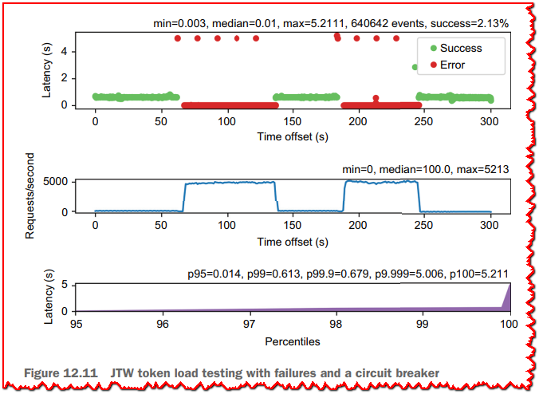

### 12.3.3 弹性和后备策略

断路器使JWT令牌生成即使在故障情况下也能响应，因此端点现在完全反应。也就是说，它并没有提供太多的后备策略:如果我们不能与用户配置文件服务对话，我们就没有办法验证用户，然后生成一个JWT令牌。这就是为什么断路器总是报告错误。

我们可以在向活动服务发出请求时采用相同的策略，并简单地报告错误。也就是说，我们可以通过缓存数据和向请求者提供旧值来提供进一步的弹性。后备策略依赖于功能需求:在没有验证工作的情况下，我们无法生成JWT令牌，但如果缓存中有一些旧的步数数据，我们当然可以提供这些数据。

我们将使用高效的内存中Caffeine缓存库(https://github.com/ben-manes/caffeine)。这个库提供了管理缓存数据的可配置策略，包括计数、访问和基于时间的回收策略。我们也可以将数据缓存到Java *HashMap*中，但如果没有适当地设置适当的回收策略，就会很快暴露出内存耗尽的问题。

下面的清单展示了如何创建最多10,000个条目的缓存，其中键是字符串，值是长整数。

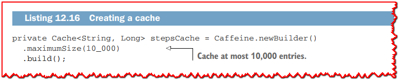

在下面的列表中，我们使用*cacheTotalSteps*方法向缓存添加条目，当达到10,000条目的限制时，Caffeine会清除旧的条目。

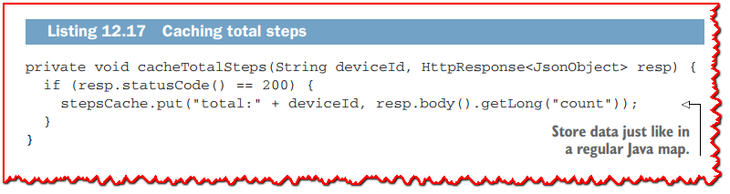

前面的方法在*totalSteps*方法中使用，如下所示，其中的代码使用一个断路器调用进行了包装。

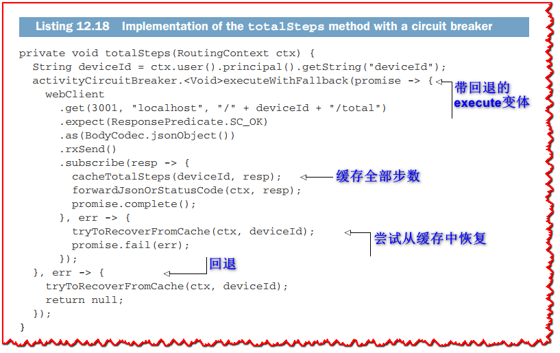

我们现在使用一个不返回任何值的断路器，因此是 *Void* 参数类型。 *executeWithFallback* 方法允许我们在电路打开时提供回退，因此我们可以尝试从缓存中恢复值。 这是在以下清单中的 *tryToRecoverFromCache* 方法中完成的。

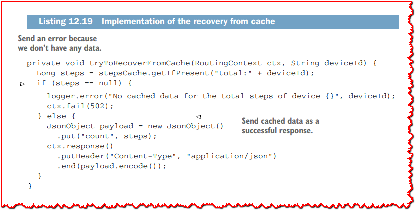

通过 *tryToRecoverFromCache* 方法从缓存中恢复，我们并不总是发送错误。 如果我们在缓存中有数据，我们仍然可以提供响应，尽管可能是过时的值。

>  **🏷注意:** 缓存步数计数和使用断路器回退从旧值恢复也可以直接在活动服务中完成。

现在是时候在获取步数时检查服务的行为了。 首先，让我们在数据库最初关闭且服务刚刚启动的情况下进行冷启动运行。 **图 12.12** 显示了两分钟的运行，数据库在一分钟后启动。 服务立即启动，出现一些错误，然后断路器打开，此时服务始终以非常低的延迟提供错误。

请记住，该服务尚未缓存任何数据。

当数据库启动时，我们可以看到一个延迟峰值，因为错误变成了成功，然后服务能够名义上响应。 请注意，在第一个成功秒内，JVM 将开始优化与数据库对话的代码，因此提高了吞吐量。

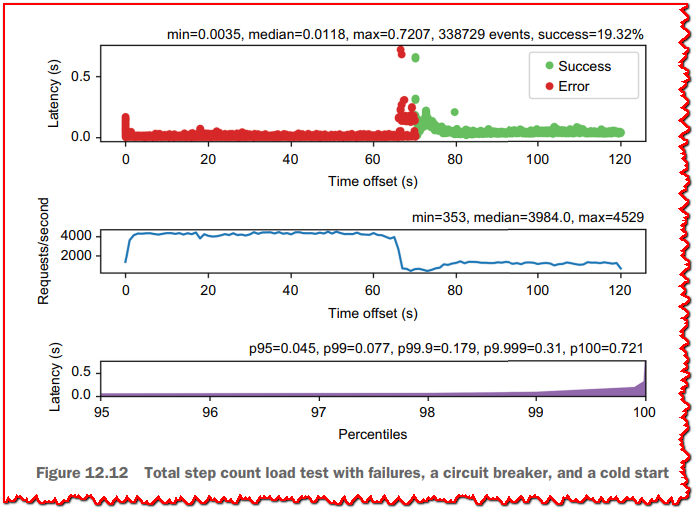

图12.13显示了整个五分钟测试计划中的服务行为。由于测试计划从正常运行的数据库开始，所以服务为测试用户管理缓存数据。这就是为什么我们在整个运行过程中没有出现错误的原因。当网络延迟出现时，我们看到了一些延迟更高的成功案例，这实际上影响了99.99以上的最后几个百分点。这是由于断路器在发出HTTP请求时报告超时，但是请注意，断路器不能取消HTTP请求。因此，我们有一些HTTP请求等待一个没有响应的活动服务，而断路器同时用一些缓存的数据完成相应的HTTP响应。

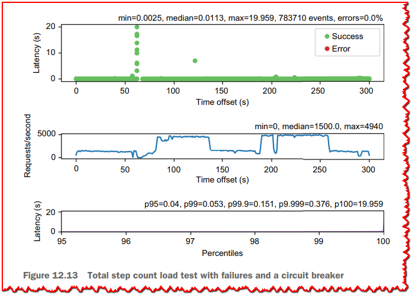

图12.14展示了在web客户端HTTP请求中结合断路器和5秒超时的效果(参见 *chapter12/public-api-with-circuitbreaker-and-timeout* 分支)。

这明显改善了结果，因为我们不再有20秒左右的最坏情况延迟了。除此之外，延迟和吞吐量在运行的其余时间内是一致的，它们几乎不受数据库在4分钟左右停止的影响。

> **🏷注意:** 断路器是避免级联故障的非常有用的工具，但您不必将网络上的每个操作都封装在断路器中。每一种抽象都有成本，而断路器确实增加了一层间接。相反，最好使用混乱测试，并确定它们最有可能对整个系统行为产生积极影响的地方。


我们现在有了一个响应式服务:它不仅资源高效、可伸缩，而且对故障也有弹性。服务在所有情况下都保持响应，延迟也得到了控制。

下一章也是最后一章将讨论在容器环境中运行Vert.x应用程序。

## 总结

  - 响应式服务不仅是可伸缩的;它必须具有弹性和响应能力。
  - 负载测试和混沌测试工具是分析服务行为的关键，无论是在正常条件下运行时，还是在被来自其依赖的网络和服务的故障包围时。
  - 断路器是保护服务免受无响应服务和网络故障影响的最有效工具。
  - 弹性服务不仅可以在快速通知错误时做出响应； 它可能仍然能够成功响应，例如在应用程序域允许的情况下使用缓存数据。
