# 第十三章: Final notes: Container-native Vert.x  

> 翻译: 白石(https://github.com/wjw465150/Vert.x-in-Action-ChineseVersion)

**This chapter covers**

  - Efficiently building container images with Jib
  - Configuring Vert.x clustering to work in a Kubernetes cluster
  - Deploying Vert.x services to a Kubernetes cluster
  - Using Skaffold and Minikube for local development
  - Exposing health checks and metrics

By now you should have a solid understanding of what a reactive application is, and how Vert.x can help you build scalable, resource-efficient, and resilient services. In this chapter we’ll discuss some of the main concerns related to deploying and operating a Vert.x application in a Kubernetes cluster container environment. You will learn how to prepare Vert.x services to work well in Kubernetes and how to use efficient tools to package container images and run them locally. You will also learn how to expose health checks and metrics to better integrate services in a container environment.

This chapter is optional, given that the core objectives of the book are about teaching yourself reactive concepts and practices. Still, Kubernetes is a popular deployment target, and it is worth learning how to make Vert.x applications first-class citizens in such environments.

In this chapter I’ll assume you have a basic understanding of containers, Docker, and Kubernetes, which are covered in depth in other books such as Marko Lukša’s *Kubernetes in Action*, second edition (Manning, 2020) and *Docker in Action*, second edition, by Jeff Nickoloff and Stephen Kuenzli (Manning, 2019). If you don’t know much about those topics, you should still be able to understand and run the examples in this chapter, and you’ll learn some Kubernetes basics along the way, but I won’t spend time explaining the core concepts of Kubernetes, such as *pods* and *services*, or describe the subtleties of the kubectl command-line tool.

> **Tool** **versions**
>
> The chapter was written and tested with the following tool versions:
>
> ◾     Minikube 1.11.0
>
> ◾     Skaffold 1.11.0
>
> ◾     k9s 0.20.5 (optional)
>
> ◾     Dive 0.9.2 (optional)


## 13.1 Heat sensors in a cloud

In this final chapter, we’ll go back to a use case based on heat sensors, as it will be simpler than working with the 10k steps challenge application.

In this scenario, heat sensors regularly publish temperature updates, and an API can be used to retrieve the latest temperatures from all sensors, and also to identify sensors where the temperature is abnormal. The application is based on three microservices that you can find in the source code Git repository and that are illustrated in figure 13.1.

Here is what each services does:

◾     heat-sensor-service—Represents a heat sensor that publishes temperature updates over the Vert.x event bus. It exposes an HTTP API to fetch the current temperature.

◾     sensor-gateway—Collects temperature updates from all heat sensor services over the Vert.x event bus. It exposes an HTTP API for retrieving the latest temperature values.

◾     heat-api—An HTTP API for retrieving the latest temperature values and for detecting the sensors where temperatures are not within expected bounds.

The heat sensor service needs to be scaled to simulate multiple sensors, whereas the sensor gateway and API services work fine with just one instance of each. That being said, the latter two do not share state, so they can also be scaled to multiple instances if the workload requires it.

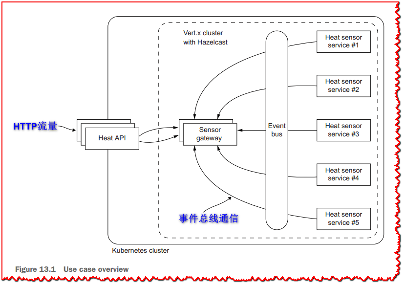

The heat API is the only service meant to be exposed outside the cluster. The sensor gateway is a cluster-internal service. The heat sensor services should just be deployed as instances inside the cluster, but they do not require a load balancer. The Vert.x cluster manager uses Hazelcast.

Let’s quickly see the noteworthy code portions in these service implementations.

### 13.1.1 Heat sensor service

The heat sensor service is based on the code found in the early chapters of this book, especially that of chapter 3. The update method called from a timer set in the scheduleNextUpdate method has been updated as follows.

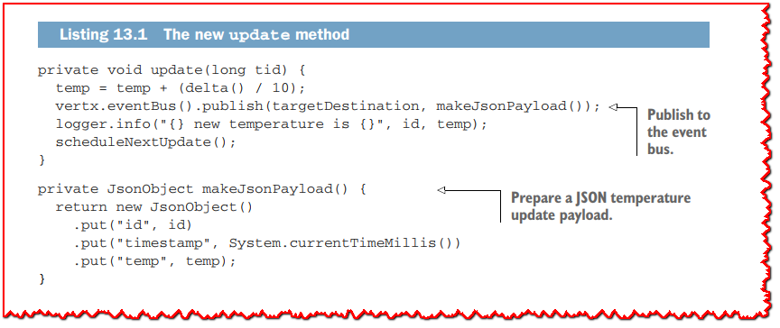

We still have the same logic, and we publish a JSON temperature update document to the event bus. We’ve also introduced the makeJsonPayload method, as it is also used for the HTTP endpoint, as shown next.

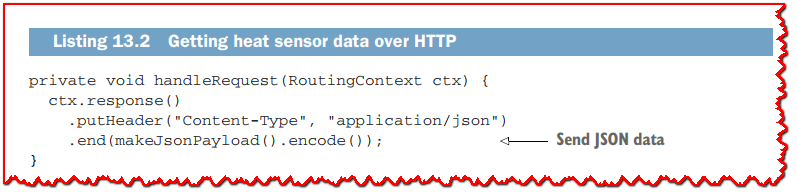

Finally we get the service configuration from environment variables in the HeatSensor

verticle’s start method, as follows.

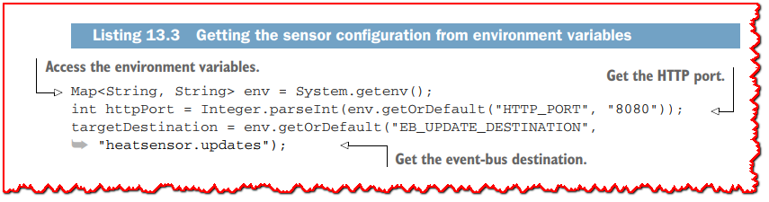

Environment variables are great because they are easy to override when running the service. Since they are exposed as a Java Map, we can take advantage of the getOrDefault method to have default values.

Vert.x also provides the vertx-config module (not covered in this book) if you need more advanced configuration, like combining files, environment variables, and distributed registries. You can learn more about it in the Vert.x website documentation (https://vertx.io/docs/). For most cases, however, parsing a few environment variables using the Java System class is much simpler.

### 13.1.2 Sensor gateway

The sensor gateway collects temperature updates from the heat sensor services over Vert.x event-bus communications. First, it fetches configuration from environment variables, as shown in listing 13.3, because it needs an HTTP port number and an event bus destination to listen to. The start method sets an event-bus consumer, as in the following listing.

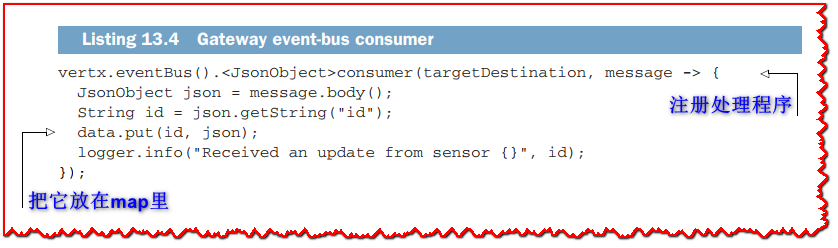

Each incoming JSON update is put in a data field, which is a HashMap<String, JsonObject>, to store the last update of each sensor.

The HTTP API exposes the collected sensor data over the /data endpoint, which is handled by the following code.

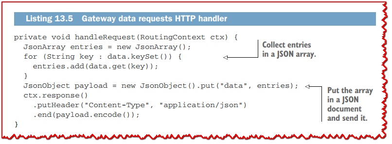

This method prepares a JSON response by assembling all collected data into an array, which is then wrapped in a JSON document.

### 13.1.3 Heat API

This service provides all sensor data, or just the data for services where temperatures are outside an expected correct value range. To do so, it makes HTTP requests to the sensor gateway.

The configuration is again provided through environment variables, as follows.

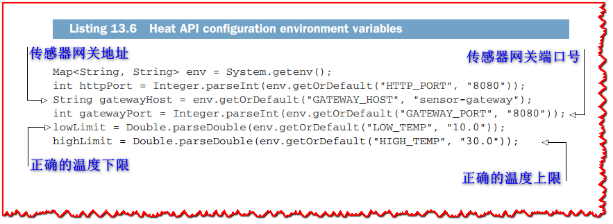

The service resolves the sensor gateway address as well as the correct temperature range using environment variables. As you will see later, we can override the values when deploying the service to a cluster.

The start method configures the web client to make HTTP requests to the sensor gateway, and it also uses a Vert.x web router to expose API endpoints.

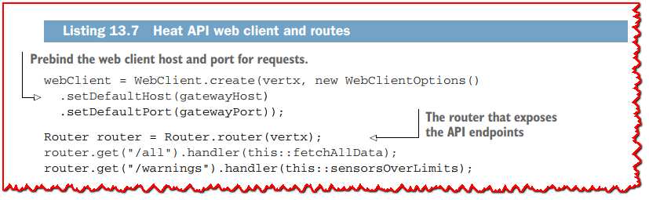

Data is fetched from the sensor gateway with HTTP GET requests, as shown in the following listing.

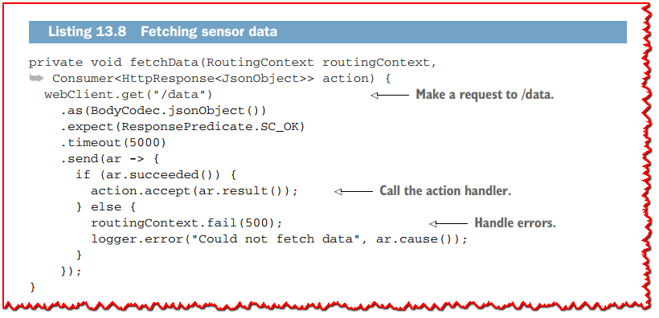

The fetchData method is generic, with a custom action given as the second parameter, so the two HTTP endpoints that we are exposing can reuse the request logic.

The implementation of the fetchAllData method is shown next.

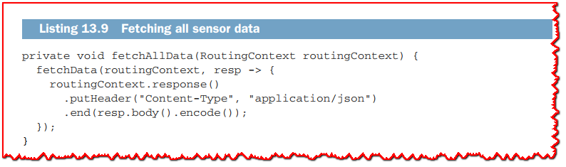

This method doesn’t do anything special besides completing the HTTP request with the JSON data.

The *sensorsOverLimits* method shown next is more interesting, as it filters the data.

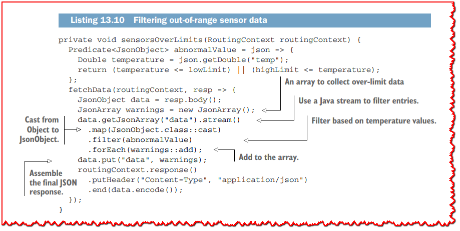

The *sensorsOverLimits* method keeps only the entries where the temperature is not within the expected range. To do so, we take a functional processing approach using Java collection streams, and then return the response. Note that the data array in the response JSON document may be empty if all sensor values are correct.

Now that you have seen the main interesting points in the three service implementations, we can move on to the topic of actually deploying them in a Kubernetes cluster.

### 13.1.4 Deploying to a local cluster

There are many ways to run a local Kubernetes cluster. Docker Desktop embeds Kubernetes, so it may be all you need to run Kubernetes, if you have it running on your machine.

Minikube is another reliable option offered by the Kubernetes project ([https://](https://minikube.sigs.k8s.io/docs/) [minikube.sigs.k8s.io/docs/](https://minikube.sigs.k8s.io/docs/)). It deploys a small virtual machine on Windows, macOS, or Linux, which makes it perfect for creating disposable clusters for development. If anything goes wrong, you can easily destroy a cluster and start anew.

Another benefit of Minikube is that it offers environment variables for Docker daemons, so you can have your locally built container images available right inside the cluster. In other Kubernetes configurations, you would have to push images to private or public registries, which can slow the development feedback loop, especially when pushing a few hundred megabytes to public registries over a slow internet connection.

I am assuming that you will use Minikube here, but feel free to use any other option.

>  **TIP** If you have never used Kubernetes before, welcome! Although you will not become a Kubernetes expert by reading this section, running the commands should still give you an idea of what it is all about. The main concepts behind Kubernetes are quite simple, once you go beyond the vast ecosystem and terminology.

The following listing shows how to create a cluster with four CPUs and 8 GB of memory.

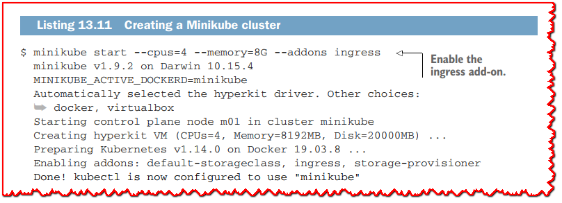

The flags and the output will differ based on your operating system and software versions. You may need to adjust these by looking at the current Minikube documentation (which may have been updated by the time you read this chapter). I allocated four CPUs and 8 GB of memory because this is comfortable on my laptop, but you could be fine with one CPU and less RAM.

You can access a web dashboard by running the minikube dashboard command. Using the Minikube dashboard, you can look at the various Kubernetes resources and even perform some (limited) operations, such as scaling a service up and down or looking into logs.

There is another dashboard that I find particularly efficient and can recommend that you try: K9s ([https://k9scli.io](https://k9scli.io/)). It works as a command-line tool, and it can very quickly move between Kubernetes resources, access pod logs, update replica counts, and so on.

Kubernetes has a command-line tool called kubectl that you can use to perform any actions: deploying services, collecting logs, configuring DNS, and more. kubectl is the Swiss army knife of Kubernetes. We could use kubectl to apply the Kubernetes resource definitions found in each service’s k8s/ folder. I will later describe the resources in the k8s/ folders. If you are new to Kubernetes, all you need to know right now is that these files tell Kubernetes how to deploy the three services in this chapter.  

There is a better tool for improving your local Kubernetes development experience called Skaffold (https://skaffold.dev). Instead of using Gradle (or Maven) to build the services and package them, and then using kubectl to deploy to Kubernetes, Skaffold is able to do it all for us, avoiding unnecessary builds using caching, performing deployments, aggregating all logs, and cleaning everything on exit.

You first need to download and install Skaffold on your machine. Skaffold works out of the box with Minikube, so no additional configuration is needed. All it needs is a skaffold.yaml resource descriptor, as shown in the following listing (and is included at the root of the chapter13 folder in the Git repository).

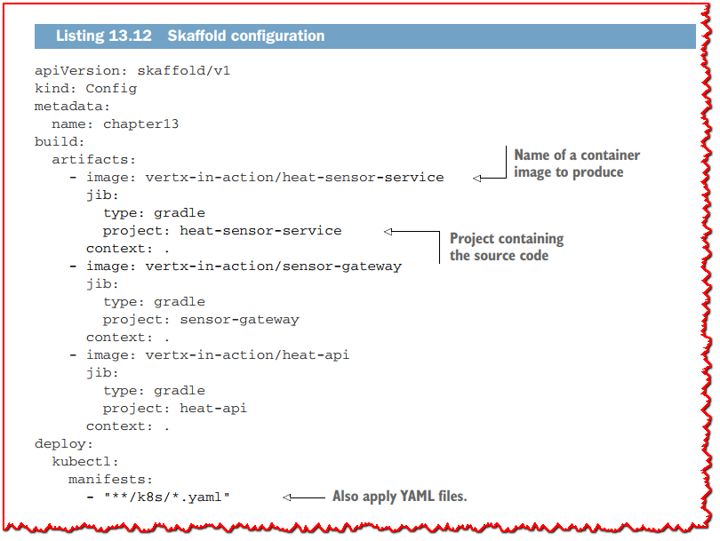

From the chapter13 folder, you can run skaffold dev, and it will build the projects, deploy container images, expose logs, and watch for file changes. Figure 13.2 shows a screenshot of Skaffold running.

Congratulations, you now have the services running in your (local) cluster!

You don’t have to use Skaffold, but for a good local development experience, this is a tool you can rely on. It hides some of the complexity of the kubectl commandline interface, and it bridges the gap between project build tools (such as Gradle or Maven) and the Kubernetes environment.


The following listing shows a few commands that check on the services deployed in a cluster.

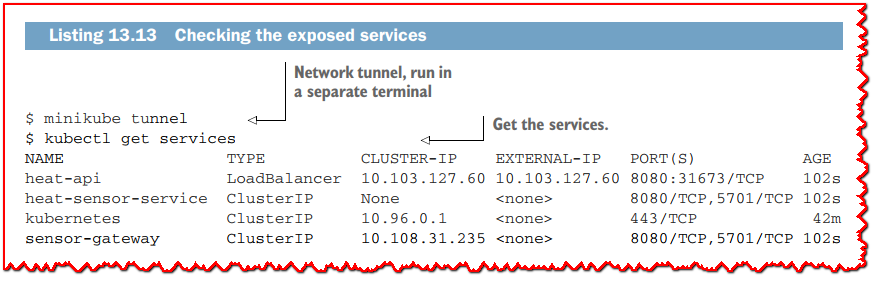

The *minikube tunnel* command is important for accessing *LoadBalancer* services, and it should be run in a separate terminal. Note that it will likely require you to enter your password, as the command needs to adjust your current network settings.

You can alternatively use the following Minikube command to obtain a URL for a *LoadBalancer* service without *minikube tunnel*:

```bash
$ minikube service heat-api --url
http://192.168.64.12:31673
```

>  **TIP** The IP addresses for the services will be different on your machine. They will also change as you delete and create new services, so don’t make any assumptions about IP addresses in Kubernetes.

This works because Minikube also exposes LoadBalancer services as NodePort on the Minikube instance IP address. Both methods are equivalent when using Minikube, but the one using minikube tunnel is closer to what you would get with a production cluster, since the service is accessed via a cluster-external IP address.

Now that you have a way to access the heat API service, you can make a few requests.

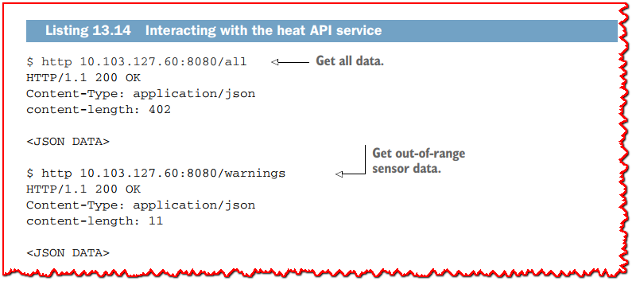

You can also access the sensor gateway using port forwarding, as shown next.

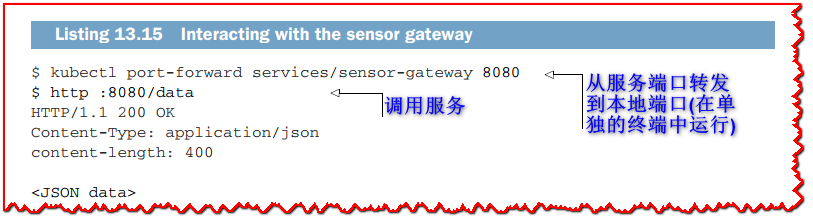

The kubectl port-forward command must be run in another terminal, and as long as it is running, the local port 8080 forwards to the sensor gateway service inside the cluster. This is very convenient for accessing anything that is running in the cluster without being exposed as a LoadBalancer service.

Finally, we can make a DNS query to see how the heat sensor headless services are resolved. The following listing uses a third-party image that contains the dig tool, which can be used to make DNS requests.

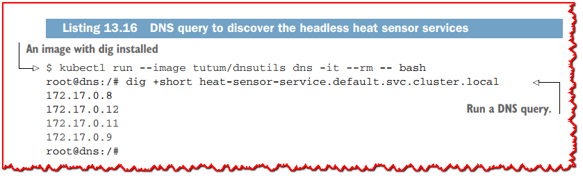

Now if we increase the number of replicas, as in the following listing, we can see that the DNS reflects the change.

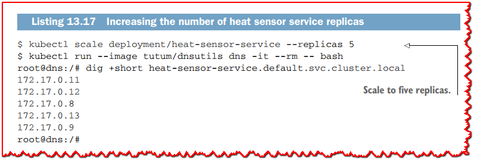

Also, if we make HTTP requests like in listing 13.14, we can see that we have data from five sensors.

Now that we have deployed the services and interacted with them, let’s look at how deployment in Kubernetes works for Vert.x services.

## 13.2 Making the services work in Kubernetes

Making a service work in Kubernetes is fairly transparent for the most part, especially when it has been designed to be agnostic of the target runtime environment. Whether it runs in a container, in a virtual machine, or on bare-metal should never be an issue. Still, there are some aspects where adaptation and configuration need to be done due to how Kubernetes works.

In our case, the only major adaptation that has to be made is configuring the cluster manager so instances can discover themselves and messages can be sent across the distributed event bus. The rest is just a matter of building container images of the services and writing Kubernetes resource descriptors to deploy the services.

Let’s start by talking about building container images.

### 13.2.1 Building container images

There are many ways to build a container image, which technically is based on the *OCI Image Format* (OCIIF; https://github.com/opencontainers/image-spec). The most basic way to build such an image is to write a Dockerfile and use the docker build command to build an image. Note that Dockerfile descriptors can be used by other tools such as Podman (https://podman.io/) or Buildah (https://github.com/containers/buildah), so you don’t actually need Docker to build container images.

You could thus choose a base image with Java, and then copy a self-contained executable Jar file to be run. While this approach is simple and works just fine, it means that for every change in the source code, you need to build a new image layer of the size of the Jar file that includes all dependencies such as Vert.x, Netty, and more. The compiled classes of a service typically weigh a few kilobytes, while a self-contained Jar file weighs a few megabytes.

Alternatively, you can either craft a Dockerfile with multiple stages and layers, or you can use a tool like Jib to automatically do the equivalent for you (https://github.com/GoogleContainerTools/jib). As shown in figure 13.3, Jib assembles different layers to make a container image.

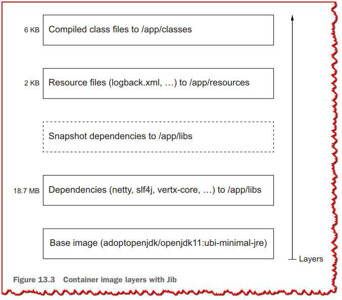

Project dependencies are put just above the base image; they are typically bigger than the application code and resources, and they also tend not to change very often, except when upgrading versions and adding new dependencies. When a project has snapshot dependencies, they appear as a layer on top of the fixed-version dependencies, because newer snapshots appear frequently. The resources and class files change more often, and they are typically light on disk use, so they end up on top. This clever layering approach does not just save disk space; it also improves build time, since layers can often be reused.

Jib offers Maven and Gradle plugins, and it builds container images by deriving information from a project. Jib is also great because it is purely written in Java and it does not need Docker to build images, so you can produce container images without any third-party tools. It can also publish container images to registries and Docker daemons, which is useful in development.

Once the Jib plugin has been applied, all you need is a few configuration elements, as in the following listing for a Gradle build (the Maven version is equivalent, albeit done in XML).

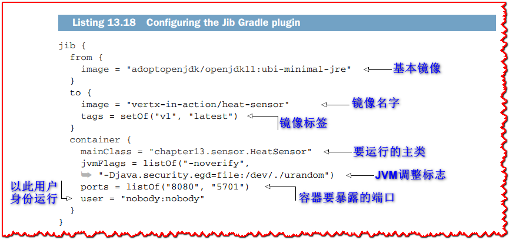

The base image comes from the AdoptOpenJDK project, which publishes many builds of OpenJDK ([https://adoptopenjdk.net](https://adoptopenjdk.net/)). Here we are using OpenJDK 11 as a *Java Run-* *time Environment* (JRE) rather than a full *Java Development Kit* (JDK). This saves disk space, as we just need a runtime, and a JDK image is bigger than a JRE image. The ubi-minimal part is because we use an AdoptOpenJDK build variant based on the Red Hat Universal Base Image, where the “minimal” variant minimizes the embedded dependencies.

Jib needs to know the main class to execute as well as the ports to be exposed outside the container. In the case of the heat sensor and sensor gateway services, we need to expose port 8080 for the HTTP service and port 5701 for the Vert.x clustering with Hazelcast. The JVM tuning is limited to disabling the JVM bytecode verifier so it boots marginally faster, and also using /dev/urandom for random number generation (the default /dev/random pseudo-file may block when a container starts and there isn’t enough entropy). Finally, we run as user nobody in group nobody to ensure the process runs as an unprivileged user inside the container.

You can build an image and inspect it as shown next.

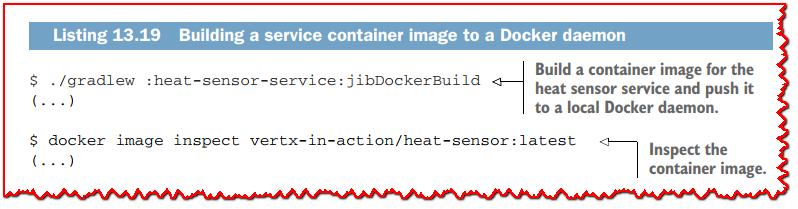

All three services’ container images build the same way. The only configuration difference is that the heat API service only exposes port 8080, since it does not need a cluster manager.

>  **TIP** You can use a tool like Dive (https://github.com/wagoodman/dive) if you are curious about the content of the different layers produced to prepare the container images of the three services.

Speaking of clustering, there is configuration work to be done!

### 13.2.2 Clustering and Kubernetes

Both Hazelcast and Infinispan, which you used in chapter 3, by default use multicast communications to discover nodes. This is great for local testing and many bare-metal server deployments, but multicast communications are not possible in a Kubernetes cluster. If you run the containers as is on Kubernetes, the heat sensor services and sensor gateway instances will not be able to communicate over the event bus.

These cluster managers can, of course, be configured to perform service discovery in Kubernetes. We will briefly cover the case of Hazelcast, where two discovery modes are possible:
  - Hazelcast can connect to the Kubernetes API to listen for and discover pods matching a request, such as a desired label and value.
  - Hazelcast can periodically make DNS queries to discover all pods for a given Kubernetes (headless) service.

The DNS approach is more limited.

Instead, let’s use the Kubernetes API and configure Hazelcast to use it. By default, the Hazelcast Vert.x cluster manager reads configuration from a cluster.xml resource. The following listing shows the relevant configuration excerpt of the *heat-sensor-service/ src/main/resource/cluster.xml* file.

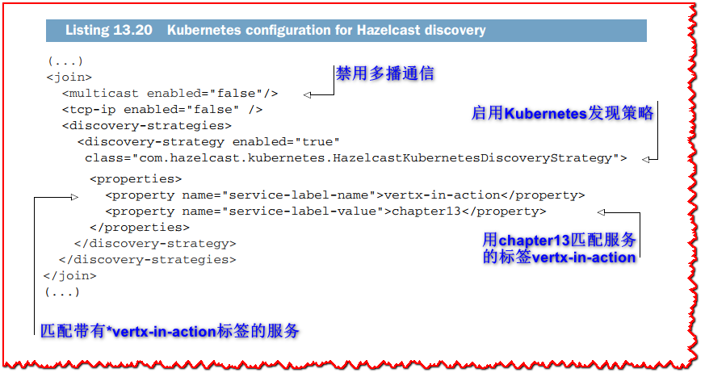

We disable the default discovery mechanism and enable the Kubernetes ones. Here Hazelcast forms clusters of pods that belong to a service where a vertx-in-action label is defined with the value chapter13. Since we opened port 5701, the pods will be able to connect. Note that the configuration is the same for the sensor gateway.

Since Hazelcast needs to read from the Kubernetes API, we need to ensure that we have permissions using the Kubernetes role-based access control (RBAC). To do so, we need to apply the ClusterRoleBinding resource of the following listing and the *k8s/rbac.yaml* file.

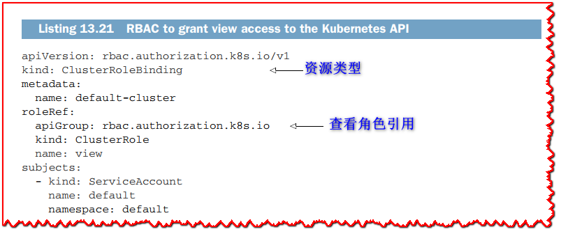

The last thing we need to do is ensure that the heat sensor and gateway services run with clustering enabled. In both cases the code is similar. The following listing shows the main method for the heat sensor service.

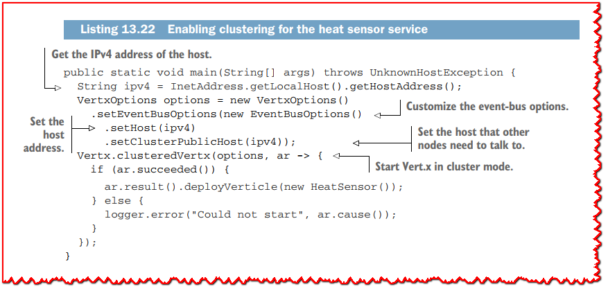

We start a clustered Vert.x context and pass options to customize the event-bus configuration. In most cases you don’t need to do any extra tuning here, but in the context of Kubernetes, clustering will likely resolve to localhost rather the actual host IPv4 address. This is why we first resolve the IPv4 address and then set the event-bus configuration host to that address, so the other nodes can talk to it.

>  **TIP** The event-bus network configuration performed in listing 13.22 will be done automatically in future Vert.x releases. I show it here because it can help you troubleshoot distributed event-bus configuration issues in contexts other than Kubernetes.

### 13.2.3 Kubernetes deployment and service resources

Now that you know how to put your services into containers and how to make sure Vert.x clustering works in Kubernetes, we need to discuss resource descriptors. Indeed, Kubernetes needs some descriptors to deploy container images to pods and expose services.

Let’s start with the heat sensor service’s deployment descriptor, shown in the following listing.

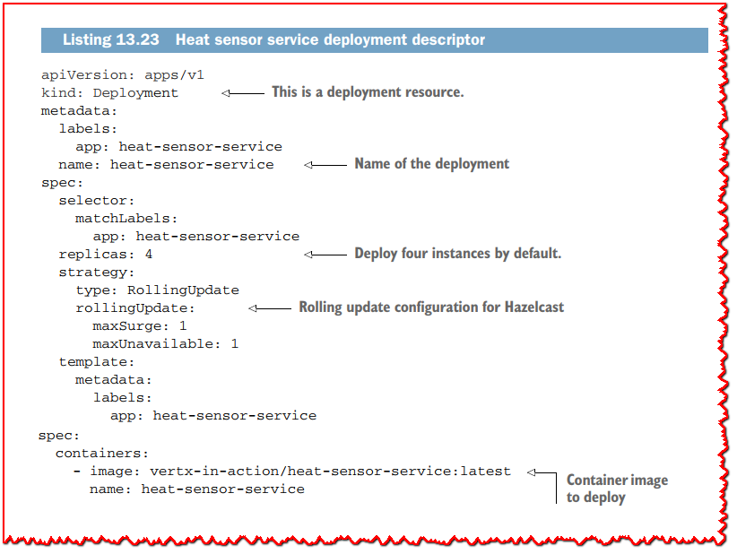

This deployment descriptor by default deploys four pods of the *vertx-in-action/heat-sensor-service* container image. Deploying pods is a good first step, but we also need a service definition that maps to these pods. This is especially important for Hazelcast: remember that these instances discover themselves through Kubernetes services with the label vertx-in-action and value chapter13.

Kubernetes performs rolling updates when a deployment is updated by progressively replacing pods of the older configuration with pods of the newer configuration. It is best to set the values of maxSurge and maxUnavailable to 1. When you do so, Kubernetes replaces pods one after the other, so the cluster state is smoothly transferred to the new pods. You can avoid this configuration and let Kubernetes be more aggressive when rolling updates, but the cluster state may be inconsistent for some time.

The following listing shows the service resource definition.

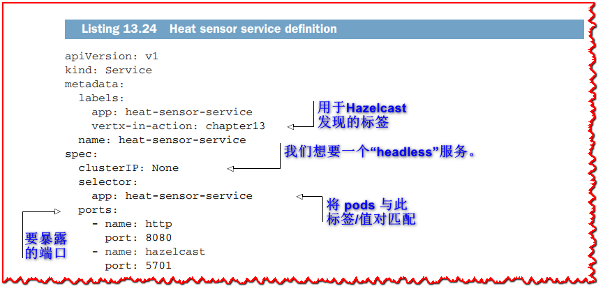

The service descriptor exposes a *headless* service, which is to say that there is no load balancing among the pods. Because each service is a sensor, they cannot be taken one for the other. Headless services can instead be discovered using DNS queries that return the list of all pods. You saw in listing 13.16 how headless services could be discovered using DNS queries.

The deployment descriptor for the sensor gateway is nearly identical to that of the heat sensor service, as you can see in the next listing.

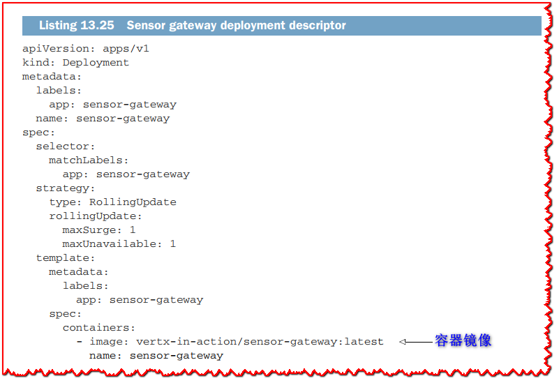

Aside from the names, you can note that we did not specify the replica count, which by default is 1. The service definition is shown in the following listing.

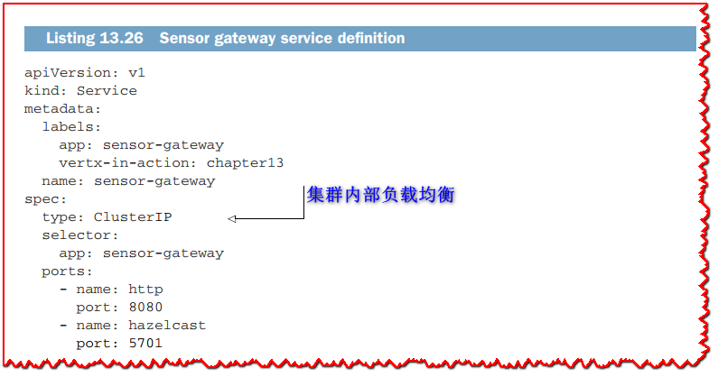

Now we expose a service that does load balancing. If we start further pods, the traffic will be load balanced between them. A ClusterIP service is load balanced, but it is not exposed outside the cluster.

The heat API deployment is very similar to the deployments we’ve already done, except that there is configuration to pass through environment variables. The following listing shows the interesting portion of the descriptor in the *spec.template.spec.containers* section.

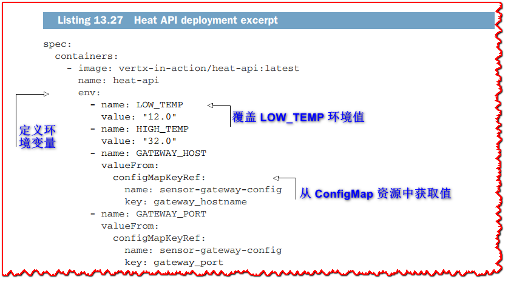

Environment variables can be either passed directly by value, as for LOW_TEMP, or passed through the indirection of a ConfigMap resource, as in the following listing.

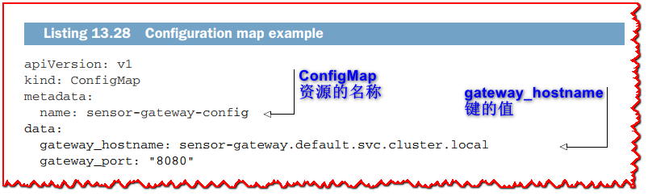

By passing environment variables through a ConfigMap, we can change configuration without having to update the heat API deployment descriptor. Note the value of *gateway_hostname*: this is the name used to resolve the service with DNS inside the Kubernetes cluster. Here *default* is the Kubernetes namespace, *svc* designates a service resource, and *cluster.local* resolves to the *cluster.local* domain name (remember that we are using a local development cluster).

Finally, the following listing shows how to expose the heat sensor API as an externally load-balanced service.

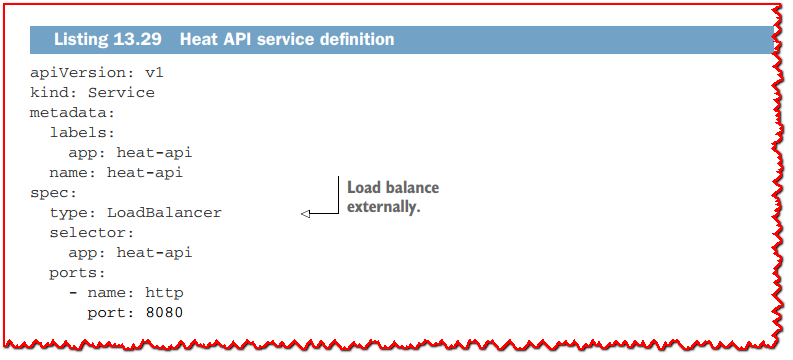

A *LoadBalancer* service is exposed outside the cluster. It can also be mapped to a host name using an Ingress, but this is not something that we will cover.

We have now covered deploying the services to Kubernetes, so you may think that we are done. Sure, the services work great in Kubernetes as-is, but we can make the integration even better!

## 13.3 First-class Kubernetes citizens

As you have seen, the services that we deployed work fine in Kubernetes. That being said, we can make them first-class Kubernetes citizens by doing two things:
  - Exposing health and readiness checks
  - Exposing metrics

This is important to ensure that a cluster knows how services behave, so that it can restart services or scale them up and down.

### 13.3.1 Health checks

When Kubernetes starts a pod, it assumes that it can serve requests on the exposed ports, and that the application is running fine as long as the process is running. If a process crashes, Kubernetes will restart its pod. Also, if a process consumes too much memory, Kubernetes will kill it and restart its pod.

We can do better by having a process *inform* Kubernetes about how it is doing.

There are two important concepts in health checking:
  - *Liveness checks* allow a service to report if it is working correctly, or if it is failing and needs to be restarted.
  - *Readiness checks* allow a service to report that it is ready to accept traffic.

Liveness checks are important because a process may be working, yet be stuck with a fatal error, or be stuck in, say, an infinite loop. Liveness probes can be based on files, TCP ports, and HTTP endpoints. When probes fail beyond a threshold, Kubernetes restarts the pod.

The heat sensor service and sensor gateway can provide simple health-check reporting using HTTP. As long as the HTTP endpoint is responding, that means the service is operating. The following listing shows how to add health-check capability to these services.

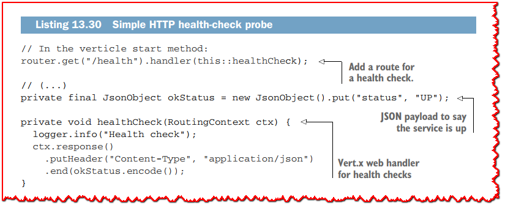

With HTTP probes, Kubernetes is interested in the HTTP status code of the response: 200 means the check succeeded, and anything else means that there is a problem. It is a loose convention to return a JSON document with a status field and the value UP or DOWN. Additional data can be in the document, such as messages from various checks being done. This data is mostly useful when logged for diagnosis purposes.

We then have to let Kubernetes know about the probe, as in the following listing.

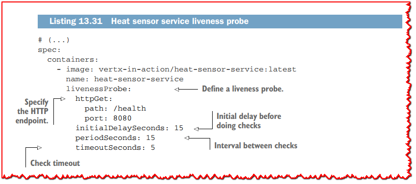

Here the liveness checks start after 15 seconds, happen every 15 seconds, and time out after 5 seconds. We can check this by looking at the logs of one of the heat sensor service pods.

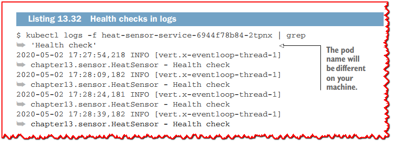

To get a pod name and check the logs, you can look at the output of kubectl logs. Here we see that the checks indeed happen every 15 seconds.

The case of the heat API is more interesting, as we can define both liveness and readiness checks. The API needs the sensor gateway, so its readiness depends on that of the gateway. First, we have to define two routes for liveness and readiness checks, as shown in the next listing.


The implementation of the livenessCheck method is identical to that of listing 13.30: if the service responds, it is alive. There is no condition under which the service would respond yet be in a state where a restart would be required. The service can, however, be unable to accept traffic because the sensor gateway is not available, which will be reported by the following readiness check.

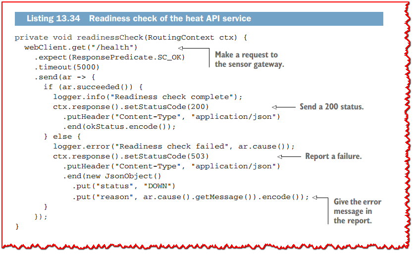

To perform a readiness check, we make a request to the sensor gateway health-check endpoint. We could actually make any other request that allows us to know if the service is available. We then respond to the readiness check with either an HTTP 200 or 503.

The configuration in the deployment resource is shown in the following listing.

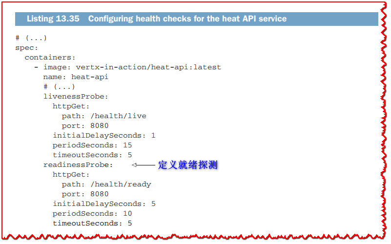

As you can see, a readiness probe is configured very much like a liveness probe. We have defined initialDelaySeconds to be five seconds; this is because the initial Hazelcast discovery takes a few seconds, so the sensor gateway hasn’t deployed its verticle before this has been completed.

We can check the effect by taking down all instances of the sensor gateway, as shown next.

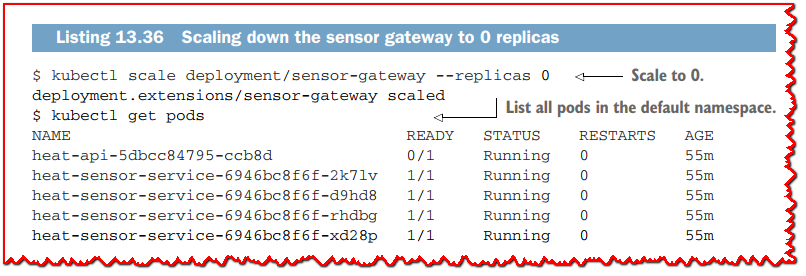

You should wait a few seconds before listing the pods, and observe that the heat API pod becomes marked as 0/1 ready. This is because the readiness checks have failed, so the pod will not receive traffic anymore. You can try running the following query and see an immediate error:

```bash
$ http $(minikube service heat-api --url)/warnings
```

Now if we scale back to one instance, we’ll get back to a working state, as shown in the following listing.

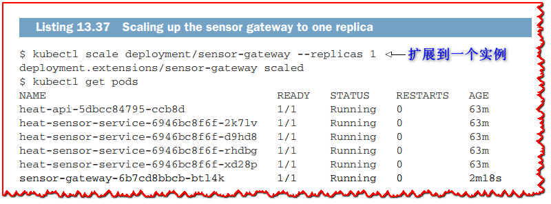

You can now make successful HTTP requests again.

>  **NOTE** The action you perform in a health or readiness check depends on what your service does. As a general rule, you should perform an action that has no side effect in the system. For instance, if your service needs to report a failed health check when a database connection is down, a safe action should be to perform a small SQL query. By contrast, doing a data insertion SQL query has side effects, and this is probably not how you want to check whether the database connection is working.

### 13.3.2 Metrics

Vert.x can be configured to report metrics on various items like event-bus communications, network communications, and more. Monitoring metrics is important, because they can be used to check how a service is doing and to trigger alerts. For instance, you can have an alert that causes Kubernetes to scale up a service when the throughput or latency of a given URL endpoint is above a threshold.

I will show you how to expose metrics from Vert.x, but the other topics, like visualization, alerting, and auto-scaling are vastly complex and are outside the scope of this book.

Vert.x exposes metrics over popular technologies such as JMX, Dropwizard, Jolokia, and Micrometer.

We will be using Micrometer and Prometheus. Micrometer (https://micrometer.io/)is interesting because it is an abstraction over metric-reporting backends such as InfluxDB and Prometheus. Prometheus is a metrics and alerting project that is popular in the Kubernetes ecosystem (https://prometheus.io/). It also works in *pull* mode: Prometheus is configured to periodically collect metrics from services, so your services are not impacted by Prometheus being unavailable.

We will be adding metrics to the sensor gateway as it receives both event-bus and HTTP traffic; it is the most solicited service of the use case. To do that, we first have to add two dependencies as follows.

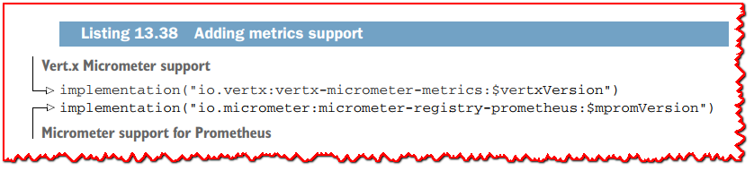

The sensor gateway needs clustering and metrics when starting Vert.x from the *main* method. We need to enable metrics as follows.

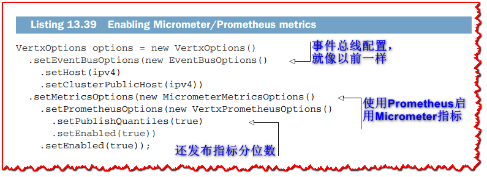

We now have to define an HTTP endpoint for metrics to be available. The Vert.x Micrometer module offers a Vert.x web handler to make it easy, as shown in the following listing.

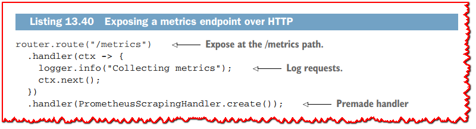

It is a good idea to intercept metric requests and log them. This is useful when configuring Prometheus to check if it is collecting any metrics.

You can test the output using port forwarding.

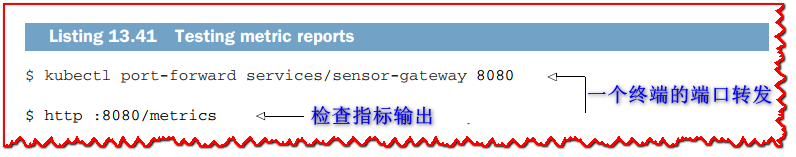

Prometheus metrics are exposed in a simple text format. As you can see when running the preceding commands, by default lots of interesting metrics are reported, like response times, open connections, and more. You can also define your own metrics using the Vert.x Micrometer module APIs and expose them just like the default ones.

You will find instructions and Kubernetes descriptors for configuring the Prometheus operator to consume metrics from the sensor gateway in the *chapter13/k8s-metrics* folder of the book’s Git repository. You will also find a pointer to make a dashboard with Grafana that looks like the one in figure 13.4.

Grafana is a popular dashboard tool that can consume data from many sources, including Prometheus databases (https://grafana.com/). All you need is to connect visualizations and queries. Fortunately, dashboards can be shared as JSON documents. Check the pointers in the Git repository if you want to reproduce the dashboard in figure 13.4.

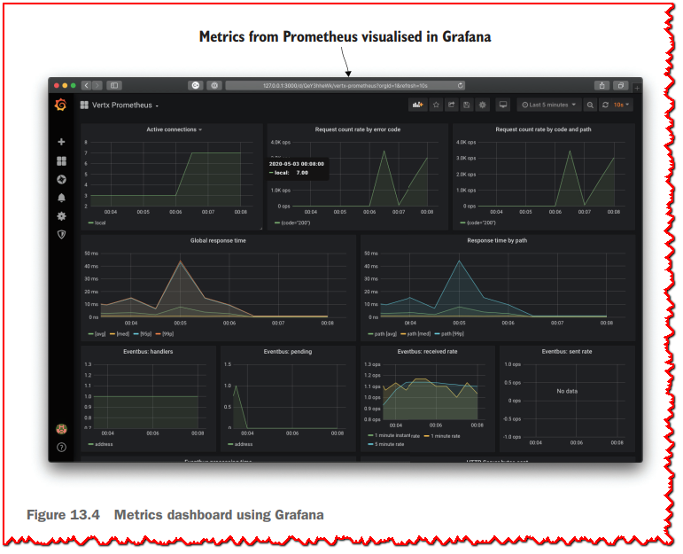

## 13.4 The end of the beginning

All good things come to an end, and this chapter concludes our journey toward reactive applications with Vert.x. We started this book with the fundamentals of asynchronous programming and Vert.x. Asynchronous programming is key to building scalable services, but it comes with challenges, and you saw how Vert.x helped in making this programming style simple and enjoyable. In the second part of this book we used a realistic application scenario to study the key Vert.x modules for databases, web, security, messaging, and event streaming. This allowed us to build an end-to-end reactive application made up of several microservices. By the end of the book, you saw a methodology based on a combination of load and chaos testing to ensure service resilience and responsiveness. This is important, as reactive is not just about scalability, but is also about writing services that can cope with failures. We concluded with notes on deploying Vert.x services in a Kubernetes cluster, something Vert.x is a natural fit for.

Of course, we did not cover all that’s in Vert.x, but you will easily find your way through the project’s website and documentation. The Vert.x community is welcoming, and you can get in touch over mailing lists and chat. Last but not least, most of the skills that you have learned by reading this book translate to technologies other than Vert.x. Reactive is not a technology that you pick off the shelf. A technology like Vert.x will only get you half of the way to reactive; there is a craft and mindset required in sysems design to achieve solid scalability, fault resiliency, and ultimately responsiveness. On a more personal note, I hope that you enjoyed reading this book as much as I enjoyed the experience of writing it. I’m looking forward to hearing from you in online discussions, and if we happen to attend an event together, I will be more than

happy to meet you in person! Have fun, and take care!

## Summary
  - Vert.x applications can easily be deployed to Kubernetes clusters with no need for Kubernetes-specific modules.
  - The Vert.x distributed event bus works in Kubernetes by configuring the cluster manager discovery mode.
  - It is possible to have a fast, local Kubernetes development experience using tools like Minikube, Skaffold, and Jib.
  - Exposing health checks and metrics is a good practice for operating services in a cluster.
