# 第二章: Vert.x的基本处理单元-Verticles

> 翻译: 白石(https://github.com/wjw465150/Vert.x-in-Action-ChineseVersion)

**本章涵盖了**

+ 什么是 verticles
+ 如何编写、配置和部署 verticles
+ Vert.x线程模型
+ 如何混合Vert.x和非Vert.x线程

------

简单地说，`verticle`是Vert.x中的基本处理单元。`verticle`的作用是封装一个处理事件的“技术功能单元”，例如公开HTTP API和响应请求、在数据库之上提供存储库接口或向第三方系统发出请求。与Enterprise JavaBeans等技术中的组件一样，`verticle`也可以被部署，并且它们有一个生命周期。 

异步编程是构建响应式应用程序的关键，因为它们必须具有伸缩性，而`verticle`是Vert.x中结构化(异步)事件处理代码和业务逻辑的基础。

## 2.1 编写一个verticle

如果您熟悉**actor并发模型**，您将发现Vert.x的verticle和actor之间的相似之处。简单地说，在actor模型中，自治实体(actor)通过发送和响应消息专门与其他实体进行通信。Vertx的verticles和actor之间的相似之处并不是偶然的巧合: verticles拥有在接收事件时可以更新的私有状态，它们可以部署其他verticles，它们还可以通过消息传递进行通信(下一章将详细介绍)。Vertx不一定遵循actors的正统定义，但至少可以认为它受到了actors的启发。 

由于verticles是Vertx中的一个关键概念，我们将研究它们是如何工作的。在此之前，我们将编写一个处理两种类型事件的小verticle: 定期计时器和HTTP请求。 

### 2.1.1 准备项目

我们将在本章的所有例子中使用一个通用项目，使用Gradle项目描述符如下所示。

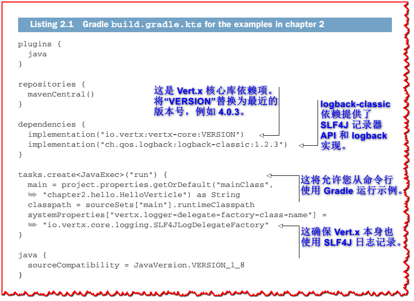

```groovy
plugins {
  java
}

repositories {
  mavenCentral()
  maven {
    url = uri("https://oss.sonatype.org/content/repositories/snapshots/")
  }
}

dependencies {
  implementation("io.vertx:vertx-core:4.0.3")  // <1>
  implementation("ch.qos.logback:logback-classic:1.2.3")  // <2>
}

tasks.create<JavaExec>("run") {  // <3>
  main = project.properties.getOrDefault("mainClass", "chapter2.hello.HelloVerticle") as String
  classpath = sourceSets["main"].runtimeClasspath
  systemProperties["vertx.logger-delegate-factory-class-name"] = "io.vertx.core.logging.SLF4JLogDelegateFactory"  // <4>
}

java {
  sourceCompatibility = JavaVersion.VERSION_1_8
}
```

> <1>: 这是 Vert.x 核心库依赖项。 将“VERSION”替换为最近的版本号，例如 4.0.3。
>
> <2>: logback-classic 依赖提供了 SLF4J 记录器 API 和 logback 实现。
>
> <3>: 这将允许您从命令行使用 Gradle 运行示例。
>
> <4>: 这确保 Vert.x 本身也使用 SLF4J 日志记录。

Gradle的构建对于Java项目来说是非常简单的。因为我们要运行几个例子，所以我们不会依赖Gradle的`application`插件，而是会定义我们自己的`run`任务，在这个任务中，我们可以传递要执行的类名。我们还将使用它来确保日志记录被正确配置并统一到SLF4J.

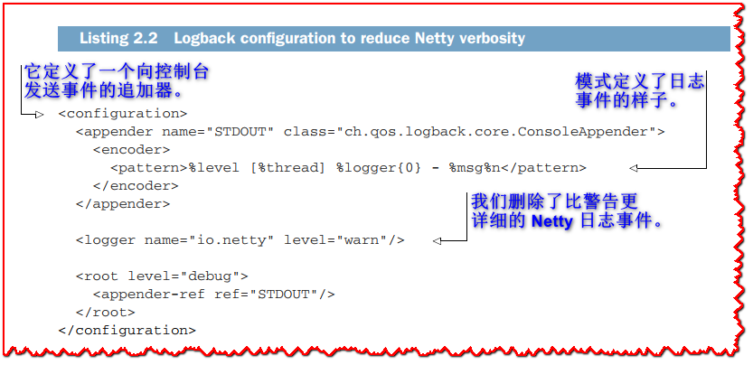

```xml
<configuration>  <!-- <1>  -->
  <appender name="STDOUT" class="ch.qos.logback.core.ConsoleAppender">
    <encoder>
      <pattern>%level [%thread] %logger{0} - %msg%n</pattern>  <!-- <2>  -->
    </encoder>
  </appender>

  <logger name="io.netty" level="warn"/>  <!-- <3>  -->

  <root level="debug">
    <appender-ref ref="STDOUT"/>
  </root>

</configuration> 
```

> <1>: 它定义了一个向控制台发送事件的追加器。
>
> <2>: 模式定义了日志事件的样子。
>
> <3>: 我们删除了比警告更详细的 Netty 日志事件。
>
> **💡提示:** Vert.x使用Netty，使用默认的Logback配置登录Netty非常繁琐。我们可以通过创建一个`src/main/resources/logback.xml`文件并添加如 清单2.2 所示的配置来减少日志条目的数量。为了使本书中的日志示例更短，我还删除了事件日期并缩短了日志程序类名($logger{0})。请参考Logback文档了解如何配置它([https://logback.qos.ch/manual/index.html](https://logback.qos.ch/manual/index.html))

### 2.1.2 verticle类

整个verticle和应用程序都适合下面的Java类:

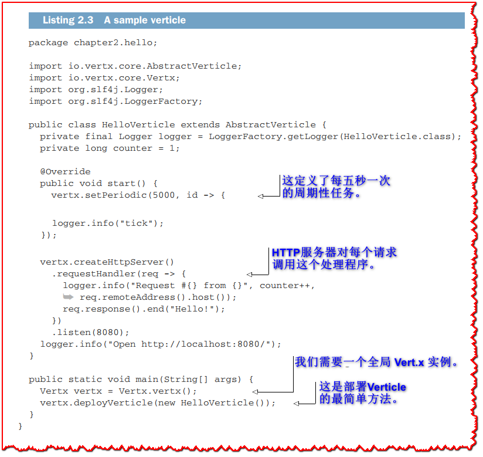

```java
package chapter2.hello;

import io.vertx.core.AbstractVerticle;
import io.vertx.core.Vertx;
import org.slf4j.Logger;
import org.slf4j.LoggerFactory;

public class HelloVerticle extends AbstractVerticle {

  private final Logger logger = LoggerFactory.getLogger(HelloVerticle.class);

  private long counter = 1;

  @Override
  public void start() {

    vertx.setPeriodic(5000, id -> {  // <1>
      logger.info("tick");
    });

    vertx.createHttpServer()
      .requestHandler(req -> {  // <2>
        logger.info("Request #{} from {}", counter++, req.remoteAddress().host());
        req.response().end("Hello!");
      })
      .listen(8080);

    logger.info("Open http://localhost:8080/");
  }

  public static void main(String[] args) {
    Vertx vertx = Vertx.vertx();  // <3>
    vertx.deployVerticle(new HelloVerticle());  // <4>
  }
} 
```

> <1>: 这定义了每五秒一次的周期性任务。
>
> <2>: HTTP服务器对每个请求调用这个处理程序。
>
> <3>: 我们需要一个全局 Vert.x 实例。
>
> <4>: 这是部署 Verticle 的最简单方法。

本verticle定义了两个事件处理程序:一个用于每5秒执行周期性任务，另一个用于处理HTTP服务器中的HTTP请求。`main`方法实例化一个全局Vert.x实例，并部署该verticle的一个实例。 

在Java中定义一个verticle通常通过继承`AbstractVerticle`类来完成。理论上你可以实现一个 `Verticle` 接口，但是 `AbstractVerticle`类提供Vert.x用户需要的所有事件处理、配置和执行管道。

> **🏷注意:** 由于 Vert.x 是一个库而不是框架，因此您可以从`main`方法或任何其他类创建 Vert.x 实例，然后部署 Verticle。

Verticle 的生命周期由`start` 和 `stop` 事件组成。 `AbstractVerticle` 类提供了可以被覆盖的 `start` 和 `stop` 方法：

+ `start`方法通常包含处理程序的设置和初始化，如**清单2.3**中所示的设置周期性任务处理程序和启动HTTP服务器。
+ `stop`方法是在需要执行清理任务时实现的，例如关闭打开的数据库连接。

默认情况下，这些方法什么也不做。

### 2.1.3 运行和第一次观察

通过从IDE或命令行运行`main`方法，应用程序可以像普通Java应用程序一样启动。要使用Gradle在命令行运行它，你可以使用以下命令:

```shell
$ ./gradlew run -PmainClass=chapter2.hello.HelloVerticle
```

我再次假设您将从 Unix shell 运行它，无论是在 Linux、macOS 还是通过 WSL 的 Windows 下。 如果您从传统的 Windows 终端运行命令，Gradle 有一个 `.bat` 文件，因此您需要将 `./gradlew` 替换为 `gradlew.bat`。

应用程序运行后，您可以使用 Web 浏览器在 http://localhost:8080/ 处执行一些 HTTP 请求，或者使用命令行工具，例如 `curl` 和 `HTTPie`。 日志将类似于以下清单中显示的日志.

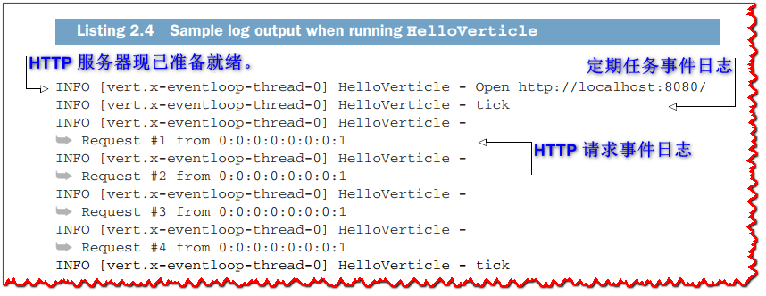

> **💡提示:** 在剩下的一些示例中，我缩短了类定义。 我特别删除了与 **清单 2.3** 中类似的包定义、导入和 `main` 方法。 要查看完整的源代码，请查阅本书的代码库。 

我们使用的 Logback 配置显示了与事件关联的线程的名称。 我们已经可以在日志条目中检查 Vert.x verticles 的一个重要属性：事件处理发生在**单个**事件循环线程上。 周期性任务和 HTTP 请求处理都发生在日志中显示为`vert.x-eventloop-thread-0`的线程上。

这种设计的一个明显好处是一个verticle实例总是在同一个线程上执行事件处理，因此不需要使用线程同步原语。 在多线程设计中，更新 `counter` 字段将需要 `synchronized` 块或使用 `java.util.concurrent.AtomicLong`。 这里不存在这样的问题，因此可以安全地使用普通的 `long` 字段。

可以从非 Vert.x 线程调用准备方法，例如 `createHttpServer` 或 `setTimer`。 当您直接使用没有 Verticle 的 `Vertx` 对象时，或者在编写单元测试时，可能会发生这种情况。 然而，这不是问题，因为 `Vertx` 类方法的使用是线程安全的。

**图 2.1** 显示了 Verticle、处理程序、Vert.x 和事件源之间的（简化的）交互。 每个箭头代表参与者之间的方法调用。 例如，`HelloVerticle` 通过在 `Vertx` 对象上调用 `setPeriodic` 创建一个周期性任务处理程序，然后使用内部 Vert.x 计时器创建一个周期性任务。 反过来，计时器会定期回调 `HelloVerticle` 中的 `timerHandler` 处理程序。

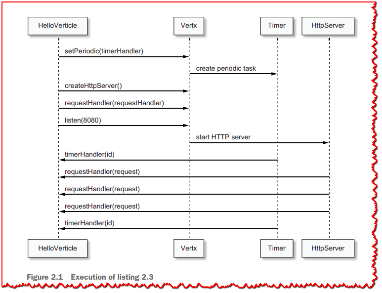

请注意，我将对 `requestHandler` 和 `listen` 的调用表示为对 `Vert.x` 对象的快捷方式； 实际上，它们位于实现 `HttpServer` 接口的对象上。 实际的类是 Vert.x 内部的，由于它不服务于图表来添加另一个参与者，我将它合并到 `Vert.x` 中。

## 2.2 更多关于verticles的细节

关于编写和部署 Verticle，还有更多需要了解的事情：
+ 当事件循环被阻塞时会发生什么？
+ 在存在异步初始化工作的情况下，如何推迟生命周期完成的通知？
+ 你如何部署和取消部署 Verticle？
+ 你如何传递配置数据？

我们将使用非常简单但重点突出的示例来介绍这些主题中的每一个。

### 2.2.1 阻塞和事件循环

处理程序回调从事件循环线程运行。 重要的是，在事件循环上运行的代码需要尽可能少的时间，这样事件循环线程才能在处理的事件数量上具有更高的吞吐量。 这就是为什么不应在事件循环上发生长时间运行或阻塞的 I/O 操作的原因。

话虽如此，发现阻塞代码可能并不总是那么容易，尤其是在使用第三方库时。 Vert.x 提供了一个检查器，用于检测事件循环何时被阻塞太久。

为了说明这一点，让我们看看当我们在事件处理程序回调中引入无限循环时会发生什么。

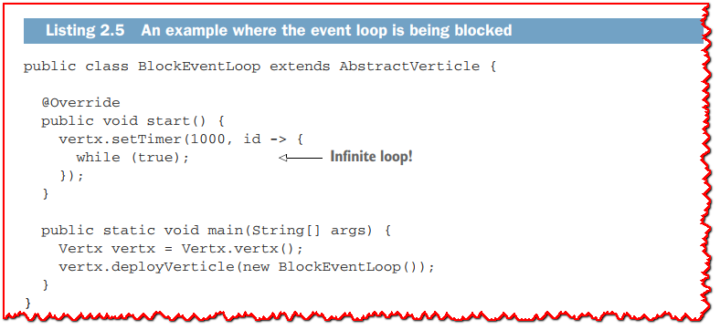

```java
package chapter2.blocker;

import io.vertx.core.AbstractVerticle;
import io.vertx.core.Vertx;

public class BlockEventLoop extends AbstractVerticle {

  @Override
  public void start() {
    vertx.setTimer(1000, id -> {
      while (true);
    });
  }

  public static void main(String[] args) {
    Vertx vertx = Vertx.vertx();
    vertx.deployVerticle(new BlockEventLoop());
  }
}
```

**清单 2.5** 中的代码定义了一个一秒计时器，处理程序回调进入一个无限循环。

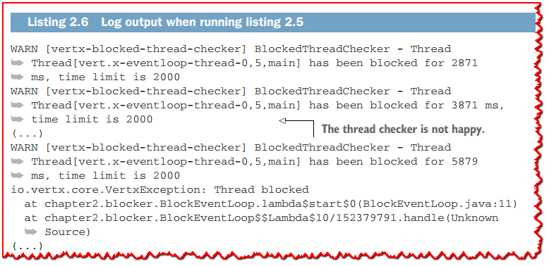

**清单 2.6** 显示了运行**清单 2.5** 中的代码时的典型日志输出。 如您所见，在事件循环线程运行无限循环时开始出现警告，因此不可用于处理其他事件。经过一些迭代(默认为5秒)后，警告通过堆栈跟踪转储得到了丰富，因此您可以清楚地识别代码中的罪魁祸首。注意，这只是一个警告。事件循环线程检查器不能杀死花费太长时间来完成其任务的处理程序。

当然，有时您需要使用阻塞或长时间运行的代码，Vert.x 提供了在不阻塞事件循环的情况下运行此类代码的解决方案。 这是第 [2.3 节](#2_3_When_code_needs_to_block)的主题。

**配置 Vert.x 阻塞线程检查器**
默认情况下，阻塞线程检查器抱怨之前的时间限制是2秒，但可以将其配置为不同的值。 有些环境，例如嵌入式设备，处理能力较慢，增加它们的线程检查器阈值是正常的。

您可以使用系统属性来更改设置：
+ `-Dvertx.options.blockedThreadCheckInterval=5000` 将时间间隔更改为5秒。
+ `-Dvertx.threadChecks=false` 禁用线程检查器。

>  **🏷注意:** 请注意，此配置是全局的，不能在每个verticle的基础上进行微调。

### 2.2.2 生命周期事件的异步通知

到目前为止，我们已经查看了具有 `start()` 生命周期方法的示例。 这些方法中的约定是，除非该方法抛出异常，否则 Verticle 已成功完成其 `start` 生命周期事件处理。 这同样适用于 `stop()` 方法。

然而，有一个问题：`start` 或 `stop` 方法中的某些操作可能是异步的，因此它们可能会在对 `start()` 或 `stop()` 的调用返回后完成。

让我们看看如何正确地通知调用者延迟成功或失败。 一个很好的例子是启动 HTTP 服务器，这是一个非阻塞操作。

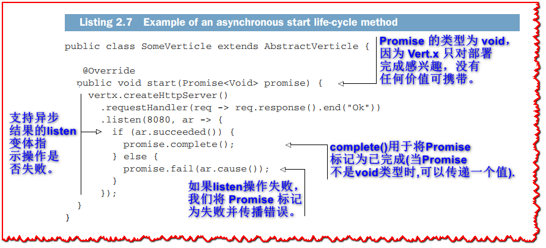

```java
package chapter2.future;

import io.vertx.core.AbstractVerticle;
import io.vertx.core.Future;
import io.vertx.core.Promise;
import io.vertx.core.Vertx;

public class SomeVerticle extends AbstractVerticle {

  @Override
  public void start(Promise<Void> promise) {   // <1>
    vertx.createHttpServer()
      .requestHandler(req -> req.response().end("Ok"))
      .listen(8080, ar -> {
        if (ar.succeeded()) {       // <2>
          promise.complete();   // <3>
        } else {
          promise.fail(ar.cause()); // <4>
        }
      });
  }

  public static void main(String[] args) {
    Vertx vertx = Vertx.vertx();
    vertx.deployVerticle(new SomeVerticle());
  }
}
```

> <1>: Promise 的类型为 void，因为 Vert.x 只对部署完成感兴趣，没有任何价值可携带。
>
> <2>: 支持异步结果的listen变体指示操作是否失败。
>
> <3>: `complete()` 用于将 Promise 标记为已完成（当 Promise 不是 void 类型时，可以传递一个值）.
>
> <4>: 如果listen操作失败，我们将 Promise 标记为失败并传播错误。

**清单 2.7** 显示了一个示例，其中 Verticle 在启动时报告异步通知。 这很重要，因为启动 HTTP 服务器可能会失败。 事实上，TCP 端口可能被另一个进程使用，在这种情况下 HTTP 服务器无法启动，因此 Verticle 没有成功部署。 为了报告异步通知，我们使用 `listen` 方法的变体，并在操作完成时调用回调。

`AbstractVerticle` 中的 `start` 和 `stop` 方法支持带有 `io.vertx.core.Promise` 类型参数的变体。 顾名思义，Vert.x 的 `Promise` 是对 **futures 和 Promise** 模型的改编，用于处理异步结果。 `promise` 用于写入异步结果，而 `future` 用于查看异步结果。 给定一个 `Promise` 对象，您可以调用 `future()` 方法来获取 `io.vertx.core.Future` 类型的future 。

在**清单 2.7** 中，`Promise` 对象被设置为在 Verticle 成功完成其 `start` 或 `stop` 生命周期时完成。 如果出现错误，`Promise` 对象将失败，并出现描述错误的异常，并且 Verticle 部署失败。

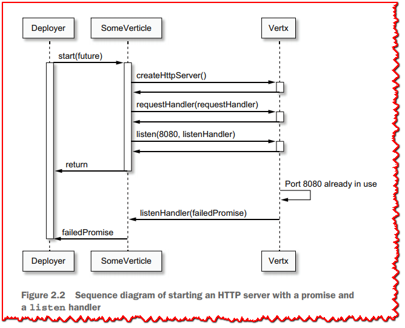

为了更好地理解这里发生了什么，**图 2.2** 展示了 Verticle、Vert.x 对象和负责调用 `start` 方法的内部 Vert.x 部署程序对象之间的交互。 我们可以检查部署程序是否等待承诺完成以了解部署是否成功，即使在对 `start` 方法的调用返回之后也是如此。 相比之下，图 2.3 显示了不使用接受 `Promise` 对象的 `start` 变体时的交互。 部署者无法收到错误通知。

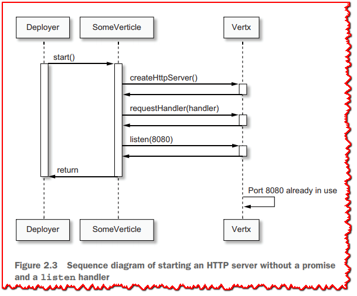

> **💡提示:** 使用接受回调来通知错误的异步方法变体是一种很好的健壮性实践，例如**清单 2.7** 中的 `listen` 方法。 如果它允许我减少代码示例的冗长，我不会在本书的其余部分总是这样做。

### 2.2.3 部署 verticles

到目前为止，我们一直在从嵌入在单个 Verticle 类中的`main`方法中部署 Verticle。

Verticle 总是通过 `Vertx` 对象部署（和取消部署）。 您可以通过任何方法执行此操作，但部署由 Verticle 组成的应用程序的典型方法如下：
1. 部署一个“主” verticle.
2. "主" verticle 部署其他 verticles。
3. 被部署的verticles又可以部署更多的verticles 。

>  **🏷注意:** 请注意，虽然这听起来是分层的，但 Vert.x 并没有正式的"父/子" Verticle 概念。

为了说明这一点，让我们定义一些 Verticle。

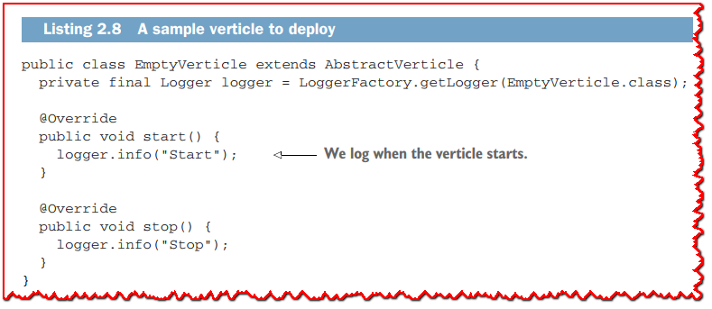

```java
package chapter2.deploy;

import io.vertx.core.AbstractVerticle;
import org.slf4j.Logger;
import org.slf4j.LoggerFactory;

public class EmptyVerticle extends AbstractVerticle {

  private final Logger logger = LoggerFactory.getLogger(EmptyVerticle.class);

  @Override
  public void start() {
    logger.info("Start");
  }

  @Override
  public void stop() {
    logger.info("Stop");
  }
}
```

**清单 2.8** 定义了一个简单的 Verticle。 除了在启动和停止时记录日志之外，它没有做任何有趣的事情。

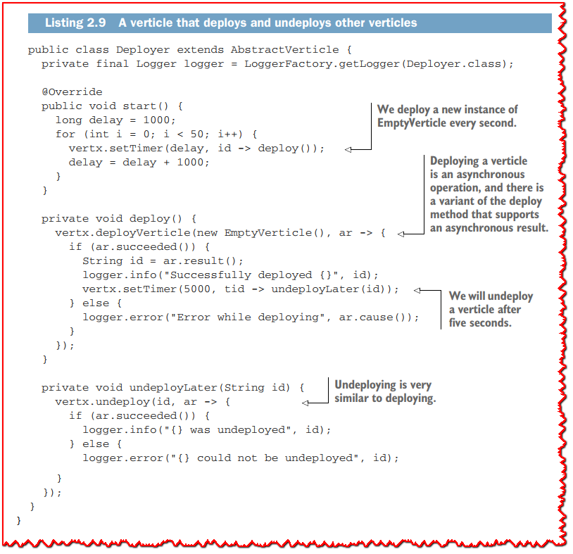

```java
package chapter2.deploy;

import io.vertx.core.AbstractVerticle;
import org.slf4j.Logger;
import org.slf4j.LoggerFactory;

public class Deployer extends AbstractVerticle {

  private final Logger logger = LoggerFactory.getLogger(Deployer.class);

  @Override
  public void start() {
    long delay = 1000;
    for (int i = 0; i < 50; i++) {
      vertx.setTimer(delay, id -> deploy());  // <1>
      delay = delay + 1000;
    }
  }

  private void deploy() {
    vertx.deployVerticle(new EmptyVerticle(), ar -> {   // <2>
      if (ar.succeeded()) {
        String id = ar.result();
        logger.info("Successfully deployed {}", id);
        vertx.setTimer(5000, tid -> undeployLater(id));   // <3>
      } else {
        logger.error("Error while deploying", ar.cause());
      }
    });
  }

  private void undeployLater(String id) {
    vertx.undeploy(id, ar -> {  // <4>
      if (ar.succeeded()) {
        logger.info("{} was undeployed", id);
      } else {
        logger.error("{} could not be undeployed", id);
      }
    });
  }
}

```

> <1>: 我们每秒部署一个 EmptyVerticle 的新实例。
>
> <2>: 部署一个 Verticle 是一个异步操作，并且有一个支持异步结果的 deploy 方法的变体。
>
> <3>: 我们将在五秒后解除 Verticle  部署。
>
> <4>: 取消部署与部署非常相似。

**清单 2.9** 定义了一个 Verticle，它部署了来自 **清单 2.8** 的 50 个 `EmptyVerticle` 类的实例。 计时器的使用允许我们将每个部署间隔一秒。 `deploy` 方法使用另一个计时器在部署 Verticle 5 秒后取消部署它。 部署为一个verticle分配一个唯一的标识符字符串，以后可以将其用于取消部署。

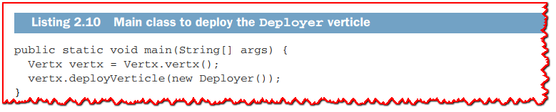

最后但同样重要的是，`Deployer` verticle 本身可以从主方法和类部署，如**清单 2.10** 所示。 运行此示例会产生类似于以下清单中的日志条目。

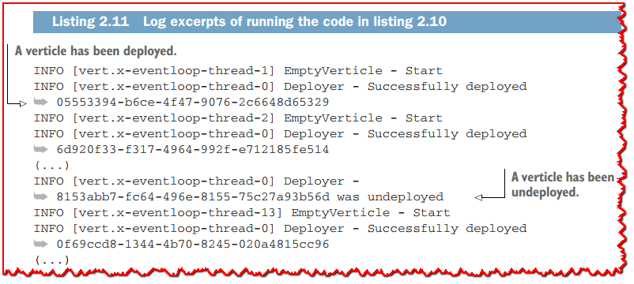

您可以从 `vert.x-eventloop-thread-0` 线程查看日志条目； 它们对应于 `Deployer` verticle。 然后您可以从 `EmptyVerticle` 实例中查看生命周期日志事件； 他们使用其他事件循环线程。

有趣的是，我们从 Deployer 部署了 50 个 Verticle，但线程可能比日志中出现的 Verticle 少。 默认情况下，Vert.x 创建的事件循环线程数量是 CPU 内核的两倍。 如果您有 8 个内核，那么 Vert.x 应用程序有 16 个事件循环。 将 Verticle 分配给事件循环是以循环方式完成的。

这给我们上了一堂有趣的课: 一个Verticle总是使用同一个事件循环线程，事件循环线程被多个Verticle共享。这种设计导致运行应用程序的线程数量是可预测的。

> **💡提示:** 可以调整应该可用的事件循环的数量，但无法手动将给定的 Verticle 分配给特定的事件循环。 这在实践中永远不会成为问题，但在最坏的情况下，您始终可以计划 Verticle 的部署顺序。

### 2.2.4 传递配置数据

应用程序代码通常需要配置数据。 一个很好的例子是连接到数据库服务器的代码：它通常需要主机名、TCP 端口、登录名和密码。 由于值从一种部署配置更改为另一种，因此需要从配置 API 访问此类配置。

Vert.x verticles 可以在部署时传递此类配置数据。 您将在本书后面看到可以使用一些更高级的配置形式，但是 Vert.x 核心 API 已经提供了一个非常有用的通用 API。

配置需要作为 JSON 数据传递，使用由 `io.vertx.core.json 包`中的 `JsonObject` 和 `JsonArray` 类具体化的 Vert.x JSON API。

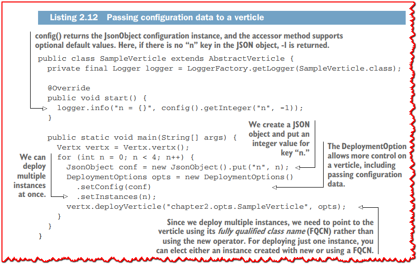

```java
package chapter2.opts;

import io.vertx.core.AbstractVerticle;
import io.vertx.core.DeploymentOptions;
import io.vertx.core.Vertx;
import io.vertx.core.json.JsonObject;
import org.slf4j.Logger;
import org.slf4j.LoggerFactory;

public class SampleVerticle extends AbstractVerticle {

  private final Logger logger = LoggerFactory.getLogger(SampleVerticle.class);

  @Override
  public void start() {
    logger.info("n = {}", config().getInteger("n", -1));  // <1>
  }

  public static void main(String[] args) {
    Vertx vertx = Vertx.vertx();
    for (int n = 0; n < 4; n++) {
      JsonObject conf = new JsonObject().put("n", n);  // <2>
      DeploymentOptions opts = new DeploymentOptions()
        .setConfig(conf)  // <3>
        .setInstances(n);  // <4>
      vertx.deployVerticle("chapter2.opts.SampleVerticle", opts);  // <5>
    }
  }
}
```

> <1>: config() 返回 JsonObject 配置实例，访问器方法支持可选的默认值。 这里，如果 JSON 对象中没有“n”键，则返回 -1。
>
> <2>: 我们创建一个 JSON 对象并为键“n”放置一个整数值。
>
> <3>: DeploymentOption 允许对 Verticle 进行更多控制，包括传递配置数据。
>
> <4>: 我们可以一次部署多个实例。
>
> <5>: 由于我们部署了多个实例，我们需要使用它的完全限定类名（FQCN）而不是使用 new 运算符来指向 Verticle。 对于仅部署一个实例，您可以选择使用 new 或使用 FQCN 创建的实例。

**清单 2.12** 展示了一个部署多个 Verticle 并传递配置数据的示例。 运行该示例给出了**清单 2.13** 中的输出，您可以检查配置数据的不同值。

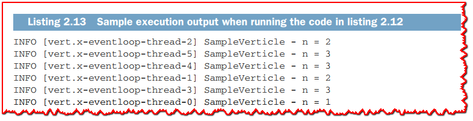

<a name="2_3_When_code_needs_to_block"></a>

## 2.3 当代码需要阻塞时

在事件循环上运行代码的基本规则是它不应该阻塞，它应该运行“足够快”。 您之前已经看到，默认情况下，Vert.x 会在事件循环被阻塞时间过长时检测并发出警告。

在某些情况下，您将很难避免阻塞代码。 这可能是因为您正在使用具有其他线程模型的第三方库，例如某些网络服务的驱动程序。 Vert.x 提供了两个选项来处理这种情况：worker verticles 和 `executeBlocking` 操作。

### 2.3.1 Worker verticles

Worker Verticle 是一种特殊形式的 Verticle，它不在事件循环上执行。 相反，它们在工作线程上执行，即从特殊工作池中获取的线程。 您可以定义自己的工作线程池并将工作线程部署到它们，但在大多数情况下，使用默认的 Vert.x 工作线程池就可以了。

一个worker verticle处理事件就像一个event-loop verticle，除了它可能需要任意长的时间来处理。 了解两点很重要：

- 一个worker verticle不依赖于一个单独的worker thread，因此与event-loop verticle不同的是，连续的事件可能不会在同一个线程上执行。
- Worker Verticle 只能在给定时间由某个工作线程访问。

>  **💡提示:** 简单来说，就像event-loop verticles一样，worker verticles也是单线程的，但与event-loop verticles不同，线程可能并不总是相同的。

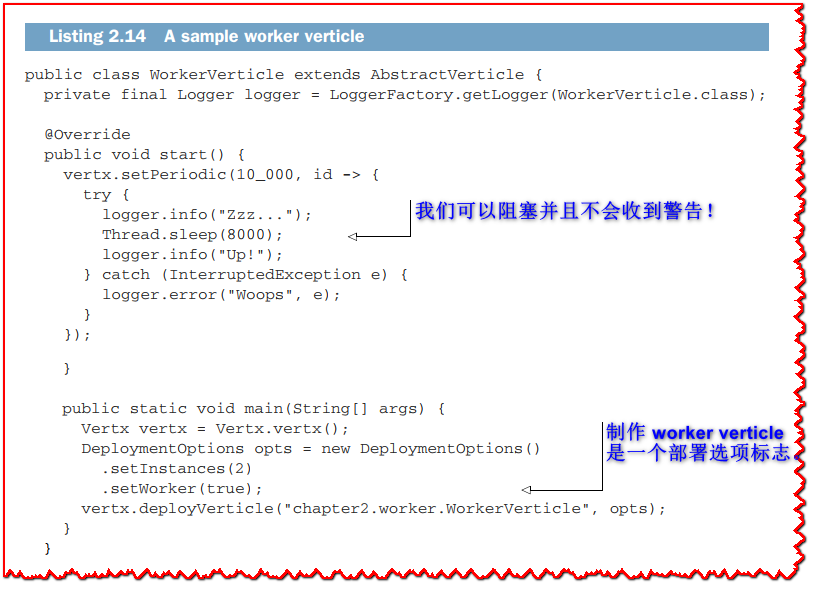

```java
package chapter2.worker;

import io.vertx.core.AbstractVerticle;
import io.vertx.core.DeploymentOptions;
import io.vertx.core.Vertx;
import org.slf4j.Logger;
import org.slf4j.LoggerFactory;

public class WorkerVerticle extends AbstractVerticle{

  private final Logger logger = LoggerFactory.getLogger(WorkerVerticle.class);

  @Override
  public void start() {
    vertx.setPeriodic(10_000, id -> {
      try {
        logger.info("Zzz...");
        Thread.sleep(8000);  // <1>
        logger.info("Up!");
      } catch (InterruptedException e) {
        logger.error("Woops", e);
      }
    });
  }

  public static void main(String[] args) {
    Vertx vertx = Vertx.vertx();
    DeploymentOptions opts = new DeploymentOptions()
      .setInstances(2)
      .setWorker(true);  // <2>
    vertx.deployVerticle("chapter2.worker.WorkerVerticle", opts);
  }
}
```

> <1>: 我们可以阻塞并且不会收到警告！
>
> <2>: 制作 worker verticle 是一个部署选项标志。

**清单2.14** 显示了一个使用两个实例部署worker verticle对象的示例。每10秒，代码就会阻塞8秒。运行这个示例将产生与**清单2.15** 类似的输出。如您所见，不同的工作线程被用于连续的事件。

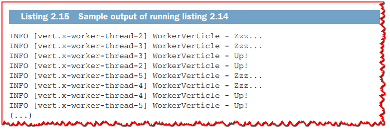

> **☢警告:** 在部署 verticle 时，有一个为 worker verticles 启用多线程的选项，它允许一个 verticle 并发处理多个事件，打破了单线程处理的假设。 这一直被认为是相当高级的用法，许多用户最终以错误的方式使用它并发现并发错误。 该功能不再公开记录，甚至可能在未来的 Vert.x 版本中消失。 鼓励用户简单地调整工作池大小以匹配工作负载，而不是启用工作器程多线程。

### 2.3.2 执行阻塞操作

Worker Verticle 是运行阻塞任务的明智选择，但将阻塞代码提取到 Worker Verticle 中可能并不总是有意义。 这样做会导致执行小任务的Worker  Verticle 类的数量激增，并且每个类可能无法形成一个合理的独立功能单元。

运行阻塞代码的另一个选项是使用 Vert.x 类中的 `executeBlocking` 方法。 该方法需要一些阻塞代码来执行，将其卸载到工作线程，并将结果作为新事件发送回事件循环，如**图 2.4** 所示。


以下清单显示了一个示例用法。

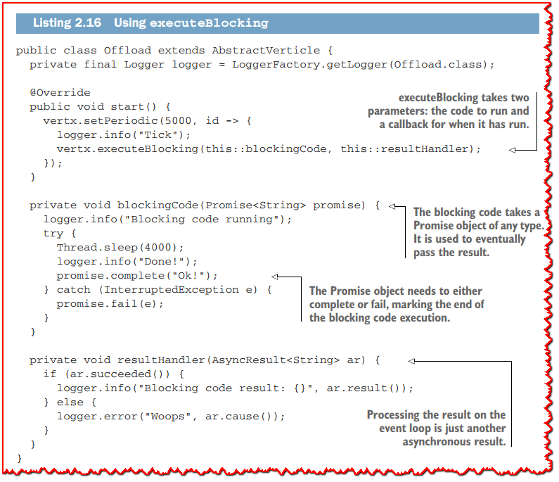

```java
package chapter2.execblocking;

import io.vertx.core.*;
import org.slf4j.Logger;
import org.slf4j.LoggerFactory;

public class Offload extends AbstractVerticle {

  private final Logger logger = LoggerFactory.getLogger(Offload.class);

  @Override
  public void start() {
    vertx.setPeriodic(5000, id -> {
      logger.info("Tick");
      vertx.executeBlocking(this::blockingCode, this::resultHandler);  // <1>
    });
  }

  private void blockingCode(Promise<String> promise) {  // <2> 
    logger.info("Blocking code running");
    try {
      Thread.sleep(4000);
      logger.info("Done!");
      promise.complete("Ok!");  // <3>
    } catch (InterruptedException e) {
      promise.fail(e);
    }
  }

  private void resultHandler(AsyncResult<String> ar) {  // <4>
    if (ar.succeeded()) {
      logger.info("Blocking code result: {}", ar.result());
    } else {
      logger.error("Woops", ar.cause());
    }
  }

  public static void main(String[] args) {
    Vertx vertx = Vertx.vertx();
    vertx.deployVerticle(new Offload());
  }
}
```

><1>: executeBlocking接受两个参数:要运行的代码和运行后的回调。
>
><2>: 阻塞代码接受任何类型的Promise对象。它用于最终传递结果。
>
><3>: Promise对象需要完成或失败，标志着阻塞代码执行的结束。
>
><4>: 在事件循环上处理的结果只是另一个异步结果。

下面的清单显示了运行**清单2.16** 中的代码的一些示例输出。正如您所看到的，执行被卸载到工作线程，但结果处理仍然发生在事件循环中。

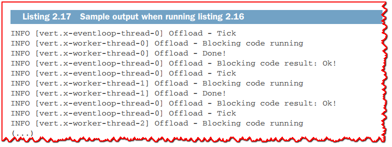

> **💡提示:** 默认情况下，连续的 `executeBlocking` 操作的结果处理顺序与调用 `executeBlocking` 的顺序相同。 `executeBlocking` 有一个带有附加 `boolean` 参数的变体，当它设置为 `false` 时，无论`executeBlocking` 的顺序如何，只要它们可用，结果都会作为事件循环事件在其可用时立即被提供。
>
> **JavaDoc中是这样解释的:** "ordered - 如果为true，那么如果`executeBlocking`在同一上下文上被多次调用，那么该上下文的执行将被串行执行，而不是并行执行。如果为false，则它们将是无顺序保证."
>
> **译者注:** 也就是说如果`ordered `是false,就可以并发执行`executeBlocking`了!但是不保证先后顺序.

## 2.4 什么才是真正的verticle?

到目前为止，您已经了解了如何编写verticles、如何部署和配置verticles，以及如何处理阻塞代码。通过在示例中使用信息日志，您已经了解了Vert.x线程模型的元素。

现在是时候回过头来仔细分析一下verticle里面是什么了，并确保你在本章结束时对verticle是如何工作的以及如何正确使用它们有了全面的了解。

### 2.4.1 Verticles及其environment

图 2.5 概述了一个 Verticle 和它的环境之间的关系。
一个verticle对象本质上是两个对象的组合：

- Verticle 所属的 Vert.x 实例
- 允许将事件分派给处理程序的专用上下文实例

Vert.x 实例公开了用于声明事件处理程序的核心 API。 我们已经在之前的代码示例中使用了它，其中包括 `setTimer`、`setPeriodic`、`createHttpServer`、`deployVerticle` 等方法。 Vert.x 实例被多个 Verticle 共享，每个 JVM 进程一般只有一个 Vert.x 实例。

上下文实例持有对线程的访问权以执行处理程序。 事件可能源自各种来源，例如计时器、数据库驱动程序、HTTP 服务器等。 因此，它们通常由其他线程触发，例如 Netty的accepting线程或计时器线程。

用户定义的回调中的事件处理通过上下文发生。 上下文实例允许我们在 Verticle 事件循环线程上调用处理程序，从而尊重 Vert.x 线程模型。

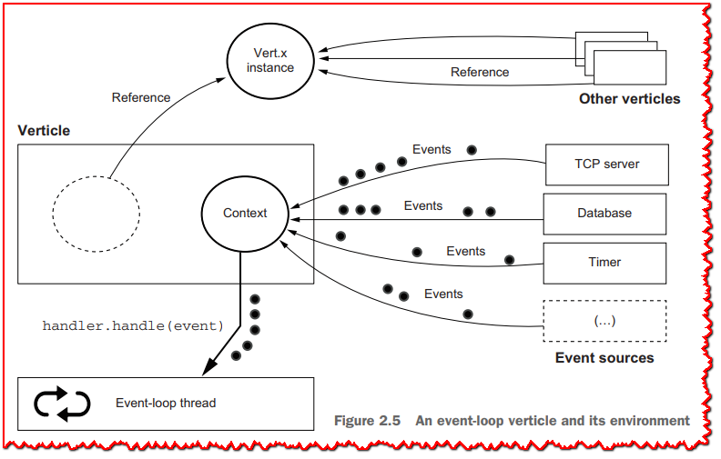

worker verticles的情况没有太大区别，只是处理程序是在工作线程池中使用一个工作线程执行的，如**图2.6** 所示。它们仍然是verticles，就像它们的事件循环一样，代码可以假定是单线程访问。只是没有固定的工作线程被用于处理一个worker verticle的事件。

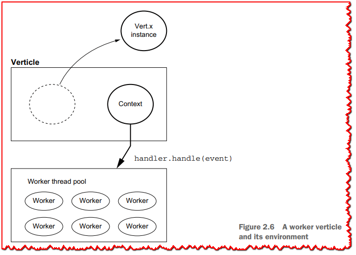

### 2.4.2 有关上下文的更多信息

可以使用 Vert.x 类中的 `getOrCreateContext()` 方法访问上下文对象。 虽然上下文几乎总是与verticle相关联，但可以在verticle之外创建事件循环上下文。 正如该方法的名称所暗示的那样
- 从像verticle这样的上下文线程调用`getOrCreateContext()`会返回上下文。
- 从非上下文线程调用 `getOrCreateContext()` 会创建一个新上下文。

**清单 2.18** 显示了一个创建全局 Vertx 实例的示例，并且在 JVM 进程主线程上对 `getOrCreateContext` 进行了两次调用。 每次调用之后都会调用 `runOnContext`，它允许我们在上下文线程上运行代码块。


正如您在下一个清单中看到的，每个上下文都被分配给一个事件循环。

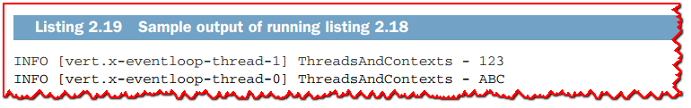

上下文对象支持更多操作，例如保存上下文范围的任意键/值数据和声明异常处理程序。 下面的清单显示了一个示例，其中 `foo` 键包含字符串 `bar`，并且声明了一个异常处理程序以在事件循环线程上执行处理程序时捕获和处理异常。

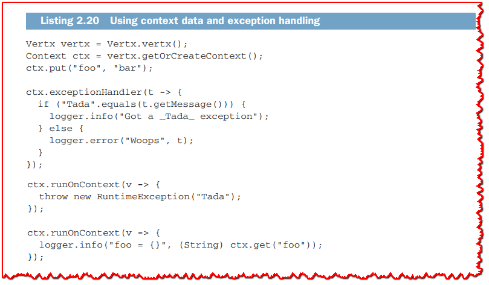

```java
package chapter2.dissecting;

import io.vertx.core.Context;
import io.vertx.core.Vertx;
import org.slf4j.Logger;
import org.slf4j.LoggerFactory;

public class ThreadsAndContexts {

  private static final Logger logger = LoggerFactory.getLogger(ThreadsAndContexts.class);

  public static void main(String[] args) {
    createAndRun();
    dataAndExceptions();
  }

  private static void createAndRun() {
    Vertx vertx = Vertx.vertx();

    vertx.getOrCreateContext()
      .runOnContext(v -> logger.info("ABC"));

    vertx.getOrCreateContext()
      .runOnContext(v -> logger.info("123"));
  }

  private static void dataAndExceptions() {
    Vertx vertx = Vertx.vertx();
    Context ctx = vertx.getOrCreateContext();
    ctx.put("foo", "bar");

    ctx.exceptionHandler(t -> {
      if ("Tada".equals(t.getMessage())) {
        logger.info("Got a _Tada_ exception");
      } else {
        logger.error("Woops", t);
      }
    });

    ctx.runOnContext(v -> {
      throw new RuntimeException("Tada");
    });

    ctx.runOnContext(v -> {
      logger.info("foo = {}", (String) ctx.get("foo"));
    });
  }
}
```

当事件处理分布在多个类中时，上下文数据可能很有用。 否则，使用类字段要简单得多（而且速度更快！）。

当事件处理可能引发异常时，异常处理程序很重要。 默认情况下，异常仅由 Vert.x 记录，但在执行自定义操作以处理错误时，重写上下文异常处理程序很有用。

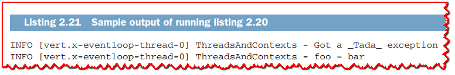

运行**清单 2.20** 中的代码会产生类似于**清单 2.21** 的输出。

### 2.4.3 桥接 Vert.x 和非 Vert.x 线程模型

在编写 Vert.x 应用程序时，您可能不必处理 Vert.x 上下文。 尽管如此，在一种情况下它最有意义：当您必须使用具有自己的线程模型的第三方代码，并且您希望使其与 Vert.x 一起正常工作时。

下一个清单中的代码显示了一个创建非 Vert.x 线程的示例。 通过传递从 Verticle 获得的上下文，我们能够从运行在非Vert.x线程上的代码里在事件循环中执行一些代码。

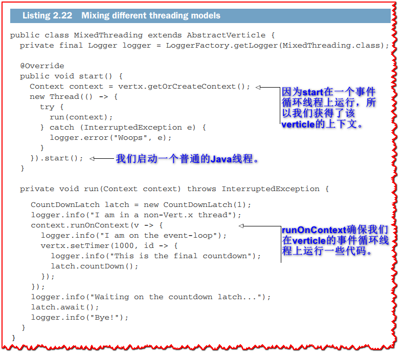

```java
package chapter2.dissecting;

import io.vertx.core.AbstractVerticle;
import io.vertx.core.Context;
import io.vertx.core.Vertx;
import org.slf4j.Logger;
import org.slf4j.LoggerFactory;

import java.util.concurrent.CountDownLatch;

public class MixedThreading extends AbstractVerticle {

  private final Logger logger = LoggerFactory.getLogger(MixedThreading.class);

  @Override
  public void start() {
    Context context = vertx.getOrCreateContext();   // <1>
    new Thread(() -> {
      try {
        run(context);
      } catch (InterruptedException e) {
        logger.error("Woops", e);
      }
    }).start();                                      // <2>
  }

  private void run(Context context) throws InterruptedException {
    CountDownLatch latch = new CountDownLatch(1);
    logger.info("I am in a non-Vert.x thread");
    context.runOnContext(v -> {                       // <3>
      logger.info("I am on the event-loop");
      vertx.setTimer(1000, id -> {
        logger.info("This is the final countdown");
        latch.countDown();
      });
    });
    logger.info("Waiting on the countdown latch...");
    latch.await();
    logger.info("Bye!");
  }

  public static void main(String[] args) {
    Vertx vertx = Vertx.vertx();
    vertx.deployVerticle(new MixedThreading());
  }
}
```

> <1>: 因为start在一个事件循环线程上运行，所以我们获得了该verticle的上下文。
>
> <2>: 我们启动一个普通的Java线程。
>
> <3>: runOnContext确保我们在verticle的事件循环线程上运行一些代码。

下面清单中的日志显示了这一点。

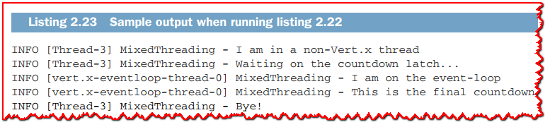

每当您需要将非 Vert.x 线程模型集成到您的应用程序中时，您都可以使用拥有verticle上下文并发出 `runInContext` 调用的方法。

> **💡提示:** 这个例子展示了上下文的另一个重要属性: 在定义处理程序时传播上下文。实际上，使用`runOnContext`运行的代码块会在一秒钟后设置一个计时器处理程序。您可以看到，计时器处理程序在与用来定义它的上下文相同的上下文中执行。

下一章将讨论事件总线，这是Vertx应用程序中verticles可以相互通信和进行事件处理的标准方式。

### 总结

- Verticle 是 Vert.x 应用程序中异步事件处理的核心组件。
- `Event-loop verticles` 处理异步 I/O 事件，并且应该没有阻塞和长时间运行的操作。
- `Worker Verticle` 可用于处理阻塞 I/O 和长时间运行的操作。
- 通过使用事件循环上下文，可以将代码与 Vert.x 和非 Vert.x 线程混合。
