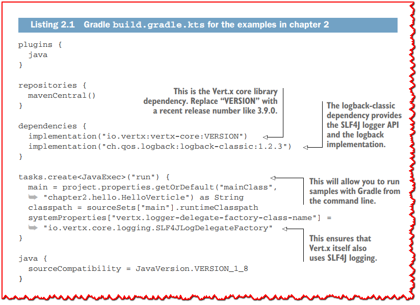
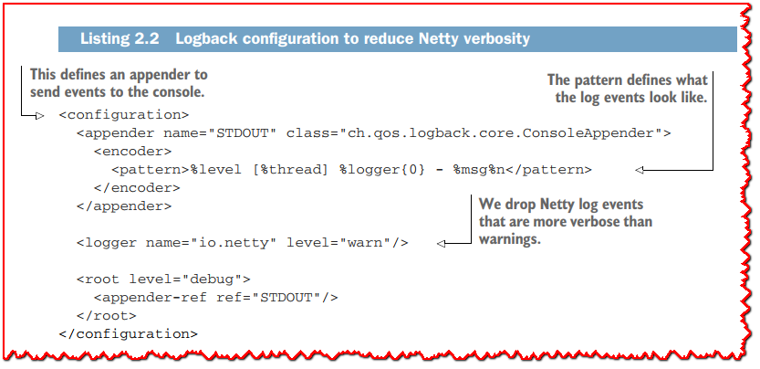
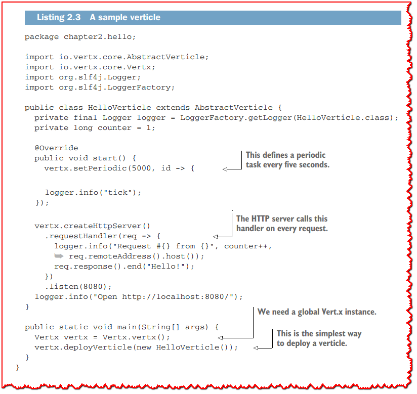
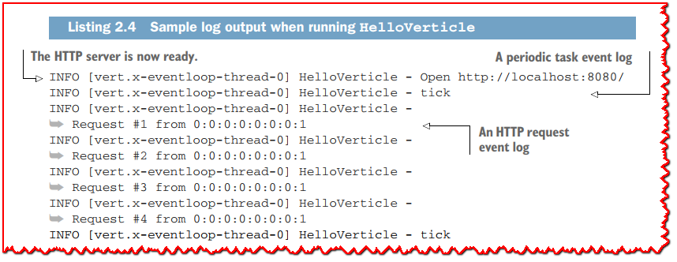

# Chapter 2: Verticles: The basic processing units of Vert.x

> 翻译: 白石(https://github.com/wjw465150/Vert.x-Core-Manual)

**本章涵盖了**

+ 什么是 verticles
+ 如何编写、配置和部署 verticles
+ Vert.x线程模型
+ 如何混合Vert.x和非Vert.x线程

------

简单地说，`verticle`是Vert.x中的基本处理单元。`verticle`的作用是封装一个处理事件的“技术功能单元”，例如公开HTTP API和响应请求、在数据库之上提供存储库接口或向第三方系统发出请求。与Enterprise JavaBeans等技术中的组件一样，`verticle`也可以被部署，并且它们有一个生命周期。 

异步编程是构建响应式应用程序的关键，因为它们必须具有伸缩性，而`verticle`是Vert.x中结构化(异步)事件处理代码和业务逻辑的基础。

## 2.1 编写一个 verticle

如果您熟悉**actor并发模型**，您将发现Vert.x的verticle和actor之间的相似之处。简单地说，在actor模型中，自治实体(actor)通过发送和响应消息专门与其他实体进行通信。Vertx verticles和actor之间的相似之处并不是偶然的巧合: verticles拥有在接收事件时可以更新的私有状态，它们可以部署其他verticles，它们还可以通过消息传递进行通信(下一章将详细介绍)。Vertx不一定遵循actors的正统定义，但至少可以认为它受到了actors的启发。 

由于verticles是Vertx中的一个关键概念，我们将研究它们是如何工作的。在此之前，我们将编写一个处理两种类型事件的小verticle: 定期计时器和HTTP请求。 

### 2.1.1 准备项目

我们将在本章的所有例子中使用一个通用项目，使用Gradle项目描述符如下所示。



```groovy
plugins {
  java
}

repositories {
  mavenCentral()
  maven {
    url = uri("https://oss.sonatype.org/content/repositories/snapshots/")
  }
}

dependencies {
  implementation("io.vertx:vertx-core:4.0.3")
  implementation("ch.qos.logback:logback-classic:1.2.3")
}

tasks.create<JavaExec>("run") {
  main = project.properties.getOrDefault("mainClass", "chapter2.hello.HelloVerticle") as String
  classpath = sourceSets["main"].runtimeClasspath
  systemProperties["vertx.logger-delegate-factory-class-name"] = "io.vertx.core.logging.SLF4JLogDelegateFactory"
}

java {
  sourceCompatibility = JavaVersion.VERSION_1_8
}
```

Gradle的构建对于Java项目来说是非常简单的。因为我们要运行几个例子，所以我们不会依赖Gradle的`application`插件，而是会定义我们自己的`run`任务，在这个任务中，我们可以传递要执行的类名。我们还将使用它来确保日志记录被正确配置并统一到SLF4J.



```xml
<configuration>

  <appender name="STDOUT" class="ch.qos.logback.core.ConsoleAppender">
    <encoder>
      <pattern>%level [%thread] %logger{0} - %msg%n</pattern>
    </encoder>
  </appender>

  <logger name="io.netty" level="warn"/>

  <root level="debug">
    <appender-ref ref="STDOUT"/>
  </root>

</configuration> 
```

> **💡提示:** Vert.x使用Netty，使用默认的Logback配置登录Netty非常繁琐。我们可以通过创建一个`src/main/resources/logback.xml`文件并添加如 清单2.2 所示的配置来减少日志条目的数量。为了使本书中的日志示例更短，我还删除了事件日期并缩短了日志程序类名($logger{0})。请参考Logback文档了解如何配置它([https://logback.qos.ch/manual/index.html](https://logback.qos.ch/manual/index.html))

### 2.1.2 verticle 类

整个verticle和应用程序都适合下面的Java类:



```java
package chapter2.hello;

import io.vertx.core.AbstractVerticle;
import io.vertx.core.Vertx;
import org.slf4j.Logger;
import org.slf4j.LoggerFactory;

public class HelloVerticle extends AbstractVerticle {

  private final Logger logger = LoggerFactory.getLogger(HelloVerticle.class);

  private long counter = 1;

  @Override
  public void start() {

    vertx.setPeriodic(5000, id -> {
      logger.info("tick");
    });

    vertx.createHttpServer()
      .requestHandler(req -> {
        logger.info("Request #{} from {}", counter++, req.remoteAddress().host());
        req.response().end("Hello!");
      })
      .listen(8080);

    logger.info("Open http://localhost:8080/");
  }

  public static void main(String[] args) {
    Vertx vertx = Vertx.vertx();
    vertx.deployVerticle(new HelloVerticle());
  }
} 
```

本verticle定义了两个事件处理程序:一个用于每5秒执行周期性任务，另一个用于处理HTTP服务器中的HTTP请求。`main`方法实例化一个全局Vert.x实例，并部署该verticle的一个实例。 

在Java中定义一个verticle通常通过继承`AbstractVerticle`类来完成。理论上你可以实现一个 `Verticle` 接口，但是 `AbstractVerticle`类提供Vert.x用户需要的所有事件处理、配置和执行管道。

> **🏷注意:** 由于 Vert.x 是一个库而不是框架，因此您可以从`main`方法或任何其他类创建 Vert.x 实例，然后部署 Verticle。

Verticle 的生命周期由开始和停止事件组成。 `AbstractVerticle` 类提供了可以被覆盖的 `start` 和 `stop` 方法：

+ `start`方法通常包含处理程序的设置和初始化，如**清单2.3**中所示的设置周期性任务处理程序和启动HTTP服务器。
+ `stop`方法是在需要执行清理任务时实现的，例如关闭打开的数据库连接。

默认情况下，这些方法什么也不做。

### 2.1.3 运行和第一次观察

通过从IDE或命令行运行`main`方法，应用程序可以像普通Java应用程序一样启动。要使用Gradle在命令行运行它，你可以使用以下命令:

```shell
$ ./gradlew run -PmainClass=chapter2.hello.HelloVerticle
```

我再次假设您将从 Unix shell 运行它，无论是在 Linux、macOS 还是通过 WSL 的 Windows 下。 如果您从传统的 Windows 终端运行命令，Gradle 有一个 `.bat` 文件，因此您需要将 `./gradlew` 替换为 `gradlew.bat`。

应用程序运行后，您可以使用 Web 浏览器在 http://localhost:8080/ 处执行一些 HTTP 请求，或者使用命令行工具，例如 `curl` 和 `HTTPie`。 日志将类似于以下清单中显示的日志.



> **💡提示:** 在剩下的一些示例中，我缩短了类定义。 我特别删除了与 清单 2.3 中类似的包定义、导入和 `main` 方法。 要查看完整的源代码，请查阅本书的代码库。 

我们使用的 Logback 配置显示了与事件关联的线程的名称。 我们已经可以在日志条目中检查 Vert.x verticles 的一个重要属性：事件处理发生在单个事件循环线程上。 周期性任务和 HTTP 请求处理都发生在日志中显示为`vert.x-eventloop-thread-0`的线程上。

这种设计的一个明显好处是一个verticle实例总是在同一个线程上执行事件处理，因此不需要使用线程同步原语。 在多线程设计中，更新 `counter` 字段将需要 `synchronized` 块或使用 `java.util.concurrent.AtomicLong`。 这里不存在这样的问题，因此可以安全地使用普通的 `long` 字段。

可以从非 Vert.x 线程调用准备方法，例如 `createHttpServer` 或 `setTimer`。 当您直接使用没有 Verticle 的 `Vertx` 对象时，或者在编写单元测试时，可能会发生这种情况。 然而，这不是问题，因为 `Vertx` 类方法的使用是线程安全的。

图 2.1 显示了 Verticle、处理程序、Vert.x 和事件源之间的（简化的）交互。 每个箭头代表参与者之间的方法调用。 例如，`HelloVerticle` 通过在 `Vertx` 对象上调用 `setPeriodic` 创建一个周期性任务处理程序，然后使用内部 Vert.x 计时器创建一个周期性任务。 反过来，计时器会定期回调 `HelloVerticle` 中的 `timerHandler` 处理程序。


请注意，我将对 `requestHandler` 和 `listen` 的调用表示为对 `Vert.x` 对象的快捷方式； 实际上，它们位于实现 `HttpServer` 接口的对象上。 实际的类是 Vert.x 内部的，由于它不服务于图表来添加另一个参与者，我将它合并到 `Vert.x` 中。

## 2.2 更多关于 verticles

关于编写和部署 Verticle，还有更多需要了解的事情：
+ 当事件循环被阻塞时会发生什么？
+ 在存在异步初始化工作的情况下，如何推迟生命周期完成的通知？
+ 你如何部署和取消部署 Verticle？
+ 你如何传递配置数据？

我们将使用非常简单但重点突出的示例来介绍这些主题中的每一个。
