# 第三章: 事件总线：Vert.x 应用程序的支柱

**本章涵盖了**
  - 事件总线是什么
  - 如何通过事件总线进行点对点、**请求-回复** 和 **发布/订阅** 通信
  - 用于通过网络进行verticle到verticle通信的分布式事件总线

上一章介绍了*verticles*。 一个 Vert.x 应用程序由一个或多个 Verticle 组成，每个 Verticle 形成一个处理异步事件的单元。 通常通过功能和技术问题来专门化 Verticle，例如有一个 Verticle 用于公开 HTTP API，而另一个 Verticle 用于处理数据存储。 这种设计还鼓励部署给定 Verticle 的多个实例以实现可扩展性目的。

我们尚未介绍的是verticles如何相互交流。 例如，如果较大的Vert.x应用程序要执行任何有用的事情，则HTTP API Verticle需要与数据存储verticle交谈。

连接verticles并确保它们能够合作是“事件总线”的作用。在构建响应式应用程序时，这一点非常重要—事件总线提供了一种方法，可以透明地在进程内部和网络上的多个节点上分发事件处理工作。

## 3.1 什么是事件总线?

事件总线是一种以异步方式发送和接收消息的方法。向目的地发送消息，并从目的地检索消息。目的地只是一个自由格式的字符串，例如`incoming.purchase.order` 或 `incoming-purchase-orders`，尽管前者带点的格式是首选的。

消息具有**正文**、用于存储元数据的**可选头**以及**过期时间戳**(如果还未处理则将丢弃它们)。

消息主体通常使用Vert.x JSON表示形式编码。 使用JSON的优点是，它是一种可以轻松通过网络运输的序列化格式，所有编程语言都可以理解它。 也可以使用Java基本类型和字符串类型，尤其是因为可以用来编写verticles的JVM语言对其具有直接的绑定。 最后但并非最不重要的一点是，可以注册自定义编码器/解码器（编解码器），以支持更专业的消息主体序列化。 例如，您可以编写一个编解码器，以将Java对象转换为自己的二进制编码。 但是，这样做很少有用，JSON和String数据涵盖了大多数Vert.x应用程序的需求。

事件总线允许分离verticles。不需要一个verticle访问另一个verticle类—只需要商定目标名称和数据表示。另一个好处是，由于Vert.x是多语言的，事件总线允许用不同语言编写的verticle相互通信，而不需要任何复杂的语言互操作性层，无论是在同一个JVM进程内部通信还是跨网络通信。

事件总线的一个有趣属性是，它可以扩展到应用程序进程之外。在本章中，您将看到事件总线也可以跨集群的分布式成员工作。在本书后面，您将看到如何将事件总线扩展到嵌入式或外部消息代理、远程客户端，以及运行在web浏览器中的JavaScript应用程序。

事件总线上的通信遵循三种模式:
  - **点到点** 消息
  - **请求-应答** 消息
  - **发布/订阅** 消息

### 3.1.1 事件总线只是另一个消息代理吗?

熟悉面向消息的中间件的读者应该已经发现了事件总线和消息代理之间明显的相似之处。毕竟，事件总线展示了常见的消息传递模式，例如发布/订阅模式，该模式在集成分布式和异构应用程序时非常流行。

简短的回答是否定的，Vert.x事件总线不是Apache ActiveMQ、RabbitMQ、ZeroMQ或Apache Kafka的替代方案。更长的解释是，它是应用程序内部verticle到verticle通信的**事件**总线，而不是应用程序到应用程序通信的**消息**总线。正如您将在本书后面看到的，Vert.x集成了消息代理，但事件总线并不能替代这种类型的中间件。具体来说，事件总线不执行以下操作:
  - 支持消息确认
  - 支持消息优先级
  - 支持消息持久性以从崩溃中恢复
  - 提供路由规则
  - 提供转换规则(模式适应、分散/聚集等)

事件总线仅仅携带由verticles异步处理的**volatile**事件。

不是所有的事件都是一样的，有些可能会丢失，有些可能不会。在我们编写**“响应式应用程序”**的过程中，你会看到在哪里使用数据复制或消息代理(如Apache Kafka)与事件总线相结合。

事件总线是一个简单而快速的事件传递器，我们可以利用它进行大多数verticle到verticle的交互，同时转向成本更高的中间件来处理不能丢失的事件。

>  **💡提示:** 熟悉消息传递模式的读者可能希望浏览接下来的三个小节，甚至跳过它们。

### 3.1.2 点对点 消息

消息由生产者发送到目的地，如**图3.1**中的`a.b.c`。目标名称是自由格式的字符串，但Vert.x社区的约定是使用分隔点。例如，我们可以使用`datastore.new-purchase-orders`发送存储在数据库中的新购买订单。

使用**点对点**消息传递时，可能有**多个**消费者，其中一个会选择一条消息并处理它。图3.1显示了消息*M1*、*M2*和*M3*。

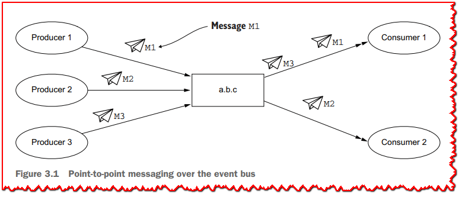

消息以轮循的方式在消费者之间分发，因此它们以相同的比例分割消息处理。这就是为什么在**图3.1**中，第一个消费者处理*M1*和*M3*，而第二个消费者处理*M2*。请注意，没有公平机制来向超载的消费者分发更少的消息。

### 3.1.3 请求-应答 消息

在Vert.x中，**请求-应答**消息传递通信模式是点对点消息传递的变体。当消息以点对点的方式发送时，可以注册一个**reply**处理程序。当您这样做时，事件总线将生成一个临时目的地名称，仅用于期待应答的请求消息生成器与最终将接收和处理消息的使用者之间的通信。

此消息传递模式非常适合模拟远程过程调用，但响应是以异步方式发送的，因此不需要一直等待，直到返回。例如，一个HTTP API Verticle可以向数据存储Verticle发送一个获取数据的请求，数据存储verticle最终返回一个回复消息。

这个模式如图3.2所示。当消息需要应答时，事件总线生成应答目的地，并在消息到达使用者之前将其附加到消息上。如果你愿意，你可以通过事件总线消息API来检查回复目的地的名称，但是你很少需要知道目的地，因为你只需要在消息对象上调用一个**reply**方法。当然，需要对消息消费者进行编程，以便在使用此模式时提供应答。
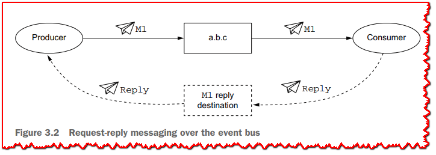

### 3.1.4 发布/订阅 消息

在**发布/订阅**通信中，生产者和消费者之间甚至存在更多的解耦。当消息发送到目的地时，所有订阅者都会收到它，如**图3.3**所示。消息*M1*、*M2*和*M3*分别由不同的生产者发送，所有订阅者接收消息，这与点对点消息不同(见**图3.1**)。不可能为事件总线上的发布/订阅通信指定应答处理程序。

当您不确定有多少verticles和处理程序对某个特定事件感兴趣时，**发布/订阅**非常有用。如果您需要消息消费者返回发送事件的实体，请使用**请求-应答**。否则，选择**点对点 **还是 **发布/订阅** 是一个功能需求问题，主要是所有消费者应该处理一个事件还是只有一个消费者应该处理一个事件。

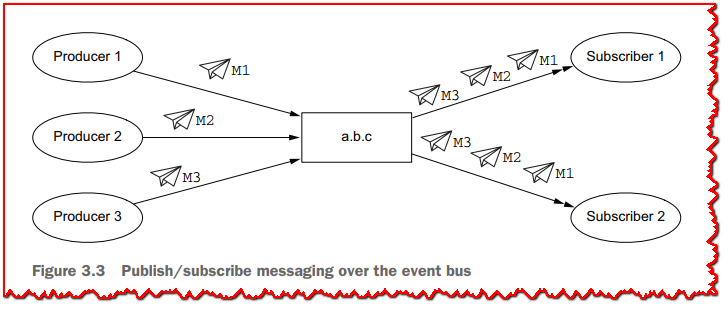

## 3.2 事件总线的例子

让我们使用事件总线，看看我们如何在独立的 Verticle 之间进行通信。 我们将使用的示例涉及多个温度传感器。 当然，我们不会使用任何硬件。 相反，我们将使用伪随机数让温度变化。 我们还将公开一个简单的 Web 界面，其中将实时更新温度及其平均值。

web界面截图如**图3.4**所示。它可以显示来自四个传感器的温度，并保持它们的平均温度最新。web界面和服务器之间的通信将通过**server-sent events**，这是一个简单而有效的协议，大多数web浏览器都支持。

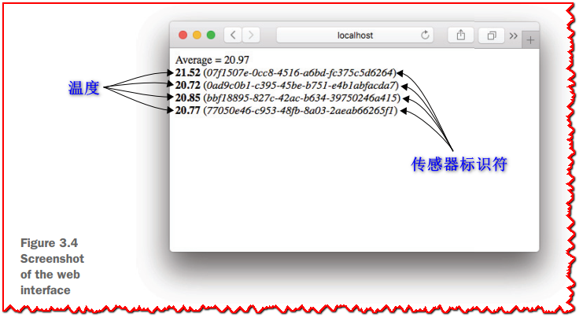

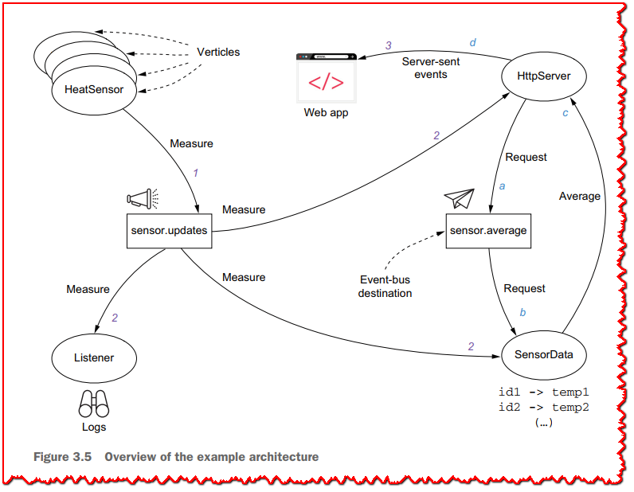

图 3.5 给出了应用程序架构的概述。 该图显示了两个并发事件通信，使用排序序列 *[1,2,3]*（正在发送温度更新）和 *[a,b,c,d]*（正在请求温度平均计算）。

该应用程序围绕四个 Verticle 构建：
  - **HeatSensor** 以非固定速率生成温度测量值，并将其发布给 **sensor.updates** 目的地的订阅者。 每个verticle都有一个唯一的传感器标识符。
  - **Listener** 监控新的温度测量值并使用 SLF4J 记录它们。
  - **SensorData** 记录每个传感器的最新观测值。 它还支持**请求-响应**通信：向 `sensor.average` 发送消息会触发基于最新数据的平均值计算，并将结果作为响应发送回。
  - **HttpServer** 公开 HTTP 服务器并提供 Web 界面。 每当观察到新的温度测量值时，它就会向其客户端推送新值，并定期询问当前平均值并更新所有连接的客户端。

### 3.2.1 热传感器 verticle

下面的清单显示了 *HeatSensor* verticle 类的实现。

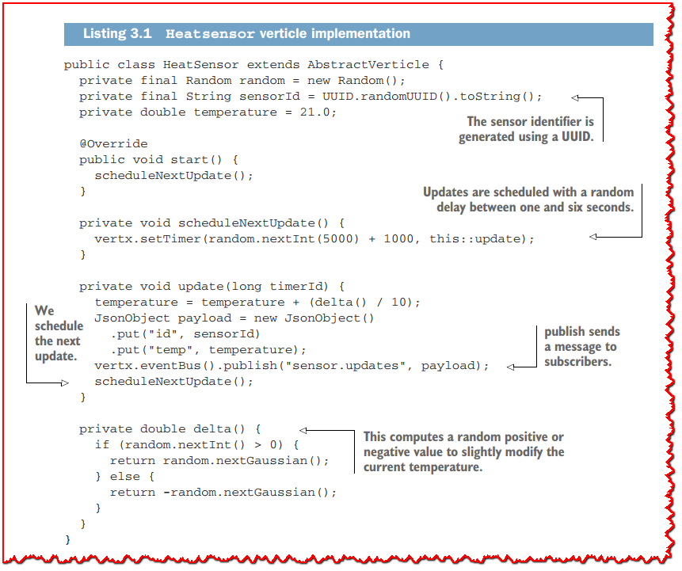

```java
package chapter3;

import io.vertx.core.AbstractVerticle;
import io.vertx.core.json.JsonObject;

import java.util.Random;
import java.util.UUID;

public class HeatSensor extends AbstractVerticle {

  private final Random random = new Random();
  private final String sensorId = UUID.randomUUID().toString();  // <1>
  private double temperature = 21.0;

  @Override
  public void start() {
    scheduleNextUpdate();
  }

  private void scheduleNextUpdate() {
    vertx.setTimer(random.nextInt(5000) + 1000, this::update);  // <2>
  }

  private void update(long timerId) {
    temperature = temperature + (delta() / 10);
    JsonObject payload = new JsonObject()
      .put("id", sensorId)
      .put("temp", temperature);
    vertx.eventBus().publish("sensor.updates", payload);  // <3>
    scheduleNextUpdate();                                 // <4>
  }

  private double delta() {                             // <5>
    if (random.nextInt() > 0) {
      return random.nextGaussian();
    } else {
      return -random.nextGaussian();
    }
  }
}
```

> <1>: 传感器标识符是使用 UUID 生成的。
>
> <2>: 更新安排在 1 到 6 秒之间随机延迟。
>
> <3>: 向订阅者发送消息。
>
> <4>: 我们安排下一次更新。
>
> <5>: 这会计算一个随机的正值或负值以稍微修改当前温度。

*HeatSensor* verticle 类不使用任何真实的温度模型，而是使用随机增量或减量。 因此，如果您运行它足够长的时间，它可能会报告荒谬的值，但这在我们通过响应式应用程序的过程中并不是很重要。

事件总线通过 *Vertx* 上下文和 `eventBus()` 方法访问。 由于这个 Verticle 不知道发布的值将用于什么，我们使用 `publish` 方法将它们发送给 `sensor.updates` 目标上的订阅者。 我们还使用 JSON 来编码数据，这在 Vert.x 中是惯用的。

现在让我们来看一个消费温度更新的verticle。

### 3.2.2 监听器 verticle

下面的清单显示了 *Listener* verticle 类的实现。

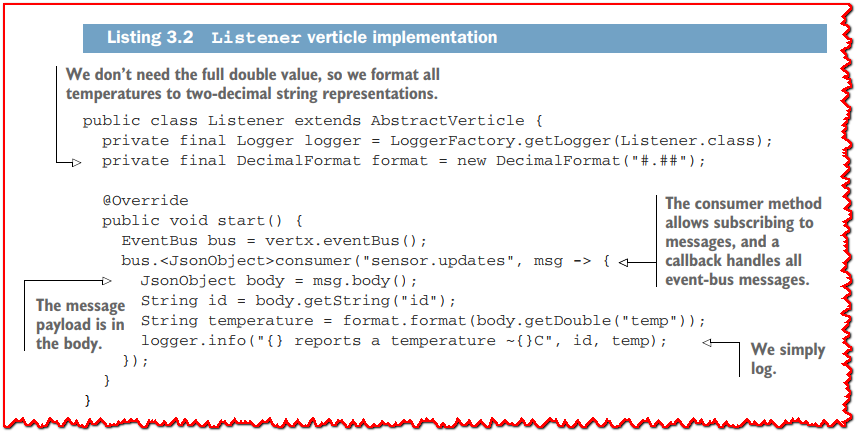

```java
package chapter3;

import io.vertx.core.AbstractVerticle;
import io.vertx.core.eventbus.EventBus;
import io.vertx.core.json.JsonObject;
import org.slf4j.Logger;
import org.slf4j.LoggerFactory;

import java.text.DecimalFormat;

public class Listener extends AbstractVerticle {

  private final Logger logger = LoggerFactory.getLogger(Listener.class);
  private final DecimalFormat format = new DecimalFormat("#.##");              // <1>

  @Override
  public void start() {
    EventBus bus = vertx.eventBus();
    bus.<JsonObject>consumer("sensor.updates", msg -> {                       // <2>
      JsonObject body = msg.body();                                           // <3>
      String id = body.getString("id");
      String temperature = format.format(body.getDouble("temp"));
      logger.info("{} reports a temperature ~{}C", id, temperature);         // <4>
    });
  }
}
```

> <1>: 我们不需要完整的双精度值，所以我们将所有温度格式化为两位数的字符串表示形式。
>
> <2>: 消费者方法允许订阅消息，回调处理所有事件总线消息。
>
> <3>: 消息有效负载在正文中。
>
> <4>: 只是记录日志。

*Listener* verticle 类的目的是记录所有温度测量值，因此它所做的只是监听在 `sensor.updates` 目标上接收到的消息。 由于 *HeatSensor* 类中的发射器使用**发布/订阅**模式，*Listener* 不是唯一可以接收消息的 Verticle。

在此示例中，我们没有利用消息头，但可以将它们用于不属于消息正文的任何元数据。 一个常见的标题是“动作”的标题，以帮助接收者了解消息的内容。 例如，给定一个 **database.operations** 目的地，我们可以使用操作头来指定我们是否打算查询数据库、更新条目、存储新条目或删除以前存储的条目。

现在让我们看看另一个消费温度更新的verticle。

### 3.2.3 传感器数据 verticle

下面的清单显示了 SensorData verticle 的实现。

 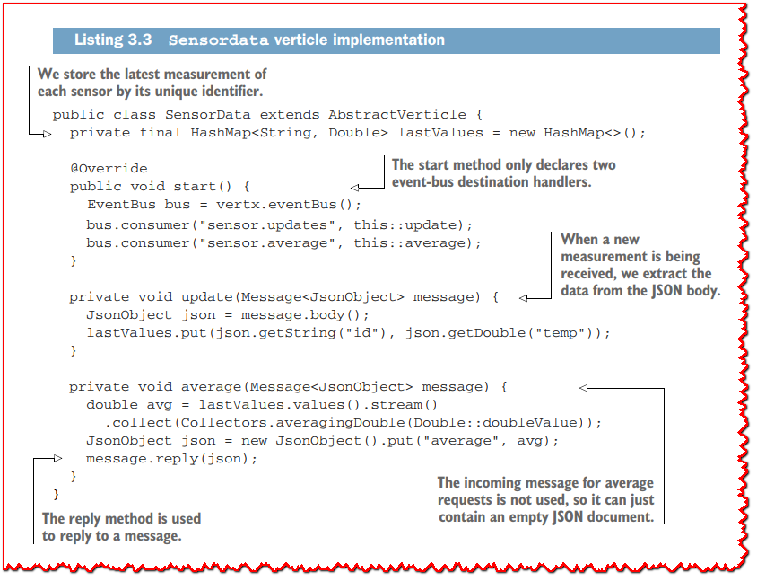

```java
package chapter3;

import io.vertx.core.AbstractVerticle;
import io.vertx.core.eventbus.EventBus;
import io.vertx.core.eventbus.Message;
import io.vertx.core.json.JsonObject;

import java.util.HashMap;
import java.util.stream.Collectors;

public class SensorData extends AbstractVerticle {

  private final HashMap<String, Double> lastValues = new HashMap<>();    // <1>

  @Override
  public void start() {  // <2>
    EventBus bus = vertx.eventBus();
    bus.consumer("sensor.updates", this::update);
    bus.consumer("sensor.average", this::average);
  }

  private void update(Message<JsonObject> message) {  // <3>
    JsonObject json = message.body();
    lastValues.put(json.getString("id"), json.getDouble("temp"));
  }

  private void average(Message<JsonObject> message) {  // <4>
    double avg = lastValues.values().stream()
      .collect(Collectors.averagingDouble(Double::doubleValue));
    JsonObject json = new JsonObject().put("average", avg);
    message.reply(json);  // <5>
  }
}
```

> <1>: 我们通过其唯一标识符存储每个传感器的最新测量值。
>
> <2>: start 方法只声明了两个事件总线目标处理程序。
>
> <3>: 当接收到新的测量值时，我们会从 JSON 正文中提取数据。
>
> <4>: 不使用平均请求的传入消息，因此它可以只包含一个空的 JSON 文档。
>
> <5>: 回复方法用于回复消息。

*SensorData* 类有两个事件总线处理程序：一个用于传感器更新，一个用于平均温度计算请求。 在一种情况下，它更新 *HashMap* 中的条目，而在另一种情况下，它计算平均值并响应消息发送者。

下一个 Verticle 是 HTTP 服务器。

### 3.2.4 HTTP服务器 verticle

HTTP 服务器很有趣，因为它通过事件总线从 *SensorData* verticle 请求温度平均值，并且它实现了`erver-sent events`协议来消费温度更新。

让我们从这个 Verticle 实现的主干开始。

**服务器实现**

以下清单显示了启动 HTTP 服务器和声明请求处理程序的经典示例。

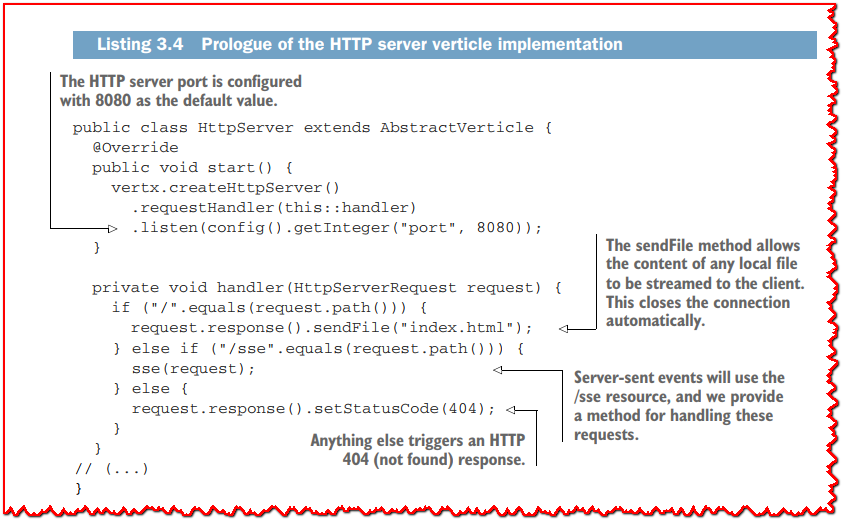

```java
package chapter3;

import io.vertx.core.AbstractVerticle;
import io.vertx.core.TimeoutStream;
import io.vertx.core.eventbus.MessageConsumer;
import io.vertx.core.http.HttpServerRequest;
import io.vertx.core.http.HttpServerResponse;
import io.vertx.core.json.JsonObject;

public class HttpServer extends AbstractVerticle {

  @Override
  public void start() {
    vertx.createHttpServer()
      .requestHandler(this::handler)
      .listen(config().getInteger("port", 8080));  // <1>
  }

  private void handler(HttpServerRequest request) {
    if ("/".equals(request.path())) {
      request.response().sendFile("index.html");  // <2>
    } else if ("/sse".equals(request.path())) {
      sse(request);                               // <3>
    } else {
      request.response().setStatusCode(404);      // <4>
    }
  }

  private void sse(HttpServerRequest request) {
    HttpServerResponse response = request.response();
    response
      .putHeader("Content-Type", "text/event-stream")
      .putHeader("Cache-Control", "no-cache")
      .setChunked(true);

    MessageConsumer<JsonObject> consumer = vertx.eventBus().consumer("sensor.updates");
    consumer.handler(msg -> {
      response.write("event: update\n");
      response.write("data: " + msg.body().encode() + "\n\n");
    });


    TimeoutStream ticks = vertx.periodicStream(1000);
    ticks.handler(id -> {
      vertx.eventBus().<JsonObject>request("sensor.average", "", reply -> {
        if (reply.succeeded()) {
          response.write("event: average\n");
          response.write("data: " + reply.result().body().encode() + "\n\n");
        }
      });
    });

    response.endHandler(v -> {
      consumer.unregister();
      ticks.cancel();
    });
  }
}
```

> <1>: HTTP 服务器端口配置为默认值 8080。
>
> <2>: `sendFile` 方法允许将任何本地文件的内容流式传输到客户端。 这会自动关闭连接。
>
> <3>: `Server-sent events`将使用 `/sse` 资源，我们提供了处理这些请求的方法。
>
> <4>: 其他任何内容都会触发 HTTP 404（未找到）响应。

处理程序处理三种情况：

  - 将 Web 应用程序提供给浏览器
  - 为服务器发送的事件提供资源
  - 响应任何其他资源路径的 404 错误

>  **💡提示:** 根据请求的资源路径和 HTTP 方法手动调度自定义操作是乏味的。 正如您稍后将看到的，*vertx-web* 模块提供了一个更好的 *router* API 以方便地声明处理程序。

**WEB 网页**

现在让我们看看由 HTTP 服务器提供服务的WEB 网页。 Web 应用程序适合以下清单所示的单个 HTML 文档（我删除了不相关的 HTML 部分，例如页眉和页脚）。

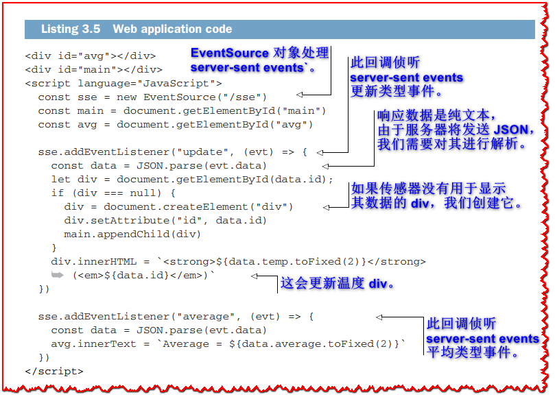

```html
<!DOCTYPE html>
<html lang="en">
<head>
  <meta charset="UTF-8">
  <title>Chapter 3</title>
</head>
<body>
<div id="avg"></div>
<div id="main"></div>

<script language="JavaScript">

  const sse = new EventSource("/sse")                // <1>
  const main = document.getElementById("main")
  const avg = document.getElementById("avg")

  sse.addEventListener("update", (evt) => {         // <2>
    const data = JSON.parse(evt.data)               // <3>
    let div = document.getElementById(data.id);
    if (div === null) {
      div = document.createElement("div")          // <4>
      div.setAttribute("id", data.id)
      main.appendChild(div)
    }
    div.innerHTML = `<strong>${data.temp.toFixed(2)}</strong> (<em>${data.id}</em>)`  // <5>
  })

  sse.addEventListener("average", (evt) => {            // <6>
    const data = JSON.parse(evt.data)
    avg.innerText = `Average = ${data.average.toFixed(2)}`
  })

</script>

</body>
</html>
```

> <1>: EventSource 对象处理`server-sent events`。
>
> <2>: 此回调侦听`server-sent events`更新类型事件。
>
> <3>: 响应数据是纯文本，由于服务器将发送 JSON，我们需要对其进行解析。
>
> <4>: 如果传感器没有用于显示其数据的 div，我们创建它。
>
> <5>: 这会更新温度 div。
>
> <6>: 此回调侦听`server-sent events`平均类型事件。

前面清单中的 JavaScript 代码处理`server-sent events`并做出反应以更新显示的内容。 我们本可以使用许多流行的 JavaScript 框架之一，但有时回归基础是件好事。

>  **🏷注意:** 您可能已经注意到，**清单 3.5** 使用了现代版本的 JavaScript，带有箭头函数、没有分号和字符串模板。 此代码应该可以在任何最近的 Web 浏览器上正常工作。 我使用 Mozilla Firefox 63、Safari 12 和 Google Chrome 70 对其进行了测试。

**支持 SERVER-SENT EVENTS**

现在让我们关注`server-sent events`的工作原理，以及如何使用 Vert.x 轻松实现它们。

**Server-sent events**是服务器将事件推送到其客户端的一种非常简单但有效的协议。 该协议是基于文本的，每个事件都是一个带有事件类型和一些数据的块：

  ```
  event: foo
  data: bar
  ```
每个块事件由一个空行分隔，因此两个连续的事件如下所示：
  ```
  event: foo
  data: abc

  event: bar
  data: 123
  ```
使用 Vert.x 实现**Server-sent events**非常容易。

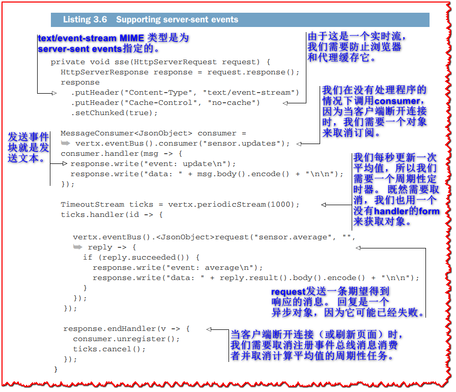

```java
package chapter3;

import io.vertx.core.AbstractVerticle;
import io.vertx.core.TimeoutStream;
import io.vertx.core.eventbus.MessageConsumer;
import io.vertx.core.http.HttpServerRequest;
import io.vertx.core.http.HttpServerResponse;
import io.vertx.core.json.JsonObject;

public class HttpServer extends AbstractVerticle {

  @Override
  public void start() {
    vertx.createHttpServer()
      .requestHandler(this::handler)
      .listen(config().getInteger("port", 8080));  
  }

  private void handler(HttpServerRequest request) {
    if ("/".equals(request.path())) {
      request.response().sendFile("index.html");  
    } else if ("/sse".equals(request.path())) {
      sse(request);                               
    } else {
      request.response().setStatusCode(404);      
    }
  }

  private void sse(HttpServerRequest request) {
    HttpServerResponse response = request.response();
    response
      .putHeader("Content-Type", "text/event-stream")   // <1>
      .putHeader("Cache-Control", "no-cache")           // <2>
      .setChunked(true);

    MessageConsumer<JsonObject> consumer = vertx.eventBus().consumer("sensor.updates");  // <3>
    consumer.handler(msg -> {
      response.write("event: update\n");                         // <4>
      response.write("data: " + msg.body().encode() + "\n\n");
    });


    TimeoutStream ticks = vertx.periodicStream(1000);  // <5>
    ticks.handler(id -> {
      vertx.eventBus().<JsonObject>request("sensor.average", "", reply -> {       // <6>
        if (reply.succeeded()) {
          response.write("event: average\n");
          response.write("data: " + reply.result().body().encode() + "\n\n");
        }
      });
    });

    response.endHandler(v -> {   // <7>
      consumer.unregister();
      ticks.cancel();
    });
  }
}
```

> <1>: *text/event-stream* MIME 类型是为**server-sent events**指定的。
>
> <2>: 由于这是一个实时流，我们需要防止浏览器和代理缓存它。
>
> <3>: 我们在没有处理程序的情况下调用`consumer`，因为当客户端断开连接时，我们需要一个对象来取消订阅。
>
> <4>: 发送事件块就是发送文本。
>
> <5>: 我们每秒更新一次平均值，所以我们需要一个周期性定时器。 既然需要取消，我们也用一个没有handler的form来获取对象。
>
> <6>: `request` 发送一条期望得到响应的消息。 回复是一个异步对象，因为它可能已经失败。
>
> <7>: 当客户端断开连接（或刷新页面）时，我们需要取消注册事件总线消息消费者并取消计算平均值的周期性任务。

**清单 3.6** 提供了 *sse* 方法的实现，该方法处理对 /`sse` 资源的 HTTP 请求。 它为每个温度更新的 HTTP 请求声明一个消费者，并推送新事件。 它还声明了一个定期任务来查询 *SensorData* verticle 并以请求-回复的方式维护平均值。

由于这两个处理程序用于 HTTP 请求，因此我们需要能够在连接丢失时停止它们。 这可能是因为 Web 浏览器选项卡已关闭，或者只是在页面重新加载时发生。 为此，我们获取 **stream** 对象，并为每个对象声明一个处理程序，就像我们对接受回调的表单所做的那样。 您将在下一章看到如何处理流对象，以及它们何时有用。

我们还可以对正在运行的应用程序使用命令行工具（例如 *HTTPie* 或 *curl*）来查看事件流，如下面的清单所示。

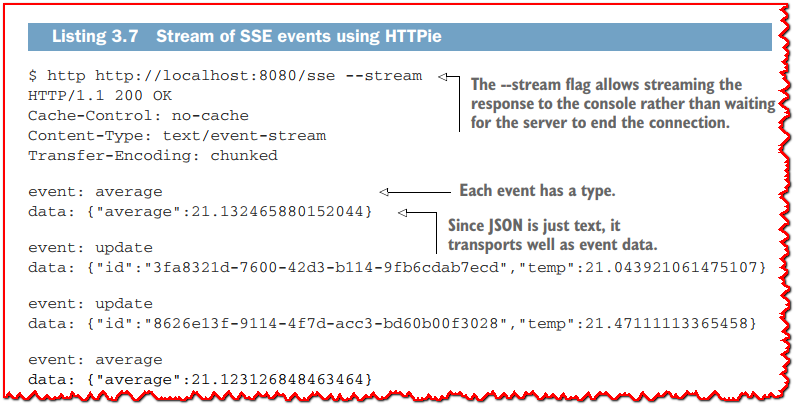

> **☢警告:** 在撰写本文时，所有主要的 Web 浏览器都支持服务器发送的事件，但 Microsoft 的浏览器除外。 有一些 JavaScript polyfill 为微软的浏览器提供了缺失的功能，尽管有一些限制。

### 3.2.5 启动应用程序

现在我们已经准备好了所有的 Verticle，我们可以将它们组装成一个 Vert.x 应用程序。 下面的清单显示了一个用于引导应用程序的主类。 它部署了四个传感器verticle和一个其他verticle的实例。

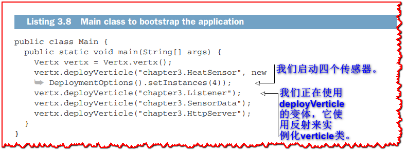

```java
package chapter3.cluster;

import io.vertx.core.AbstractVerticle;
import io.vertx.core.DeploymentOptions;
import io.vertx.core.Vertx;
import io.vertx.core.VertxOptions;
import io.vertx.core.json.JsonObject;
import org.slf4j.Logger;
import org.slf4j.LoggerFactory;

public class SecondInstance {

  private static final Logger logger = LoggerFactory.getLogger(SecondInstance.class);

  public static void main(String[] args) {
    Vertx.clusteredVertx(new VertxOptions(), ar -> {
      if (ar.succeeded()) {
        logger.info("Second instance has been started");
        Vertx vertx = ar.result();
        vertx.deployVerticle("chapter3.HeatSensor", new DeploymentOptions().setInstances(4));  // <1>
        vertx.deployVerticle("chapter3.Listener");                                             // <2>
        vertx.deployVerticle("chapter3.SensorData");
        JsonObject conf = new JsonObject().put("port", 8081);
        vertx.deployVerticle("chapter3.HttpServer", new DeploymentOptions().setConfig(conf));
      } else {
        logger.error("Could not start", ar.cause());
      }
    });
  }
}
```

> <1>: 我们启动四个传感器。
>
> <2>: 我们正在使用 `deployVerticle` 的变体，它们使用反射来实例化 Verticle 类。

运行这个类的 main 方法可以让我们通过网络浏览器连接到 http://localhost:8080/。 当你这样做时，你应该会看到一个类似于**图 3.4** 的图形界面，并具有持续的实时更新。 控制台日志还将显示温度更新。

## 3.3 集群和分布式事件总线

到目前为止，我们对事件总线的使用一直是 *本地*：所有通信都发生在同一个 JVM 进程中。 更有趣的是使用 Vert.x *集群* 并从 *分布式* 事件总线中受益。

### 3.3.1 Vert.x 中的集群

Vert.x 应用程序可以在集群模式下运行，其中一组 Vert.x 应用程序节点可以通过网络协同工作。 它们可能是同一应用程序的节点实例并具有相同的一组已部署的 Verticle，但这不是必需的。 一些节点可以有一组verticles，而另一些则有不同的一组verticles。

**图 3.6** 显示了 Vert.x 集群的概述。 *集群管理器*确保节点可以通过事件总线交换消息，启用以下功能集：

  - 组成员资格和发现允许发现新节点、维护当前节点列表以及检测节点何时消失。
  - 共享数据允许在集群范围内维护映射和计数器，以便所有节点共享相同的值。 分布式锁对于节点之间的某些协调形式很有用。
  - 订阅者拓扑允许了解每个节点感兴趣的事件总线目的地。这对于通过分布式事件总线有效地调度消息很有用。 如果一个节点在目的地 *a.b.c* 上没有消费者，则从该目的地向该节点发送事件是没有意义的。

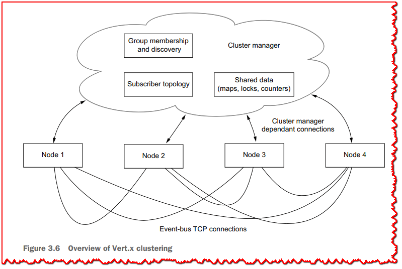

Vert.x 有几个基于 Hazelcast、Infinispan、Apache Ignite 和 Apache ZooKeeper 的集群管理器实现。 从历史上看，Hazelcast 是 Vert.x 的集群管理器，然后添加了其他引擎。 它们都支持相同的 Vert.x 集群抽象，用于成员资格、共享数据和事件总线消息传递。 它们在功能上都是等效的，因此您必须根据自己的需要和限制选择一个。 如果您不知道该选择哪一个，我建议您使用 Hazelcast，这是一个很好的默认设置。

最后，如**图 3.6** 所示，节点之间的事件总线通信通过使用自定义协议的直接 TCP 连接发生。 当节点向目标发送消息时，它会使用集群管理器检查订阅者拓扑并将消息分派给具有该目标订阅者的节点。

**您应该使用什么集群管理器？**  

对于您应该使用哪个集群管理器这个问题没有很好的答案。 这取决于您是否需要与一个库进行特殊集成，以及您需要部署哪种类型的环境。 例如，如果您需要在代码中使用 Infinispan API，而不仅仅是将 Infinispan 作为 Vert.x 的集群管理器引擎，您应该使用 Infinispan 来满足这两种需求。

您还应该考虑您的部署环境。 如果您部署到某个使用 Apache ZooKeeper 的环境，那么将它也用于 Vert.x 集群管理器可能是一个不错的选择。

默认情况下，一些集群管理器使用多播通信进行节点发现，这可能在某些网络上被禁用，尤其是在 Kubernetes 等容器化环境中发现的网络。 在这种情况下，您需要配置集群管理器以在这些环境中工作。

如前所述，如有疑问，请选择 Hazelcast，并查看项目文档以了解特定的网络配置，例如部署到 Kubernetes 时。 您以后可以随时更改为另一个集群管理器实现。

### 3.3.2 从事件总线到分布式事件总线

让我们回到本章前面开发的热传感器应用程序。 迁移到分布式事件总线对于 Verticle 来说是透明的。

我们将准备两个具有不同 Verticle 部署的主要类，如**图 3.7** 所示：
  - 四个 *Heat Sensor* 实例和一个 *Http Server* 实例在端口 8080 上
  - 4 个 *HeatSensor* 实例、1 个 *Listener* 实例、1 个 *SensorData* 实例和 1 个 *HttpServer* 实例在端口 8081 上（因此您可以在同一主机上运行和测试它）

目标是表明，通过在集群模式下启动每个部署的一个实例，verticles 的通信就像它们在同一个 JVM 进程中运行一样。 使用 Web 浏览器连接到任一实例将提供八个传感器数据的相同视图。 同样，第二个实例上的 *Listener* verticle 将从第一个实例获取温度更新。

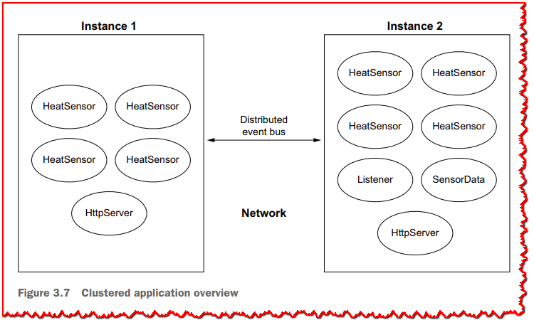

我们将使用 Infinispan 作为集群管理器，但您同样可以使用另一个。 假设您的项目是使用 Gradle 构建的，您需要添加 vertx-infinispan 作为依赖项：

```groovy
implementation("io.vertx:vertx-infinispan:version")
```

下面的清单显示了主类 *FirstInstance* 的实现，我们可以使用它来启动一个不部署所有应用程序 Verticle 的节点。

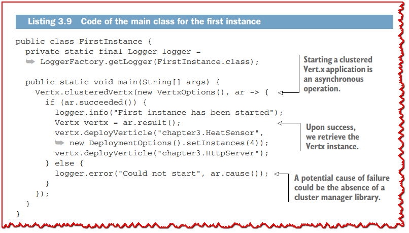

```
package chapter3.cluster;

import io.vertx.core.DeploymentOptions;
import io.vertx.core.Vertx;
import io.vertx.core.VertxOptions;
import org.slf4j.Logger;
import org.slf4j.LoggerFactory;

public class FirstInstance {

  private static final Logger logger = LoggerFactory.getLogger(FirstInstance.class);

  public static void main(String[] args) {              // <1>
    Vertx.clusteredVertx(new VertxOptions(), ar -> {
      if (ar.succeeded()) {
        logger.info("First instance has been started");
        Vertx vertx = ar.result();                      // <2>
        vertx.deployVerticle("chapter3.HeatSensor", new DeploymentOptions().setInstances(4));
        vertx.deployVerticle("chapter3.HttpServer");
      } else {
        logger.error("Could not start", ar.cause());   // <3>
      }
    });
  }
}
```

> <1>: 启动集群 Vert.x 应用程序是一个异步操作。
>
> <2>: 成功后，我们获取 Vertx 实例。
>
> <3>: 失败的潜在原因可能是缺少集群管理器库。

如您所见，以集群模式启动应用程序需要调用 `clusteredVertx` 方法。 剩下的只是经典的verticle部署。

第二个实例的 main 方法的代码非常相似，如下面的清单所示。

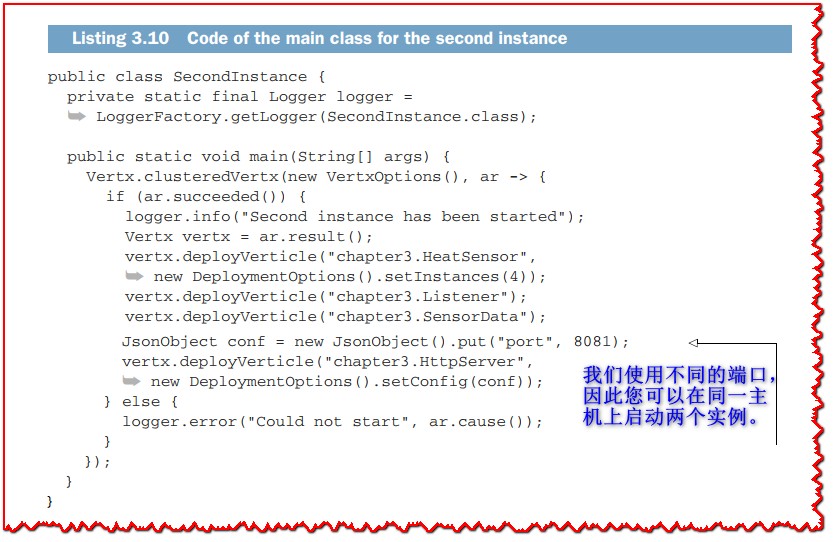

```java
package chapter3.cluster;

import io.vertx.core.AbstractVerticle;
import io.vertx.core.DeploymentOptions;
import io.vertx.core.Vertx;
import io.vertx.core.VertxOptions;
import io.vertx.core.json.JsonObject;
import org.slf4j.Logger;
import org.slf4j.LoggerFactory;

public class SecondInstance {

  private static final Logger logger = LoggerFactory.getLogger(SecondInstance.class);

  public static void main(String[] args) {
    Vertx.clusteredVertx(new VertxOptions(), ar -> {
      if (ar.succeeded()) {
        logger.info("Second instance has been started");
        Vertx vertx = ar.result();
        vertx.deployVerticle("chapter3.HeatSensor", new DeploymentOptions().setInstances(4));
        vertx.deployVerticle("chapter3.Listener");
        vertx.deployVerticle("chapter3.SensorData");
        JsonObject conf = new JsonObject().put("port", 8081);                                   // <1>
        vertx.deployVerticle("chapter3.HttpServer", new DeploymentOptions().setConfig(conf));
      } else {
        logger.error("Could not start", ar.cause());
      }
    });
  }
}
```

> <1>: 我们使用不同的端口，因此您可以在同一主机上启动两个实例。

两个主类都可以在同一台主机上运行，两个实例会相互发现。 和以前一样，您可以从 IDE 启动它们，或者在两个不同的终端中运行 `gradle run -PmainClass=chapter3.cluster.FirstInstance` 和 `gradle run -PmainClass=chapter3.cluster.SecondInstance`。

>  **💡提示:** 如果您使用 IPv6 并遇到问题，可以将 `-Djava.net.preferIPv4Stack=true` 标志添加到 JVM 参数。

默认情况下，Vert.x Infinispan 集群管理器配置为使用网络广播执行发现，因此两个实例在同一台机器上运行时会相互发现。 您还可以在同一网络上使用两台机器。

> **☢警告:** 网络广播很少在云环境和许多数据中心中工作。 在这些情况下，集群管理器需要配置为使用其他发现和组成员协议。 对于 Infinispan，文档在 https://infinispan.org/documentation/ 上有具体的详细信息。

**图 3.8** 显示了应用程序运行，其中一个浏览器连接到端口 8080 的实例，另一个浏览器连接到端口 8081 的第二个实例，我们在后台看到来自 *Listener* verticle 的日志。 如您所见，两个实例都显示来自八个传感器的事件，第一个实例的平均温度已更新，因此它可以与第二个实例上的 *SensorData* verticle 交互。

分布式事件总线是一个有趣的工具，因为它对verticles是透明的。

>  **💡提示:** 事件总线 API 具有 `localConsumer` 方法，用于声明消息处理程序，这些处理程序仅在使用集群运行时在本地工作。 例如，目的地 `a.b.c` 的消费者将不会接收从集群中的另一个实例发送到该目的地的消息。

下一章讨论异步数据和事件流。

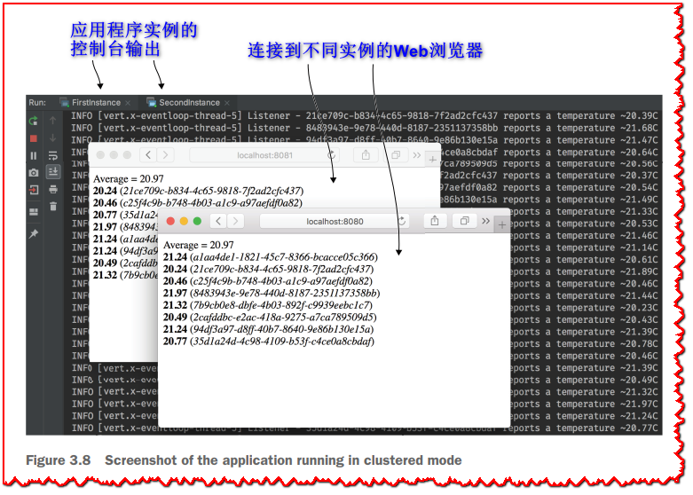

## 总结
  - 事件总线是 Verticle 通信的首选方式，它使用异步消息传递。
  - 事件总线实现发布/订阅（一对多）和点对点（多对一）通信。
  - 虽然它看起来像一个传统的消息代理，但事件总线不提供持久性保证，因此它只能用于瞬态数据。
  - 集群允许联网实例以透明的方式通过分布式事件总线进行通信，并跨多个应用程序实例扩展工作负载。

