# 第五章: 超越回调

> 翻译: 白石(https://github.com/wjw465150/Vert.x-in-Action-ChineseVersion)

**本章涵盖了**

  - 回调及其限制，如网关/边缘服务示例所示
  - Futures 和 Promise - 链接异步操作的简单模型
  - 反应式扩展 - 一种更强大的模型，特别适合组合异步事件流
  - Kotlin 协程 - 对异步代码执行流程的语言级支持

在开发响应式应用程序时，您将需要编写各种各样的业务逻辑，并不是所有的逻辑都很容易用异步形式表示。虽然回调是异步事件通知的一种简单形式，但它们很容易使异步代码变得复杂。

让我们看一个真实的例子，说明为什么回调并不总是最好的异步编程模型。 然后我们将探索 Vert.x 支持的多个选项。

## 5.1 组合异步操作：边缘服务示例

我们将以一个“边缘服务”为例来说明如何使用不同的异步编程模型组合异步操作。

边缘服务也经常被称为 **API 网关**。 它是一种服务，作为其他服务的外观，因此请求者只需处理一个服务接口，而不必与每个服务进行对话。 边缘服务还可以执行其他任务，例如数据转换和与其他服务交互，因此它不仅仅是方便地聚合来自多个服务的数据。

### 5.1.1 场景

让我们回到我们在第 3 章中使用的热传感器 Verticle。假设我们有几个热传感器，并且我们想要公开一个 API 来获取和聚合所有传感器的热数据。 这是一个非常简单但有效的边缘服务示例，因为它抽象了请求者了解和联系所有传感器的需求。 为了让事情变得更有趣，我们还将有一个 *snapshot* 服务，在传感器值返回给请求者之前捕获并记录它们。 整个场景如**图 5.1** 所示。

请求者向边缘服务发出请求，边缘服务又从传感器服务中获取温度数据。 每个传感器都公开一个 HTTP/JSON API，边缘服务将所有响应聚合在一个更大的 JSON 文档中。

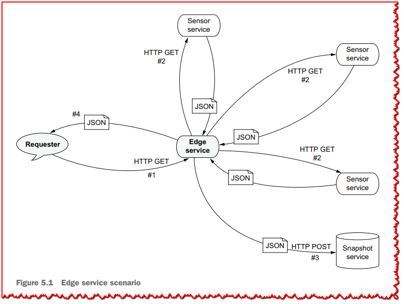

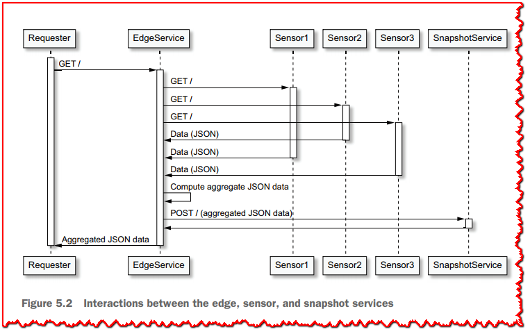

然后将该文档发送到快照服务，然后再发送回请求者。 交互过程总结在 **图5.2** 中。

这个例子允许我们推理并行和顺序操作：
  - 并行异步操作：获取热传感器数据
  - 顺序异步操作：聚合热传感器数据，发送到快照服务，然后返回给请求者

### 5.1.2 热传感器verticles

我们可以将我们的热传感器部署为多个独立的进程，每个进程都公开一个 HTTP API。 为了简化我们的示例，我们将在同一进程中部署它们，尽管 HTTP 服务器侦听不同的 TCP 端口。

下面的 *HeatSensor* 类是对我们之前使用的类的简单改编。 **清单 5.1** 显示了该类的前面一些代码，直接从第 3 章中的代码移植而来。

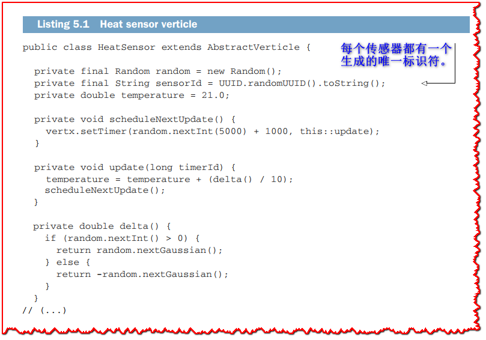

代码保持相同的随机更新温度逻辑，随机延迟在 1 到 6 秒之间。

以下清单显示了为公开 HTTP API 而添加的代码。


这是对 Vert.x HTTP 服务器的非常直接的使用，HTTP 端口通过配置传递。 响应以 JSON 编码。

### 5.1.3 快照服务verticle

快照服务也公开了一个 HTTP 服务器，如下面的清单所示。


HTTP 请求处理程序需要一个 HTTP *POST* 请求，使用主体处理程序提取主体，并记录接收到的数据。

定义了这两个 Verticle，现在可以开始有趣的事情了，我们可以考虑制作我们的边缘服务。

## 5.2 回调

我们将首先使用回调来实现边缘服务，就像我们从本书开始以来一直在做的那样。

我们项目所需的依赖项是 *Vert.x Core*、*Vert.x Web Client*（用于简化 HTTP 请求）和 *Logback*。 以下清单显示了 Gradle 构建的依赖项。 使用 Maven 或任何其他兼容的构建工具时，工件完全相同。

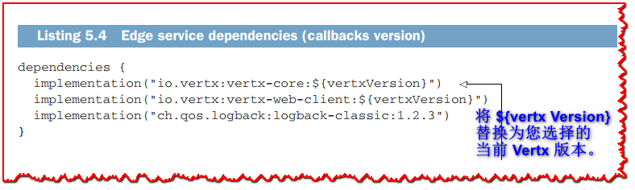

>  **🏷注意:** 除了 *chapter5.future.CollectorService* 之外的所有类都在 Vert.x 3.9 上编译。 此类需要较新的基于 Vert.x 4 future的 API，如第 5.3.2 节中关于 Vert.x futures 和 promises 的部分所述。

### 5.2.1 实现

我们将从 *CollectorService* verticle 类实现的序言开始。


*start* 方法首先创建一个 *WebClient* 实例，然后在端口 8080 上启动一个 HTTP 服务器。Web 客户端类来自 *vertx-web-client* 模块，与 Vert.x 核心 API。 它特别简化了 HTTP 正文处理和转换：您可以将正文转换为纯文本、JSON 或通用的 Vert.x 缓冲区。

HTTP 请求处理程序是以下清单中显示的 **handleRequest** 方法。


此方法显示使用 Web 客户端 API 执行 HTTP 请求是多么容易。 主要困难在于协调并行 HTTP 请求。 我们需要一个循环来发出请求，并且由于它们是异步的，我们还需要跟踪接收到的响应数量和响应值。 这是通过拥有一个响应列表并使用一个计数器进行响应来完成的。 请注意，我们在这里使用 *AtomicInteger* 不是因为并发性，而是因为我们需要一个对象来从回调中增加一个整数。

收到所有响应后，我们可以进行下一个操作，即将数据发送到快照服务。


此方法实现仅使用 Web 客户端发出 HTTP **POST** 请求。

成功后，代码将移至 *sendResponse* 方法以结束 HTTP 请求，如下所示。

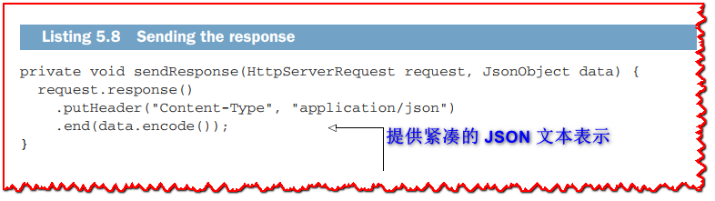

### 5.2.2 运行

要运行边缘服务，我们首先需要部署 Verticle，如下面的清单所示。

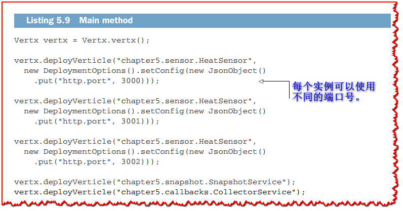

我们可以发出 HTTP 请求以使用 `HTTPie` 测试服务，如下所示。

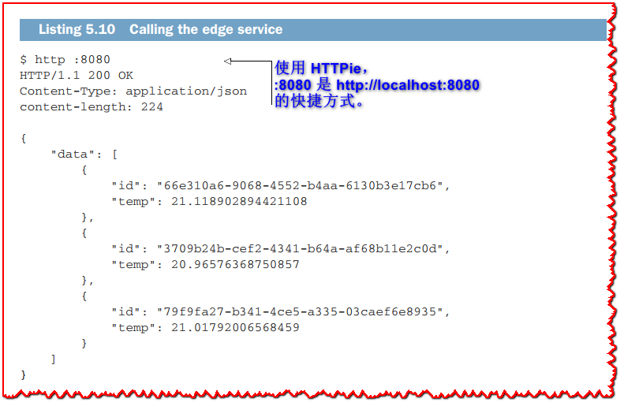

在服务器端，我们可以检查快照服务是否输出了一些日志，如下面的清单所示。

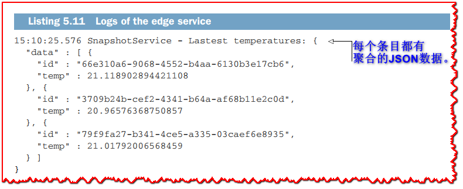

### 5.2.3 “回调地狱”不是问题所在

很多人会尖叫“回调地狱！” 在讨论回调时。 回调地狱是当嵌套回调被用于链接异步操作时，由于深度嵌套导致代码更难理解。 对于嵌套回调，错误处理尤其困难。

虽然这是真的，但是对于每个异步操作回调使用一种方法可以轻松缓解回调地狱，就像我们对 *handleRequest*、*sendToSnapshot* 和 *sendResponse* 方法所做的那样。 每个方法只做一件事，我们避免嵌套回调。

下面的清单显示了与前面相同的代码，但压缩为带有嵌套回调的单个片段。

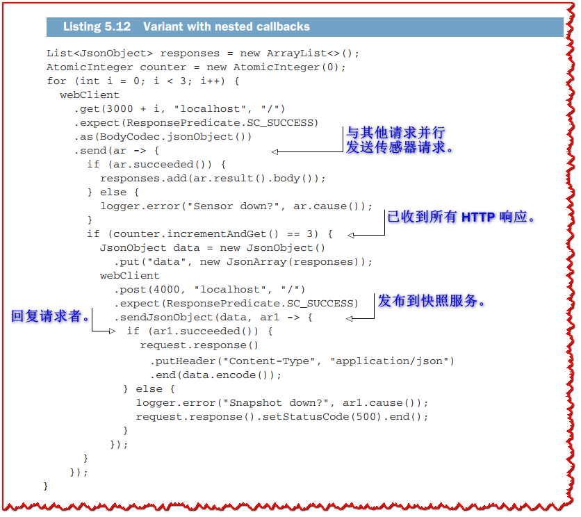

嵌套回调当然不会使代码更具可读性，但我认为真正的问题在于**功能代码**与**异步协调代码**纠缠在一起的事实。 您需要从循环、回调和分支中解读出三个 HTTP 请求是并行发出的，并且它们的结果正在组合、发送到第三方服务，然后作为响应返回。

回调并不完美，但是一些规则可以保持代码的可读性，特别是当您所拥有的只是异步操作的顺序组合时，比如*sendToSnapshot*将工作传递给*sendResponse*。

现在让我们看看其他比回调更有趣的异步编程模型。

## 5.3 Futures 和 promises

由于 Verticle *start* 方法的签名，您已经接触过 Vert.x *futures* 和 *promises*。 你可能也接触过其他语言，比如 JavaScript。 我们将进一步探索这个模型，看看它们是如何用 Vert.x 组合异步操作的有趣原语。

Vert.x 实现了与 Barbara Liskov 和 Liuba Shrira 的原始研究结果一致的 *Future* 和 *Promise* 模型。他们引入了 *Promise* 作为组合异步远程过程调用的语言抽象。

promise保存了一些现在还没有值的计算的值。承诺最终会带着一个结果值或一个错误完成。在异步I/O上下文中，promise自然适合保存异步操作的结果。反过来，future允许您读取最终将从promise中获得的值。

>  **⚠重要:**  总结一下：promise 用于写入最终值，future 用于在可用时读取它。 现在让我们看看它在 Vert.x 中是如何工作的。

### 5.3.1 Vert.x 中的 Futures 和 promises

Promise 是由一段即将执行异步操作的代码创建的。 例如，假设您要报告异步操作已完成，不是现在，而是在 5 秒内。 在 Vert.x 中，您将为此使用计时器，并使用 promise 来保存结果，如下面的清单所示。


这里的异步操作是一个五秒的定时器，之后promise就完成了。 根据当前时间是奇数还是偶数，promise 以一个值完成或因异常而失败。 这很好，但我们如何真正从 Promise 中*get*值？

想要在结果可用时做出反应的代码需要一个future对象。一个Vertx future是从一个promise创建的，然后传递给想要读取该值的代码，如下一个清单所示，即 **清单5.13** 的其余部分。

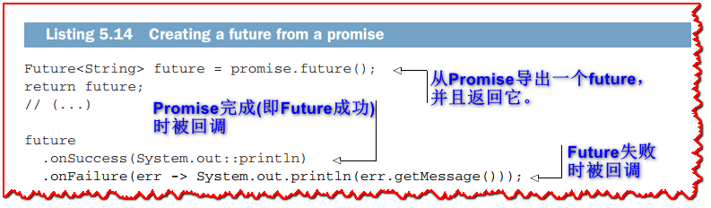

*Future* 接口定义了两种方法，`onSuccess` 和 `onFailure`，用于处理值和错误。 当我们运行相应的代码时，我们会看到“Ok！” 或“Bad lucky...”在5秒后打印。

我们可以使用Future执行更高级的异步操作，如下面的清单所示。


当 promise 失败时调用 `recover` 操作，它用于将错误替换为另一个值。 您可以将 `recover` 视为 Java 中的 `catch` 块的等价物，您可以在其中处理错误。 这里，我们只是使用一个成功的future提供一个恢复值，但是在更高级的情况下，当您无法进行恢复时，您也可以使用一个失败的future。

map 操作使用函数转换值，而 `flatMap` 与另一个异步操作组合。 您可以将`flatMap` 视为“然后(and then)”。 此处操作获取字符串值并在3秒后将“>>>”添加到其前面。 我们还看到了典型的 Promise/Future 模式，我们首先创建一个 Promise，然后执行一个最终完成 Promise 的异步操作，最后返回一个 Future，这样该值就可以被另一段代码使用。

### 5.3.2 Vert.x 4 中基于Future的 API

Vert.x 4 将 Future与回调一起引入核心 API。 虽然回调仍然是规范模型，但大多数 API 都可以使用返回Future的变体。

这意味着给定一个方法，`void doThis(Handler<AsyncResult<T>>)`，有一个形式为`Future<T> doThis()`的变体。 下面的清单显示了一个很好的示例，我们在其中启动了一个 HTTP 服务器。


我们在前面的例子中看到的 listen 方法接受一个回调接口`Handler<AsyncResult<HttpServer>>`，但是在这里它返回一个 `Future<HttpServer>`。 然后，我们可以链接调用 `onFailure` 和 `onSuccess` 来定义服务器启动或发生错误时要做什么。

>  **🏷注意:** 您可以从 Vert.x 3.8 开始使用新的 Promise/Future 接口，但基于Future的 API 仅在 Vert.x 4 中可用。

### 5.3.3 与 CompletionStage API 的互操作性

Vert.x futures 还可以与 JDK 中的 `java.util.concurrent` 包的 *CompletionStage* 接口互操作。 *CompletionStage* 接口代表异步操作中的一个步骤，因此您可以将其视为future，尤其是当有一个名为 *CompletableFuture* 的类实现了 *CompletionStage* 时。 例如，**Java 11** 中的 HTTP 客户端 API 提供了 `sendAsync` 方法，这些方法返回 *CompletableFuture* 来发出异步 HTTP 请求。

当您需要与在 API 中使用*CompletionStage*的库进行交互时，Vert.x 的*Future*和*CompletionStage*之间的互操作性非常有用。

>  **🏷注意:** Vert.x `Future` 接口不是 `CompletionStage` 的子类型。 Vert.x 团队在为 Vert.x 4 准备路线图时考虑了这一点，但我们最终选择了我们自己的接口定义，因为`CompletionStage`与线程模型无关。实际上，以“**async**”为后缀的方法提供了变体，您可以在其中传递执行器，例如 `CompletionStage<Void> thenRunAsync(Runnable,Executor)`，而没有执行器参数的变体默认分派到 `ForkJoinPool` 实例。这些方法可以很容易地跳出 Vert.x 事件循环或工作线程池，因此我们选择提供互操作性，而不是直接在 Vert.x API 中使用 `CompletionStage`。

以下清单显示了我们如何从 Vert.x Future 迁移到 *CompletionStage*。


这里我们将字符串结果转换为大写，在它前面加上一个字符串，最终调用了*whenComplete*。 请注意，这是一个 *BiConsumer*，需要测试哪些值或异常参数为 *null*，才能知道 promise 是否成功完成。 同样重要的是要注意，除非您调用异步的 *CompletionStage* 方法，否则调用将在 Vert.x 线程上执行。

最后但同样重要的是，您也可以将 *CompletionStage* 转换为 Vert.x 的 *Future*，如下所示。


*CompletableFuture* 实现了 *CompletionStage*接口，而 *supplyAsync* 调度了对默认 *ForkJoinPool* 的调用。 将使用该线程池中的一个线程，在返回一个字符串之前休眠5秒钟，该字符串将是 *CompletableFuture* 结果。*fromCompletionStage* 方法转换为 Vert.x *Future*。 该方法有两种变体：一种具有 Vert.x 上下文，用于在上下文上调用 *Future* 方法，如*onSuccess*，另一种调用将发生在完成提供的*CompletionStage* 实例的任何线程上。

### 5.3.4 Vert.x Future的收集器服务

回到边缘服务示例，我们可以利用使用 Future 的 Vert.x API。 我们将使用**清单 5.16** 中较早的 verticle `start` 方法。

首先，我们可以在下面的清单中定义 *fetchTemperature* 方法来从服务中获取温度。


该方法返回一个值是JsonObject的future对象，为了实现这一点，我们使用`WebClient HttpRequest send`方法返回future，然后映射结果以仅提取JSON数据。

在接下来显示的 *handleRequest* 方法中收集温度。

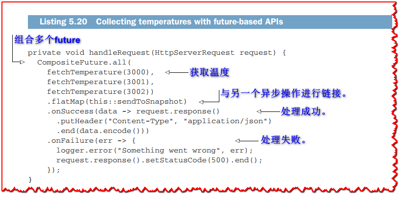

你可以使用*CompositeFuture*将多个future组合成一个。`all`静态方法的结果是，当所有的future完成时，该future会完成，当任何future失败时，该future会失败。还有具有不同语义的`any`和`join`方法。

一旦成功接收到所有温度，对`flatMap`的调用将数据发送到快照服务，这是一个异步操作。 *sendToSnapshot* 方法的代码显示在以下清单中。


这段代码与 *fetchTemperature* 的代码类似，因为我们使用 *WebClient* 的方法返回 *Future*。 部署 Verticle 的 main 方法的代码与回调变体中的代码相同，只是我们部署了一个不同的 *CollectorService* verticle：

```java
// (...)
vertx.deployVerticle("chapter5.future.CollectorService");
```

现在让我们继续讨论响应式扩展，这是另一种异步编程模型。

## 5.4 反应式扩展

反应式扩展是**observable(可观察)**设计模式的一种详细形式。 它们首先由 Erik Meijer 在 *Microsoft .NET* 生态系统中推广。 现代应用程序越来越多地由异步事件流组成，不仅在服务器上，而且在 Web、桌面和移动客户端中。 实际上，我们可以将图形用户界面事件视为应用程序必须响应的事件流。

反应式扩展由三个方面定义：
  - 观察事件或数据流（例如，可以观察传入的 HTTP 请求）
  - 组合运算符来转换流（例如，将多个 HTTP 请求流合并为一个）
  - 订阅流并对事件和错误做出响应

*ReactiveX* 计划为后端和前端项目（http://reactivex.io/）提供了多种语言的通用 API 和实现。 RxJS 项目为浏览器中的 JavaScript 应用程序提供响应式扩展，而像 RxJava 这样的项目为 Java 生态系统提供通用的响应式扩展实现。

Vert.x 为 RxJava 版本 1 和 2 提供绑定。建议使用版本 2，因为它支持背压，而版本 1 不支持。

### 5.4.1 简单说说RxJava

让我们探索一下 RxJava 的基础知识，看看它做了什么以及它如何与 Vert.x 完美集成

>  **💡提示:** Timo Tuominen 的 **RxJava for Android Developers**（Manning，2019 年）是学习 RxJava 的可靠资源。

**可观察的类型**

首先，RxJava 2 提供了五种不同类型的可观察源，如 **表 5.1** 所示。

**表 5.1 RxJava 中的 Observable 类型**

| **类型**        | **描述**                              | **例子**                                              |
| --------------- | ------------------------------------- | ----------------------------------------------------- |
| `Observable<T>` | T 类型的事件流。不支持背压。          | 定时器事件，我们无法像 GUI 事件那样应用背压的可观察源 |
| `Flowable<T>`   | 可以应用背压的 T 型事件流             | 网络数据、文件系统输入                                |
| `Single<T>`     | 只发出一个 T 类型事件的源             | 通过键从数据存储中获取条目                            |
| `Maybe<T>`      | 可以发出一个 T 类型事件的源，或者没有 | 通过键从数据存储中获取条目，但该键可能不存在          |
| `Completable`   | 通知某些操作已完成但未给出任何值的源  | 删除文件                                              |

您有时可能会阅读有关 *hot* 和 *cold* 来源的信息。 热源是无论是否有订阅者，都会发出事件的源。 冷源是在第一次订阅后才开始发出事件的源。 周期性计时器是热源，而要读取的文件是冷源。 使用冷源，您可以获得所有事件，但使用热源，您只能在订阅后获得那些发出的事件。

**基本示例**

我们将从**清单 5.22** 中的简单示例开始，如**图 5.3** 所示。


运行**清单5.22** 中的代码会得到如下控制台输出:

```
@1
@2
@3
```

这个例子创建了一个由三个整数组成的 observable。 *just* 工厂方法创建一个 `Observable<Integer>` 源。 然后我们使用两个映射运算符来转换流。 第一个从 `Observable<Integer>` 转换为 `Observable<String>`。 第二个将 `@` 字符添加到每个项目。 最后，*subscribe* 执行订阅，其中为每个项目调用 *System.out.println*。

源可能会发出错误，在这种情况下可以通知订阅者。 考虑以下清单中的 observable。

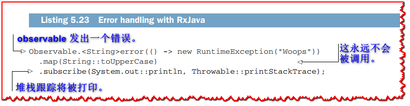

可观察的字符串值将发出一个错误。 map 运算符永远不会被调用，因为它只对值进行操作，而不是对错误进行操作。 我们可以看到 *subscribe* 现在有两个参数； 第二个是处理错误的回调。 在这个例子中，我们只打印堆栈跟踪，但在网络应用程序中，例如，我们会进行错误恢复。

>  **🏷注意:** 在示例和测试中使用 *just* 工厂方法非常有用，但在实际场景中，您需要调整更复杂的源以将事件生成到 RxJava 可观察类型。 为此，您可以实现一个通用的 *Publisher* 接口，以使用 *fromPublisher* 方法（而不是 *just*）向订阅者发送项目。 还有用于 JDK futures、可迭代iterable对象以及从 JDK 可调用对象生成项目的适配器方法。

**生命周期**

前面的例子没有展示 observable 的完整生命周期。 一旦进行了订阅，就会发出零个或多个项目。 然后流以错误或已完成的通知终止。

让我们看一个更详细的例子。

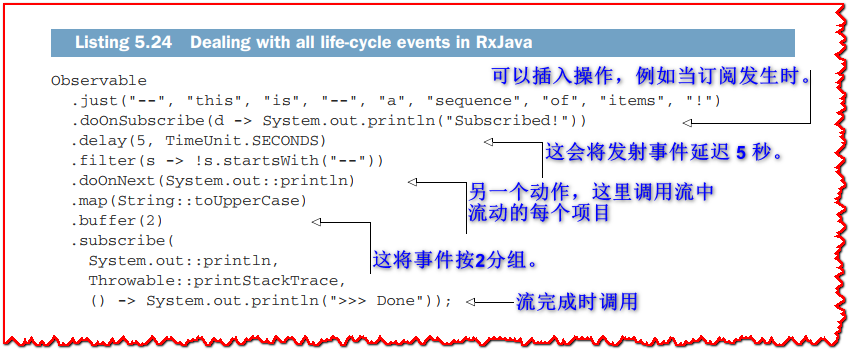

Running the preceding code gives the following output.

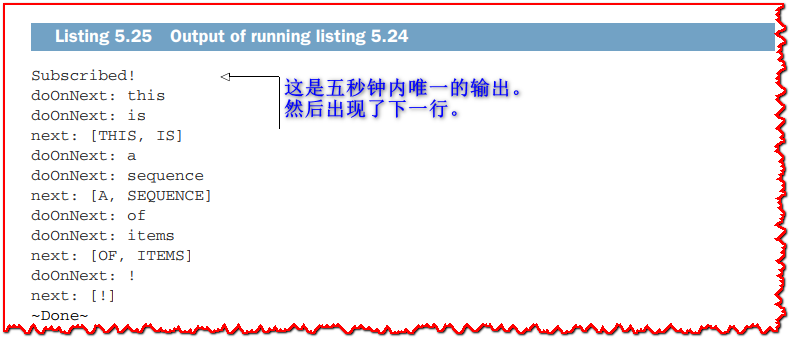

此示例向我们展示了 *subscribe* 的形式，其中可以处理所有事件：事件、错误和流的完成。 该示例还显示了更多运算符：
  - *doOnSubscribe* 和 *doOnNext* 是可以在项目沿流传递时触发的操作（具有潜在的副作用）。
  - *delay* 允许在事件开始在流的下游发出时进行延迟。
  - *buffer* 将事件分组（到列表中），所以在这里我们成对地获取事件。

当然，RxJava 的内容比我们在本节中讨论的要多，但我们已经涵盖了足够多的内容来深入研究 Vert.x 和 RxJava 的集成。

### 5.4.2 RxJava 和 Vert.x

Vert.x 中的 RxJava 集成可从 *vertx-rx-java2* 模块获得。 在 Gradle 中（在 Maven 中也是如此），可以将依赖项添加为

```groovy
implementation("io.vertx:vertx-rx-java2:version")
```

官方 Vert.x 堆栈中项目的所有 API 都支持 RxJava。 RxJava API 是从核心 API 自动生成的。 RxJava API 有几个惯用的转换规则，但作为一个简单的例子，当你有

```java
void foo(String s, Handler<AsyncResult<String>> callback)
```

RxJava 的翻译是

```java
Single<String> foo(String s)
```

RxJava API 位于 *io.vertx.reactivex* 的子包中。 例如，*AbstractVerticle* 的 RxJava 版本是 *io.vertx.reactivex.core.AbstractVerticle*。

让我们看一个使用 RxJava API 的示例 Verticle。

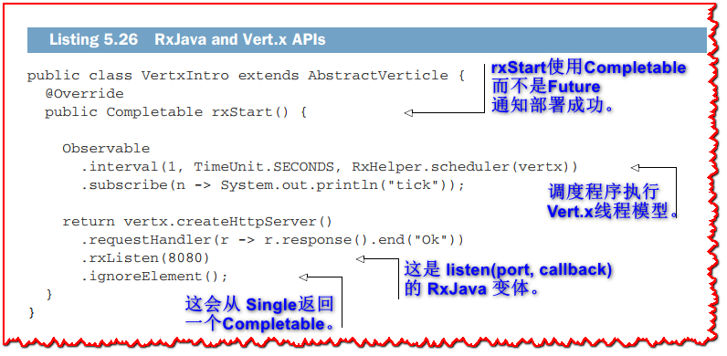

这个例子打开了一个经典的 HTTP 服务器，它对任何请求都回复 *Ok*。 有趣的部分是*AbstractVerticle* 的RxJava 变体有一个*rxStart*（和*rxStop*）方法来通知部署成功。 在我们的例子中，当 HTTP 服务器启动时，verticle 已经成功部署，所以我们返回一个 *Completable* 对象。 您可以检查以 *rx* 为前缀的方法是否对应于生成的支持 RxJava 的方法。 如果您检查 RxJava API，您会注意到原始方法（包括回调）仍然存在。

这个例子的另一个有趣的部分是每秒发出事件的 observable。 它的行为本质上与 Vert.x 计时器一样。 RxJava API 中有几个接受调度器对象的操作符方法，因为它们需要延迟异步任务。 默认情况下，他们从他们管理的内部工作线程池中回调，这打破了 Vert.x 线程模型假设。 我们总是可以传递一个 Vert.x 调度器来确保事件仍然在原始上下文事件循环中被回调。

### 5.4.3 RxJava 中的收集器服务

我们现在可以回到我们的边缘服务示例并使用 RxJava 重写 *CollectorService* verticle 类。

首先，我们将更新导入以使用 `io.vertx.reactivex.*` 包。 由于 Verticle 启动了一个 HTTP 服务器，我们可以利用 *rxStart* 如下。


下一步是编写一个并行获取温度的方法，然后将响应组装为 JSON 对象。 就像回调版本一样，我们可以有一个获取单个温度的方法。 代码显示在以下清单中。


同样，与回调版本的区别在于我们使用 *rxSend*（返回 *Single*）而不是 send（使用回调）。

下一个清单显示了一种组合并行异步 HTTP 请求并根据响应组装 JSON 对象的方法。


通过使用 *fetchTemperature* 来获取单个响应，我们获得了观察单个 HTTP 响应的 *Single* 对象。 为了组合结果，我们使用 *zip* 运算符，它采用可分割的源并将结果组合为另一个 *Single* 对象。 当所有 HTTP 响应都可用时，*zip* 运算符将值传递给必须产生值（任何类型）的函数。 然后返回的值是 *zip* 运算符发出的 *Single* 对象。 在这里，我们使用 Vert.x Web 客户端为我们转换为 JSON 的 HTTP 响应主体构建了一个 JSON 数组，然后我们将数组包装在一个 JSON 对象中。

请注意，*zip* 有许多带有不同数量参数的重载定义，以应对两个来源、三个来源等等。 当代码需要处理未定义数量的源时，有一个变体获取源列表，传递给 *zip* 的函数接受值列表。

这导致我们定义了 HTTP 请求处理方法，该方法收集温度，发布到快照服务，然后响应请求者。 代码在以下清单中。

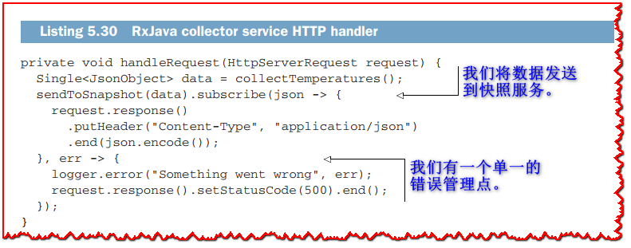

此方法还执行订阅：成功时将 JSON 数据返回给请求者，失败时返回 HTTP 500 错误。 需要注意的是，订阅会触发对传感器服务的 HTTP 请求，然后是对快照服务的请求，依此类推。 在进行订阅之前，RxJava 可观察管道只是处理事件的“配方”。

最后缺少的部分是向快照服务发送数据的方法。


该方法引入了函数式编程爱好者所熟知的 *flatMap* 运算符。 如果 *flatMap* 对您来说听起来很神秘，请不要担心； 在组合顺序异步操作的情况下，您可以将“flatmap”读为“and then(然后)”。

由于 *data* 发出一个 JSON 对象，所以 *flatMap* 运算符允许我们在发出该 JSON 对象后向 Web 客户端发出 HTTP 请求。 在对快照服务的 HTTP 请求成功后，我们需要另一个（嵌套的）*flatMap*。 实际上，*rxSendJsonObject* 提供了一个发出 HTTP 响应的 observable。 但是，我们需要 JSON 对象，因为它必须在发送到快照服务成功后返回给请求者，因此第二个 *flatMap* 允许我们这样做并将其重新注入管道。 这是 RxJava 中非常常见的模式。

运行 RxJava 版本的边缘服务与运行回调版本没有区别。 我们需要做的就是将 *CollectorService* 的部署更改为以下内容：

```java
vertx.deployVerticle("chapter5.reactivex.CollectorService");
```

与服务交互产生与回调版本相同的结果。

**`map` 和 `flatMap` 的区别`**

*flatMap* 来自“flatten”和“map”运算符。 为了更好地理解它的工作原理，让我们用 JavaScript 数组来说明 *flatMap*（您可以使用 *node* 或直接从 Web 浏览器控制台对其进行测试）。

使用 `let a = [1, 2, 3]`，a 是一个包含值 1、2 和 3 的数组。现在假设对于每个值，我们希望将值乘以 10 和 100。使用 *map* ，我们可以写`let b = a.map(x => [x * 10, x * 100])`，它给我们一个数组的数组：`[ [ 10, 100 ], [ 20, 200 ], [ 30 , 300]]`。

如果我们只想要值而不是嵌套数组，这不是很方便，所以我们可以“flatten(展平)” b，`b.flat()`，这给了我们 `[10, 100, 20, 200, 30, 300]`。 您可以直接使用 `a.flatMap(x => [x * 10, x * 100])` 获得相同的结果。

这直接转化为其他操作，如HTTP客户端请求或数据库调用，因为*flatMap*避免了可观察对象的嵌套可观察对象。

## 5.5 Kotlin 协程

最后一个要探索的异步编程模型是 Kotlin 编程语言中的 *coroutines*。 （有关 Kotlin 的更多信息，请参阅 Dmitry Jemerov 和 Svetlana Isakova 的 *Kotlin in Action* [Manning, 2017]）。

探索协程很有趣，因为在许多情况下，它们允许我们编写看起来像常规非异步代码的异步代码。 此外，Kotlin 有一个可靠的协程实现，Java 开发人员很容易理解，而且由于我们说 Vert.x 是多语言的，所以本书必须在某些时候展示没有 Java 的 Vert.x！

### 5.5.1 什么是协程?

术语 *coroutines* 首次出现在 Melvin Conway 于 1963 年关于 COBOL 编译器设计的论文中。 许多语言都支持协程或某种形式的协程：Python（生成器）、C#（async/await 运算符）、Go（goroutines）等等。 存在使用字节码检测的 Java 实现，而且由于Project Loom (https://openjdk.java.net/projects/loom/)的支持，Java的未来版本将支持协程。

协程可以暂停执行并在稍后的时间点恢复。 它可以看作是一个具有多个入口和出口点的函数，其执行堆栈可以恢复。 协程非常适合异步模型，因为它们可以在需要异步操作的结果时暂停，并在可用时恢复。

为了让事情更具体，让我们看看在 Kotlin 中使用协程。 首先，考虑以下代码。

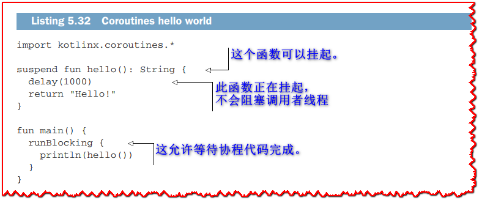

对 *delay* 的调用不会阻塞调用者线程，因为可以挂起该方法。 时间过去后再次调用该方法，并在下一行继续执行，该行返回一个字符串。 在回调世界中，*delay* 函数将采用回调参数，该参数必须将返回的字符串传递给调用者，可能使用另一个回调。

这是一个更详细的示例。

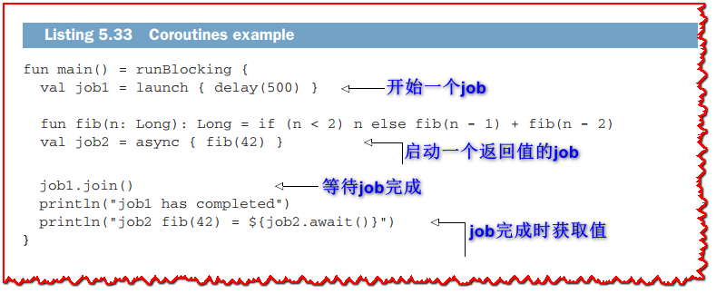

在这个例子中，*job1* 是使用 *launch* 创建的，它并行执行一些代码。 它等待 500 毫秒。 这同样适用于 *job2*，除了 *async* 用于返回值的代码块。 它计算 42 的斐波那契值，这需要一些时间。 job上的 *join* 和 *await* 方法允许我们等待这些job完成。 最后但同样重要的是，*main* 函数包含在 *runBlocking* 调用中。 这是因为挂起的方法正在被调用，所以执行必须等待所有协程完成。

我们只触及了 Kotlin 和协程的表面，但这应该足以了解 Vert.x 的集成。 要深入了解 Kotlin，您可能还需要阅读 Pierre-Yves Saumont，*The Joy of Kotlin*（Manning，2019 年）。

### 5.5.2 Vert.x 和 Kotlin协程

Vert.x 为 Kotlin 协程提供一流的支持。 要在 Gradle 项目中使用它们，您需要以下清单中显示的依赖项和配置。


同样，协程绑定是从回调 API 生成的。 约定是，对于任何具有回调的方法，都会生成带有后缀 *Await* 的 Kotlin 挂起方法。 给定

```java
void foo(String s, Handler<AsyncResult<String>> callback)
```

以下方法将存在于 Kotlin 协程绑定中：

```java
suspend fun String fooAwait(String s)
```

有一个名为 *io.vertx.kotlin.coroutines.CoroutineVerticle* 的 Verticle 基类，其中 *start* 和 *stop* 方法处于暂停状态，因此您可以直接从它们中使用协程。 通过使用 *CoroutineVerticle*，您还可以在 Verticle 事件循环线程上执行协程，而不是像默认的 Kotlin 协程那样在工作池的线程上执行协程。

>  **💡提示:** 如果你用 Kotlin 编写 Vert.x 代码，你也可以直接使用 Kotlin 的 RxJava。 还有一个帮助 RxKotlin 库，它使一些 RxJava API 更加符合 Kotlin 的习惯。

### 5.5.3 使用协程的边缘服务

让我们看看使用Kotlin协程的边缘服务的实现。序言如下清单所示。

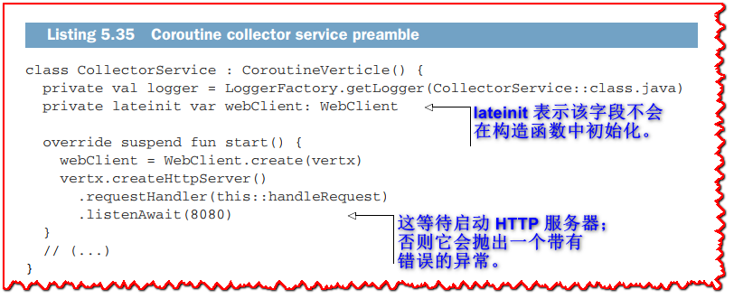

与其他实现相比，除了 *start* 方法是挂起，HTTP 服务器是使用 *listenAwait* 启动之外，没有太大区别。 由于该方法调用处于挂起状态，因此在 HTTP 服务器运行时继续执行，并且该方法返回 HTTP 服务器实例，我们在这里简单地忽略它。

下一个清单显示了适用于协程的 *fetchTemperature* 和 *sendToSnapshot* 方法的代码。


这两种方法现在看起来更像是更经典的命令式代码。 *fetchTemperature* 返回一个值（一个 JSON 对象），尽管是异步的，因为在调用 *sendAwait* 时方法中的执行被暂停。

“看起来不像异步操作的异步操作”的错觉在下面的清单中更加明显，其中包含边缘服务的核心逻辑。


这段代码非常自然地表达了温度是异步获取的，它们的值被收集在一个 JSON 对象中，调用快照服务，最终将结果发送给请求者。 尽管如此，异步操作仍有许多暂停点。 此外，错误管理是一个熟悉的 *try/catch* 结构。

您可能已经注意到了包装整个方法代码的启动函数调用。这是因为当start方法挂起时，HTTP请求处理程序不是挂起函数类型，它将在Kotlin协程上下文之外被调用。调用launch确保创建一个协程上下文，所以可以调用挂起方法。此外，协程会自动附加到确保事件在verticle事件循环线程上运行的上下文(多亏了*CoroutineVerticle*的内部功能)。

> **🏷注意:** 协程并不神奇，它们的实现需要特殊的编译器和运行时库支持。 Kotlin 编译器将挂起函数拆分为多个函数。 分割点是暂停函数调用，函数的其余部分在另一个函数中结束（称为“延续”）。 然后有一个有限状态机来确定当挂起的函数恢复时调用哪个拆分函数。 Kotlin 协程的设计方案位于 GitHub 上，网址为 http://mng.bz/Qxvj。

## 5.6 我应该使用哪个模型？

我们刚刚介绍了三种不同的异步编程模型，它们通常比回调更好。 对于您应该使用哪种模型来编写 Vert.x 应用程序，没有明确的答案。 选择一种模型或另一种模型基本上取决于您要实现的目标。

这是 Vert.x 的优点：您可以使用 RxJava 编写一个 Verticle，因为它使代码直接满足该 Verticle 的功能要求，并且您可以将 Kotlin 协程用于另一个 Verticle。 您可以在同一应用程序中混合和匹配模型。

Futures 和 Promise 是组合异步操作的简单有效的模型。 从版本 4 开始，它们被内置到 Vert.x 核心 API 中，它们提供了处理异步结果的基本工具：转换值 (*map*)、从错误中恢复 (*recover*/*otherwise*)、链接 ( *flatMap*) 和合成 (*CompositeFuture*)。 它们还提供与 JDK 中的 *CompletionStage* 的互操作性。

RxJava允许你以一种“函数式”和“声明式”的方式来推理事件流。它在错误管理和恢复方面特别强大。这些操作符用于重试失败的操作、处理超时以及在出现错误时将处理切换到另一个值或管道。然而，当构建长链(有时嵌套)操作符时，有“单子地狱”的固有风险，代码变得更难阅读。将处理拆分为多个方法是一个很好的策略。如果您不太熟悉函数式编程习惯用法，*zip*、*flatMap*和*concatMap*等操作符就不一定有意义。此外，并不是所有的处理都容易表示为管道，特别是在涉及条件分支时。

Kotlin 协程具有生成看起来不像异步代码的代码的优势。 简单的错误管理案例可以用熟悉的 *try/catch* 块来表示。 虽然这里没有提到，但 Kotlin 协程支持 Go 编程语言风格的通道和选择器，这允许协程之间的消息传递。 话虽如此，更复杂的错误管理，例如重试，需要手动表达。 最后但同样重要的是，了解协程和异步编程的工作方式仍然很重要。

同样，没有明确的答案，因为所有模型都有其优点和缺点，但是根据您自己的经验和偏好，您可能会认识到在特定情况下应该使用哪种模型。 在本书的其余部分，我们将根据我们编写的示例使用不同的模型，但这并不意味着您不能用您喜欢的模型重写它们。

## 总结

  - 当涉及到组合异步操作时，回调具有表达性限制，如果不适当注意，它们会使代码更难以理解。
  - 并行和顺序异步操作可以与其他异步编程模型组成：futures 和 promises、reactive extensions 和 coroutines。
  - 反应式扩展有一组丰富的可组合操作符，它们特别适合事件流。
  - Futures 和 Promise 非常适合异步操作的简单链接。
  - Kotlin 协程为异步操作提供语言级别的支持，这是另一个有趣的选择。
  - 没有普遍良好的异步编程模型，因为它们都有自己喜欢的用例。 Vert.x 的好处是您可以根据您的问题域混合和匹配这些模型。
