# 第六章: 超越事件总线

**本章涵盖了**

  - How to expose services on top of the event bus
  - Asynchronous testing of both verticles and event-bus services

The event bus is a fundamental tool for articulating event processing in Vert.x, but there is more to it! Event-bus services are useful for exposing typed interfaces rather than plain messaging, especially when multiple message types are expected at an event-bus destination. Testing is also an important concept, and we’ll look at what is different in testing asynchronous Vert.x code compared to traditional testing.

In this chapter we will revisit an earlier example, refactor it into an event-bus service, and test it.

## 6.1   Revisiting heat sensors with a service API

In chapter 3 we used heat sensors as an example. We had a *SensorData* verticle that kept the last observed values for each sensor and compute their average using request/reply communication on the event bus. The following listing shows the code we used to compute the temperature average.

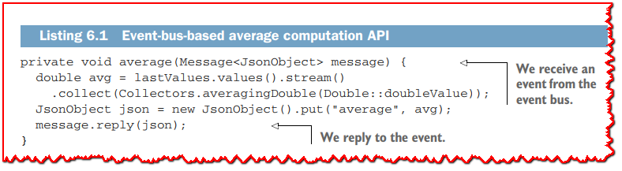

This code is tightly coupled with the Vert.x event-bus APIs, as it needs to receive a message and reply to it. Any software component willing to call *average* has to send a message over the event bus and expect a response.

But what if we could have a regular Java interface with methods to call, rather than having to send and receive messages over the event bus? The interface proposed in the next listing would be completely agnostic of the event bus.

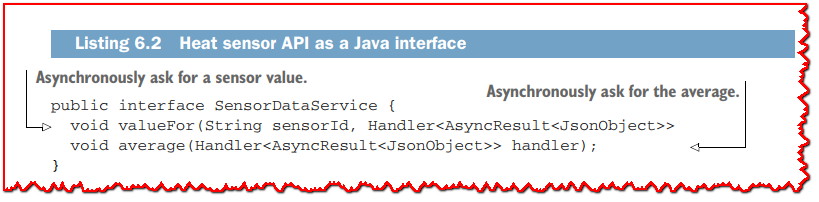

The proposed interface has methods with trailing callback parameters so the caller will be notified asynchronously of responses and errors. The *`Handler<AsyncResult<T>>`* type is commonly used for callbacks in Vert.x APIs, where T can be anything but is typically a JSON type.

The interface of listing 6.2 is what we are aiming for with event-bus services. Let’s revise the heat sensor example, replacing event-bus interactions with a SensorDataService typed Java interface.

## 6.2 Return of the RPCs (remote procedure calls)

You may already be familiar with *remote procedure calls*, a popular abstraction in distributed computing. RPCs were introduced to hide network communications when you’re calling functions running on another machine (the server). The idea is that a local function acts as a proxy, sending a message with the call arguments over the network to the server, and the server then calls the *real* function. The response is then sent back to the proxy, and the client has the illusion of having called a regular, local function.

Vert.x event-bus services are a form of *asynchronous RPC*:
  - A service encapsulates a set of operations, like *SensorDataService* in listing 6.2.
  - A service is described by a regular Java API with methods for exposed operations.
  - Neither the requester nor the implementation need to directly deal with even-tbus messages.

Figure 6.1 illustrates the various components at stake when invoking the *average* method of the *SensorDataService* interface. The client code invokes the *average* method on a service proxy. This is an object that implements the *SensorDataService* interface and then sends a message on the event bus to the *sensor.data-service* destination (this can be configured). The message body contains the method call parameter values, so because *average* only takes a callback, the body is empty. The message also has an *action* header that indicates which method is being called.

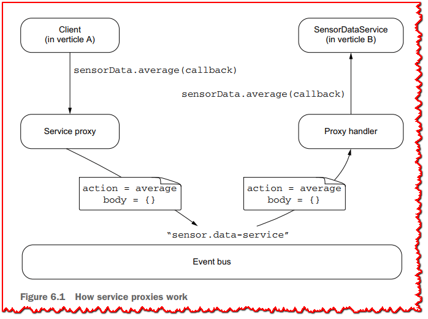

A proxy handler listens to the *sensor.data-service* destination and dispatches method calls based on the message’s action header and body. The actual *SensorDataService* implementation is used here, and the *average* method is called. The proxy handler then replies to the event-bus message with a value passed through the *average* method callback. In turn, the client receives the reply through the service proxy, which passes the reply to the callback from the call on the client side.

This model can simplify dealing with the event bus, especially when many operations need to be exposed. It thus makes sense to define a Java interface as an API rather than manually dealing with messages.

## 6.3 Defining a service interface

Listing 6.2 has the interface that we want for *SensorDataService*, but there is a little more code to add. To develop an event-bus service, you need to
  - Write a Java interface that respects a few conventions
  - Write an implementation

Vert.x does not rely on magic through bytecode engineering or reflection at runtime, so service proxies and handlers need to be written and compiled. Fortunately, Vert.x comes with code generators, so you will generate both the service proxies and handlers at compilation time rather than write them yourself.

The complete *SensorDataService* interface is detailed in the following listing.

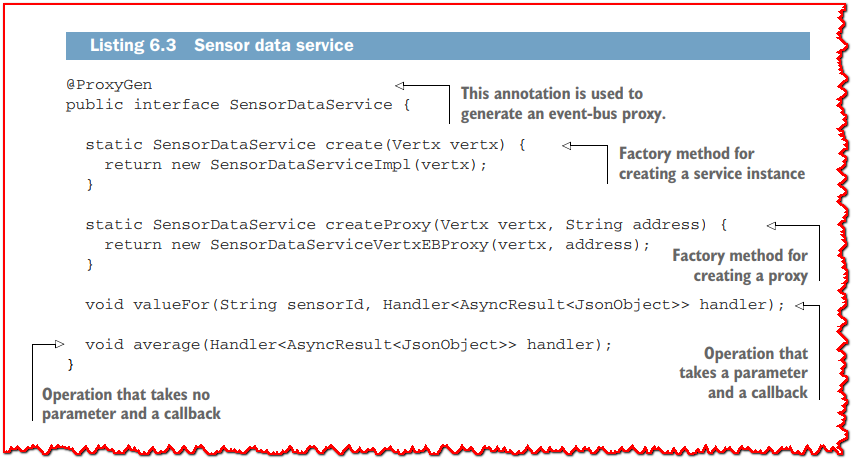

The *@ProxyGen* annotation is used to mark an event-bus service interface so as to generate the proxy code.

You will also need to define a *package-info.java* file and annotate the package definition with *@ModuleGen* to enable the annotation processor, as shown in the next listing.

The methods in a service interface need to adhere to a few conventions, notably that of having a callback as the last parameter. You will be tempted to use return values rather than callbacks, but remember that we are dealing with asynchronous operations, so we need callbacks! It is idiomatic for service interfaces to have factory methods for both the service implementations (*create*) and proxies (*createProxy*). These methods greatly simplify the code for either getting a proxy or publishing a service.

The *SensorDataServiceVertxEBProxy* class is generated by the Vert.x code generator, and if you peek into it, you will see event-bus operations. There is also a *SensorDataServiceVertxProxyHandler* class that’s generated, but only Vert.x will use it, not your code.

Let’s now look at the actual service implementation in the *SensorDataServiceImpl* class.

## 6.4 Service implementation

The following service implementation is a direct adaptation of the code from chapter 3.

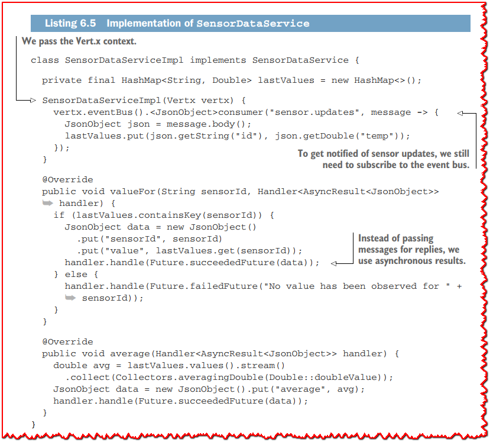

Compared to the code of chapter 3, we have mostly replaced the event-bus code with passing asynchronous results via completed future objects. This code is also free from references to the service proxy handler code, which is being generated.

>  **💡提示:** The code in listing 6.5 is free of asynchronous operations. In more elaborated services, you will quickly stumble upon cases where you issue asynchronous calls to some other component like a database, an HTTP service, a message broker, or even another service over the event bus. Once you have a response ready, you will pass the result or an error to the method callback, just like we did in *SensorDataServiceImpl*.

## 6.5 Enabling proxy code generation

Service proxy generation is done using *javac* and apt annotation processing at compilation time. Two Vert.x modules are required: *vertx-service-proxy* and *vertxcodegen*.

To make the Vert.x code generation work with annotation processing in Gradle, you will need a configuration similar to the following.

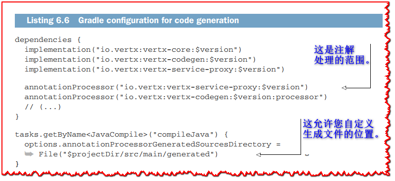

Now whenever the Java classes are being compiled, the proxy classes are generated. You can see the files in the *src/main/generated* folder of your project.

If you look into the code of *SensorDataServiceVertxProxyHandler*, you’ll see a *switch* block in the *handle* method, where the *action* header is being used to dispatch the method call to the service implementation methods. Similarly, in the *average* method of *SensorDataServiceVertxEBProxy* you will see the code that sends a message over the event bus to invoke that method. The code of both *SensorDataServiceVertxProxyHandler* and *SensorDataServiceVertxEBProxy* is really what you would write if you had to implement your own event-bus service system.

## 6.6 Deploying event-bus services

Event-bus services need to be deployed to verticles, and event-bus addresses need to be defined. The following listing shows how to deploy a service.

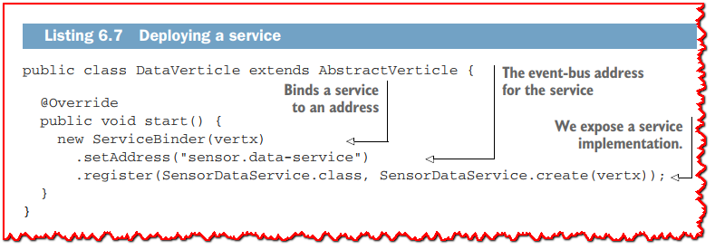

Deploying is as simple as binding to an address and passing a service implementation. We can use the factory *create* methods from the *SensorDataService* interface to do this.

You can deploy multiple services on a verticle. It makes sense to deploy event-bus services that are functionally related together, so a verticle remains a coherent eventprocessing unit.

Obtaining a service proxy to issue method calls is done by calling the corresponding factory method and passing the correct event-bus destination, as in the following listing.

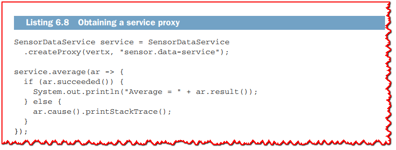

The service interface follows the callbacks model, as this is the canonical definition for (asynchronous) service interfaces.

## 6.7 Service proxies beyond callbacks

We explored asynchronous programming models other than callbacks in the previous chapter, but we designed event-bus services with callbacks. The good news is that you can leverage code generation to get, say, RxJava or Kotlin coroutine variants for your service proxies. Even better, you do not need much extra work!

To make this work, you need to add the @VertxGen annotation to your service interface, as follows.

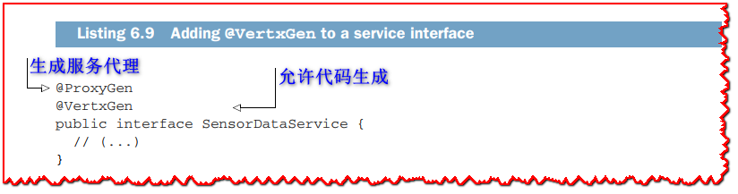

When this annotation is present, code generation by a Vert.x Java annotation processor is enabled with all suitable code generators available at build time.

To generate RxJava bindings, we need to add the dependencies in the following listing.

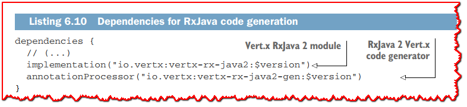

When we compile the project, a *chapter6.reactivex.SensorDataService* class is generated. This is a small shim that bridges the original callbacks API to RxJava. The class has all the methods from the original *SensorDataService* API (including *create* factory methods), plus rx-prefixed methods.

Given the *average* method that takes a callback, the RxJava code generator creates an *rxAverage* method with no parameter that returns a *Single* object. Similarly, *valueFor* gets translated to *rxValueFor*, a method that takes a *String* argument (the sensor identifier) and returns a *Single* object.

The next listing shows a sample use of the generated RxJava API.

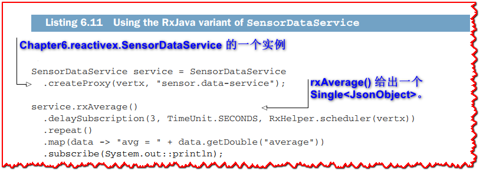

The RxJava pipeline created here makes a new subscription every three seconds and extracts the average into a string that is then displayed on the standard output.

>  **🏷注意:** You must always develop your event-bus services with the callbacks API for the interface and implementation. Code generators then turn it into other models.

Now that you know how to develop event-bus services, let’s switch to the topic of testing verticles and services.

## 6.8 Testing and Vert.x

Automated testing is critical in designing software, and Vert.x applications also need to be tested. The main difficulty when testing Vert.x code is the asynchronous nature of operations. Other than that, tests are classical: they have a setup phase and a test execution and verification phase, followed by a tear-down phase.

A verticle is relatively well isolated from the rest of the system, thanks to the event bus. This is very useful in a test environment:
  - The event bus allows you to send events to a verticle to put it in a desired state and to observe what events it produces.
  - The configuration passed to a verticle when it is deployed allows you to tune some parameters for a test-centric environment (e.g., using an in-memory database).
  - It is possible to deploy mock verticles with controlled behaviors to substitute for verticles with lots of dependencies (e.g., databases, connecting to other verticles, etc.).

As such, testing verticles is more integration testing than unit testing, regardless of whether the verticles under test are being deployed within the same JVM or in cluster mode. We need to see verticles as opaque boxes that we communicate with via the event bus, and possibly by connecting to network protocols that verticles expose. For instance, when a verticle exposes an HTTP service, we are likely going to issue HTTP requests in tests to check its behavior.

In this book, we will only focus on the Vert.x-specific aspects of testing. If you lack experience with the broader topic of testing, I recommend reading a book like *Effective Unit Testing* by Lasse Koskela (Manning, 2013).

### 6.8.1 Using JUnit 5 with Vert.x

Vert.x supports both the classic JUnit 4 test framework as well as the more recent one for JUnit 5. Vert.x provides a module called *vertx-junit5* with support for version 5 of the JUnit framework (https://junit.org/junit5/). To use it in a Vert.x project, you need to add the *io.vertx:vertx-junit5* dependency, and possibly some JUnit 5 libraries.

In a Gradle project, the *dependencies* section needs to be updated as in the following listing.

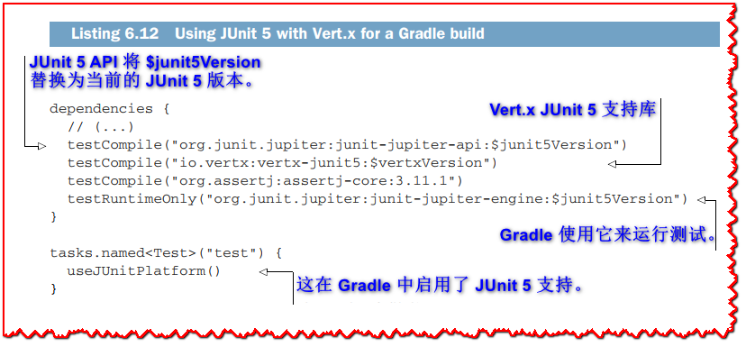

The *vertx-junit5* library already has a dependency on *junit-jupiter-api*, but it is a good practice to fix the version in the build. The *junit-jupiter-engine* module needs to be present in the *testRuntime* scope for Gradle. Finally, JUnit 5 can be used with any assertion API, including its built-in one, and AssertJ is a popular one.

### 6.8.2 Testing DataVerticle

We need two test cases to check the behavior of *DataVerticle*, and by extension that of *SensorDataService*:
  - When no sensor is present, the average should be 0, and requesting a value for any sensor identifier must raise an error.
  - When there are sensors, we need to check the average value and individual sensor values.

Figure 6.2 shows the interactions for the test environment. The test case has a proxy reference to make calls to *SensorDataService*. The actual *DataVerticle* verticle is deployed at the *sensor.data-service* destination. It can issue *valueFor* and *average* method calls from tests. Since *DataVerticle* receives messages from sensors on the event bus, we can send arbitrary messages rather than deploying actual *HeatSensor* verticles over which we have no control. Mocking a verticle is often as simple as sending the type of messages it would send.

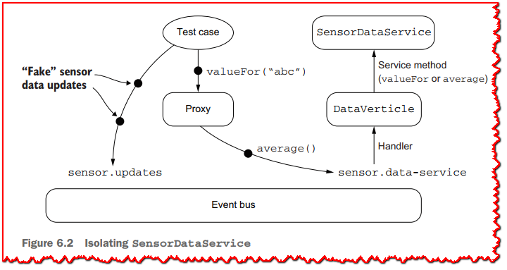

The following listing shows the test class preamble.

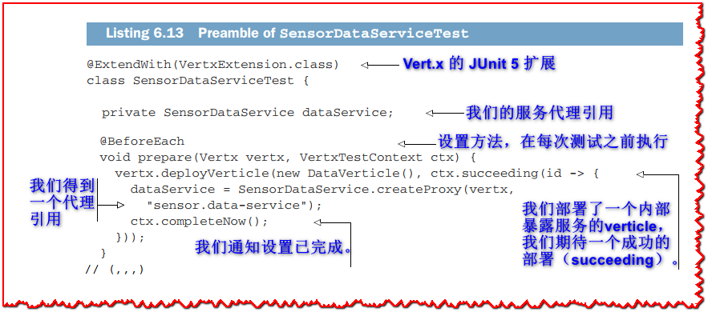

JUnit 5 supports extensions to give additional functionality. In particular, extensions can inject parameters into test methods, and they can intercept life-cycle events such as before and after a test method is called. The *VertxExtension* class simplifies writing test cases by doing the following:
  - Injecting ready-to-use instances of *Vertx* with default configuration
  - Injecting a *VertxTestContext* object to deal with the asynchronous nature of Vert.x code
  - Ensuring awaiting for the *VertxTestContext* to either succeed or fail

The *prepare* method is executed before each test case, to prepare the test environment. We use it here to deploy the *DataVerticle* verticle and then fetch the service proxy and store it in the *dataService* field. Since deploying a verticle is an asynchronous operation, the *prepare* method is injected with a *Vertx* context and a *VertxTestContext* object to notify when it has completed.

>  **💡提示:** Users of JUnit before version 5 may be surprised that the class and test methods are package-private; this is idiomatic with JUnit 5.

You can see the first test case, when no sensors are deployed, in the following listing.

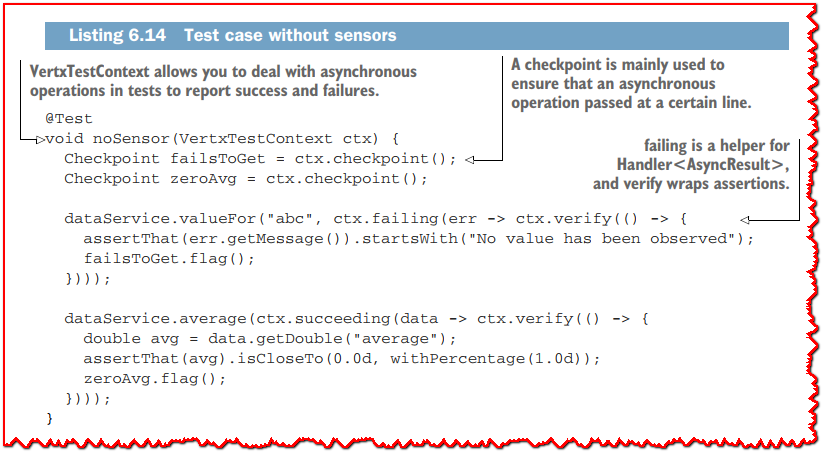

This test case assumes that no sensor has been deployed, so trying to get any sensor value must fail. We check this behavior by looking for the temperature value of sensor *abc*, which doesn’t exist. We then check that the average value is 0.

Checkpoints are flagged to mark that the test execution reached certain lines.

When all declared checkpoints have been flagged, the test completes successfully. The test fails when an assertion fails, when an unexpected exception is thrown, or when a (configurable) delay elapses and not all checkpoints have been flagged.

**Why asynchronous testing is different**

Testing asynchronous operations is slightly different from the regular testing you may be familiar with. The default contract in test executions is that a test runner thread calls test methods, and they fail when exceptions are thrown. Assertion methods throw exceptions to report errors.

Since operations like *deployVerticle* and *send* are asynchronous, the test runner thread exits the method before they have any chance to complete. The *VertxExtension* class takes care of that by waiting for *VertxTestContext* to report either a success or a failure. To avoid having tests wait forever, there is a timeout (30 seconds by default).

Finally, we have a test case for when there are sensors.

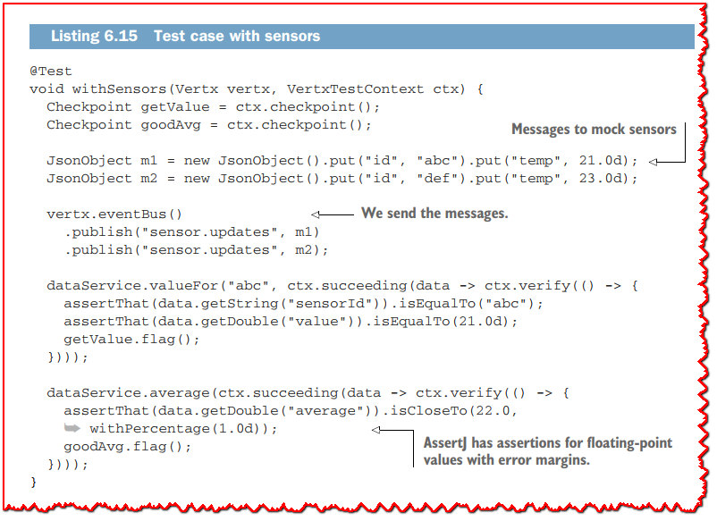

This test simulates two sensors with identifiers *abc* and *def* by sending fake sensor data updates over the event bus, just like a sensor would do. We then have determinism in our assertions, and we can check the behavior for both *valueFor* and *average* methods.

### 6.8.3 Running the tests

The tests can be run from your IDE. You can also run them using Gradle: *gradlew test*.

Gradle generates a human-readable test report in *build/reports/tests/test/ index.html*. When you open the file in a web browser, you can check that all tests passed, as shown in figure 6.3.

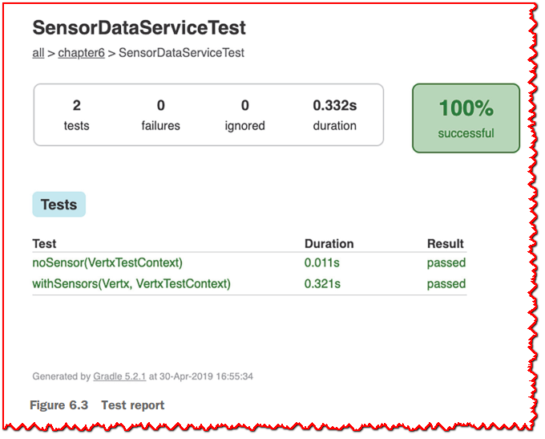

Note that the Gradle *test* task is a dependency of *build*, so the tests are always executed when the project is fully built.

## 总结

  - Event-bus services and proxies abstract from event-bus communications by providing an asynchronous service interface.
  - It is possible to generate bindings other than callbacks for event-bus services: RxJava, Kotlin coroutines, etc.
  - Testing asynchronous code and services is more challenging than in the traditional imperative cases, and Vert.x comes with dedicated support for JUnit 5.

