# 第七章: 设计一个反应式应用程序

> 翻译: 白石(https://github.com/wjw465150/Vert.x-in-Action-ChineseVersion)

**本章涵盖**

  - 什么是反应式应用
  - 介绍整个第2部分中使用的反应式应用程序方案

本书的第一部分教您使用Vert.x的异步编程。 这是编写可扩展和资源有效应用程序的关键。

现在是时候探索使应用程序 **反应式(reactive)**的原因了，因为我们努力提高可伸缩性和可靠性。 为此，我们将集中精力于从几个事件驱动的微服务中开发完全反应式应用程序。 在本章中，我们将指定这些服务。

## 7.1 是什么使应用程序具有反应性

在前几章中，我们介绍了反应式的一些元素：
  - 背压，作为异步流处理中的必要成分，以调节事件吞吐量
  - 反应式编程是组成异步操作的一种方式

现在是时候探索最后一个方面了： **反应式应用程序**。 在第1章中，我总结了 *反应式宣言*，该声明反应式应用是: **响应式的**，**有复原力的**，**有弹性的**和**消息驱动的**。

反应式应用程序的关键属性是，在苛刻的工作量和面对其他服务失败时，它们是响应良好的。 通过“响应迅速”，我们的意思是，服务响应的延迟仍处于控制之下。 一个很好的响应示例将是一项在99％百分位数中在500毫秒内做出响应的服务，但鉴于该服务的功能要求和操作约束，500毫秒是一个很好的数字。

不断增加的工作负载几乎总是会降低延迟，但对于响应式应用程序，目标是避免服务在压力下出现延迟爆发。本书的第1部分主要介绍了使用Vert.x进行异步编程，这是应对日益增长的工作负载的关键因素。您看到，异步事件处理允许在单个线程上多路复用数千个开放的网络连接。这个模型(如果实现正确的话!)比传统的“每个连接1个线程”模型在资源友好和可伸缩性方面都要好得多。

因此，Vert.x为我们提供了一个在JVM之上进行异步编程的基础，以满足高要求的工作负载，但是如何处理故障呢?这是我们必须面对的另一个核心挑战，而答案并不是我们可以从货架上取下的神奇工具。假设我们有一个与数据库通信的服务，由于内部问题(如死锁)而失去响应。在我们的服务收到错误通知(可能以TCP连接超时的形式)之前会经过一段时间。在这种情况下，延迟爆发。相反，如果数据库关闭，我们会立即得到一个TCP连接错误:延迟非常好，但由于服务不能与它的数据库通信，它无法处理请求。

在本部分的最后一章中，您将看到如何试验“出错时的情况”，我们还将讨论保持服务响应性的可能解决方案。你可能会对所有对其他服务(包括数据库)的调用强制执行严格的超时，或者在任何地方都使用**断路器**(在最后一章中有更多的介绍)，但一个更分析的方法将帮助你看到使用哪种解决方案，如果有的话，以及何时使用。根据服务的功能需求和应用程序域来查看失败也很重要:对失败的响应可能并不总是错误。例如，如果我们不能从传感器获得最新的温度更新，我们可以提供最后一个已知值，并将时间戳附加到它，这样请求程序就可以将所有必要的上下文附加到数据。

现在是构建响应式应用程序的时候了，既可以探索Vert.x堆栈的一些元素，也可以了解如何具体地构建响应式应用程序。

## 7.2 10K步骤挑战场景

我们将在接下来的章节中实现的应用程序支持一个(不那么)虚构的健身追踪器挑战。假设我们想要构建一个应用程序来跟踪和记录用户的步骤，如**图7.1**所示。

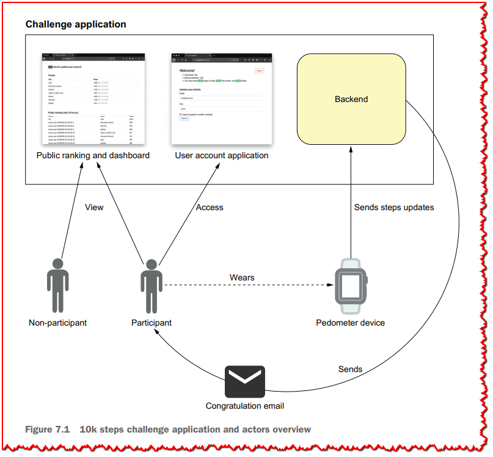

**图7.1**中描述的应用程序如下：

  - 用户使用联网计步器来跟踪他们走了多少步。
  - 计步器会定期向管理挑战的应用程序发送步数更新。
  - 目标是每天至少走1万步，当用户这样做时，每天都会收到一封电子邮件。
  - 用户可以选择在过去24小时内的步数排名中公开列出。
  - 参与者还可以连接到一个网络应用程序，查看自己的数据，并更新自己的信息，比如他们所在的城市，以及他们是否希望出现在公共排名中。

这个web应用程序允许新用户通过提供他们的设备标识符和一些基本信息来注册，比如他们的城市以及他们是否打算出现在公共排名中(**图7.2**)。

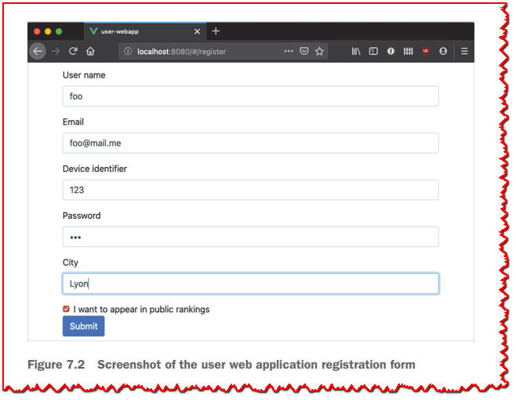

一旦连接上，用户就可以更新一些基本的细节，并获得总步数、月步数和每日步数的提醒(**图7.3**)。

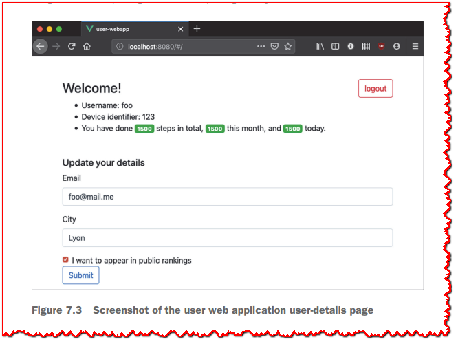

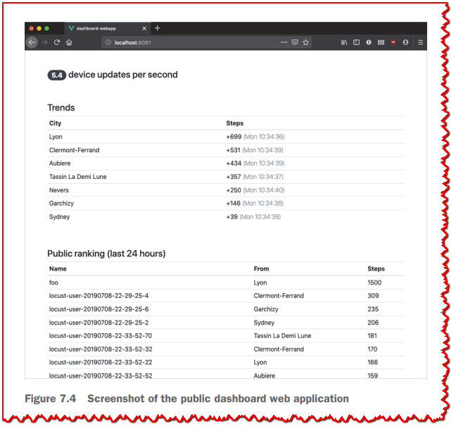

还有一个单独的web应用程序提供了一个公共仪表板(**图7.4**)。

仪表板提供了过去24小时内的公共档案排名，当前计步器设备的更新吞吐量，以及城市趋势。仪表板中显示的所有信息都实时更新。

## 7.3 一个应用程序，许多服务

应用程序被分解为一组相互交互的(微)服务，如**图7.5**所示。每个服务都实现单一的功能目的，并且可以被其他应用程序很好地使用。有四个公共服务:两个面向用户的web应用程序，一个用于接收计步器设备更新的服务，以及一个用于公开公共HTTP API的服务。用户web应用程序使用公共API，我们同样可以让移动应用程序连接到它。有四个内部服务:一个管理用户配置文件，一个管理活动数据，一个通过电子邮件祝贺用户，一个计算连续事件的各种统计数据。

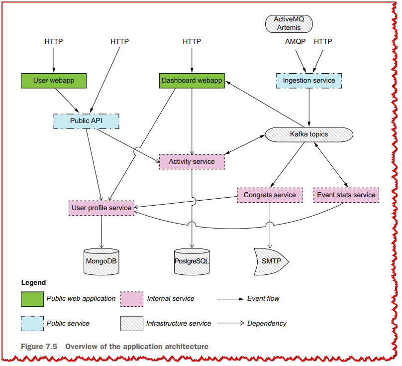

> **🏷注意:** 您可能已经听说过 *命令查询责任隔离 *（CQRS）和 *事件源 *，这是在事件驱动的架构中发现的模式。 CQRS结构如何读取和写入信息，而事件来源是关于将应用程序状态物化为事实序列的。 我们提出的应用程序体系结构与这两个概念都有关，但由于它不严格地符合定义，所以我更喜欢称它为“事件驱动的微服务体系结构”。

所有服务均由Vert.x提供动力，我们还需要一些第三方中间件，标记为**图7.5**中的“infrastructure services(基础架构服务)”。 我们将使用两种不同类型的数据库：面向文档的数据库（MongoDB）和一个关系型数据库（PostgreSQL）。 我们需要SMTP服务器来发送电子邮件，Apache Kafka用于某些服务之间的事件流处理。 由于*ingestion service(摄取服务)*可能会从HTTP和AMQP接收更新，因此我们还将使用ActiveMQ Artemis服务器。

**图7.5**中有两种类型的箭头。 事件流显示服务之间重要的事件交流。 例如，摄取服务将事件发送给Kafka，而事件统计服务既消耗并生产Kafka事件。 我还表示依赖性：例如，公共API服务取决于用户配置文件和活动服务，这又取决于他们自己的数据库以进行数据持久性。

如**图7.6**所示，我们可以通过查看设备更新如何影响仪表板Web应用程序的城市趋势排名来说明服务之间的交互示例。

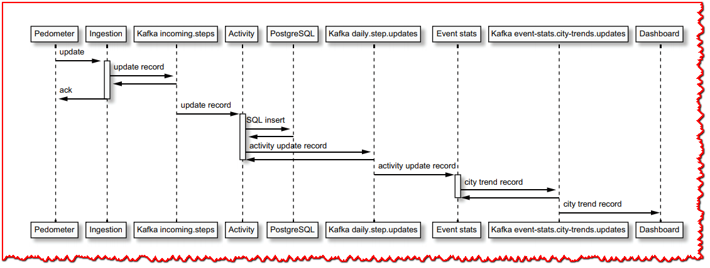

首先，计步器向摄取服务发送更新，摄取服务验证更新是否包含所有需要的数据。然后，摄取服务将更新发送到Kafka主题，计步器设备被确认，因此它知道已经收到更新并将被处理。这个更新将由多个侦听特定Kafka主题的消费者来处理，其中包括活动服务。这个服务将记录数据到PostgreSQL数据库，然后发布另一条记录到Kafka主题的计步器记录的步数在那天。该记录由事件统计服务获取，该服务观察窗口上5秒内的更新，按城市划分更新，并汇总步骤数。然后，它发布一个更新，将一个给定城市观察到的步骤的增量作为另一个Kafka记录。这个记录随后被仪表板web应用程序使用，它最终向所有连接的web浏览器发送一个更新，从而更新显示。

**关于应用程序架构**

在深入研究服务的规范和实现时，您可能会发现这种分解有时有点人为。例如，用户配置文件和活动服务可能只有一个，保存一些连接来自两个服务的数据的请求。请记住，进行分解是出于教学目的，并显示Vert.x堆栈中的相关元素。

从(微)服务创建应用程序需要一些妥协，特别是一些服务可能已经存在，您必须按原样处理它们，或者您发展它们的能力有限。

您可能还会发现，提议的体系结构并不是一个很好的分层体系结构，一些服务很好地解耦了，而其他一些服务对其他服务有更强的依赖性。同样，这样做是为了教学目的。通常情况下，现实世界的应用程序必须做出妥协来交付工作软件，而不是追求架构的完美。

## 7.4 服务说明

让我们讨论应用程序服务的功能和技术规范。对于每个服务，我们将考虑以下元素:
  - 功能概述
  - API描述，如果有的话
  - 技术上的兴趣点，包括崩溃恢复
  - 扩展和部署注意事项

### 7.4.1 用户配置文件服务(User profile service  )

用户配置文件服务管理唯一用户的配置文件数据。 用户通过以下信息确定：
  - 用户名（必须是唯一的）
  - 一个密码
  - 一个电子邮件地址
  - 一个城市
  - 计步器设备标识符(必须是唯一的)
  - 用户是否希望出现在公共排名中

该服务公开一个HTTP API并持久化MongoDB数据库中的数据(参见**图7.7**)。

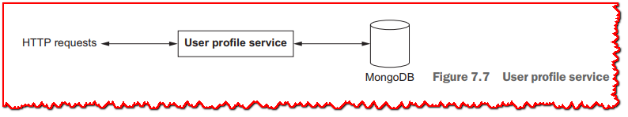

该服务属于**CRUD**(用于*创建*、*读取*、*更新*和*删除*)服务的类别，它们位于数据库之上。**表7.1**标识了HTTP API的不同元素。

这项服务不应公开暴露； 它应该被其他服务消费。 没有身份验证机制。

**表7.1用户配置文件HTTP API**

| **目的**             | **路径**           | **方法** | **数据**            | **响应**                   | 状态码                                                    |
| -------------------- | ------------------ | -------- | ------------------- | -------------------------- | --------------------------------------------------------- |
| 注册新用户           | `/register`        | POST     | 注册JSON文档        | N/A                        | 成功时200，用户名或设备标识符已经存在时409，技术错误时500 |
| 获取用户的详细信息   | `/<username>`      | GET      | N/A                 | JSON格式的用户数据         | 200表示成功，404表示用户名不存在，500表示技术错误         |
| 更新一些用户详细信息 | `/<username>`      | PUT      | JSON格式的用户数据  | N/A                        | 成功200，技术错误500                                      |
| 凭证验证             | `/authenticate`    | POST     | Credentials in JSON | N/A                        | 成功时200，认证失败时401                                  |
| 用户设备的反向查找   | `/owns/<deviceId>` | GET      | N/A                 | 拥有设备的用户名的JSON数据 | 200表示成功，404表示设备不存在，500表示技术错误           |

这里的服务为数据库上的操作提供了一个门面。服务和数据库都可以独立扩展。

> **🏷注意:** **表7.1**中描述的API不遵循*具象状态传输* (REST)接口的架构原则。一个*RESTful*接口将暴露用户资源，例如，`/user/<username>`，而不是通过在`/register`上的POST请求注册新用户，我们将在`/user`资源上这样做。忠实的REST结构和更自由的HTTP API结构都是有效的选择。

### 7.4.2 摄取服务(Ingestion service  )

摄取服务收集计步器设备更新，并将更新数据的记录转发到Kafka流，供其他服务处理事件。服务接收来自HTTP API或AMQP队列的设备更新，如**图7.8**所示。该服务是协议适配器或中介者的一种形式，因为它将事件从一个协议(HTTP或AMQP)转换到另一个协议(Kafka记录流)。

设备更新是一个JSON文档，包含以下条目:
  - 设备标识符
  - 一个同步标识符，它是一个单调递增的长整数，每次成功同步设备都会更新它
  - 自上次同步以来的步数

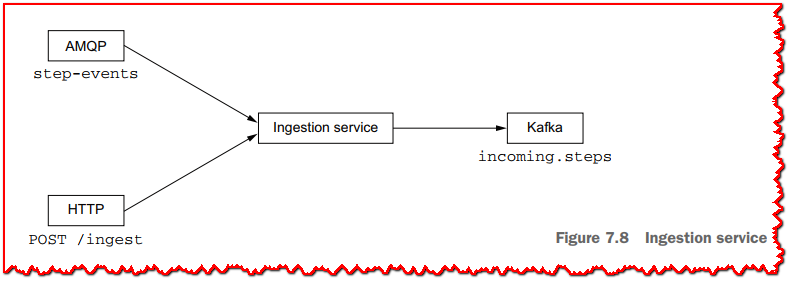

HTTP API支持单个操作，如**表7.2**所示。

**表7.2服务摄取HTTP API**

| **目的**       | **路径**  | **方法** | **数据** | **响应** | 状态码**             |
| -------------- | --------- | -------- | -------- | -------- | -------------------- |
| 摄取计步器更新 | `/ingest` | POST     | JSON文档 | N/A      | 成功200，技术错误500 |

AMQP客户端接收来自*step-events*地址的消息。JSON数据在HTTP API和AMQP客户端中是相同的。

这项服务是公开的，这样它就可以接收计步器的更新。我们假设将使用一些反向代理，提供加密和访问控制。例如，通过HTTPS进行的设备更新可以利用客户端证书检查来过滤出未经授权或未打补丁的设备。

AMQP和HTTP客户端只有在记录写入Kafka时才会得到确认。在使用HTTP的情况下，这意味着设备在收到HTTP 200响应之前不能认为同步成功。该服务不检查副本，因此设备将摄取操作视为幂等操作是安全的。正如您将看到的，保持数据一致性的是**活动服务**的角色，而不是**摄取服务**的角色。

该服务可以独立于AMQP和Kafka服务器/集群进行扩展。如果服务在做出某种形式的确认之前崩溃，客户机总是可以安全重试，因为它是幂等的。

### 7.4.3 活动服务(Activity service  )

活动服务跟踪计步器发送的步数更新。该服务将事件存储到PostgreSQL数据库，并提供一个HTTP API来收集一些统计信息，例如给定设备的每日、每月和总步数。从Kakfa主题接收更新，该主题由**摄取服务**提供(见**图7.9**)。

**活动服务**还发布带有设备当天步数的事件。通过这种方式，其他服务可以订阅相应的Kafka主题并得到通知，而不必定期轮询活动服务的更新。

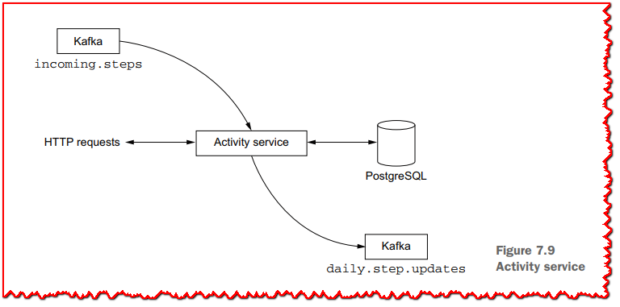

HTTP API如表7.3所示。

**表7.3活动服务HTTP API**

| **目的**                                 | **路径**                            | **方法** | **数据** | **响应** | **状态码**                                      |
| ---------------------------------------- | ----------------------------------- | -------- | -------- | -------- | ----------------------------------------------- |
| 设备的总步数                             | `/<device id>/total`                | GET      | N/A      | JSON文档 | 200表示成功，404表示设备不存在，500表示技术错误 |
| 设备在特定月份的步数                     | `/<device id>/<year>/<month>`       | GET      | N/A      | JSON文档 | 200表示成功，404表示设备不存在，500表示技术错误 |
| 在特定的日子里为一个设备计算步数         | `/<device id>/<year>/<month>/<day>` | GET      | N/A      | JSON文档 | 200表示成功，404表示设备不存在，500表示技术错误 |
| 将过去24小时内的设备按减少的步骤进行排名 | `/ranking-last-24-hours`            | GET      | N/A      | JSON文档 | 200表示成功，500表示技术错误                    |

大多数操作是对给定设备的查询。正如你将在另一章中看到的，最后一个操作提供了一个获取设备排名的有效查询，这在仪表板服务启动时非常有用。

发送到 `daily.step.updates` kafka主题的事件包含以下信息：
  - 设备标识符
  - 时间戳
  - 当天记录的步数

对于每个传入的设备更新，需要按照这个顺序进行三个操作:
  - 一个数据库插入
  - 一个数据库查询，用于获取设备在当天的步数
  - 一个Kafka记录写

这些操作中的每一个都可能失败，而且我们没有一个分布式事务代理。我们保证等幂性和正确性如下:
  - 我们只在最后一个操作完成后才承认Kafka中传入的设备更新记录。
  - 数据库模式对所存储的事件强制一些惟一性约束，因此如果再次处理某个事件，插入操作可能会失败。
  - 我们将重复插入错误作为具有等幂性的正常情况处理，并继续执行接下来的步骤，直到它们全部完成。
  - 成功编写每日步骤更新记录到KAFKA使我们能够确认初始设备更新记录，并且系统可以通过其他传入记录取得进展。

**活动服务**不打算公开，因此就像用**户配置文件服务**一样，没有适当的身份验证。它可以独立于数据库进行扩展。

### 7.4.4 公共API

此服务公开一个公共HTTP API供其他服务使用。它本质上充当用户配置文件和活动服务的“外观”，如**图7.10**所示。

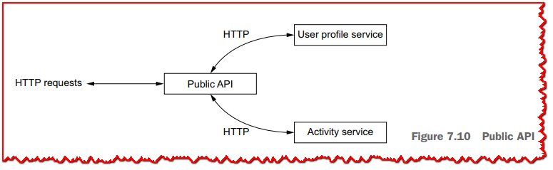

该服务是一种**边缘服务**或**API网关**的形式，因为它转发和组合请求给其他服务。由于这是一个公共HTTP API，服务的大多数操作都需要身份验证。为了做到这一点，我们将使用*JSON web令牌* (https://tools.ietf.org/html/rfc7519)，我们将在第8章与服务实现一起讨论。因为我们希望公共API可以从任何HTTP客户端使用，包括运行在web浏览器中的JavaScript代码，我们需要支持*跨源资源共享*，或CORS (https://fetch.spec.whatwg.org/#http-cors-protocol)。我们将在适当的时候再次深入研究细节。HTTP API操作如**表7.4**所示。

**表7.4公共API HTTP接口**

| **目的**                                  | **路径**                           | **方法** | **数据**               | **响应**        | **状态码**                              |
| ----------------------------------------- | ---------------------------------- | -------- | ---------------------- | --------------- | --------------------------------------- |
| 注册新用户和设备                          | `/register`                        | POST     | 带有注册数据的JSON文档 | N/A             | 成功200，否则502                        |
| 获取一个JWT令牌来使用API                  | `/token`                           | POST     | 带有凭据的JSON文档     | JWT标记(纯文本) | 成功200，否则401                        |
| 获取用户数据(需要有效的JWT)               | `/<username>`                      | GET      | N/A                    | JSON文档        | 200表示成功，如果没有找到404，否则为502 |
| 更新用户数据(需要有效的JWT)               | `/<username>`                      | PUT      | JSON文档               | N/A             | 200表示成功，如果没有找到404，否则为502 |
| 用户的总步数(需要有效的JWT)               | `/<username>/total`                | GET      | N/A                    | JSON文档        | 200表示成功，如果没有找到404，否则为502 |
| 一个用户一个月的总步数(需要一个有效的JWT) | `/<username>/<year>/<month>`       | GET      | N/A                    | JSON文档        | 200表示成功，如果没有找到404，否则为502 |
| 用户一天的总步数(需要有效的JWT)           | `/<username>/<year>/<month>/<day>` | GET      | N/A                    | JSON文档        | 200表示成功，如果没有找到404，否则为502 |

请注意，请求路径将以`/api/v1`作为前缀，因此请求令牌是对`/api/v1/token`的POST请求。在公共API的url中有一些版本控制方案总是一个好主意。JWT令牌被限制为用于获取它的用户名，因此用户B不能执行，例如，对`/api/v1/a/2019/07/14`的请求。

公共API服务可以扩展到多个实例。在生产设置中，负载平衡HTTP代理应该将请求分发给实例。服务中不需要维护任何状态，因为它将请求转发并组合到其他服务。

### 7.4.5 用户的web应用程序

用户web应用程序为用户提供了一种方式来注册、更新他们的详细信息，并检查有关他们活动的一些基本数据。如**图7.11**所示，有一个后端通过HTTP将web应用程序的静态资源提供给web浏览器。

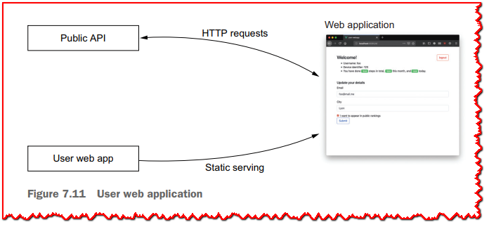

前端是一个用JavaScript和Vue.JS框架编写的单页应用程序。它由用户web应用程序服务提供，所有与应用程序后端的交互都通过调用公共API服务发生。

因此，这个服务更像是一个Vue.JS应用程序，而不是一个Vert.x应用程序，尽管看到Vert.x如何以最少的成本提供静态内容仍然很有趣。我们可以选择其他流行的JavaScript框架，甚至不选择任何框架。我发现Vue.JS是一个简单而高效的选择。另外，由于Vue.JS采用了响应式的习惯用法，它使得从后端API到前端的应用程序完全响应式。

服务本身只服务静态文件，因此它可以扩展到多个实例，并置于生产设置中的负载均衡器之后。服务器端没有状态，无论是在服务中还是在使用的公共API中。它是前端应用程序，在用户的web浏览器中存储一些状态。

### 7.4.6 事件统计服务(Event stats service  )

事件统计服务对Kafka主题中的选定事件做出反应，生成统计信息，并将其作为Kafka记录发布，供其他服务使用，如**图7.12**所示。

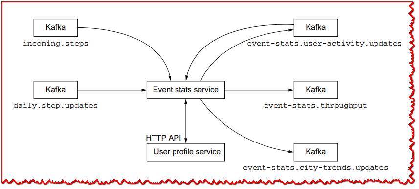

该服务执行以下计算：
  - 基于 5 秒的时间窗口，它根据在 *incoming.steps* 主题上接收到的事件数计算设备更新的吞吐量，然后向 *event-stats.throughput* 主题发出一条记录。
  - 在 *daily.step.updates* 主题上接收到的事件会携带有关当天来自设备的步数的数据。 此数据缺少用户数据（姓名、城市等），因此对于每个事件，服务都会查询用户配置文件服务以使用用户数据丰富原始记录，然后将其发送到 *event-stats.useractivity.updates* 主题 .
  - 该服务通过在 5 秒的时间窗口内处理来自 *eventstats.user-activity.update*s 主题的事件来计算城市趋势，并为每个城市发布一个更新，其中包含该城市的汇总步数到 *event -stats.city-trends.updates* 主题。

Kafka 记录可以批量自动确认，因为再次处理记录几乎没有危害，特别是对于吞吐量和城市趋势计算。 为了确保为活动更新准确地生成一条记录，手动确认是可能的，尽管偶尔的重复记录不应该影响消费服务。

**事件统计服务**并不意味着是公共的，而且它不为其他服务提供任何接口。最后，由于计算的性质，应该将服务部署为单个实例。

### 7.4.7 祝贺服务(Congrats service  )

祝贺服务的作用是监控设备每天何时达到至少10,000步，然后向所有者发送祝贺邮件，如图7.13所示。

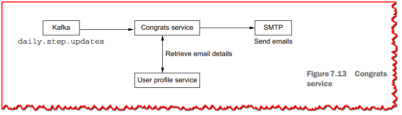

该服务调用用户配置文件服务来获取与设备关联的用户的电子邮件，然后联系SMTP服务器发送电子邮件。

注意，我们可以重用*event-stats.user-activity.updates* Kafka主题由事件统计服务提供，因为它丰富了从*daily.step.updates*接收到的用户数据消息，包括电子邮件地址。Kafka记录键是如何为两个主题产生的实现细节使它更简单，通过使用*daily.step.updates*记录，每天最多发送一条消息给用户，然后从用户档案服务获取电子邮件。这也不会增加太多的网络和处理开销，因为用户必须在给定的一天中收到至少10,000步的第一个活动更新的电子邮件。

此服务不公开，也不公开任何 API。 单个实例在生产环境中就足够了，但服务可以扩展到多个实例共享同一个 Kafka 消费者组，以便它们可以在它们之间分配工作负载。

### 7.4.8 仪表板web应用程序

仪表板web应用程序提供关于传入更新吞吐量、城市趋势和公共用户排名的实时更新。如**图7.14**所示，该服务使用事件统计服务发出的Kafka记录，并定期向web应用程序推送更新。

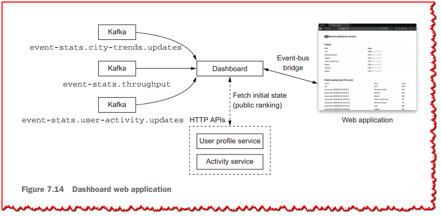

web应用程序是使用Vue.JS框架编写的，就像前面描述的用户web应用程序一样。前端和后端使用Vert.x事件总线连接，因此Vert.x和Vue.JS代码库可以使用相同的编程模型进行通信。

吞吐量和来自Kafka主题的城市趋势更新直接通过Vert.x事件总线转发，因此连接的web应用客户端实时接收更新。后端在内存中维护关于过去24小时内已公开其概要文件的所有用户的步数的数据。排名每5秒更新一次，结果会通过事件总线推送给web应用程序，这样排名就会在连接的web浏览器中更新。

由于后端是事件驱动的，在Kafka主题上，一个很好的问题是当服务启动时(或者当它从崩溃中恢复时)会发生什么。事实上，在一个新的开始，我们没有过去24小时的所有步骤数据，我们只会从服务的开始时间接收更新。

当服务开始时，我们需要一个“补水”阶段，在此我们查询活动服务并获得过去24小时内的排名。然后，我们需要为排名的每个条目查询用户配置文件服务，因为我们需要将每个设备与用户配置文件关联起来。这是一个潜在的昂贵的操作，但它不应该经常发生。

请注意，等待水合完成不会阻止处理用户活动更新，因为在更新内存数据时，最终只有来自 Kafka 记录或水合数据的最新值才会占上风。

仪表板web应用程序服务应该是公开的。如果需要，它可以扩展到多个实例，并且可以放在HTTP代理负载均衡器之后。

### 7.5 运行应用程序

要运行应用程序，您需要运行所有基础设施服务和所有微服务。 应用程序的完整源代码可以在源代码存储库的 part2-steps-challenge 文件夹中找到。

首先，Docker 必须安装在您的机器上，因为构建应用程序需要在执行测试套件时启动容器。 可以使用 Gradle 使用 *gradle assemble* 命令构建应用程序，或者如果您还想在构建过程中运行测试并运行 Docker，则可以使用 *gradle build* 构建应用程序。

一旦应用程序服务已经构建，你将需要运行所有基础设施服务，如PostgreSQL, MongoDB, Apache Kafka，等等。通过在Docker容器中运行它们，可以大大简化任务。为此，需要使用*docker-compose.yml*文件描述了使用Docker Compose运行的几个容器，这是一个简单而有效的工具，用于同时管理多个容器。运行*docker-compose* up将启动所有容器，而*docker-compose* down将停止并删除所有容器。你也可以在运行Docker Compose的终端中按下**Ctrl+C**，它会停止容器(但不会删除它们，所以它们可以以当前状态再次启动)。

> **💡提示:** 在 macOS 和 Windows 上，我建议安装 Docker Desktop。 大多数 Linux 发行版都将 Docker 作为一个包提供。 请注意，*docker* 需要以 *root* 身份运行，因此在 Linux 上，您可能需要将您的用户添加到特殊组以避免使用 *sudo*。 Docker 官方文档提供了故障排除说明 (https://docs.docker.com/engine/install/linux-postinstall/)。 在所有情况下，请确保您可以以用户身份成功运行 *docker run hello-world* 命令。

我们需要运行的容器镜像如下：
  - MongoDB 使用初始化脚本来准备集合和索引
  - PostgreSQL 带有一个初始化脚本来创建模式
  - 来自 Strimzi 项目图像的 Apache Kafka 和 Apache ZooKeeper（参见[https://strimzi.io）
  - ActiveMQ Artemis
  - MailHog，一个适合集成测试的 SMTP 服务器 (https://github.com/mailhog/MailHog）

所有微服务都打包为自包含的可执行 JAR 文件。 例如，您可以按如下方式运行活动服务：

```
$ java -jar activity-service/build/libs/activity-service-all.jar
```

也就是说，手动启动所有服务不是很方便，所以项目还包含一个Procfile文件来运行所有服务。该文件包含带有服务名称和相关shell命令的行。然后，您可以使用Foreman工具来运行这些服务(https://github.com/ddollar/foreman)或兼容的工具，比如Hivemind (https://github.com/DarthSim/hivemind):

```
$ foreman start
```

这非常方便，因为您可以从两个终端窗口运行所有服务，如**图7.15**所示。

Foreman还可以从Procfile中生成各种系统服务描述符:initab、launchd、systemd等等。最后，Foreman是用Ruby编写的，但是在项目页面上也列出了对其他语言的移植。

>  **💡提示:** Foreman 简化了所有服务的运行，但您也可以不使用它。 您可以在命令行上运行每个单独的服务。 Procfile 的内容将向您显示每个服务的确切命令。

下一章将通过构建一组（不完美！）微服务来说明实现反应式应用程序的挑战，这些微服务涵盖了 Web、API、消息传递、数据和连续流处理等主题。 在下一章中，我们将探索用于实现本章中描述的一些服务的 Web 栈。

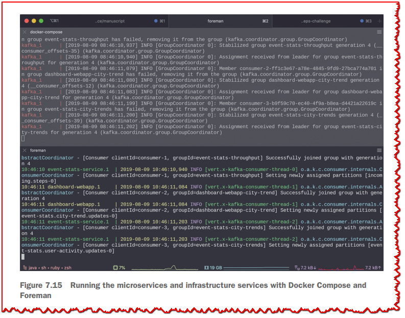

## 总结
  - 反应式应用程序专注于控制各种工作负载下的延迟以及其他服务出现故障的情况。
  - 反应式应用程序可以分解为一组独立扩展的事件驱动微服务。

