# 第八章: The Web Stack

> 翻译: 白石(https://github.com/wjw465150/Vert.x-in-Action-ChineseVersion)

**本章涵盖**
  - 边缘服务和公共 API 的构建
  - Vert.x 网络客户端
  - JSON Web 令牌 (JWT) 和跨域资源共享 (CORS)
  - 使用 Vert.x 服务和集成 Vue.js 反应式应用程序
  - 使用 REST Assured 测试 HTTP API

响应式应用程序经常使用 HTTP，因为它是一种通用的协议，而 Vert.x 为 Web 技术提供了全面的支持。 Vert.x Web 栈提供了许多用于构建 Web 应用程序后端的工具。 其中包括高级路由、身份验证、HTTP 客户端等。 本章将指导您使用 *JSON Web 令牌* (JWT) 公开 HTTP API 以进行访问控制，向其他服务发出 HTTP 请求，以及构建连接到 HTTP API 的反应式单页应用程序。

> **🏷注意:** 本书不涵盖以下来自 Vert.x Web 栈的值得注意的元素，这些元素在本书的这一部分构建应用程序时不需要：使用正则表达式进行路由、cookie、服务器端会话、服务器端模板渲染和 跨站点请求伪造保护。 您可以在 https://vertx.io/ 的官方文档中获得有关这些主题的更多详细信息。

## 8.1 公开公共 API

让我们从提醒一下公共 API 服务的作用开始，**如图 8.1** 所示。 该服务是一个边缘服务（或服务网关，取决于您喜欢如何命名它），因为它公开了一个 HTTP API，但它本质上构成了其他服务中的功能。 在这种情况下，正在使用*用户配置文件服务* 和 *活动服务*。 这两个服务在应用程序内部，不公开。 它们还缺乏任何形式的身份验证和访问控制，这是大多数操作公共 API 无法承受的。

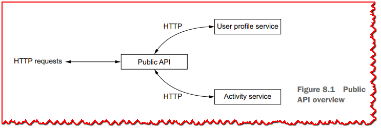

实现公共 API 需要以下 Vert.x 模块：
  - **vertx-web**, 提供高级 HTTP 请求处理功能
  - **vertx-web-client**, 向用户配置文件和活动服务发出 HTTP 请求
  - **vertx-auth-jwt**, 生成和处理 JSON Web 令牌并执行访问控制

公共 API 服务的完整源代码可以在本书源代码存储库的 *part2-stepschallenge/public-api* 文件夹中找到。

我们将从 Vert.x 网络路由器开始。

### 8.1.1 路由 HTTP 请求

Vert.x 核心提供了一个非常底层的 HTTP 服务器 API，您需要在其中为所有类型的 HTTP 请求传递一个请求处理程序。 如果只是使用 Vert.x 内核，则需要手动检查请求的路径和方法。 这对于简单的情况来说很好，这也是我们在前面的一些章节中所做的，但它很快就会变得复杂。

*vertx-web* 模块提供了一个 *router*，它可以充当 Vert.x HTTP 服务器请求处理程序，并根据请求路径（例如，*/foo*）和 HTTP 管理将 HTTP 请求分派到合适的处理程序方法（例如，POST）。 如**图 8.2** 所示。

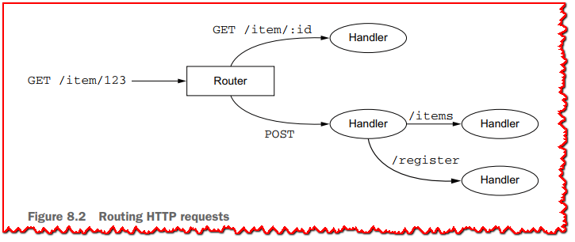

以下清单显示了如何初始化路由器并将其设置为 HTTP 请求处理程序。

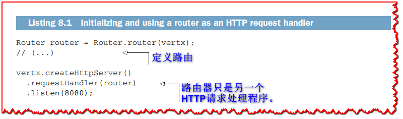

**Router** 类提供了一个流畅的 API 来描述基于 HTTP 方法和路径的路由，如下面的清单所示。

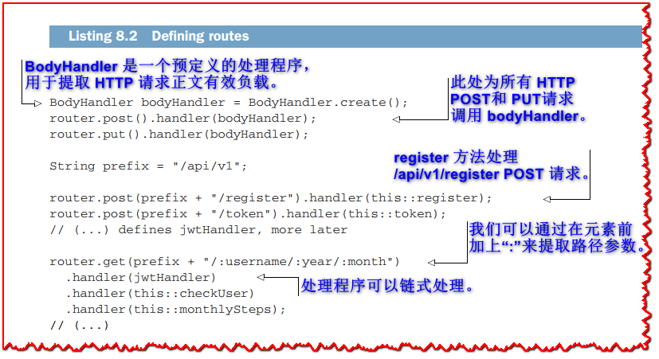

Vert.x 路由器的一个有趣特性是可以链接处理程序。 使用**清单 8.2** 中的定义，对 `/api/v1/register` 的 *POST* 请求首先通过 *BodyHandler* 实例。 此处理程序对于轻松解码 HTTP 请求正文有效负载很有用。 下一个处理程序是 *register* 方法。

**清单 8.2** 还定义了 *GET* 请求到 *monthlySteps* 的路由，其中请求首先通过 *jwtHandler*，然后是 *checkUser*，如图 8.3 所示。 这对于分解 HTTP 请求很有用，分几个步骤处理问题：*jwtHandler* 检查请求中是否包含有效的 JWT 令牌，*checkUser* 检查 JWT 令牌是否授予访问资源的权限，*monthlySteps* 检查用户在一个月内走了多少步。

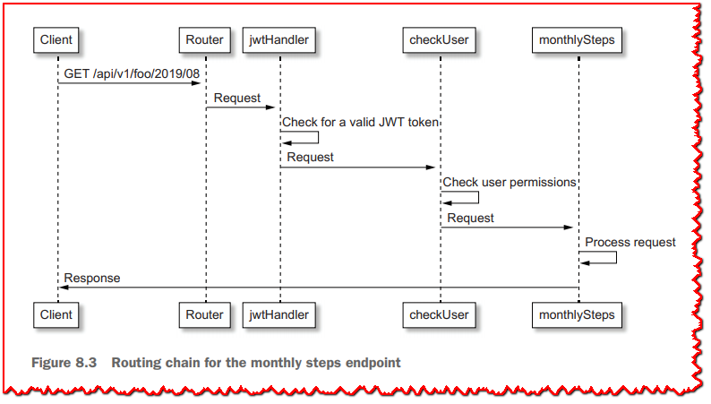

请注意，checkUser 和 jwtHandler 都将在8.2 节中讨论。

> **💡提示:** *io.vertx.ext.web.handler* 包包含有用的实用程序处理程序，包括 *BodyHandler*。 它特别为 HTTP 身份验证、CORS、CSRF、favicon、HTTP 会话、静态文件服务、虚拟主机和模板呈现提供处理程序。

### 8.1.2 发出 HTTP 请求

现在让我们深入研究处理程序的实现。 由于公共 API 服务将请求转发到用户配置文件和活动服务，因此我们需要使用 Vert.x Web 客户端来发出 HTTP 请求。 如前所述，Vert.x 核心 API 提供了一个低级 HTTP 客户端，而来自 *vertx-web-client* 模块的 *WebClient* 类提供了更丰富的 API。

创建 Web 客户端实例非常简单：

```java
WebClient webClient = WebClient.create(vertx);
```

*WebClient* 实例通常存储在 Verticle 类的私有字段中，因为它可用于执行多个并发 HTTP 请求。 整个应用程序使用 RxJava2 绑定，因此我们可以利用它们来组合异步操作。 正如您将在后面的示例中看到的那样，RxJava2 绑定有时会带来额外的功能来处理错误管理。

以下清单显示了 *register* 路由处理程序的实现。

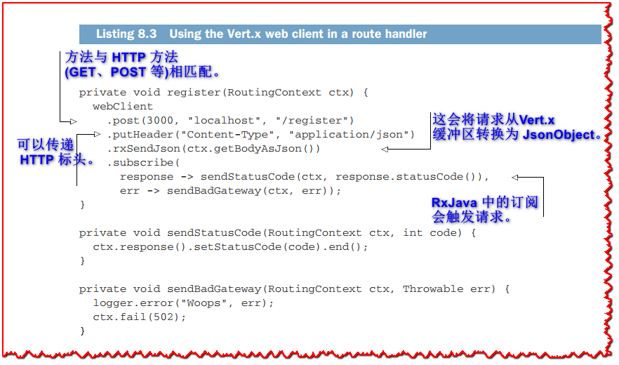

此示例演示如何使用路由器处理 HTTP 请求，以及如何使用 Web 客户端。 *RoutingContext* 类封装有关 HTTP 请求的详细信息，并通过 *response* 方法提供 HTTP 响应对象。 可以在请求和响应中设置 HTTP 标头，并且在调用 *end* 方法后发送响应。 可以指定状态码，但默认为 200（OK）。

您可以看到 *getBodyAsJson* 将 HTTP 请求正文转换为 *JsonObject*，而 *rxSendJson* 发送带有 *JsonObject* 作为正文的 HTTP 请求。 默认情况下，Vert.x *Buffer* 对象在请求和响应中都携带正文，但有一些辅助方法可以从 *String*、*JsonObject* 和 *JsonArray* 来转换。

下一个清单为对 `/api/v1/:username` 的 HTTP GET 请求提供了另一种路由器处理程序方法，其中 `:username` 是一个路径参数。

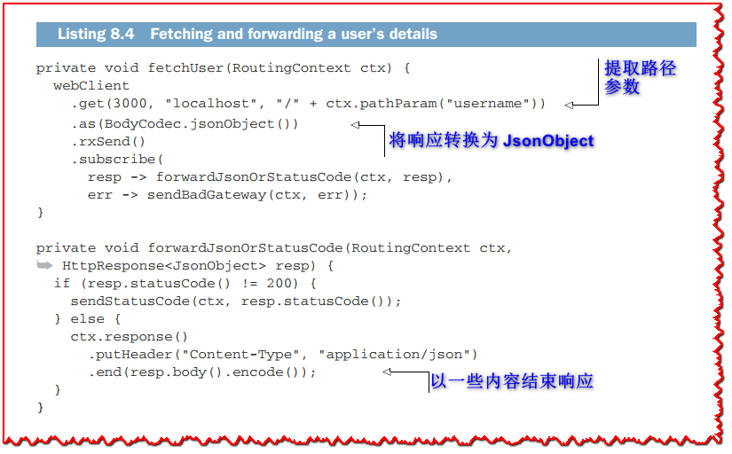

此示例显示了 **as** 方法，该方法使用 *BodyCodec* 将 HTTP 响应转换为 *Buffer* 以外的类型。 您还可以看到 HTTP 响应的 *end* 方法可以接受一个作为响应内容的参数。 它可以是 *String* 或 *Buffer*。 虽然通常在单个结束方法调用中发送响应，但您可以使用 *write* 方法发送中间片段，直到最终结束调用关闭 HTTP 响应，如下所示：

```java
response.write("hello").write(" world").end();
```

## 8.2 使用 JWT 令牌进行访问控制

JSON Web Token (JWT) 是用于在各方之间安全传输 JSON 编码数据的开放规范 (https://tools.ietf.org/html/rfc7519)。 JWT 令牌使用对称共享密钥或非对称公钥/私钥对进行签名，因此始终可以验证它们包含的信息是否未被修改。 这很有趣，因为 JWT 令牌可用于保存身份和授权授权等声明。 JWT 令牌可以使用 *Authorization* HTTP 标头作为 HTTP 请求的一部分进行交换。

让我们看看如何使用 JWT 令牌，它们包含哪些数据，以及如何使用 Vert.x 验证和颁发它们。

> **💡提示:** JWT 只是 Vert.x 支持的一种协议。 Vert.x 为 OAuth2 提供了 *vertx-auth-oauth2* 模块，这是一种在 Google、GitHub 和 Twitter 等公共服务提供商中流行的协议。 如果您的应用程序需要与此类服务集成（例如在访问用户的 Gmail 帐户数据时），或者当您的应用程序希望通过 OAuth2 授予第三方访问权限时，您将对使用它感兴趣。

### 8.2.1 使用 JWT 令牌

为了说明如何使用 JWT 令牌，让我们与公共 API 交互并以用户 *foo* 的身份使用密码 *123* 进行身份验证，并获取 JWT 令牌。 以下清单显示了 HTTP 响应。

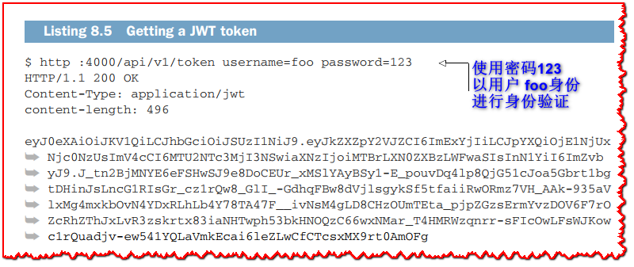

JWT 令牌的 MIME 类型为 *application/jwt*，它是纯文本。 我们可以通过令牌发出请求，如下所示。

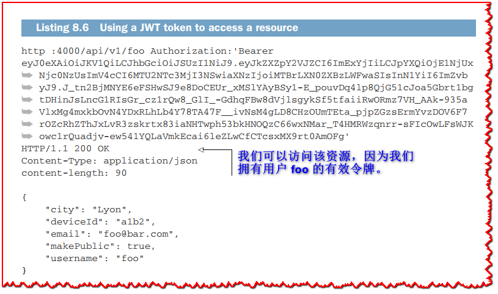

> **💡提示:** 令牌值放在一行中，*Bearer* 和令牌之间只有一个空格。

令牌与 *Authorization* HTTP 标头一起传递，并且值以 *Bearer* 为前缀。 这里令牌允许我们访问资源 `/api/v1/foo`，因为令牌是为用户 *foo* 生成的。 如果我们尝试在没有令牌的情况下做同样的事情，或者如果我们尝试访问另一个用户的资源，如下面的清单所示，我们会被拒绝。

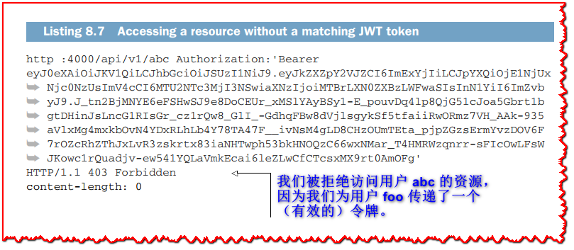

### 8.2.2 JWT 令牌中有什么？

到目前为止一切顺利，但令牌字符串中有什么？

如果您仔细观察，您会发现 JWT 令牌字符串是一条由三部分组成的大线，每部分由一个点分隔。 这三个部分的格式为 `header.payload.signature`：
  - *header* 是一个 JSON 文档，指定了令牌的类型和正在使用的签名算法。
  - *payload* 是一个包含 *claims(声明)* 的 JSON 文档，它是 JSON 条目，其中一些是规范的一部分，而一些可以是自由格式的。
  - *signature* 是带有共享密钥或私钥的标头和有效负载的签名，具体取决于您选择的算法。

标头和有效负载使用 Base64 算法进行编码。 如果您解码清单 8.5 中获得的 JWT 令牌，则标头包含以下内容：

```json
{
  "typ": "JWT",
  "alg": "RS256"
}
```

这是有效载荷包含的内容：

```json
{
  "deviceId": "a1b2", 
  "iat": 1565167475,
  "exp": 1565772275,
  "iss": "10k-steps-api", 
  "sub": "foo"
}
```

这里，*deviceId* 是用户 *foo* 的设备标识符，*sub* 是主题（用户 *foo*），*iat* 是颁发令牌的日期，exp 是令牌到期日期，*iss * 是令牌发行者（我们的服务）。

签名允许您检查标头和有效负载的内容是否已由颁发者签名并且没有被修改，只要您知道公钥即可。 这使得 JWT 令牌成为 API 中授权和访问控制的绝佳选择； 包含所有需要声明的令牌是自包含的，不需要您针对身份管理服务（如 LDAP/OAuth 服务器）检查每个请求。

重要的是要了解任何拥有 JWT 令牌的人都可以解码其内容，因为 Base64 不是加密算法。 切勿将密码等敏感数据放入令牌中，即使它们是通过 HTTPS 等安全通道传输的。 设置令牌到期日期也很重要，这样被破坏的令牌就不能无限期地使用。 处理 JWT 令牌过期的策略有多种，例如在后端维护一个受损令牌列表，以及将较短的过期期限与来自客户端的频繁有效性扩展请求相结合，其中发行者重新发送令牌，但带有扩展的 *exp* 声明 .

### 8.2.3 使用 Vert.x 处理 JWT 令牌

为了发行和检查令牌，我们需要的第一件事是一对公钥和私钥 RSA 密钥，因此我们可以签署 JWT 令牌。 您可以使用以下清单中的 shell 脚本生成这些。

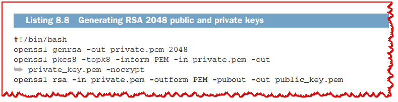

```bash
#!/bin/bash
openssl genrsa -out private.pem 2048
openssl pkcs8 -topk8 -inform PEM -in private.pem -out private_key.pem -nocrypt
openssl rsa -in private.pem -outform PEM -pubout -out public_key.pem
```

下一个清单显示了一个帮助类，用于将 PEM 文件作为字符串读取。


请注意，*CryptoHelper* 中的代码使用阻塞 API。 由于此代码在初始化时运行一次，并且 PEM 文件很小，因此我们可以承受可能但可以忽略不计的事件循环阻塞。

然后我们可以创建一个 Vert.x JWT 处理程序，如下所示。

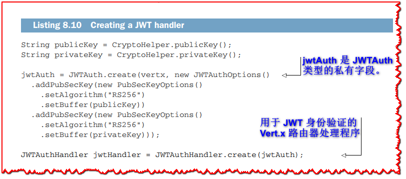

JWT 处理程序可用于需要 JWT 身份验证的路由，因为它解码 *Authorization* 标头以提取 JWT 数据。

下面的清单在它的处理程序链中调用了一个带有JWT处理程序的路由。

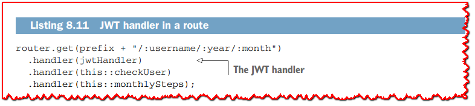

JWT 处理程序支持来自 *vertx-auth-common* 模块的通用身份验证 API，它提供跨不同类型身份验证机制（如数据库、OAuth 或 Apache *.htdigest* 文件）的统一视图。 处理程序将身份验证数据放入路由上下文中。

下面的清单显示了 *checkUser* 方法的实现，我们检查 JWT 令牌中的用户是否与 HTTP 请求路径中的用户相同。


这提供了一个简单的关注点分离，因为 *checkUser* 处理程序专注于访问控制，并通过在授予访问权限时调用 next 委托给链中的 *next* 处理程序，或者如果错误用户以 403 状态码结束请求 正在尝试访问资源。

知道访问控制是正确的，下面清单中的 *monthlySteps* 方法可以专注于向活动服务发出请求。

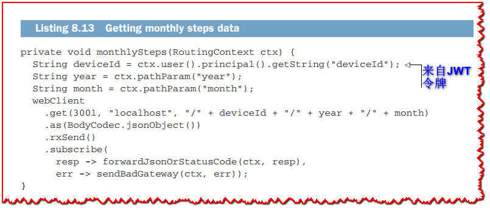

设备标识符从 JWT 令牌数据中提取并传递给 Web 客户端请求。

### 8.2.4 使用 Vert.x 发行 JWT 令牌

最后但同样重要的是，我们需要生成 JWT 令牌。 为此，我们需要向用户配置文件服务发出两个请求：首先我们需要检查凭据，然后我们收集配置文件数据以准备令牌。

以下清单显示了 */api/v1/token* 路由的处理程序。

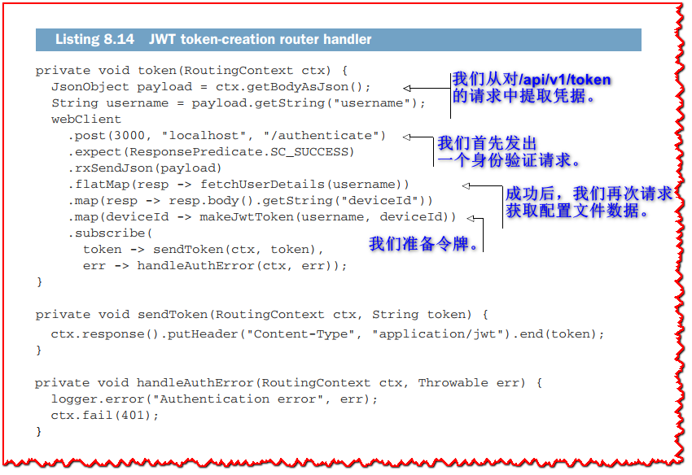

这是一个典型的 RxJava 异步操作组合，使用 *flatMap* 来链接请求。 您还可以看到 Vert.x 路由器的声明式 API，我们可以在其中指定我们希望第一个请求成功。

以下清单显示了 *fetchUserDetails* 的实现，它在身份验证请求成功后获取用户配置文件数据。

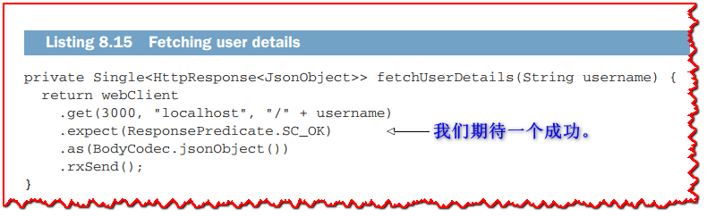

最后，下一个清单显示了如何准备 JWT 令牌。

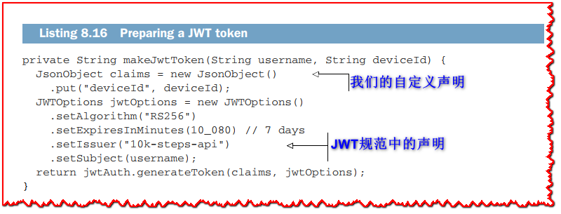

*JWTOptions* 类为 JWT RFC 中的常见声明提供方法，例如颁发者、到期日期和主题。 您可以看到我们没有指定令牌的发布时间，尽管在 *JWTOptions* 中有一个方法。 *jwtAuth* 对象在这里做了正确的事情并代表我们添加它。

## 8.3 跨域资源共享 (CORS)

我们有一个将请求转发到内部服务的公共 API，该 API 使用 JWT 令牌进行身份验证和访问控制。 我还在命令行上演示了我们可以与 API 进行交互。 事实上，*任何*第三方应用程序都可以通过 HTTP 与我们的 API 通信：手机应用程序、另一个服务、桌面应用程序等等。 您可能认为 Web 应用程序也可以通过在 Web 浏览器中运行的 JavaScript 代码与 API 通信，但（幸运的是！）并不是那么简单。

### 8.3.1 问题是什么？

Web 浏览器强制执行安全策略，其中包括*同源策略*。 假设我们从 https://my.tld:4000/js/app.js 加载 *app.js*：
  - 允许 app.js 向 https://my.tld:4000/api/foo/bar 发出请求。
  - 不允许 app.js 向 https://my.tld:4001/a/b/c 发出请求，因为不同的端口不是同一个来源。
  - 不允许 app.js 向 https://other.tld/123 发出请求，因为不同的主机不是同一个来源。

跨域资源共享 (CORS) 是一种机制，服务可以通过该机制允许来自其他来源的传入请求 (https://fetch.spec.whatwg.org/)。 例如，暴露 https://other.tld/123 的服务可以指定允许来自 https://my.tld:4000 甚至来自 *any* 来源的代码的跨域请求。 这允许 Web 浏览器在请求源允许时继续执行跨域请求； 否则它将拒绝它，这是默认行为。

当触发跨域请求时，例如加载一些 JSON 数据、图像或 Web 字体，Web 浏览器会向服务器发送请求，并带有请求的资源，并传递一个 *Origin* HTTP 标头。 然后，服务器以带有允许来源的 *Access-Control-Allow-Origin* HTTP 标头进行响应，如**图 8.4** 所示。

“*”值表示任何源都可以访问资源，而像 https://my.tld 这样的值表示只允许来自 https://my.tld 的跨源请求。 在**图 8.4** 中，请求通过 JSON 有效负载成功，但如果 CORS 策略禁止调用，则 app.js 代码在尝试发出跨域请求时会出错。

根据跨域 HTTP 请求的类型，Web 浏览器会执行 *simple* 或 *preflighted* 请求。 **图 8.4** 中的请求是一个简单的请求。

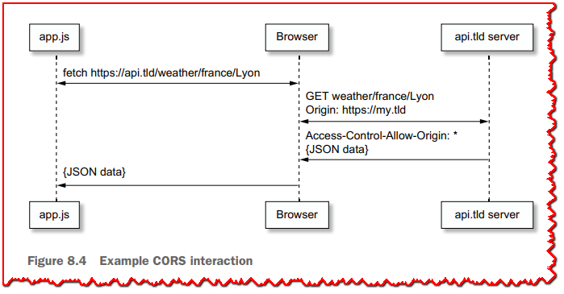

相比之下，*PUT* 请求需要预检请求，因为它可能会产生副作用（*PUT* 意味着修改资源），因此必须对资源发出预检 *OPTIONS* HTTP 请求以检查 CORS 策略是，后跟实际的 *PUT* 请求（如果允许）。 预检请求提供更多详细信息，例如允许的 HTTP 标头和方法，因为例如，服务器可以具有禁止执行 *DELETE* 请求或在 HTTP 请求中具有 *ABC* 标头的 CORS 策略。 我建议阅读 Mozilla 的“跨源资源共享 (CORS)”文档 (http://mng.bz/X0Z6)，因为它提供了浏览器和服务器之间使用 CORS 的交互的详细且易于理解的解释。

### 8.3.2 Vert.x 支持 CORS

Vert.x 带有一个带有 *CorsHandler* 类的即用型 CORS 处理程序。 创建 *CorsHandler* 实例需要三个设置：

  - 允许的起源模式
  - 允许的 HTTP 标头
  - 允许的 HTTP 方法

以下清单显示了如何在 Vert.x 路由器中安装 CORS 支持。


HTTP 方法是我们的 API 中支持的方法。 例如，您可以看到我们不支持 *DELETE*。 已为所有路由安装了 CORS 处理程序，因为它们都是 API 的一部分，并且应该可以从任何类型的应用程序（包括 Web 浏览器）访问。 允许的标头应该与您的 API 需要以及客户端可能传递的内容相匹配，例如指定内容类型，或者可以由代理注入并用于分布式跟踪目的的标头。

我们可以通过向 API 支持的路由之一发出 HTTP *OPTIONS* 预检请求来检查是否正确支持 CORS。

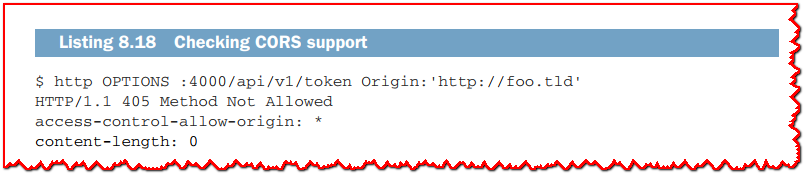

通过指定 *origin* HTTP 标头，CORS 处理程序在响应中插入 *access-control-allow-origin* HTTP 标头。 HTTP 状态码是 405，因为特定路由不支持 *OPTION* HTTP 方法，但这不是问题，因为 Web 浏览器在执行预检请求时只对 CORS 相关的标头感兴趣。

## 8.4 现代Web前端

我们已经讨论了公共 API 中的有趣点：如何使用 Vert.x Web 客户端发出 HTTP 请求，如何使用 JWT 令牌，以及如何启用 CORS 支持。 现在是时候看看我们如何公开用户 Web 应用程序（在第 7 章中定义），以及该应用程序如何连接到公共 API。

该应用程序是使用 Vue.js JavaScript 框架编写的。 Vert.x 用于提供应用程序的编译资产：HTML、CSS 和 JavaScript。

相应的源代码位于本书源代码存储库的 `part2-steps-challenge/user-webapp` 文件夹中。

### 8.4.1 Vue.js

Vue.js 本身就值得一本书，如果你有兴趣学习这个框架，我们建议你阅读 Erik Hanchett 和 Benjamin Listwon 的 *Vue.js in Action*（Manning，2018）。 我将在这里提供一个快速概述，因为我们使用 Vue.js 作为两个 Web 应用程序的 JavaScript 框架，这些 Web 应用程序是作为更大的 10k 步应用程序的一部分而开发的。

Vue.js 是一个现代 JavaScript 前端框架，如 React 或 Angular，用于构建现代 Web 应用程序，包括单页应用程序。 它是*反应*的，因为组件模型中的更改会触发用户界面中的更改。 假设我们在网页中显示温度。 当相应的数据发生变化时，温度会更新，而 Vue.js 会负责（大部分）管道来执行此操作。

Vue.js 支持组件，其中 HTML 模板、CSS 样式和 JavaScript 代码可以组合在一起，如下面的清单所示。

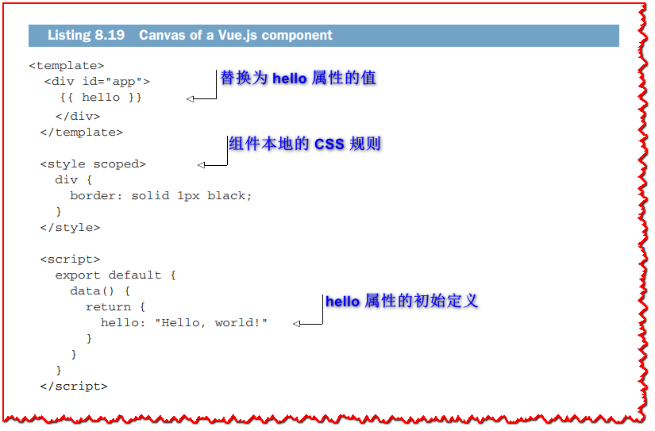

可以使用 Vue.js 命令行界面 (https://cli.vuejs.org/) 创建 Vue.js 项目：

```bash
$ vue create user-webapp
```

然后可以使用 *yarn* 构建工具来安装依赖项 (*yarn install*)，通过自动实时重新加载 (*yarn run serve*) 为项目提供开发服务，并构建项目 HTML、CSS、 和 JavaScript 资产（*yarn run build*）。

### 8.4.2 Vue.js 应用结构和构建集成

用户 Web 应用程序是具有三个不同屏幕的单页应用程序：登录表单、包含用户详细信息的页面和注册表单。

关键的 Vue.js 文件如下：
  - src/main.js - 入口点
  - src/router.js - 调度到三个不同屏幕的组件的 Vue.js 路由器
  - src/DataStore.js - 使用 Web 浏览器本地存储 API 保存应用程序存储的对象，在所有屏幕之间共享
  - src/App.vue - 挂载 Vue.js 路由器的主要组件
  - src/views - 包含三个屏幕组件：Home.vue、Login.vue 和 Register.vue

Vue.js 路由器配置显示在以下清单中。

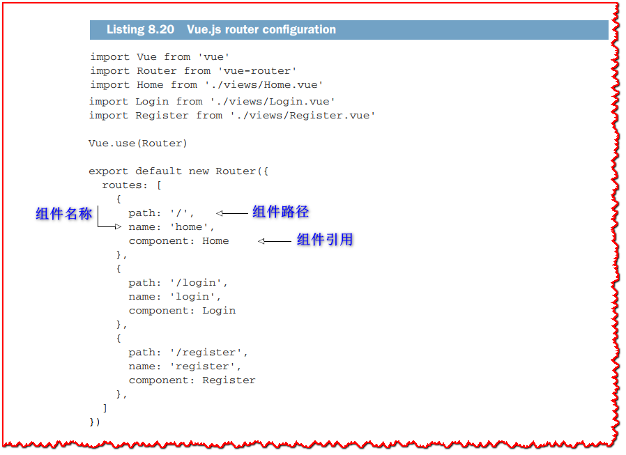

应用程序代码与服务于用户 Web 应用程序的 Vert.x 应用程序位于同一模块中，因此您将在 `src/main/java` 和 *`Gradle build.gradle.kts`* 文件下找到常用的 Java 源文件 . 必须将 Vue.js 编译的资产 (*yarn build*) 复制到 `src/main/resources/webroot/assets` 以便基于 Vert.x 的服务为其提供服务。

这使得单个项目中有两个构建工具，幸运的是它们可以和平共存。 事实上，从 Gradle 调用 *yarn* 非常容易，因为 *com.moowork.node* 的Gradle 插件提供了一个自包含的 Node 环境。 以下清单显示了用户 Web 应用程序 Gradle 构建文件的节点相关配置。


*buildVueApp* 和 *copyVueDist* 任务作为常规项目构建任务的一部分插入，因此项目构建 Java Vert.x 代码和 Vue.js 代码。 我们还自定义了 *clean* 任务以删除生成的资产。

### 8.4.3 后端集成图解

让我们看看其中一个 Vue.js 组件：如**图 8.5** 所示的登录屏幕。

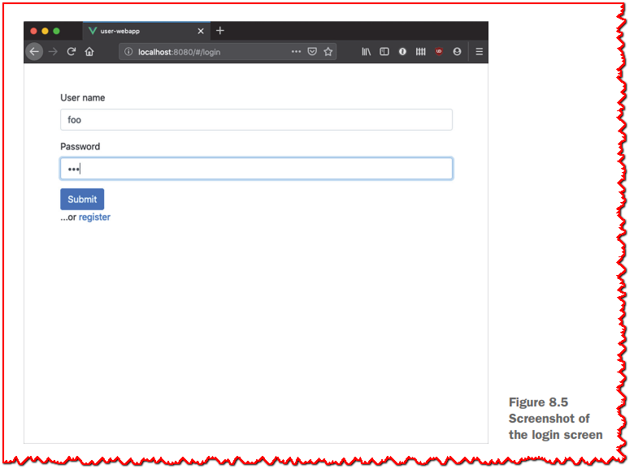

这个组件的文件是 `src/views/Login.vue`。 该组件显示登录表单，提交时必须调用公共 API 以获取 JWT 令牌。 成功后，它必须在本地存储 JWT 令牌，然后将视图切换到 *home* 组件。 出错时，它必须留在登录表单上并显示错误消息。

组件的 HTML 模板部分显示在以下清单中。

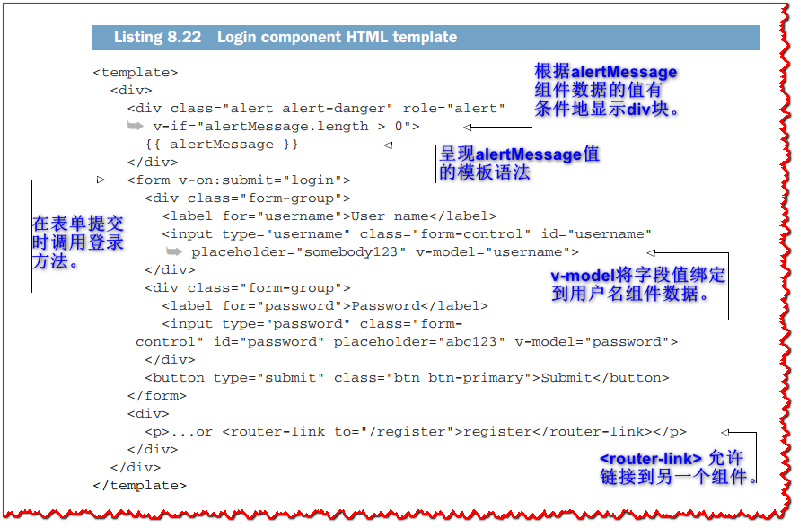

组件的 JavaScript 部分提供组件数据声明以及 *login* 方法实现。 我们使用 Axios JavaScript 库对公共 API 进行 HTTP 客户端调用。 以下清单提供了组件 JavaScript 代码。

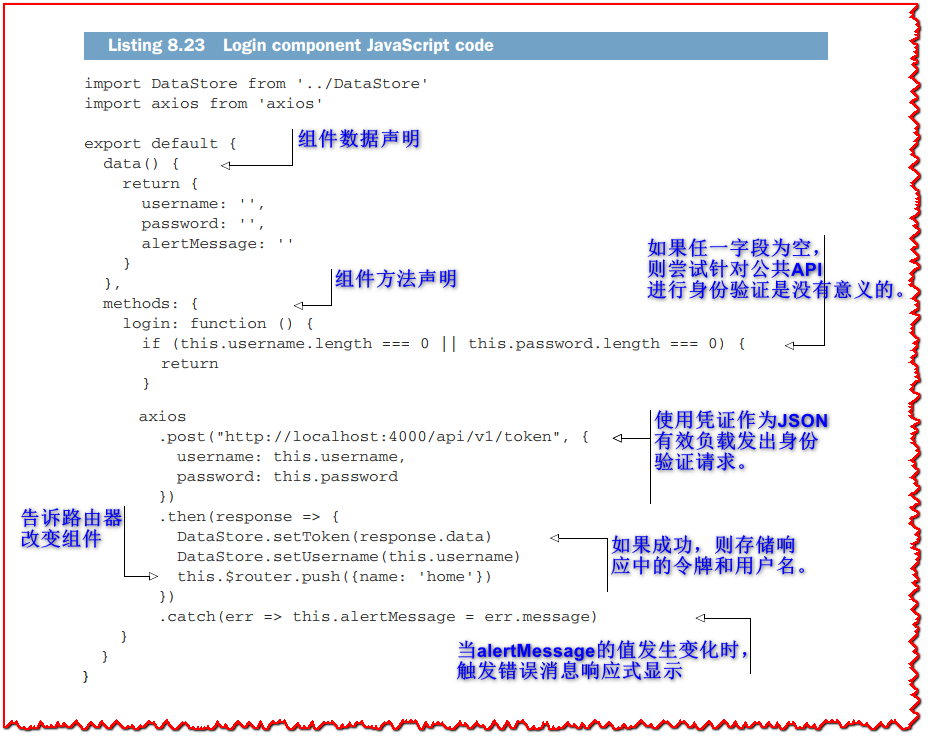

组件数据属性随着用户在用户名和密码字段中键入文本而更新，并且在表单提交时调用登录方法。 如果调用成功，应用程序将移动到 *home* 组件。

下一个清单来自 *Home.vue* 组件的代码，它展示了如何使用 JWT 令牌来获取用户的总步数。

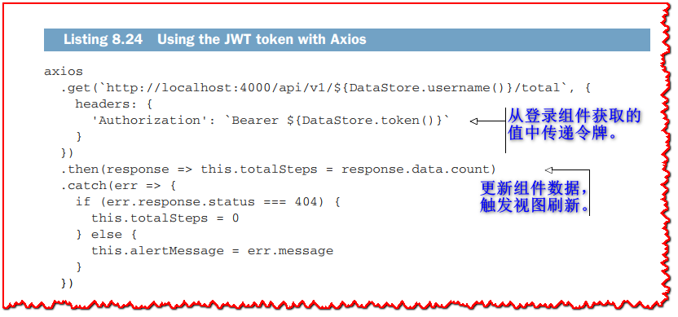

现在让我们看看如何使用 Vert.x 为 Web 应用程序资产提供服务。

### 8.4.4 使用 Vert.x 提供静态内容

除了启动 HTTP 服务器和提供静态内容之外，Vert.x 代码没有太多工作要做。 以下清单显示了 *UserWebAppVerticle* 类的 *rxStart* 方法的内容。

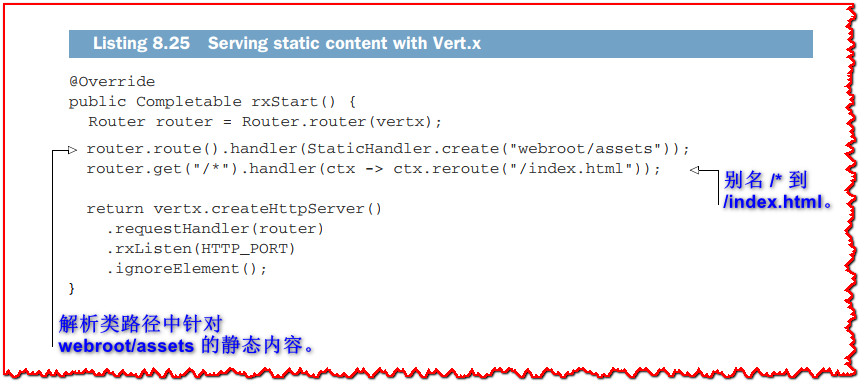

*StaticHandler* 将文件缓存在内存中，除非在调用 *create* 方法时另有配置。 禁用缓存在开发模式下很有用，因为您可以修改静态资产的内容并通过在 Web 浏览器中重新加载来查看更改，而无需重新启动 Vert.x 服务器。 默认情况下，静态文件是从类路径中的 webroot 文件夹解析的，但您可以像我们一样通过指定 `webroot/assets` 来覆盖它。

现在我们已经讨论了如何使用 Vert.x Web 堆栈，是时候专注于测试构成响应式应用程序的服务了。

## 8.5 编写集成测试

测试是一个非常重要的问题，尤其是在制作 10k 步挑战响应式应用程序时涉及多种服务。 测试用户 Web 应用程序服务是否正确交付静态内容是没有意义的，但测试涵盖与公共 API 服务的交互是至关重要的。 让我们讨论如何为此服务编写集成测试。

公共 API 源代码显示了一个 *IntegrationTest* 类。 它包含几个检查 API 行为的有序测试方法：
  1. 注册一些用户。
  2. 为每个用户获取一个 JWT 令牌。
  3. 获取用户的数据。
  4. 尝试获取另一个用户的数据。
  5. 更新用户的数据。
  6.  检查用户的一些活动统计信息。
  7. 尝试检查其他用户的活动。

由于公共 API 服务依赖于活动和用户配置文件服务，我们要么需要使用我们在测试执行期间运行的 *fake* 服务来模拟它们，要么需要将它们连同它们的所有依赖项（如数据库）一起部署。 任何一种方法都很好。 在这部分的章节中，我们有时会创建一个假服务来运行我们的集成测试，有时我们只会部署真正的服务。

在这种情况下，我们将部署真正的服务，并且我们需要从 JUnit 5 以自包含和可重现的方式进行部署。 我们首先需要添加项目依赖项，如下面的清单所示。

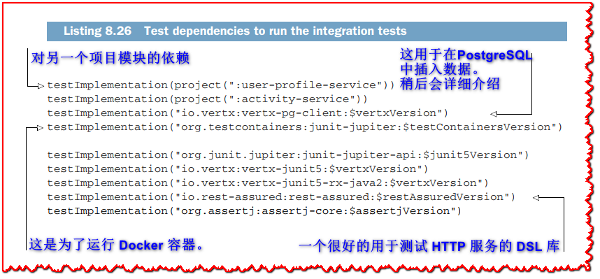

这些依赖项为我们带来了两个有用的工具来编写测试：
  - Testcontainers 是一个用于在 JUnit 测试中运行 Docker 容器的项目，因此我们将能够使用 PostgreSQL 或 Kafka ((http://www.testcontainers.org/)) 等基础设施服务。
  - REST Assured 是一个专注于测试 HTTP 服务的库，提供了一个方便的流式 API 来描述请求和响应断言 (http://rest-assured.io/)。

测试类的序言如下表所示。

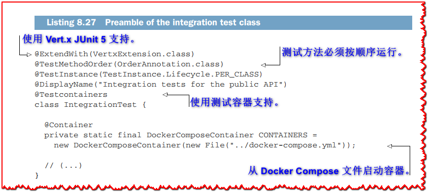

Testcontainers 为启动一个或多个容器提供了很多选择。 它支持通用 Docker 映像、通用基础设施（PostgreSQL、Apache Kafka 等）的专用类和 Docker Compose。 这里我们重用 Docker Compose 描述符来运行整个应用程序（*docker-compose.yml*），并且文件中描述的容器在第一个测试运行之前启动。 当所有测试执行完毕后，容器将被销毁。 这很有趣——我们可以针对将在生产中使用的真实基础设施服务编写集成测试。

*prepareSpec* 方法带有 *@BeforeAll* 注释，用于准备测试。 它在 PostgreSQL 数据库中为活动服务插入一些数据，然后部署用户配置文件和活动 Verticle。 它还从 REST Assured 准备一个 *RequestSpecification* 对象，如下所示。

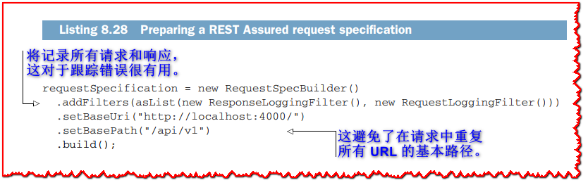

该对象在所有测试方法之间共享，因为它们都必须向 API 发出请求。 我们启用了所有请求和响应的日志记录以便于调试，我们将 */api/v1* 设置为所有请求的基本路径。

测试类维护用户的哈希映射以注册和稍后在调用中使用，以及 JWT 令牌的哈希映射。


以下清单是第一个测试，其中注册了来自 *registrations* 哈希映射的用户。

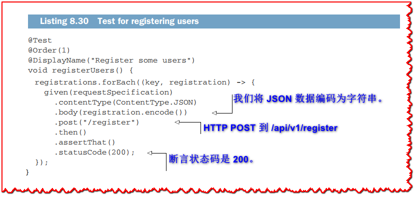

REST Assured fluent API 允许我们表达我们的请求，然后对响应进行断言。 可以将响应提取为文本或 JSON 以执行进一步的断言，如下一个清单所示，它是从检索 JWT 令牌的测试方法中提取的。

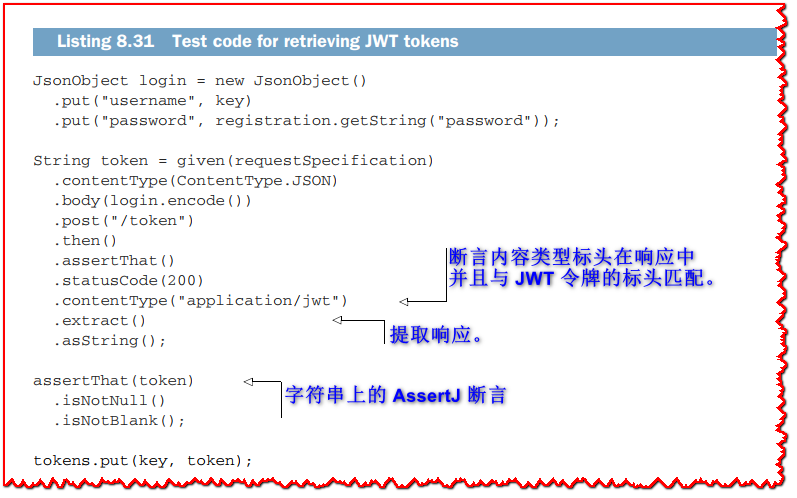

测试获取一个标记，然后断言该标记既不是 *null* 值也不是空字符串（空或带有空格）。 提取 JSON 数据也是类似的，如下所示。

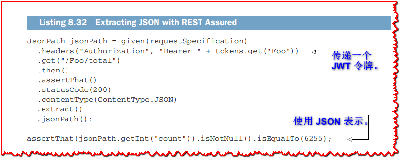

测试获取用户 Foo 的总步数，提取 JSON 响应，然后检查步数（JSON 响应中的计数键）是否等于 6255。

集成测试可以使用 Gradle (`./gradlew :public-api:test`) 或从开发环境运行，如图 8.6 所示。

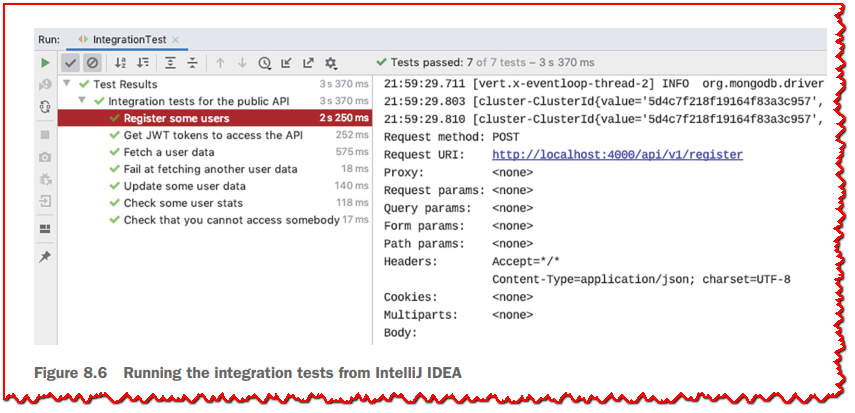

现在，您已经很好地理解了如何使用Vert.x web堆栈来公开端点和使用其他服务。下一章重点介绍Vert.x的消息和事件流堆栈。

### 总结
  - Vert.x Web 模块使构建具有 CORS 支持和对其他服务的 HTTP 调用的边缘服务变得容易。
  - JSON Web 令牌对于公共 API 中的授权和访问控制很有用。
  - Vert.x 对前端应用程序框架没有偏好，但很容易集成 Vue.js 前端应用程序。
  - 通过结合由 Testcontainers 管理的 Docker 容器和 Rest Assured 库，您可以为 HTTP API 编写集成测试。
