# 第九章: Vert.x 的消息传递和事件流

> 翻译: 白石(https://github.com/wjw465150/Vert.x-in-Action-ChineseVersion)

**本章涵盖**

  - 消息传递与AMQP
  - 使用Apache Kafka的事件流
  - 发送邮件
  - 消息和事件流中间件的集成测试

响应式应用程序非常适合消息传递和事件流技术。到目前为止，我们主要研究了公开HTTP 的 API服务。但是，尽管HTTP是与服务交互的通用且有效的协议，但它不应该是唯一的选择。

使用**消息传递**和**事件流**集成基于vert.x的服务有几个选项。本章主要介绍AMQP消息代理和Apache Kafka。我们还将讨论使用SMTP服务器发送电子邮件。

在这一章中，我们将深入研究摄取和祝贺服务的实现。*摄取服务*通过HTTP和AMQP接收来自设备的步骤更新，并将它们作为Kafka事件转发到系统中。*祝贺服务*会监听某些Kafka事件，以发现用户在一天内走了10,000步，并发送一封祝贺邮件。

## 9.1 使用 Vert.x 超越 HTTP 的事件驱动服务

作为事件驱动服务的网络接口，HTTP是一个明智的选择，特别是当服务提供API时。消息传递和事件流中间件为分离和集成服务提供了有用的工具。它们通常也比HTTP更适合在服务之间交换大量事件。

### 9.1.1 Vert.x 提供了什么

Vert.x提供消息代理的客户端，使用Apache Kafka的事件流，以及用于事件总线的通用TCP协议。

**消息代理**

对于服务到服务的通信，消息传递中间件比HTTP更有效，具有更好的吞吐量，而且当消费者或生产者服务暂时不可用时，它还可以提供持久性保证。Vert.x提供了几个模块来与消息中间件进行集成工作:
  - 一个 AMQP客户端
  - 一个 STOMP客户端
  -  一个 RabbitMQ客户端
  - 一个 MQTT客户端

**AMQP** 是消息中间件的标准协议，它由大量代理实现，例如 Apache ActiveMQ、JBoss A-MQ、Windows Azure 服务总线、RabbitMQ 等。 Vert.x 为 RabbitMQ 及其扩展提供了一个专用客户端。 请注意，也可以将 Vert.x AMQP 客户端与 RabbitMQ 一起使用，因为它在 RabbitMQ 特定服务器旁边公开了一个 AMQP 服务器。

**STOMP** 是用于消息中间件的基于文本的协议。 它的功能比 AMQP 少，但它们对于简单的消息传递可能已经足够了。 它受到流行的消息代理的支持。

**MQTT** 是一种为机器对机器发布/订阅交互而设计的协议。 它在嵌入式/物联网设备中非常流行，因为它使用低带宽。

**KAFKA事件流**

Vert.x 为 Apache Kafka 提供支持，这是一种流行的事件流中间件实现。

乍一看，事件流中间件类似于消息传递系统，但它允许有趣的架构模式，因为不同的服务可以按照自己的节奏使用相同的事件集。 消息代理支持多个服务的发布/订阅机制来消费相同的事件，但事件流中间件也具有随意重放事件的能力。 *倒带事件流*是一个独特的功能。 事件流中间件还允许将新服务插入处理管道，而不会影响其他服务。

您可以像消息中间件一样使用事件流中间件，但它不仅仅是在服务之间传递事件。

**事件总线 TCP 桥**

最后但同样重要的是，Vert.x 通过简单的 TCP 协议提供了一个事件总线桥接器，并在 JavaScript、Go、C#、C 和 Python 中进行了绑定。 这允许我们使用事件总线来连接非 Java 应用程序。 我们不会在本书中介绍这个事件总线桥，但是你可以从 Vert.x 官方文档中轻松学习如何使用它。 从 Vert.x 的角度来看，这实际上只是事件总线，除了一些事件可以在 JVM 之外产生和使用。

### 9.1.2 我们将使用的中间件和服务

1万步挑战应用程序允许我们探索用于消息传递的 AMQP、用于事件流的 Kafka 以及使用 SMTP 服务器发送电子邮件：

  - *摄取服务* 使用 AMQP，因为它通过 HTTP 或 AMQP 接收计步器设备更新。
  - *Kafka* 用于在应用程序的许多服务之间传递事件。
  - *SMTP* 用于向用户发送祝贺电子邮件。

与前一章一样，Docker Compose 可用于启动本地开发所需的中间件服务：Apache Kafka（也需要 Apache ZooKeeper）、Apache ActiveMQ Artemis 和 MailHog（一个测试友好的 SMTP 服务器）。 当然，如果您愿意，您可以自行安装和运行每个服务，但使用 Docker 启动一次性容器可提供简化的开发体验。

在 Vert.x 方面，我们将使用以下模块来构建我们的服务：
  - **vertx-amqp-client** - AMQP 客户端
  - **vertx-kafka-client** - Apache Kafka 客户端
  - **vertx-mail-client** - 将发送电子邮件的 SMTP 客户端

### 9.1.3 什么是 AMQP（和消息代理）?

*高级消息队列协议* (AMQP) 是一种广泛使用的网络协议，用于由开放规范支持的消息传递中间件。 该协议本身是二进制的，基于 TCP，它支持身份验证和加密。 我们将在项目中使用 Apache ActiveMQ，它支持 AMQP。

消息代理是一种经典的服务集成形式，因为它们通常支持消息队列和发布/订阅通信。 它们允许服务通过消息传递进行通信，并且代理确保消息的持久性。

**图 9.1** 显示了设备、收集步骤事件的 AMQP 队列和摄取服务之间的交互。

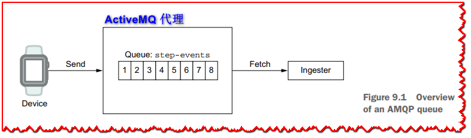

消息可以被设置为 **持久**，以便在代理崩溃时它们不会丢失。生产者和消费者可以使用*确认*来确保消息已正确发送或检索并处理。代理还提供各种服务质量特性，例如过期日期和高级路由。根据代理的不同，消息可以从一种表示形式转换为另一种表示形式，例如从二进制格式转换为JSON格式。一些代理还支持将多个消息聚合为一个消息，或者相反地将一个消息分解为多个消息。

>  **🏷注意:** 如果你是ActiveMQ的新手，我建议你阅读Bruce Snyder、Dejan Bosanac和Rob Davies的《ActiveMQ in Action》(Manning, 2011)。

### 9.1.4 Kafka是什么?

Apache Kafka是一个基于**分布式日志**的**事件流**的中间件。虽然这听起来很复杂，但你真正需要了解的是Kafka提供了事件记录流，生产者可以添加新的记录，消费者可以沿着流来回走动。例如，传入的计步器步长更新形成一个流，其中每个事件都是由设备发送的更新，摄入服务产生这些事件。另一方面，各种使用者可以查看流上的事件来填充数据库、计算统计信息等等。事件会在流中保留一段时间，或者直到流太大而不得不丢弃最旧的记录。

Kafka 支持分布式服务之间的发布/订阅交互，如**图 9.2** 所示。 在 Kafka 集群中，事件是从 *topics* 分组相关事件的 *published* 和 *consumed*。 主题分为*复制分区*，它们是有序的事件序列。 每个事件由其在具体化其分区的事件日志中的 **offset** 位置标识。

消费者从分区中提取事件。 他们可以跟踪他们消耗的最后一个偏移量，但也可以在分区中任意寻找任何随机位置，甚至可以重播从一开始的所有事件。 此外，*消费者组*可以通过从不同分区读取和并行事件处理来划分工作。

很容易认为 Kafka 是像 ActiveMQ 一样的 *messaging* 系统，并且在某些情况下 Kafka 是非常精细的消息传递中间件，但它仍然应该被视为 *streaming* 中间件。

在消息代理中，消息在从队列中被使用或过期时消失。 Kafka 分区最终会驱逐记录，要么使用分区大小限制（例如 2 GB），要么使用一些驱逐延迟（例如两周）。

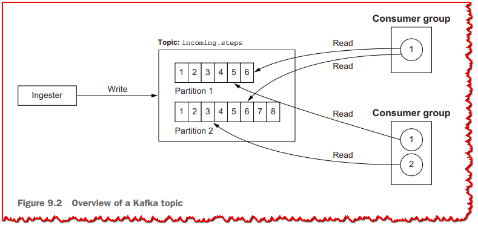

Kafka 记录应该被认为是“半耐用的”，因为它们最终会消失。 可以将主题中的分区配置为永久保留事件，但这非常罕见，因为预计事件在使用时会产生持久的影响。 例如，摄取服务生成传入的步骤更新记录，活动服务将这些记录转换为数据库中的长期事实。 Kakfa 的另一个有趣的特性是可以随意重播主题，因此新服务可以按照自己的节奏加入和消费流。

>  **🏷注意:** 如果您不熟悉 Apache Kafka，我建议您阅读 Dylan Scott 的 *Kafka in Action*（Manning，2017）。

现在让我们深入研究摄取服务。

## 9.2 通过 HTTP 和 AMQP 可靠地摄取消息

一切都从摄取服务开始，因为它从计步器接收步数更新。 在我们的（虚构的）应用程序中，我们可以预期会有几种类型的计步器可用，并且它们具有不同的通信能力。 例如，一些设备可能通过 Internet 直接与摄取服务通信，而其他设备可能需要到达将更新转发到摄取服务的网关。

这就是为什么我们提供两个接口来获取设备更新的原因：
  - 设备可以连接到摄取服务提供的 HTTP API。
  - 设备可以将更新转发到消息代理，并且摄取服务从代理接收更新。

收到更新后，必须对其进行验证，然后将其发送到 Kafka 主题。 探索 AMQP 和 HTTP 接口很有趣，因为我们可以看到它们的实现有相似之处，但在确认设备更新方面也有不同。

### 9.2.1 从 AMQP 摄取

我们将从 AMQP 摄取开始。 我们首先需要创建一个连接到代理的 AMQP 客户端。 以下清单显示了客户端配置代码。

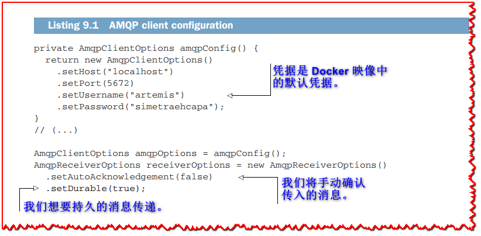

我们在此处使用的 *amqpConfig* 方法提供了带有硬编码值的配置。 这对于我们在本书中所做的测试非常有用，但对于生产环境，您当然会从一些外部来源解析凭据、主机名和端口号。 这些可能是环境变量或注册表服务，例如 Apache ZooKeeper 或 Consul。 我们还为持久消息传递设置连接并声明手动确认，因为如果写入 Kafka 主题失败，我们希望重试消息处理。

下一步是为传入的 AMQP 消息设置事件处理管道。 我们使用 RxJava 将消息发送到处理函数、记录错误并从错误中恢复，如下面的清单所示。

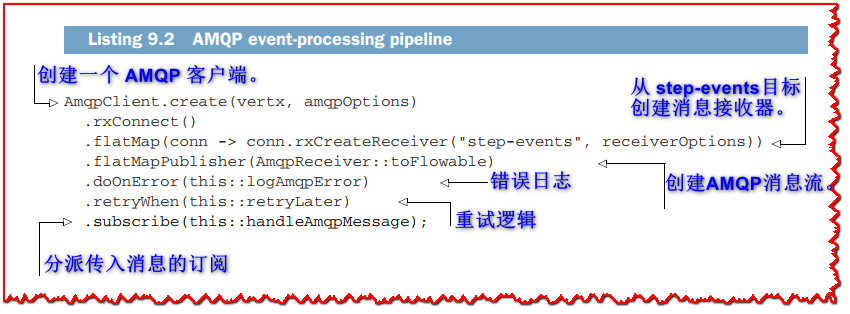

这个管道很有趣，因为它纯粹是声明性的。 它从创建客户端开始，然后为 *step-events* 持久队列和消息流获取接收器。 从那里我们声明在收到消息或错误时要做什么。 我们还通过使用 Java 方法引用而不是 lambda 来保持代码简洁明了。 但是 *logAmqpError*、*retryLater* 和 *handleAmqpMessage* 方法是做什么的？

记录消息并不复杂。

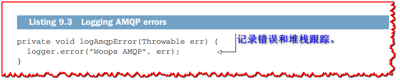

发生错误。 例如，我们可能会失去与 AMQP 代理的连接。 在这种情况下，错误会沿着管道传递，*logAmqpError* 会记录它，但 *doOnError* 会让错误传播给订阅者。

然后我们需要重试连接到 AMQP 代理并恢复接收事件，这意味着重新订阅 RxJava 中的源。 我们可以使用 *retryWhen* 运算符来做到这一点，因为它允许我们定义自己的策略。 如果您只想重试多次，甚至总是重试，那么 *retry* 会更简单。 以下清单显示了我们如何在重新订阅之前引入 10 秒延迟。

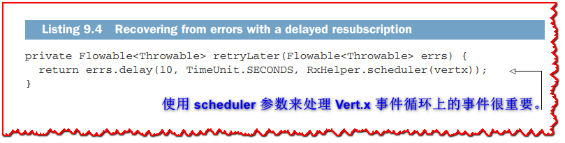

*retryLater* 运算符的工作原理如下：
  - 它以 *Flowable* 的错误作为输入，因为我们处于 *Flowable* 的 AMQP 消息中。
  - 它返回 *anything* 的 *Flowable*，其中
    - 发出 *onComplete* 和 *onError* 不会触发订阅。
    - 发出 *onNext* （无论值是什么）会触发重新订阅。

要将重新订阅延迟 10 秒，我们使用 *delay* 运算符。 它最终会发出一个值，因此将调用 *onNext* 并重新订阅。 当然，您可以考虑更复杂的处理程序，例如限制重试次数或使用指数退避策略。 我们将大量使用这种模式，因为它极大地简化了错误恢复逻辑。

### 9.2.2 将 AMQP 消息转换为 Kafka 记录

以下清单包含处理传入 AMQP 消息、验证它们，然后将它们作为 Kafka 记录推送的方法。

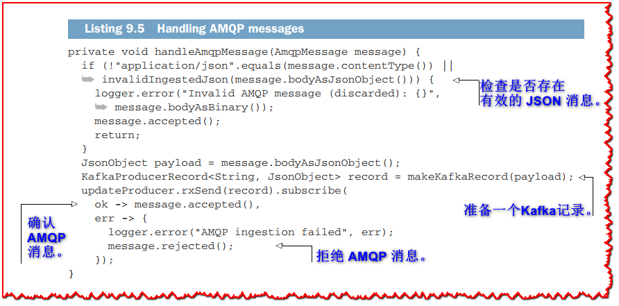

*handleAmqpMessage* 方法首先对传入的 AMQP 消息执行一些验证，然后准备 Kafka 记录。 AMQP 消息在 Kafka 记录被写入时被确认，如果记录不能被写入则被拒绝。

> **💡提示:** 在**清单 9.5** 和所有后续服务中，我们将直接使用 *JsonObject* 数据表示。 鉴于我们主要复制和转换数据，将 JSON 表示转换为 Java 域类（例如 *IngestionData* 类）没有什么意义。 当然，如果您必须执行一些更复杂的业务逻辑并且抽象成本是合理的，您可以执行此类映射。

*invalidIngestedJson* 方法检查 JSON 数据是否包含所有必需的条目，如下所示。

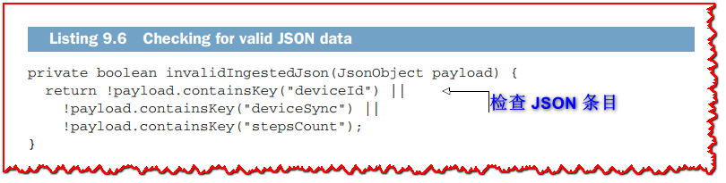

以下清单中的 *makeKafkaRecord* 方法将 AMQP 消息 JSON 转换为针对 *incoming-steps* 主题的 Kafka 记录。

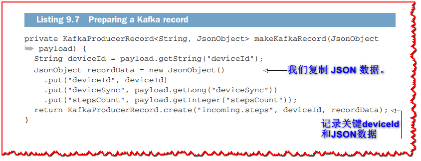

我们可以避免手动复制所有 JSON 条目，只需将 JSON 从 AMQP 消息传递到 Kafka 记录。 但是，这有助于确保 Kafka 记录中没有额外的数据。

*updateProducer* 字段的类型为 *KafkaProducer<String, JsonObject>*，因为它生成带有字符串键和 JSON 有效负载的消息。 *KafkaProducer* 的实例是通过从 Map 传递配置来创建的，如下所示。

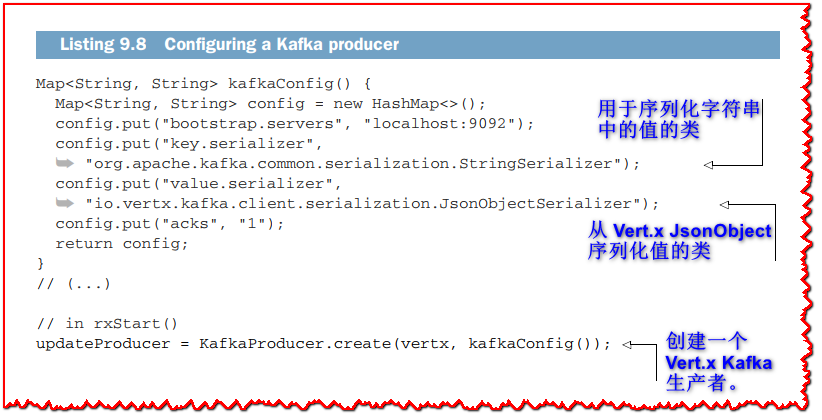

该配置特别指定了 *serializer*（或 *deserializer*）类，因为 Kafka 记录需要映射到 Java 类型。 *StringSerializer* 来自 Kafka 客户端库，它将 Java 字符串序列化为 Kafka 数据，而 *JsonObjectSerializer* 来自 Vert.x 并序列化 *JsonObject* 数据。 您需要为您的键和值指定正确的序列化程序类。 同样，在读取 Kafka 主题时，您将需要配置反序列化器。

>  **💡提示:** Vert.x Kafka 模块包装了来自 Apache Kafka 项目的 Java 客户端，所有配置 *键/值* 对都与 Kafka Java 客户端文档中的匹配。

### 9.2.3 从 HTTP 摄取

从 HTTP 摄取的代码与使用 AMQP 摄取的代码非常相似。 最显着的区别是需要设置 HTTP 状态代码，以便发送更新的设备知道摄取失败并且必须稍后重试。

我们首先需要一个 HTTP 服务器和路由器。

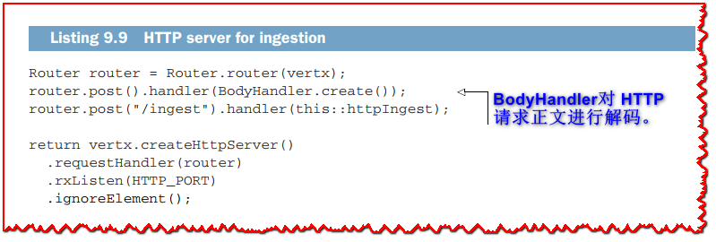

*httpIngest* 方法显示在下一个清单中，它与 *handleAmqpMessage* 非常相似。

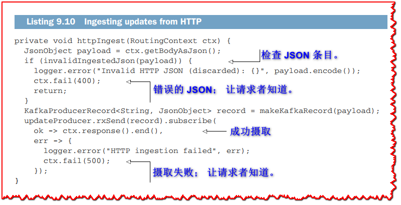

HTTP 状态代码对于让客户端知道有效负载是否不正确（400）、摄取是否由于某些（临时）错误（500）或摄取成功（200）非常重要。

摄取服务是使用不同输入协议进行集成的一个很好的例子。 现在让我们通过祝贺服务来探索更多带有 Vert.x 的 Apache Kafka。

## 9.3 发送祝贺电子邮件

摄取服务*产生* Kafka 事件，而祝贺服务*消费* Kafka 事件。

每当收到设备更新时，活动服务都会生成每日步数事件。 每个事件都包含当天为原始设备记录的步数。 祝贺服务可以观察这些事件，因为它们被发送到 *daily.step.updates* Kafka 主题，它可以针对步数超过 10,000 的事件。

### 9.3.1 监听每日步数更新事件

发送到 *daily.step.updates* Kafka 主题的事件是 JSON 数据，内容如下：
  - *deviceId* 是设备标识符。
  - *timestamp* 是在活动服务中产生事件的时间戳。
  - *stepsCount* 是当天的步数。

Kafka 记录也有一个键，它是几个参数的串联：*deviceId:year-month-day*。 在该方案中，2019 年 10 月 6 日产生的设备 *1a2b* 的所有记录都有键 *1a2b:2019-10-06*。 正如您将很快看到的那样，该键不仅可以确保按顺序使用给定设备的事件，还可以确保我们每天发送的祝贺电子邮件不超过一封。

每日步数事件处理流程如**图 9.3** 所示。

每日步骤更新来自 *daily.step.updates* Kafka 主题，然后
  1. 我们丢弃步数小于 10,000 的事件。
  2. 我们丢弃已处理具有相同键的事件的事件。
  3. 我们发送一封电子邮件。

以下清单包含相应的 RxJava 管道。

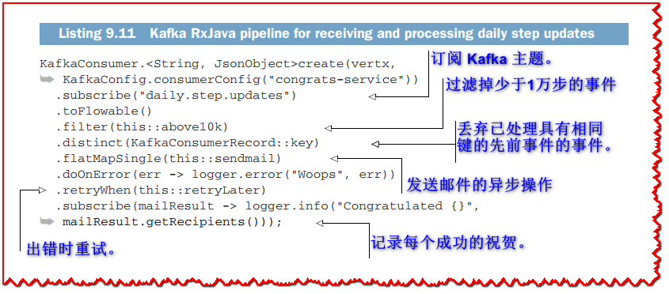

上面的清单使用 RxJava 绑定来订阅 Kafka 主题，作为 Kafka 记录的 *Flowable*。 然后我们使用过滤器组合器*过滤*出少于 10,000 步的记录，并使用以下清单中的谓词方法。

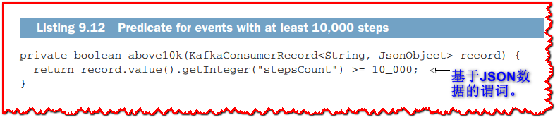

**清单 9.11** 中的 *distinct* 组合器确保每个 Kafka 记录键仅保留一个事件，就在 *filter* 之后。 这是为了避免在给定的一天向用户发送多个祝贺电子邮件，因为我们可以很容易地进行第一个事件，例如 10,100 步，然后再进行另一个 10,600 步的事件，依此类推。 请注意，此设计不是 100% 防弹的，因为它需要将已处理的键值存储在内存中，并且在服务重新启动时，我们可能会不小心发送第二封电子邮件。 在我们的示例中，这是一个合理的权衡，与使用持久数据存储只是为了跟踪电子邮件上次发送给用户的时间相比。

管道的其余部分使用类似的事件处理和 *retryWhen* 逻辑在发生错误时重新订阅。 *sendmail* 方法是发送电子邮件的异步操作—让我们看看它是如何工作的。

### 9.3.2 发送电子邮件

*vertx-mail-client* 模块提供了一个 SMTP 客户端。 以下清单显示了如何创建这样的客户端。

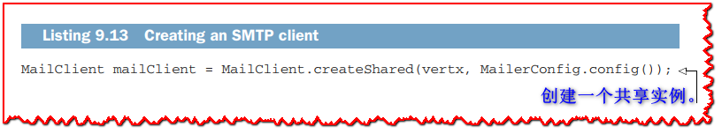

与许多其他 Vert.x 客户端一样，我们通过工厂方法获取实例，传递 *Vertx* 上下文以及一些参数。

*MailerConfig* 类提供了一种检索配置数据的方法，如下所示。

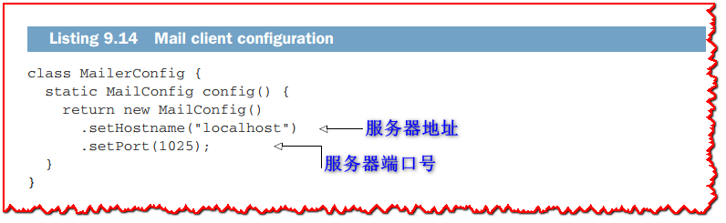

同样，这些硬编码值可用于测试目的并保持我们的代码简单。 这些值用于连接到 MailHog，这是我们从 Docker 容器中使用的测试 SMTP 服务器。 *MailConfig* 类支持更多配置选项，如 SSL、身份验证方法、凭据等。

一个每日步数更新 Kafka 事件应用于设备； 它不包含所有者的姓名或电子邮件地址。 在我们发送电子邮件之前，我们必须首先从用户配置文件服务中获取缺失的信息（姓名和电子邮件）。 因此，我们需要对该服务的两个请求：
  - */owns/deviceId* 形式的请求以获取用户名
  - */username* 形式的请求，用于获取用户个人资料并检索电子邮件地址

*sendmail* 方法如下表所示。

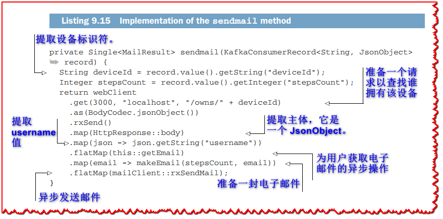

*sendmail* 方法是另一个组成异步操作和数据处理的 RxJava 管道，如**图 9.4** 所示。

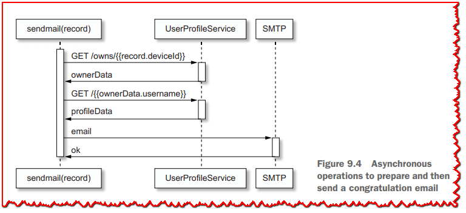

它首先向用户配置文件服务发出 HTTP 请求并查找设备所有者的用户名。 然后它准备另一个请求来获取用户配置文件数据以获取电子邮件地址。 下面的清单提供了 *getEmail* 方法的实现。

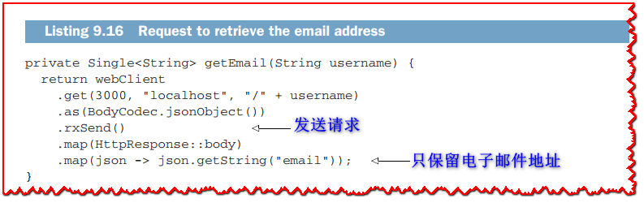

下一步是准备一封包含在 *MailMessage* 实例中的电子邮件，如以下 *makeEmail* 方法的实现所示。

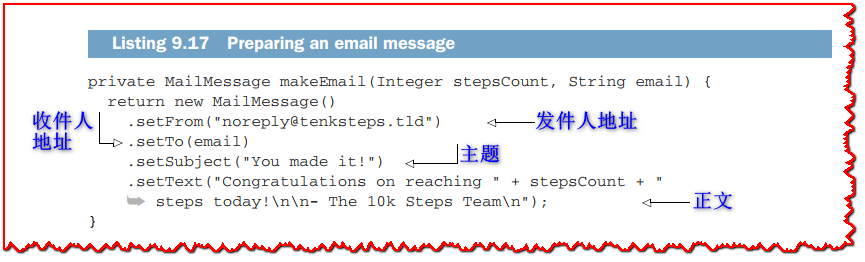

请注意，对于更高级的电子邮件格式，您可以使用模板引擎而不是文本。

既然您已经知道如何使用 Vert.x 进行消息传递和事件流处理，那么我们不要忘记集成测试，以确保摄取和祝贺服务都能正常工作。

## 9.4 集成测试

测试摄取服务包括通过 AMQP 和 HTTP 发送设备更新，并观察 Kafka 主题。 相反，测试祝贺服务涉及向 Kafka 主题发送事件，并观察电子邮件。

### 9.4.1 摄取测试

测试摄取服务需要通过 AMQP 或 HTTP 发送消息，然后检查是否已发出 Kafka 记录，如图 9.5 所示。

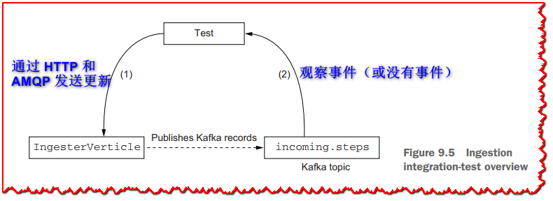

摄取服务源代码中的 *IntegrationTest* 类使用 JUnit 5 和 Docker 容器来启动 AMQP 代理、Apache Kafka 和 Apache ZooKeeper。 下面的清单显示了测试准备。

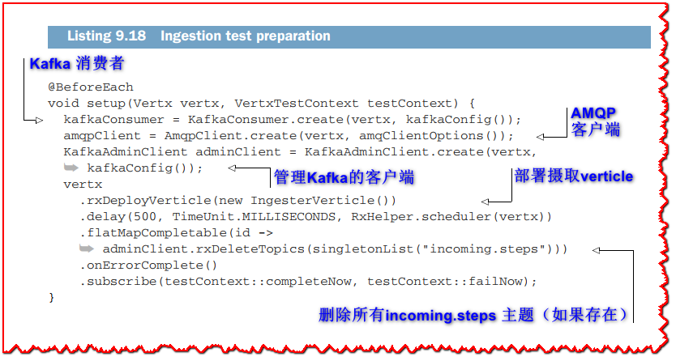

准备工作包括部署 *IngesterVerticle* verticle，然后删除任何现有的 *incoming.steps* 主题。 这确保了测试不会因剩余的 Kafka 事件而相互污染。 注意 *onErrorComplete* 组合子：它确保进度，因为删除主题不存在时会引发错误。 我们希望在 *incoming.steps* 不存在时运行测试，这通常是运行第一个测试的情况。 当然，*onErrorComplete* 可以掩盖 *IngesterVerticle* 的部署失败，但我们会在测试执行中发现这一点。

下面的清单显示了测试用例的序言，其中提取了格式良好的 AMQP 消息。

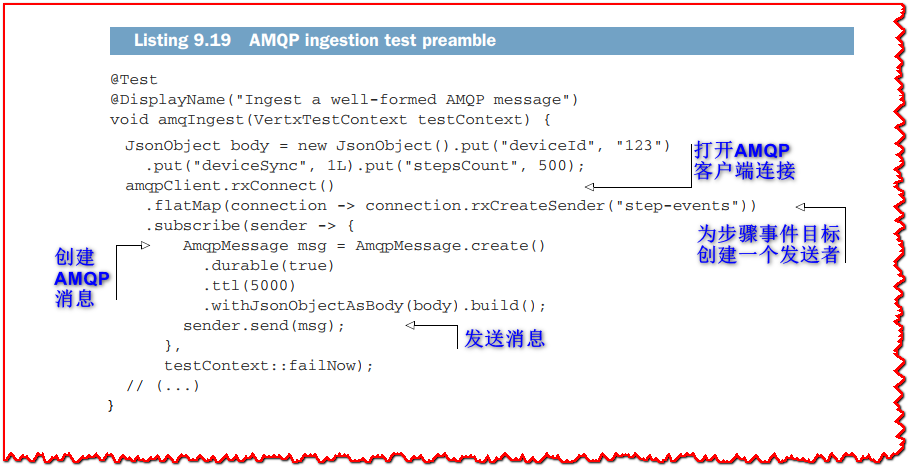

AMQP 客户端发送一条我们知道格式正确的消息，因为它的主体包含所有必需的 JSON 条目。

完成此操作后，我们需要检查是否已发送 Kafka 记录，如下所示。

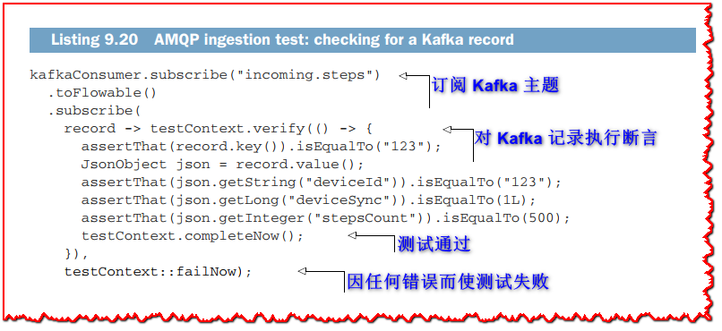

当然，我们还需要测试发送错误消息时会发生什么，比如一个空的 JSON 文档。 我们必须检查是否没有发出 Kafka 记录，如下面的清单所示。

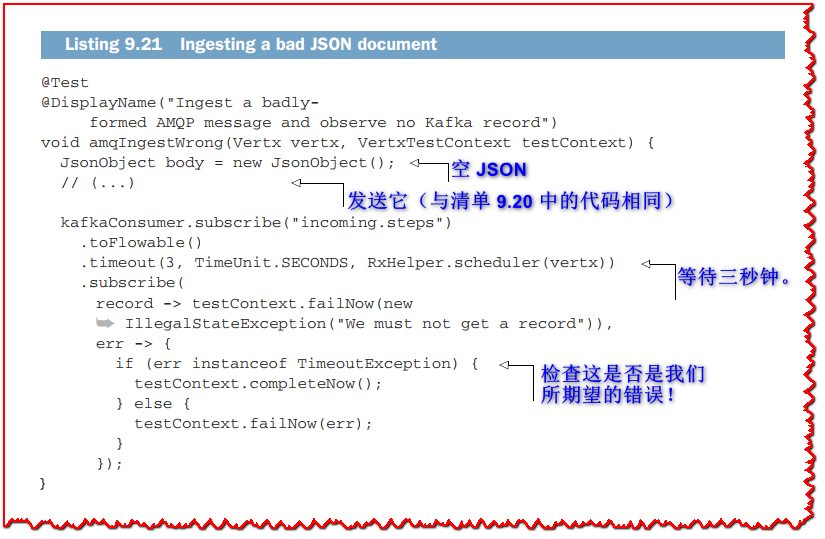

RxJava 管道中的超时很重要，因为我们需要等待一段时间以确保没有发送 Kafka 记录。 *IntegrationTest* 类的其余部分非常相似，有两个用于 HTTP 摄取的测试用例：一个检查发送正确有效负载时会发生什么，一个有效负载是空的 JSON 文档。

### 9.4.2 祝贺邮件测试

测试祝贺服务的行为比摄取更复杂，因为测试环境中有更多的移动部分，如**图 9.6** 所示。

目标是发送 Kafka 记录，然后观察已发送（或未发送）的电子邮件。 有趣的是，MailHog 不仅仅是一个 SMTP 服务器； 它还提供了一个 Web 界面和一个 HTTP API 来模拟电子邮件收件箱。 这允许我们通过发送 Kafka 记录来执行测试，然后检查收件箱中收到了哪些电子邮件。

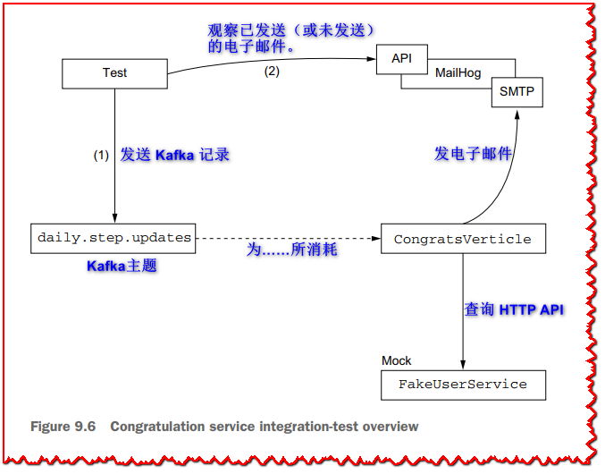

*CongratsTest* 类具有一个准备初始化方法，该方法创建一个 Kafka 生产者（用于发送 Kafka 事件）和一个 Vert.x Web 客户端（用于查询收件箱）。 *prepare* 方法中准备环境的步骤如下表所示。

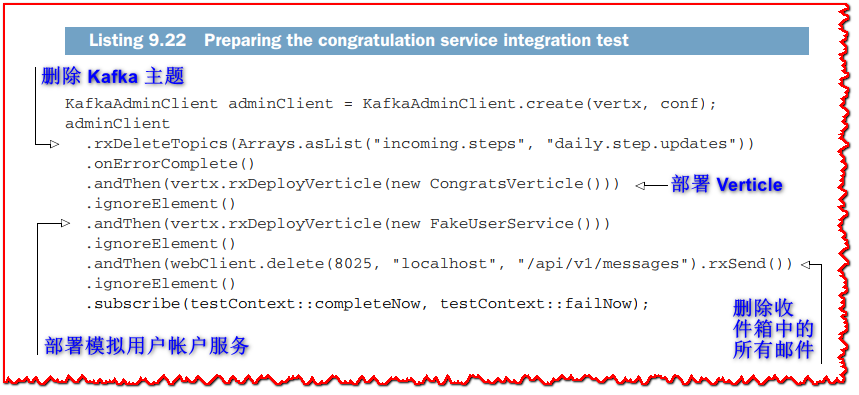

我们首先删除现有的 Kafka 主题，然后部署待测 Verticle。 我们还部署了一个 verticle 来模拟用户配置文件服务，并通过对 MailHog 实例进行 HTTP *DELETE* 查询来删除收件箱中的所有消息。

在测试源中发现的 *FakeUserService* verticle 公开了一个具有最低功能级别的 HTTP 服务，以替换我们测试中的真实用户配置文件服务。 找出谁拥有设备的所有请求都指向用户 *Foo*，检索用户 *Foo* 的详细信息只提供用户名和电子邮件。 以下清单显示了一个代码摘录，其中包含用于回答用户详细信息请求的代码，其中包含用户 *Foo* 的信息以及 *CongratsVerticle* 运行所需的 JSON 条目。

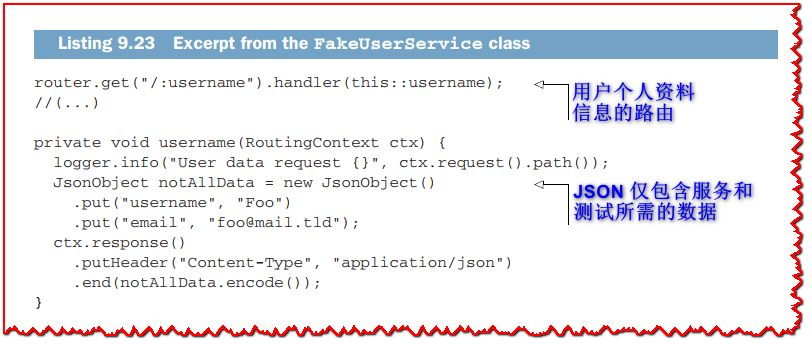

这样我们就有很好的隔离了祝贺服务进行测试。 我们也可以部署真正的用户配置文件服务，但这需要准备一个包含一些数据的数据库。 如果可以，最好用模拟服务替换依赖服务。

下一个清单显示了完整的测试用例，用于检查在少于 10,000 步的 Kafka 记录上没有发送电子邮件。

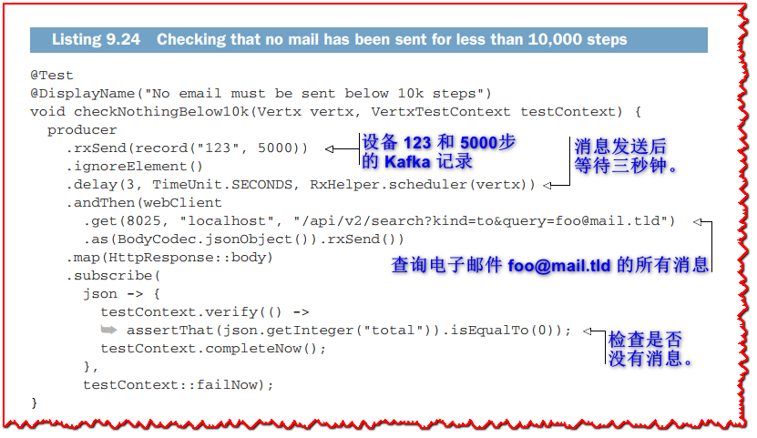

MailHog API 允许我们检查已发送的消息。 下一个清单检查是否发送了超过 10,000 步的电子邮件。

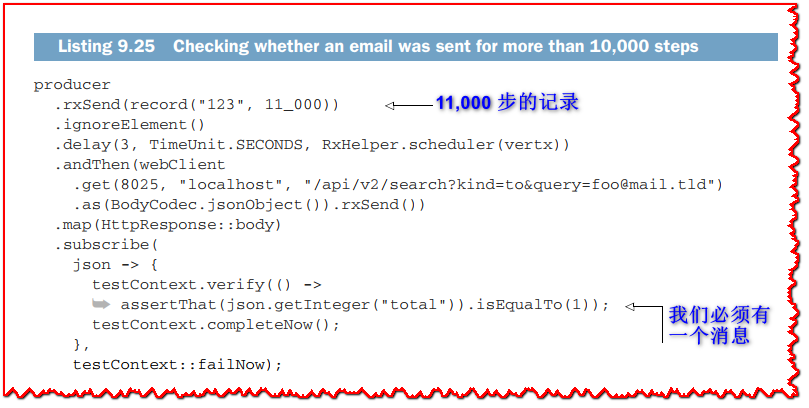

*checkNotTwiceToday* 方法中的最后一个测试用例检查是否只针对超过 10,000 步的两条连续记录发送了一封电子邮件。 由于代码冗长，我没有在此处复制代码，但您可以从本书的源代码存储库中获取它。

这结束了使用消息传递和事件流的两种服务的设计、实现和测试。 下一章重点介绍 Vert.x 和数据源。

## 总结

  - AMQP 是消息代理的标准协议，您了解了如何使用 Vert.x 和 Apache ActiveMQ 使用和生成 AQMP 消息。
  - Apache Kafka 是事件流中间件，允许服务随意重放事件。 Vert.x 提供与 Kafka 的高效集成。
  - RxJava 允许您以声明的方式编写事件处理管道，并具有内置的错误恢复功能。
  - 我们通过从测试发送消息来替换外部组件，探索了使用 AMQP、Kafka 和测试容器编写集成测试的策略。
  - MailHog 是一个测试友好的 SMTP 服务器，它公开了一个方便的 API，用于检查已发送的电子邮件。
